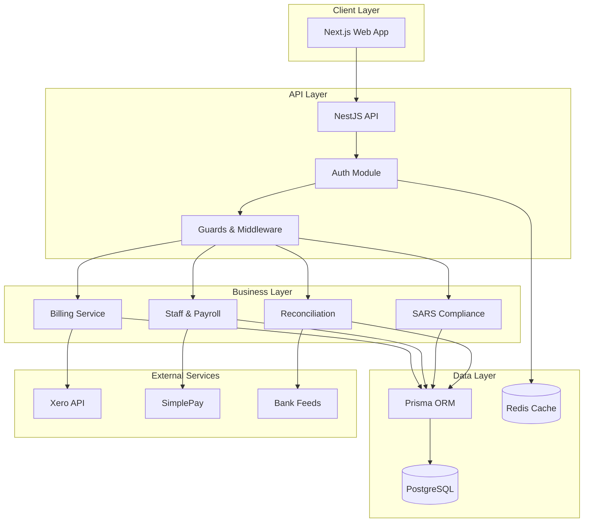

# CrecheBooks Architecture Documentation

> Comprehensive technical architecture documentation for the CrecheBooks childcare management platform.

## Quick Navigation

| Document | Description |
|----------|-------------|
| [System Overview](./system-overview.md) | High-level architecture and component relationships |
| [API Architecture](./api-architecture.md) | NestJS backend structure and patterns |
| [Database Schema](./database-schema.md) | Prisma models and data relationships |
| [Frontend Architecture](./frontend-architecture.md) | Next.js App Router and UI patterns |
| [Integrations](./integrations.md) | External services (Xero, SimplePay, SARS) |
| [Security](./security.md) | Authentication, authorization, and data protection |
| [Data Flows](./data-flows.md) | Key business process flows |

## System at a Glance



## Tech Stack

| Layer | Technology |
|-------|------------|
| Frontend | Next.js 14, React 18, TypeScript, Tailwind CSS, Zustand |
| Backend | NestJS, TypeScript, Prisma ORM |
| Database | PostgreSQL (multi-tenant) |
| Cache | Redis |
| Auth | JWT + Redis sessions, CSRF protection |
| External | Xero, SimplePay, Bank integrations |

## Key Architectural Decisions

1. **Multi-Tenant Architecture**: Organization-based tenant isolation at repository level
2. **Monorepo Structure**: Turborepo with `apps/api` and `apps/web`
3. **Type Safety**: End-to-end TypeScript with Zod validation
4. **Immutable Audit Trail**: All financial transactions logged immutably
5. **Soft Deletes**: Entities use `deletedAt` for data retention

## Module Structure

```
apps/
├── api/                    # NestJS Backend
│   ├── src/
│   │   ├── api/           # Feature modules
│   │   │   ├── auth/      # Authentication
│   │   │   ├── billing/   # Invoicing & payments
│   │   │   ├── parent/    # Parent management
│   │   │   ├── child/     # Child enrollment
│   │   │   ├── staff/     # Staff & payroll
│   │   │   ├── sars/      # Tax compliance
│   │   │   └── ...
│   │   ├── common/        # Shared utilities
│   │   └── prisma/        # Database client
│   └── prisma/
│       └── schema.prisma  # Database schema
│
└── web/                    # Next.js Frontend
    └── src/
        ├── app/           # App Router pages
        ├── components/    # UI components
        ├── hooks/         # Custom hooks
        ├── services/      # API clients
        └── stores/        # Zustand stores
```

## Version

- **Documentation Version**: 1.0.0
- **Last Updated**: 2026-01-18
- **Generated By**: Architecture Agent (Trained Swarm)
