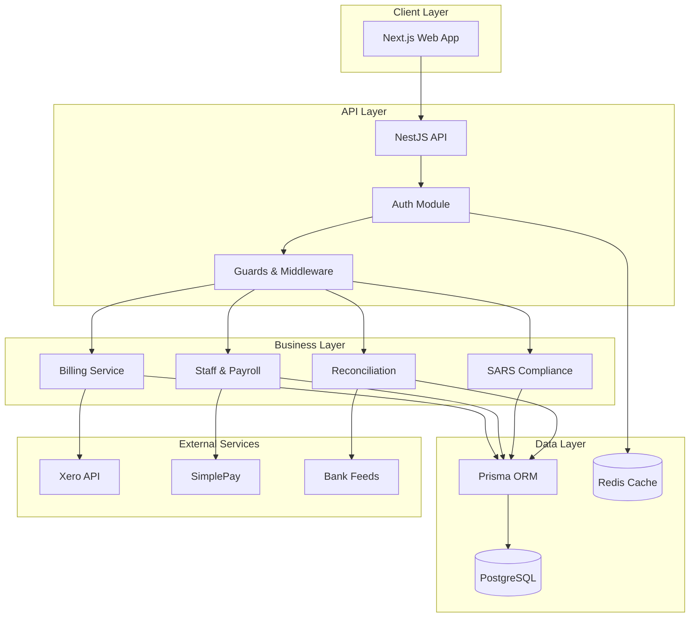

# CrecheBooks Architecture Documentation

> Comprehensive technical architecture documentation for the CrecheBooks childcare management platform.

## Quick Navigation

### Core Architecture
| Document | Description |
|----------|-------------|
| [System Overview](./system-overview.md) | High-level architecture and component relationships |
| [API Architecture](./api-architecture.md) | NestJS backend structure and patterns |
| [Database Schema](./database-schema.md) | Prisma models and data relationships |
| [Frontend Architecture](./frontend-architecture.md) | Next.js App Router and UI patterns |
| [Integrations](./integrations.md) | External services (Xero, SimplePay, SARS) |
| [Security](./security.md) | Authentication, authorization, and data protection |
| [Data Flows](./data-flows.md) | Key business process flows |
| [DevOps & Deployment](./devops-deployment.md) | CI/CD, Docker, Railway deployment, scripts |

### AI & Intelligence
| Document | Description |
|----------|-------------|
| [AI Agents](./ai-agents.md) | 11 specialized agents with hybrid decision making (L1-L3 autonomy) |

### Domain-Specific
| Document | Description |
|----------|-------------|
| [Financial Domain](./financial-domain.md) | Invoicing, payments, arrears, reconciliation (ZAR cents) |
| [SARS Compliance](./sars-compliance.md) | PAYE, UIF, VAT201, EMP201 tax calculations and submissions |

### Analysis & Planning
| Document | Description |
|----------|-------------|
| [Gaps & Opportunities](./gaps-and-opportunities.md) | Integration gaps, missing UI, and prioritized recommendations |

## System at a Glance



## Tech Stack

| Layer | Technology |
|-------|------------|
| Frontend | Next.js 15, React 19, TypeScript, Tailwind CSS, Zustand, TanStack Query |
| Backend | NestJS 11, TypeScript, Prisma 7 ORM |
| Database | PostgreSQL 16 (multi-tenant), pgvector for embeddings |
| Cache/Queue | Redis 7 (BullMQ) |
| Auth | JWT + Auth0, API keys, CSRF protection |
| AI/ML | 11 AI agents, Ruvector (384-dim), claude-flow v3 |
| External | Xero, SimplePay, SARS, Bank integrations |

## Key Architectural Decisions

1. **Multi-Tenant Architecture**: Organization-based tenant isolation at repository level
2. **Monorepo Structure**: Turborepo with `apps/api` and `apps/web`
3. **Type Safety**: End-to-end TypeScript with Zod validation
4. **Immutable Audit Trail**: All financial transactions logged immutably
5. **Soft Deletes**: Entities use `deletedAt` for data retention

## Module Structure

```
apps/
├── api/                    # NestJS Backend
│   ├── src/
│   │   ├── api/           # Feature modules
│   │   │   ├── auth/      # Authentication
│   │   │   ├── billing/   # Invoicing & payments
│   │   │   ├── parent/    # Parent management
│   │   │   ├── child/     # Child enrollment
│   │   │   ├── staff/     # Staff & payroll
│   │   │   ├── sars/      # Tax compliance
│   │   │   └── ...
│   │   ├── common/        # Shared utilities
│   │   └── prisma/        # Database client
│   └── prisma/
│       └── schema.prisma  # Database schema
│
└── web/                    # Next.js Frontend
    └── src/
        ├── app/           # App Router pages
        ├── components/    # UI components
        ├── hooks/         # Custom hooks
        ├── services/      # API clients
        └── stores/        # Zustand stores
```

## Key Findings

### Critical Gaps (See [Gaps & Opportunities](./gaps-and-opportunities.md))
- **Accounting Module**: 6 backend controllers, 0 frontend UI (CRITICAL)
- **Quote System**: Full backend lifecycle, no UI
- **Supplier Management**: Complete API, no frontend pages
- **30+ TODOs**: Implementation issues tracked across codebase

### AI Agents Summary (See [AI Agents](./ai-agents.md))
- 11 specialized agents with hybrid scoring (60% LLM + 40% heuristic)
- Autonomy levels: L1 (Observer), L2 (Collaborator), L3 (Autonomous)
- Memory architecture: AgentDB + Prisma + Ruvector (384-dim vectors)

## Version

- **Documentation Version**: 2.0.0
- **Last Updated**: 2026-02-03
- **Generated By**: CrecheBooks Documentation Swarm (10 agents)
