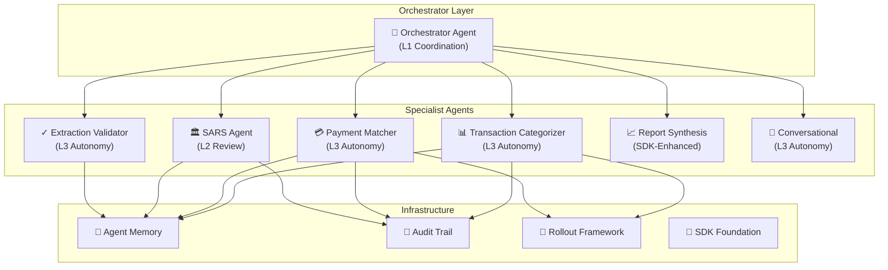
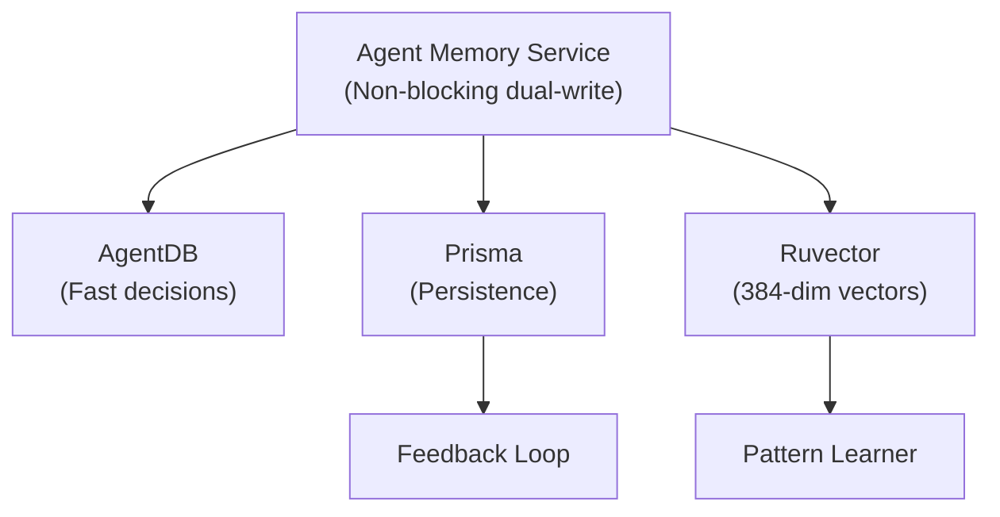

# CrecheBooks AI Agents Architecture

**Last Updated:** 2026-02-03
**Status:** Production Ready
**Agents:** 11 specialized agents with hybrid decision making
**Generated By:** CrecheBooks Documentation Swarm

## Overview

CrecheBooks implements a sophisticated multi-agent AI system for financial decision-making. All agents use a **hybrid approach** combining heuristic rules, LLM reasoning, and vector similarity search.

## System Architecture



---

## Autonomy Levels

| Level | Name | Behavior | Use Case |
|-------|------|----------|----------|
| **L1** | Observer | Log only, coordinate routing | Orchestration |
| **L2** | Collaborator | Draft for human review | SARS submissions |
| **L3** | Autonomous | Auto-apply if ≥80% confidence | Categorization, Matching |

---

## Agent Catalog

### 1. Orchestrator Agent (TASK-AGENT-005)

**Purpose:** Routes workflows to specialist agents based on task type.

**Workflow Types:**
- `CATEGORIZE` → Transaction Categorizer
- `MATCH` → Payment Matcher
- `TAX` → SARS Agent
- `VALIDATE` → Extraction Validator
- `REPORT` → Report Synthesis
- `QUERY` → Conversational Agent

### 2. Transaction Categorizer (TASK-AGENT-002)

**Purpose:** Categorizes bank transactions to GL accounts.

**Autonomy Level:** L3 (Auto-apply ≥80% confidence)

**Decision Flow:**
1. Pattern match (≥80% confidence) → use pattern
2. Ruvector semantic search (cosine ≥0.85) → boost confidence
3. LLM inference via SDK → resolve ambiguity
4. Historical match → fallback
5. Default codes (4100 credit / 8100 debit) → last resort

**Thresholds:**

| Confidence | Action |
|------------|--------|
| ≥80% | AUTO_APPLY |
| 50-79% | REVIEW_REQUIRED |
| <50% | ESCALATE |

### 3. Payment Matcher (TASK-AGENT-003)

**Purpose:** Matches bank payments to outstanding invoices.

**Autonomy Level:** L3 (Auto-apply if single match ≥80%)

**Scoring Algorithm (0-100 points):**

| Factor | Weight | Criteria |
|--------|--------|----------|
| Reference Match | 0-40 | exact=40, contains=30, suffix=15 |
| Amount Match | 0-40 | exact=40, within 1%=35, within 5%=25 |
| Name Similarity | 0-20 | exact=20, >80%=15, >60%=10 |

**Conditions:**
- Single match ≥80%: AUTO_APPLY
- Multiple matches ≥80%: REVIEW_REQUIRED (ambiguous)
- Amount >R50,000: REVIEW_REQUIRED (high-value override)

### 4. SARS Agent (TASK-AGENT-004)

**Purpose:** Calculates tax obligations and generates SARS submissions.

**Autonomy Level:** L2 (ALWAYS drafts for human review)

**Supported Calculations:**
- PAYE (Pay As You Earn)
- UIF (Unemployment Insurance Fund)
- EMP201 (Monthly reconciliation)
- VAT201 (Quarterly VAT)

**Critical Rule:** SARS submissions NEVER auto-apply. All require human approval.

### 5. Extraction Validator (TASK-AGENT-006)

**Purpose:** Validates PDF bank statement extraction quality.

**Autonomy Level:** L3 (Auto-accept ≥90% confidence)

**Validation Checks:**
- Balance reconciliation: opening + transactions = closing
- Amount sanity: detects unrealistic amounts
- OCR error patterns: common OCR mistakes (1→l, 0→O)
- Duplicate detection

### 6. Report Synthesis Agent (TASK-REPORTS-001)

**Purpose:** Generates AI-powered financial insights.

**Report Types:**
- Income Statement Analysis
- Balance Sheet Analysis
- Aged Receivables Analysis
- Aged Payables Analysis
- Anomaly Detection
- Trend Analysis

### 7. Conversational Agent (TASK-SDK-008)

**Purpose:** Natural language interface for financial queries.

**Query Complexity Routing:**

| Complexity | Example | Model |
|------------|---------|-------|
| Simple | "What's my balance?" | Haiku |
| Moderate | "Show January transactions" | Sonnet |
| Complex | "Compare MoM profitability" | Opus |

---

## Memory & Learning Systems

### Architecture



### Memory Operations

```typescript
// Store decision
await memory.storeDecision({
  tenantId: string,
  agentType: 'categorizer' | 'matcher' | 'validator' | 'sars',
  decision: DecisionResult,
  inputHash: string,
  metadata: Record<string, unknown>
});

// Record correction (learning)
await memory.recordCorrection({
  decisionId: string,
  correction: unknown,
  reasoningChain: string
});

// Retrieve similar decisions
const similar = await memory.getSimilarDecisions({
  query: string,
  tenantId: string,
  agentType: string,
  limit: number,
  threshold: number // Cosine similarity
});
```

### Learning Feedback Loop

```
User Correction → Record to Correction Table
        ↓
Pattern Learner Analysis
├─ Compare original to correction
├─ Compute error delta
├─ Update accuracy metrics
└─ Adjust confidence weights
        ↓
Next Agent Run
├─ Query similar decisions
├─ Apply learned patterns
└─ Use updated weights
```

---

## Hybrid Scoring

All agents use a weighted combination of heuristic and LLM scores:

```
Final Score = (LLM Confidence × 0.6) + (Heuristic Confidence × 0.4)
```

**Safety Floor:** Minimum 20% heuristic weight for financial operations.

**Fallback:** If SDK unavailable, 100% heuristic scoring.

---

## Audit Trail

All agent decisions are logged to the `AgentDecision` table:

```typescript
interface LogDecisionParams {
  tenantId: string;
  agentType: string;
  decision: string; // 'match' | 'categorize' | 'escalate'
  confidence: number;
  autoApplied: boolean;
  source: string; // 'deterministic' | 'sdk' | 'historical'
  reasoning: string;
  durationMs: number;
  transactionId?: string;
  invoiceId?: string;
  details: Record<string, unknown>;
}
```

**NO PII stored** - only IDs, codes, confidence scores, and metadata.

---

## Performance Characteristics

| Operation | Latency | Throughput |
|-----------|---------|------------|
| Categorization | 50-200ms | ~200 tx/sec |
| Payment Matching | 30-150ms | ~300 tx/sec |
| Validation | 20-100ms | ~500 tx/sec |
| Audit Logging | <1ms | ~10k logs/sec |
| Vector Search | 5-50ms | ~1000/sec |
| Report Synthesis | 1-5s | ~10/min |

---

## Implementation Status

| Agent | Heuristic | SDK | Memory | Audit | Status |
|-------|-----------|-----|--------|-------|--------|
| Orchestrator | ✅ | ✅ | ✅ | ✅ | 🟢 FULL |
| Categorizer | ✅ | ✅ | ✅ | ✅ | 🟢 FULL |
| Matcher | ✅ | ✅ | ✅ | ✅ | 🟢 FULL |
| SARS | ✅ | ✅ | ✅ | ✅ | 🟢 FULL |
| Validator | ✅ | ✅ | ✅ | ✅ | 🟢 FULL |
| Report Synthesis | ✅ | ✅ | ✅ | ✅ | 🟢 FULL |
| Conversational | ✅ | ✅ | ✅ | ✅ | 🟢 FULL |

**Partial Implementation:**
- SONA optimization (Stub scorer, needs agentic-flow package)
- GNN pattern analysis (Interface ready, adapter available)

---

## File Locations

```
apps/api/src/agents/
├── orchestrator/           # Workflow routing
├── transaction-categorizer/ # GL categorization
├── payment-matcher/        # Invoice matching
├── sars-agent/             # Tax calculations
├── extraction-validator/   # PDF validation
├── report-synthesis/       # AI reports
├── conversational/         # NL queries
├── memory/                 # Learning storage
├── audit/                  # Decision logging
├── rollout/                # A/B testing
└── sdk/                    # LLM integration
```

---

*Generated by CrecheBooks Documentation Swarm*
