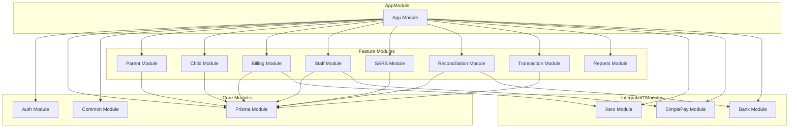
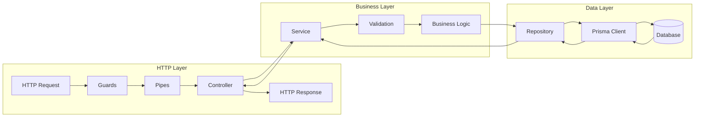
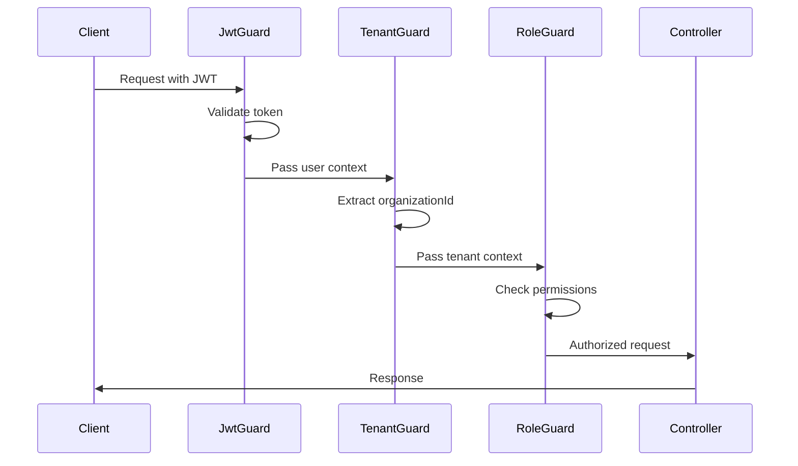

# API Architecture

> NestJS backend structure, patterns, and module organization.

## Module Hierarchy



## Layer Architecture



## Module Structure Pattern

Each feature module follows this structure:

```
module-name/
├── module-name.module.ts      # Module definition
├── module-name.controller.ts  # HTTP endpoints
├── module-name.service.ts     # Business logic
├── module-name.repository.ts  # Data access
├── dto/
│   ├── create-entity.dto.ts   # Create request
│   ├── update-entity.dto.ts   # Update request
│   └── entity-response.dto.ts # Response shape
├── guards/
│   └── entity-access.guard.ts # Authorization
├── decorators/
│   └── entity.decorator.ts    # Custom decorators
└── interfaces/
    └── entity.interface.ts    # Type definitions
```

## Controller Pattern

```typescript
@Controller('parents')
@UseGuards(JwtAuthGuard, TenantGuard)
@ApiTags('Parents')
export class ParentController {
  constructor(private readonly parentService: ParentService) {}

  @Get()
  @ApiOperation({ summary: 'List all parents' })
  async findAll(
    @TenantId() tenantId: string,
    @Query() query: PaginationDto,
  ): Promise<PaginatedResponse<ParentResponseDto>> {
    return this.parentService.findAll(tenantId, query);
  }

  @Get(':id')
  async findOne(
    @TenantId() tenantId: string,
    @Param('id') id: string,
  ): Promise<ParentResponseDto> {
    return this.parentService.findById(id, tenantId);
  }

  @Post()
  async create(
    @TenantId() tenantId: string,
    @Body() dto: CreateParentDto,
  ): Promise<ParentResponseDto> {
    return this.parentService.create(tenantId, dto);
  }

  @Patch(':id')
  async update(
    @TenantId() tenantId: string,
    @Param('id') id: string,
    @Body() dto: UpdateParentDto,
  ): Promise<ParentResponseDto> {
    return this.parentService.update(id, tenantId, dto);
  }

  @Delete(':id')
  async remove(
    @TenantId() tenantId: string,
    @Param('id') id: string,
  ): Promise<void> {
    return this.parentService.softDelete(id, tenantId);
  }
}
```

## Service Pattern

```typescript
@Injectable()
export class ParentService {
  constructor(
    private readonly parentRepository: ParentRepository,
    private readonly childRepository: ChildRepository,
    private readonly eventEmitter: EventEmitter2,
  ) {}

  async findAll(
    tenantId: string,
    query: PaginationDto,
  ): Promise<PaginatedResponse<Parent>> {
    return this.parentRepository.findAll(tenantId, query);
  }

  async findById(id: string, tenantId: string): Promise<Parent> {
    const parent = await this.parentRepository.findById(id, tenantId);
    if (!parent) {
      throw new NotFoundException('Parent not found');
    }
    return parent;
  }

  async create(tenantId: string, dto: CreateParentDto): Promise<Parent> {
    // Business validation
    await this.validateUniqueEmail(tenantId, dto.email);

    // Create entity
    const parent = await this.parentRepository.create(tenantId, dto);

    // Emit event for side effects
    this.eventEmitter.emit('parent.created', { parent, tenantId });

    return parent;
  }

  async softDelete(id: string, tenantId: string): Promise<void> {
    const parent = await this.findById(id, tenantId);

    // Business rule: check for active enrollments
    const activeChildren = await this.childRepository.countActive(
      parent.id,
      tenantId,
    );
    if (activeChildren > 0) {
      throw new BadRequestException(
        'Cannot delete parent with active enrollments',
      );
    }

    await this.parentRepository.softDelete(id, tenantId);
  }
}
```

## Repository Pattern

```typescript
@Injectable()
export class ParentRepository {
  constructor(private readonly prisma: PrismaService) {}

  async findById(id: string, tenantId: string): Promise<Parent | null> {
    return this.prisma.parent.findFirst({
      where: {
        id,
        organizationId: tenantId,
        deletedAt: null,
      },
      include: {
        children: {
          where: { deletedAt: null },
        },
      },
    });
  }

  async findAll(
    tenantId: string,
    query: PaginationDto,
  ): Promise<PaginatedResponse<Parent>> {
    const { page = 1, limit = 20, search } = query;
    const skip = (page - 1) * limit;

    const where: Prisma.ParentWhereInput = {
      organizationId: tenantId,
      deletedAt: null,
      ...(search && {
        OR: [
          { firstName: { contains: search, mode: 'insensitive' } },
          { lastName: { contains: search, mode: 'insensitive' } },
          { email: { contains: search, mode: 'insensitive' } },
        ],
      }),
    };

    const [data, total] = await Promise.all([
      this.prisma.parent.findMany({
        where,
        skip,
        take: limit,
        orderBy: { createdAt: 'desc' },
      }),
      this.prisma.parent.count({ where }),
    ]);

    return {
      data,
      meta: {
        total,
        page,
        limit,
        totalPages: Math.ceil(total / limit),
      },
    };
  }

  async create(tenantId: string, dto: CreateParentDto): Promise<Parent> {
    return this.prisma.parent.create({
      data: {
        ...dto,
        organizationId: tenantId,
      },
    });
  }

  async softDelete(id: string, tenantId: string): Promise<void> {
    await this.prisma.parent.update({
      where: { id },
      data: { deletedAt: new Date() },
    });
  }
}
```

## Guard Implementation



## API Endpoints Summary

### Authentication
| Method | Endpoint | Description |
|--------|----------|-------------|
| POST | `/auth/login` | User login |
| POST | `/auth/register` | User registration |
| POST | `/auth/refresh` | Refresh token |
| POST | `/auth/logout` | User logout |
| GET | `/auth/me` | Current user |

### Parents
| Method | Endpoint | Description |
|--------|----------|-------------|
| GET | `/parents` | List parents |
| GET | `/parents/:id` | Get parent |
| POST | `/parents` | Create parent |
| PATCH | `/parents/:id` | Update parent |
| DELETE | `/parents/:id` | Soft delete |

### Children
| Method | Endpoint | Description |
|--------|----------|-------------|
| GET | `/children` | List children |
| GET | `/children/:id` | Get child |
| POST | `/children` | Create child |
| PATCH | `/children/:id` | Update child |
| POST | `/children/:id/enroll` | Enroll child |
| POST | `/children/:id/graduate` | Graduate child |

### Billing
| Method | Endpoint | Description |
|--------|----------|-------------|
| GET | `/invoices` | List invoices |
| GET | `/invoices/:id` | Get invoice |
| POST | `/invoices/generate` | Generate invoices |
| POST | `/payments` | Record payment |
| GET | `/arrears` | View arrears |

### Staff & Payroll
| Method | Endpoint | Description |
|--------|----------|-------------|
| GET | `/staff` | List staff |
| POST | `/staff` | Add staff |
| GET | `/payroll/run` | Get payroll run |
| POST | `/payroll/process` | Process payroll |

### SARS Compliance
| Method | Endpoint | Description |
|--------|----------|-------------|
| GET | `/sars/emp201` | EMP201 data |
| POST | `/sars/emp201/submit` | Submit EMP201 |
| GET | `/sars/vat201` | VAT201 data |
| POST | `/sars/vat201/submit` | Submit VAT201 |

### Reconciliation
| Method | Endpoint | Description |
|--------|----------|-------------|
| GET | `/reconciliation` | View status |
| POST | `/reconciliation/import` | Import statement |
| POST | `/reconciliation/match` | Match transactions |
