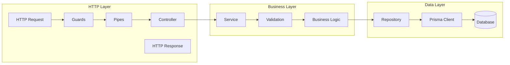

# CrecheBooks NestJS API Module Architecture

**Last Updated:** 2026-02-03
**Status:** Production Ready
**Generated By:** CrecheBooks Documentation Swarm

## Overview

CrecheBooks API is structured as a modular NestJS 11 application with **56+ modules** organized into distinct layers: Core Infrastructure, API Routes, Integrations, AI Agents, and Supporting Services.

## Module Count Summary

| Category | Count |
|----------|-------|
| Root/Core | 1 (AppModule) |
| Core Infrastructure | 7 modules |
| API Modules | 15 modules |
| Integrations | 8 modules |
| AI Agents | 10 modules |
| Communications | 3 modules |
| Support | 7+ modules |

---

## Module Dependency Diagram

```mermaid
graph TB
    AppModule["AppModule<br/>(Root)"]

    subgraph Infrastructure["Infrastructure Layer"]
        ConfigMod["ConfigModule"]
        HealthMod["HealthModule"]
        PrismaMod["PrismaModule"]
        LoggerMod["LoggerModule"]
        MetricsMod["MetricsModule"]
        SharedMod["SharedModule"]
    end

    subgraph Database["Database & Persistence"]
        DatabaseMod["DatabaseModule<br/>(120+ services)"]
        PrismaSvc["PrismaService"]
        Repos["25+ Repositories"]
        Services["Business Logic Services"]
    end

    subgraph APILayer["API Layer"]
        AuthMod["AuthModule"]
        BillingMod["BillingApiModule"]
        PaymentMod["PaymentModule"]
        TransMod["TransactionModule"]
        DashMod["DashboardModule"]
        ParentsMod["ParentsModule"]
        StaffMod["StaffModule"]
        ArearsMod["ArrearsModule"]
        SarsMod["SarsApiModule"]
        ReconcMod["ReconciliationModule"]
        AcctMod["AccountingModule"]
        AdminMod["AdminModule"]
    end

    subgraph Integration["Integration Layer"]
        XeroMod["XeroModule<br/>(Bank Feeds, Sync)"]
        BankingMod["BankingModule<br/>(Stitch)"]
        WhatsAppMod["WhatsAppModule"]
        MailgunMod["MailgunModule"]
        EmailMod["EmailModule"]
        SimplePayMod["SimplePayModule"]
        CircuitMod["CircuitBreakerModule"]
    end

    subgraph Agents["AI Agent Layer"]
        OrchestratorMod["OrchestratorModule"]
        CategorizerMod["TransactionCategorizerModule"]
        MatcherMod["PaymentMatcherModule"]
        SarsAgentMod["SarsAgentModule"]
        MemoryMod["AgentMemoryModule"]
        AuditMod["AuditTrailModule"]
        RolloutMod["RolloutModule"]
    end

    subgraph Communications["Communications"]
        NotifMod["NotificationModule"]
        CommsMod["CommunicationsApiModule"]
        WebSocketMod["WebSocketModule"]
    end

    subgraph Supporting["Supporting Services"]
        SchMod["SchedulerModule"]
        WebhookMod["WebhookModule"]
        ReportsMod["ReportsModule"]
        McpMod["CrechebooksMcpModule"]
    end

    AppModule --> ConfigMod
    AppModule --> HealthMod
    AppModule --> PrismaMod
    AppModule --> DatabaseMod
    AppModule --> APILayer
    AppModule --> Integration
    AppModule --> Communications
    AppModule --> Supporting

    DatabaseMod --> PrismaMod
    DatabaseMod --> Repos
    DatabaseMod --> Services
    DatabaseMod --> Agents

    BillingMod --> EmailMod
    BillingMod --> WhatsAppMod

    Agents --> MemoryMod
    Agents --> AuditMod
    Agents --> RolloutMod

    SchMod --> BillingMod
    WebhookMod --> DatabaseMod

    style AppModule fill:#ff6b6b
    style Infrastructure fill:#4ecdc4
    style Database fill:#45b7d1
    style APILayer fill:#f7b801
    style Integration fill:#96ceb4
    style Agents fill:#dda15e
    style Communications fill:#bc6c25
    style Supporting fill:#6c757d
```



---

## 1. Infrastructure Layer

### AppModule
- **Location**: `apps/api/src/app.module.ts`
- **Purpose**: Root module - bootstraps entire application
- **Global Providers**:
  - ThrottlerGuard (rate limiting)
  - JwtAuthGuard (authentication)
  - TenantGuard (multi-tenancy)
  - RolesGuard (authorization)

### DatabaseModule (Central Hub)
- **Location**: `apps/api/src/database/database.module.ts`
- **Purpose**: Central hub with 120+ services and 25+ repositories
- **Key Exports**: All repositories and services for dependency injection

### Other Infrastructure
| Module | Location | Purpose |
|--------|----------|---------|
| ConfigModule | `src/config/` | Environment configuration |
| HealthModule | `src/health/` | Health checks (`/health`, `/ready`, `/live`) |
| PrismaModule | `src/database/prisma/` | ORM initialization |
| LoggerModule | `src/common/logger/` | Structured JSON logging |
| MetricsModule | `src/metrics/` | Database pool metrics |

---

## 2. API Layer (15 modules)

| Module | Controllers | Purpose |
|--------|-------------|---------|
| **AuthModule** | auth, parent-auth, staff-auth, api-key | JWT + Auth0 + API Key authentication |
| **BillingApiModule** | invoice, child, enrollment, statement | Invoicing & enrollment |
| **PaymentModule** | payment | Payment processing, AI matching |
| **TransactionModule** | transaction | Bank transaction management |
| **DashboardModule** | dashboard | Real-time dashboards |
| **ArrearsModule** | arrears | Arrears tracking & reminders |
| **ParentsModule** | parent, parent-portal | Parent account management |
| **StaffModule** | staff, staff-portal, onboarding, leave | Staff management & payroll |
| **SarsApiModule** | sars | Tax authority compliance |
| **ReconciliationModule** | reconciliation | Bank reconciliation |
| **AccountingModule** | chart-of-account, general-ledger, cash-flow, supplier, quote | Full accounting |
| **AdminModule** | admin, impersonation | Admin operations |
| **PublicModule** | contact, demo, signup | Public-facing endpoints |
| **IntegrationsModule** | simplepay | External integration APIs |
| **CommunicationsApiModule** | communication | Communication settings |

### Auth Module Detail

```typescript
// Key Services
- AuthService: Core authentication logic
- MagicLinkService: Passwordless auth for parents
- Auth0ManagementService: Auth0 integration
- ApiKeyService: API key generation/validation
- CsrfStoreService: CSRF token management
- FailedAttemptsService: Brute force protection

// Guards (All Exported)
- JwtAuthGuard: Validates JWT tokens
- RolesGuard: Role-based access control
- ParentAuthGuard: Parent-specific auth
- StaffAuthGuard: Staff-specific auth
- ApiKeyAuthGuard: API key validation
- CombinedAuthGuard: Multiple auth methods
```

---

## 3. Integration Layer (8 modules)

### XeroModule
```
Location: apps/api/src/integrations/xero/
Purpose: Xero accounting software integration

Services:
- BankFeedService: Import bank transactions
- XeroAuthService: OAuth 2.0 connection management
- XeroJournalService: Push journal entries
- XeroRateLimiter: Distributed rate limiting
- XeroInvoiceService: Bidirectional invoice sync
- XeroContactService: Customer/supplier sync
```

### BankingModule
```
Location: apps/api/src/integrations/banking/
Purpose: Open banking integration (Stitch API)

Services:
- StitchBankingService: Stitch API client
- BankSyncJob: Periodic transaction sync
- EncryptionService: Secure credential storage
```

### WhatsAppModule
```
Location: apps/api/src/integrations/whatsapp/
Purpose: WhatsApp Business API

Services:
- WhatsAppService: Core messaging
- WhatsAppTemplateService: Template management
- WhatsAppRetryService: Message retry logic
- TwilioWhatsAppService: Twilio provider

Queue: WHATSAPP_RETRY (if Redis available)
```

### Other Integrations
| Module | Purpose |
|--------|---------|
| MailgunModule | Email service (Global scope) |
| EmailModule | Email abstractions |
| SimplePayModule | SimplePay payroll integration |
| CircuitBreakerModule | API resilience pattern |
| SarsModule | SARS tax authority integration |

---

## 4. AI Agent Layer (10 modules)

All located in `apps/api/src/agents/`

| Module | Purpose | Key Classes |
|--------|---------|-------------|
| **OrchestratorModule** | Multi-agent workflow orchestration | OrchestratorAgent, WorkflowRouter, EscalationManager |
| **TransactionCategorizerModule** | AI categorization of transactions | PatternMatcher, ConfidenceScorer, HybridScorer |
| **PaymentMatcherModule** | AI matching payments to invoices | SdkPaymentMatcher, MatchDecisionLogger |
| **SarsAgentModule** | SARS tax compliance automation | Tax calculation logic |
| **AgentMemoryModule** | Persistent memory for agents | Decision storage, learning |
| **AuditTrailModule** | Structured audit logging | Decision logging |
| **ExtractionValidatorModule** | PDF extraction validation | OCR validation |
| **ConversationalModule** | Conversational AI | User interaction |
| **RolloutModule** | Canary deployment framework | A/B testing |
| **ReportSynthesisModule** | AI-powered report generation | Insights generation |

---

## 5. Communications Layer (3 modules)

### NotificationModule
```
Location: apps/api/src/notifications/
Purpose: Multi-channel notifications

Adapters:
- EmailChannelAdapter
- WhatsAppChannelAdapter
- SmsChannelAdapter

SMS Gateways (Factory Pattern):
- AfricasTalkingSmsGateway (production)
- MockSmsGateway (development)
```

### WebSocketModule
```
Location: apps/api/src/websocket/
Purpose: Real-time WebSocket connections

Key Classes:
- DashboardGateway: Main WebSocket gateway
- WsJwtGuard: WebSocket JWT validation
```

---

## 6. Supporting Services

### SchedulerModule
```
Location: apps/api/src/scheduler/
Purpose: Scheduled job execution

Queues (if Redis available):
- INVOICE_GENERATION
- PAYMENT_REMINDER
- SARS_DEADLINE
- BANK_SYNC
- STATEMENT_GENERATION

Job Options:
- 3 retry attempts
- Exponential backoff
- Auto-cleanup on completion
```

### WebhookModule
```
Location: apps/api/src/webhooks/
Purpose: Incoming webhook handling

Security:
- WebhookSignatureGuard: HMAC verification
- IdempotencyGuard: Redis-backed deduplication
```

### ReportsModule
```
Location: apps/api/src/modules/reports/
Purpose: Reports generation and export

Services:
- ReportsService: Report logic
- PdfGeneratorService: PDF rendering

Imports: ReportSynthesisModule (AI insights)
```

---

## Global Guards (Applied in Order)

```typescript
1. CustomThrottlerGuard (rate limiting - early abort)
2. JwtAuthGuard (authentication)
3. TenantGuard (tenant context validation)
4. RolesGuard (authorization)
```

### Rate Limiting Configuration

```typescript
{
  name: 'short',
  ttl: 1000,          // 1 second
  limit: 10           // 10 requests/second
},
{
  name: 'medium',
  ttl: 60000,         // 1 minute
  limit: 100          // 100 requests/minute
},
{
  name: 'long',
  ttl: 3600000,       // 1 hour
  limit: 1000         // 1000 requests/hour
}
```

---

## Layer Architecture



---

## Key Service Statistics

| Category | Count |
|----------|-------|
| Total Modules | 56+ |
| Repositories | 25+ |
| Business Services | 120+ |
| Controllers | 40+ |
| Guards | 15+ |
| Processors | 8+ |
| AI Agents | 10+ |

---

## Environment Configuration

```bash
# Auth
AUTH_PROVIDER=auth0|jwt
JWT_SECRET
JWT_EXPIRATION
AUTH0_DOMAIN, AUTH0_CLIENT_ID, AUTH0_CLIENT_SECRET

# Integrations
REDIS_HOST, REDIS_PORT, REDIS_PASSWORD
XERO_CLIENT_ID, XERO_CLIENT_SECRET
STITCH_API_KEY
WHATSAPP_PROVIDER=meta|twilio
SMS_GATEWAY=mock|africastalking

# Throttling
THROTTLE_SHORT_LIMIT, THROTTLE_SHORT_TTL
THROTTLE_MEDIUM_LIMIT, THROTTLE_MEDIUM_TTL
THROTTLE_LONG_LIMIT, THROTTLE_LONG_TTL

# Features
NODE_ENV=development|production
```

---

## API Endpoints Summary

### Authentication
| Method | Endpoint | Description |
|--------|----------|-------------|
| POST | `/auth/login` | User login |
| POST | `/auth/callback` | OAuth callback |
| POST | `/auth/refresh` | Refresh token |
| POST | `/auth/logout` | User logout |
| GET | `/auth/me` | Current user |

### Parents & Children
| Method | Endpoint | Description |
|--------|----------|-------------|
| GET | `/parents` | List parents |
| POST | `/parents` | Create parent |
| GET | `/children` | List children |
| POST | `/children/:id/enroll` | Enroll child |

### Billing
| Method | Endpoint | Description |
|--------|----------|-------------|
| GET | `/invoices` | List invoices |
| POST | `/invoices/generate` | Generate invoices |
| POST | `/payments` | Record payment |
| GET | `/arrears` | View arrears |

### Staff & Payroll
| Method | Endpoint | Description |
|--------|----------|-------------|
| GET | `/staff` | List staff |
| POST | `/payroll/process` | Process payroll |

### SARS Compliance
| Method | Endpoint | Description |
|--------|----------|-------------|
| GET | `/sars/emp201` | EMP201 data |
| POST | `/sars/emp201/submit` | Submit EMP201 |
| GET | `/sars/vat201` | VAT201 data |

### Reconciliation
| Method | Endpoint | Description |
|--------|----------|-------------|
| GET | `/reconciliation` | View status |
| POST | `/reconciliation/import` | Import statement |
| POST | `/reconciliation/match` | Match transactions |

---

## Best Practices Observed

1. **Separation of Concerns**: Clear layering (Infrastructure → API → Integrations)
2. **Dependency Injection**: NestJS DI container for loose coupling
3. **Forward References**: Breaking circular dependencies with `forwardRef()`
4. **Repository Pattern**: Data access abstraction
5. **Guard Pattern**: Cross-cutting authentication/authorization
6. **Factory Pattern**: SMS Gateway provider selection
7. **Circuit Breaker**: Resilience for external APIs
8. **Conditional Module Loading**: Redis-dependent modules
9. **Multi-tenancy**: TenantGuard enforces tenant isolation

---

*Generated by CrecheBooks Documentation Swarm*
