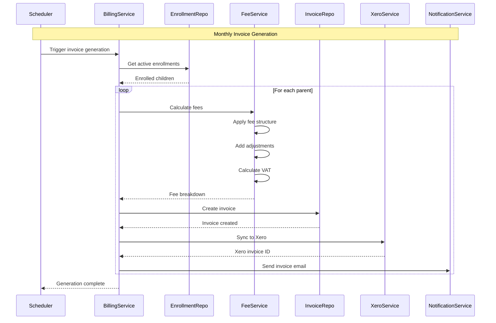
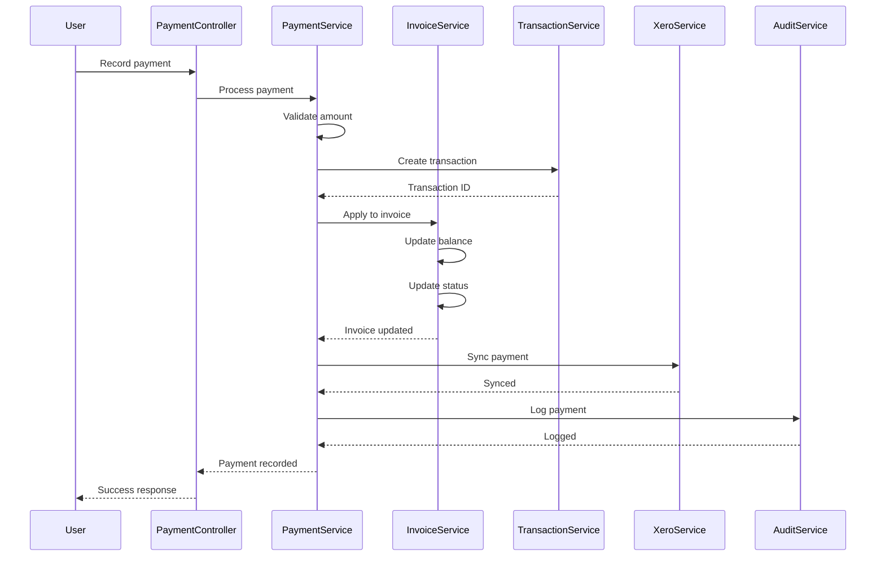
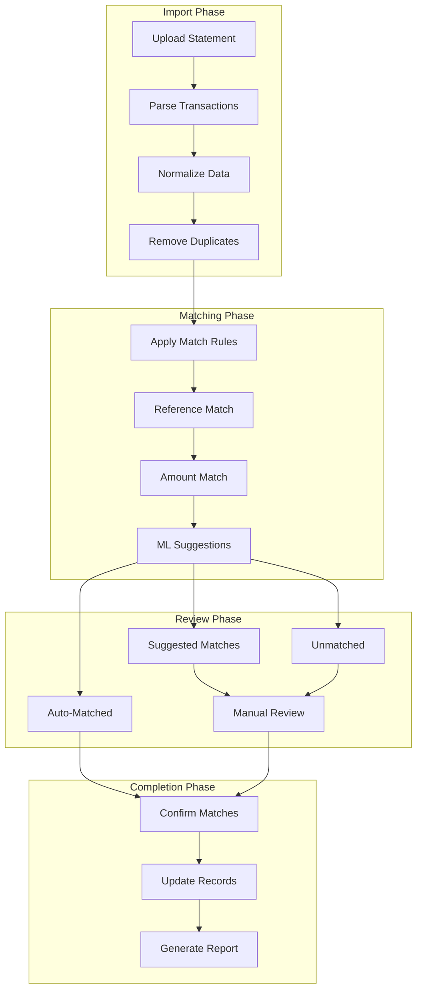
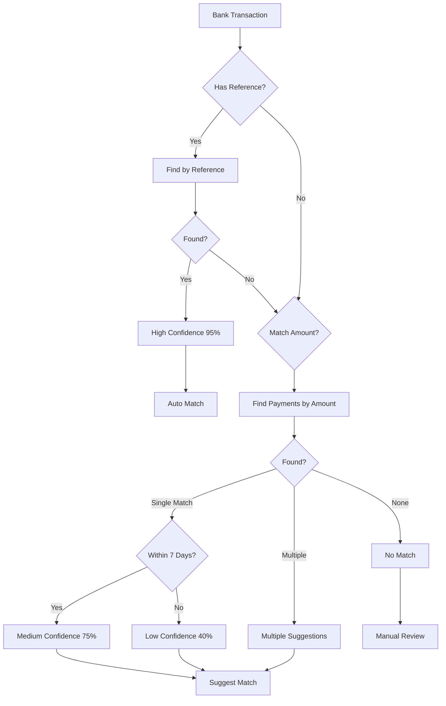
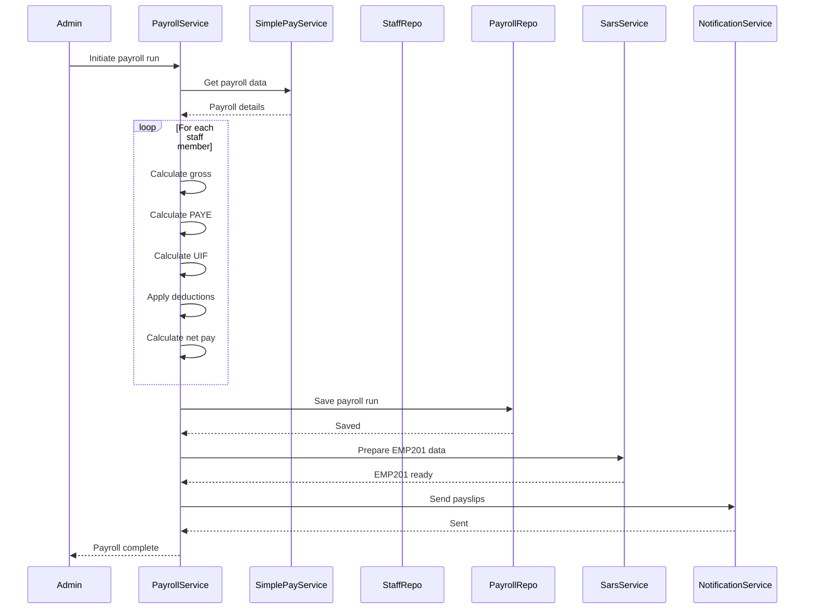
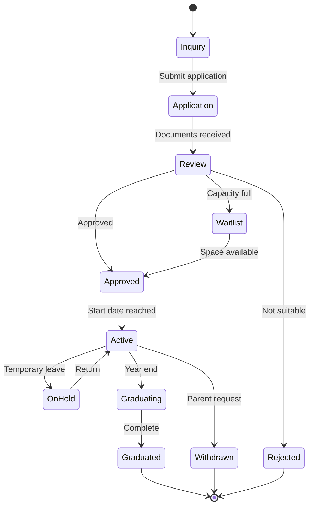
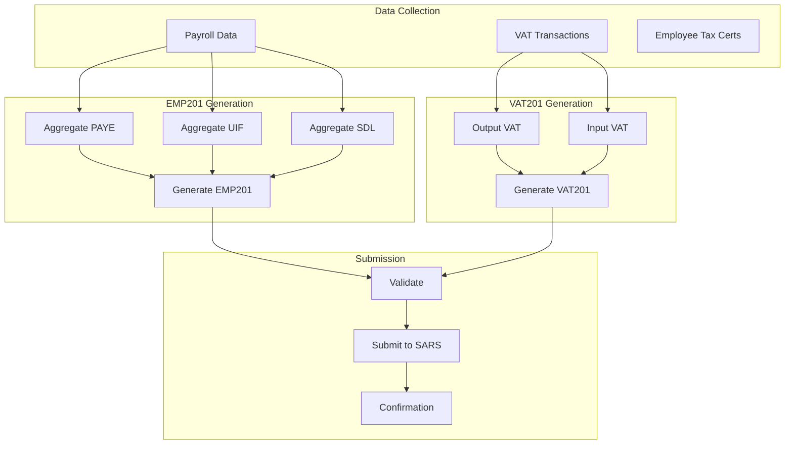
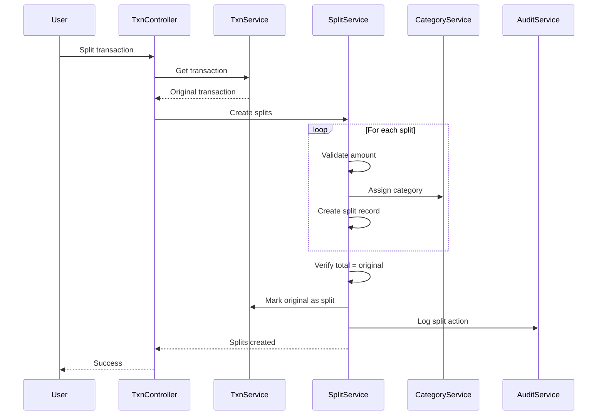

# Data Flows

> Key business process flows and data transformations.

## Invoice Generation Flow

## Payment Processing Flow

## Reconciliation Flow

### Matching Rules Detail

## Payroll Processing Flow

## Child Enrollment Flow

## SARS Submission Flow

## Transaction Split Flow

## Data Transformation Summary

| Source | Transformation | Destination |
|--------|----------------|-------------|
| Enrollment + Fee Structure | Calculate monthly fees | Invoice Lines |
| Bank Transaction | Match by reference/amount | Payment Record |
| Payroll Data | Tax calculations | Payslips + EMP201 |
| Invoices + Payments | Aggregate totals | VAT201 |
| All mutations | Extract changes | Audit Log |
| SimplePay webhook | Transform employee data | Staff Records |
| Xero sync | Map invoice format | Xero Invoice |
