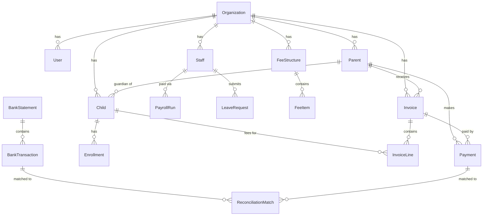
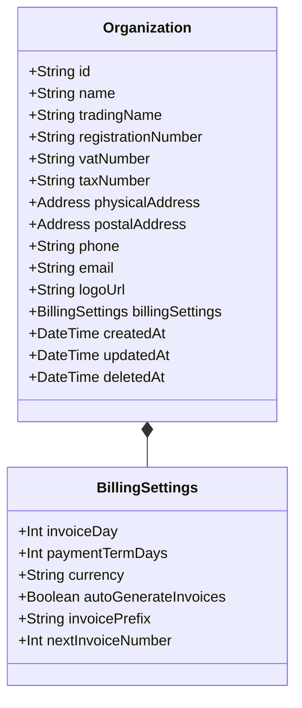
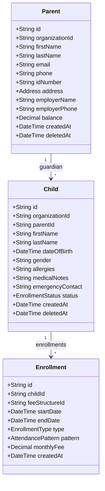
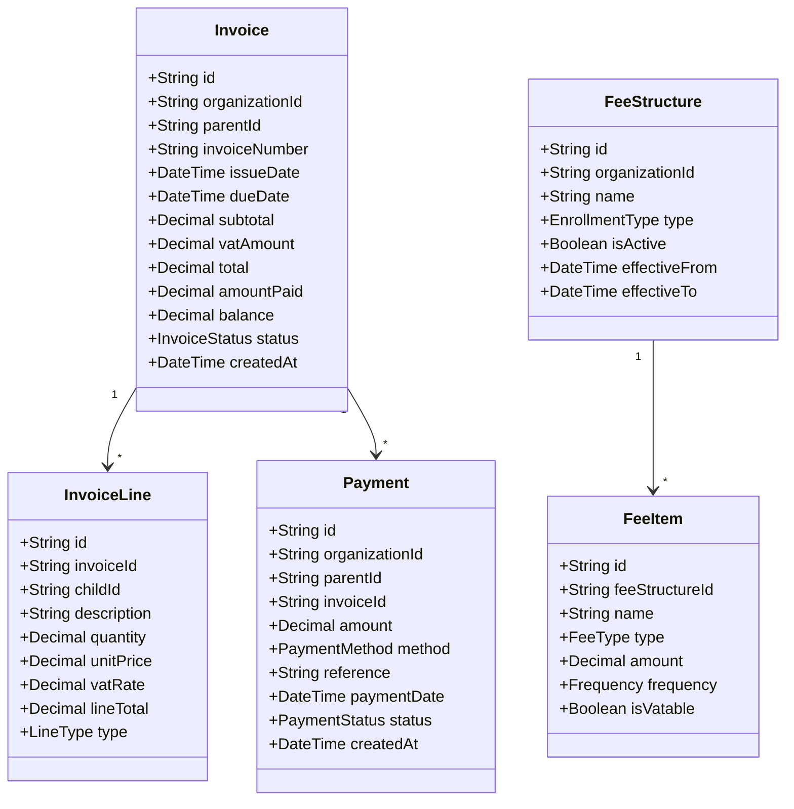
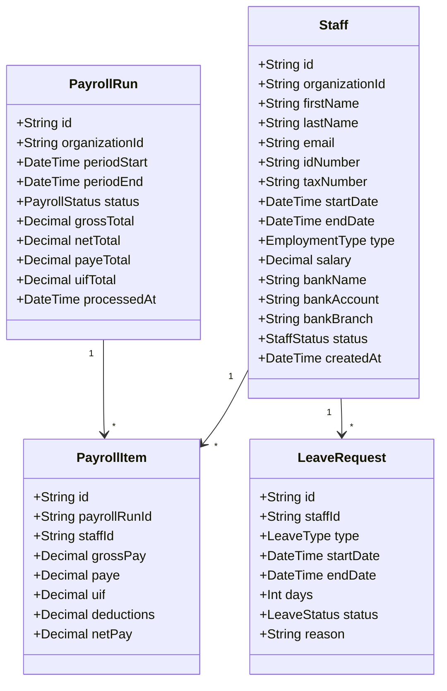
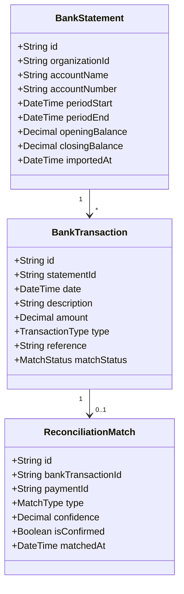
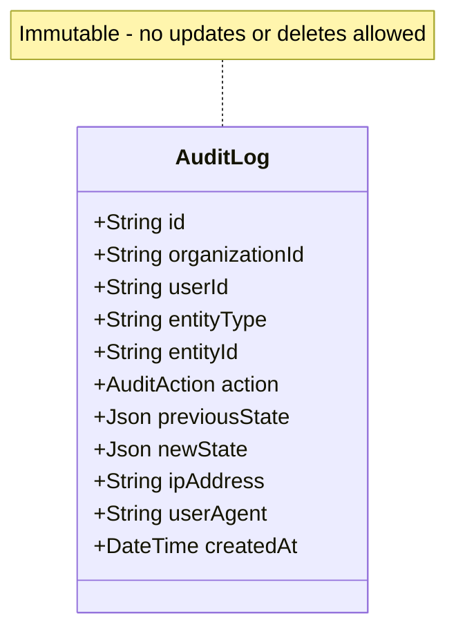

# Database Schema

> PostgreSQL database schema with Prisma ORM - 50+ models supporting multi-tenant architecture.

## Entity Relationship Overview



## Core Domain Models

### Organization (Tenant)



### Parent & Child



### Billing Domain



### Staff & Payroll



### Reconciliation



## Audit Trail



## Key Schema Features

### Multi-Tenant Isolation

Every tenant-scoped table includes:
```prisma
model Entity {
  id             String   @id @default(cuid())
  organizationId String   @map("organization_id")
  organization   Organization @relation(fields: [organizationId], references: [id])

  // ... other fields

  @@index([organizationId])
}
```

### Soft Deletes

All entities support soft deletion:
```prisma
model Entity {
  // ... fields
  deletedAt DateTime? @map("deleted_at")

  @@index([deletedAt])
}
```

### Audit Timestamps

Standard timestamp fields:
```prisma
model Entity {
  createdAt DateTime @default(now()) @map("created_at")
  updatedAt DateTime @updatedAt @map("updated_at")
}
```

### Financial Precision

All monetary values use `Decimal` for precision:
```prisma
model Invoice {
  subtotal   Decimal @db.Decimal(10, 2)
  vatAmount  Decimal @db.Decimal(10, 2)
  total      Decimal @db.Decimal(10, 2)
}
```

## Indexes

| Table | Index | Purpose |
|-------|-------|---------|
| All tenant tables | `organizationId` | Tenant isolation queries |
| All tables | `deletedAt` | Soft delete filtering |
| `Invoice` | `(organizationId, status)` | Invoice listing |
| `Payment` | `(organizationId, paymentDate)` | Payment history |
| `BankTransaction` | `(statementId, matchStatus)` | Reconciliation |
| `Child` | `(organizationId, status)` | Active enrollments |
| `Staff` | `(organizationId, status)` | Active staff |

## Enums

```prisma
enum InvoiceStatus {
  DRAFT
  SENT
  PAID
  PARTIAL
  OVERDUE
  CANCELLED
}

enum PaymentMethod {
  CASH
  EFT
  CARD
  DEBIT_ORDER
}

enum EnrollmentType {
  FULL_DAY
  HALF_DAY
  AFTER_CARE
}

enum StaffStatus {
  ACTIVE
  ON_LEAVE
  TERMINATED
}

enum LeaveType {
  ANNUAL
  SICK
  FAMILY
  MATERNITY
  UNPAID
}
```

## Migration Strategy

1. **Schema Changes**: All via Prisma migrations
2. **Data Migrations**: Separate scripts for data transforms
3. **Rollback**: Each migration has down migration
4. **Testing**: Migrations tested in staging first
