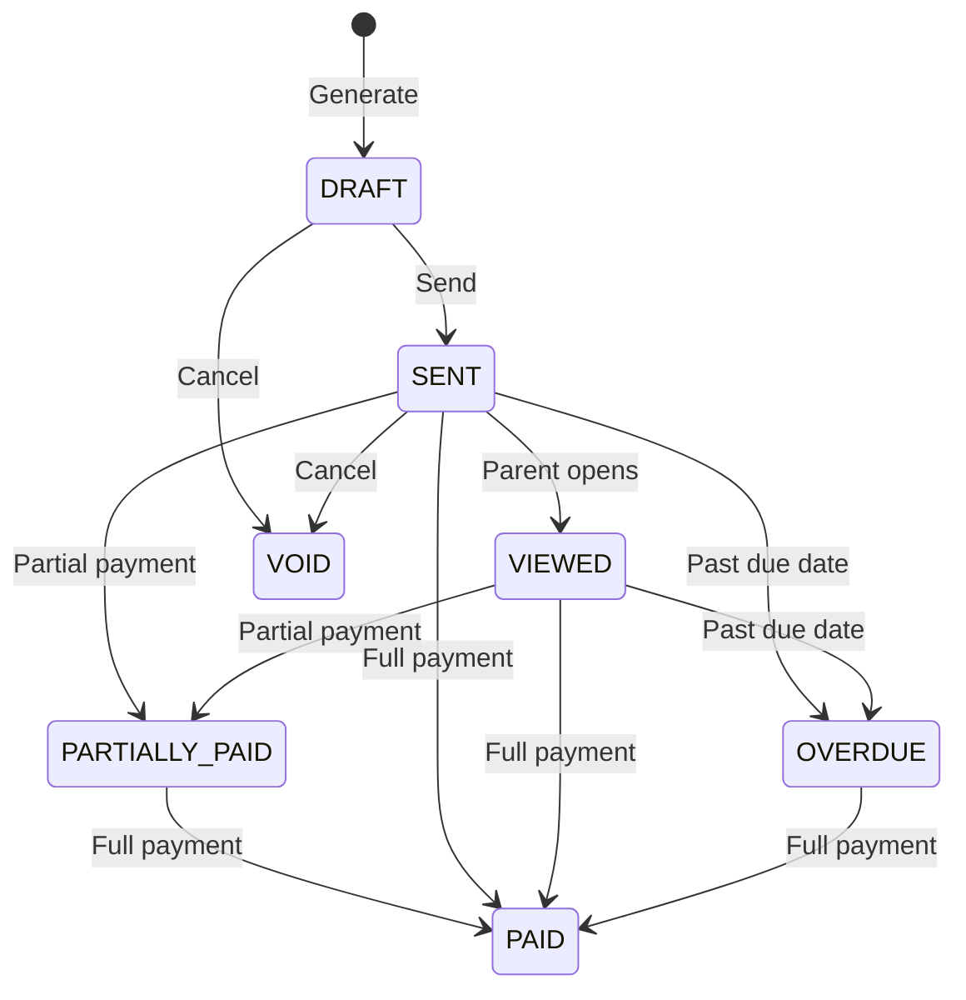
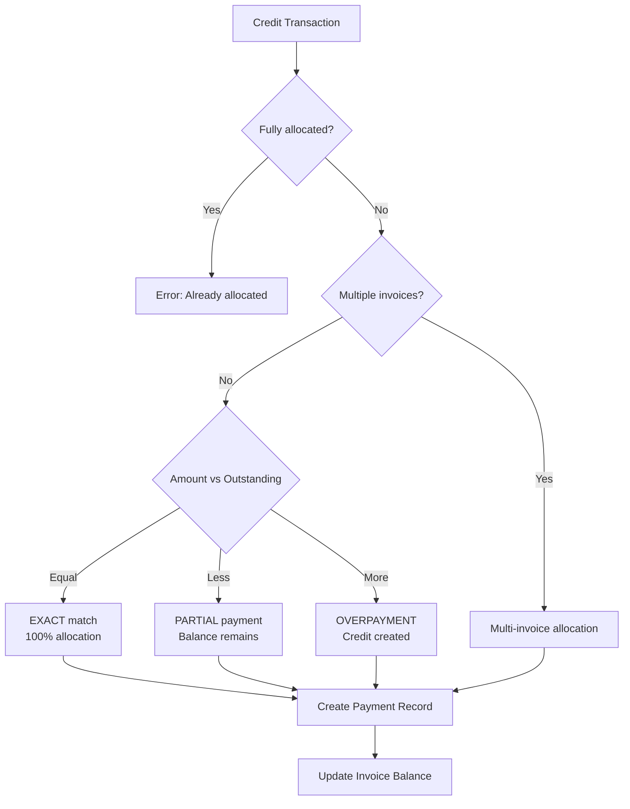
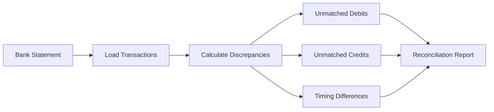
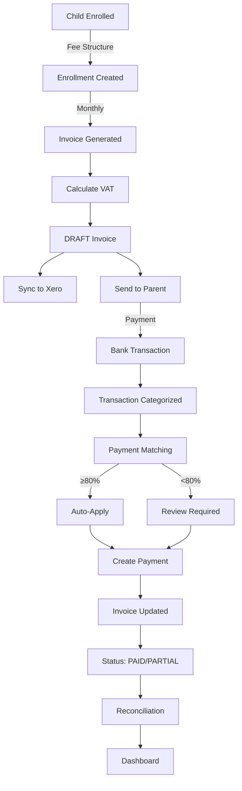

# Financial Domain Architecture - CrecheBooks

**Last Updated:** 2026-02-03
**Status:** Production Ready
**Generated By:** CrecheBooks Documentation Swarm

## Overview

CrecheBooks implements a complete financial management system for South African creches and pre-schools, with integrated invoicing, payment processing, transaction management, and bank reconciliation.

### Key Principles
- **Currency**: South African Rand (ZAR)
- **Amount Storage**: Cents as integers (e.g., R1000 = 100000 cents)
- **Calculation Library**: Decimal.js with banker's rounding (ROUND_HALF_EVEN)
- **Tenant Isolation**: ALL queries must be scoped to `tenantId`
- **Audit Logging**: All financial mutations logged with userId, timestamp, before/after values
- **VAT Rate**: 15% for taxable services

---

## 1. Invoicing System

### Invoice Lifecycle



### Line Types & VAT Classification

**VAT EXEMPT (Section 12(h) - Educational/Childcare Services)**
- MONTHLY_FEE (core tuition)
- REGISTRATION (enrollment fee)
- RE_REGISTRATION (annual fee)
- EXTRA_MURAL (educational activities)
- CREDIT/DISCOUNT (adjustments)

**VAT APPLICABLE (15% on Goods & Non-Educational Services)**
- BOOKS (educational materials)
- SCHOOL_TRIP (external activities)
- STATIONERY (supplies)
- UNIFORM (clothing)
- MEALS (prepared food)
- TRANSPORT (to/from school)
- LATE_PICKUP (penalty fee)
- DAMAGED_EQUIPMENT (replacement)
- AD_HOC (configurable)

### Invoice Generation Process

1. Parse billing month (YYYY-MM format)
2. Calculate billing period using tax utilities
3. Fetch active enrollments for the tenant
4. For each enrollment:
   - Retrieve fee structure (stored in cents)
   - Calculate pro-rata amounts if mid-month enrollment
   - Apply sibling discounts (configurable per tenant)
   - Calculate VAT based on line type
   - Create invoice with line items atomically
5. Sync DRAFT invoices to Xero
6. Return generation summary

---

## 2. Payment Processing

### Payment Allocation Flow



### Payment Matching (AI-Powered)

**Confidence Scoring Algorithm (0-100 points):**

| Category | Max Score | Criteria |
|----------|-----------|----------|
| Reference Match | 40 | exact=40, contains=30, suffix=15 |
| Amount Match | 40 | exact=40, tolerance=35-38, 1%=35, 5%=25 |
| Name Similarity | 20 | exact=20, >80%=15, >60%=10 |

**Auto-Apply Rules:**
- Single match ≥80%: AUTO_APPLIED
- Multiple high-confidence: REVIEW_REQUIRED
- Confidence <80%: REVIEW_REQUIRED
- No matches: NO_MATCH

---

## 3. Transaction Management

### Transaction Entity

```typescript
enum ImportSource {
  BANK_FEED      // Direct bank import
  CSV_IMPORT     // Manual CSV upload
  PDF_IMPORT     // Bank statement PDF
  MANUAL         // Manual entry
}

enum TransactionStatus {
  PENDING        // Awaiting categorization
  CATEGORIZED    // User/auto categorized
  REVIEW_REQUIRED // Flagged for review
  SYNCED         // Synced to Xero
}
```

### Categorization

```typescript
interface Categorization {
  accountCode: string        // e.g., '4000' for school fees
  accountName: string
  vatType: 'STANDARD' | 'ZERO_RATED' | 'EXEMPT' | 'NO_VAT'
  vatRate: number            // 15 for 15%
  source: 'AI_AUTO' | 'AI_SUGGESTED' | 'USER_OVERRIDE' | 'RULE_BASED'
  confidence: number         // 0-100
}
```

---

## 4. Arrears Tracking

### Aging Bucket Calculation

```
daysOverdue = now - dueDate

CURRENT:     daysOverdue ≤ 0
DAYS_30:     0 < daysOverdue ≤ 30
DAYS_60:     30 < daysOverdue ≤ 60
DAYS_90+:    daysOverdue > 60
```

### Arrears Report Structure

```typescript
interface ArrearsReport {
  summary: {
    totalOutstandingCents: number
    totalInvoices: number
    aging: {
      current: number
      days_30: number
      days_60: number
      days_90_plus: number
    }
  }
  topDebtors: DebtorSummary[]
  invoices: ArrearsInvoice[]
  generatedAt: Date
}
```

---

## 5. Bank Reconciliation

### Reconciliation Process



### Split Transactions (Bank Fees)

When a transaction contains both payment and fee:

```
Original: R1000 transaction
    ├── NET: R950 (allocate to invoice)
    └── FEE: R50 (reconcile separately)
```

---

## 6. Fee Structures & Enrollment

### Fee Types

```typescript
enum FeeType {
  FULL_DAY     // Full-time daily rate
  HALF_DAY     // Half-day rate
  HOURLY       // Hourly rate
  CUSTOM       // Custom configuration
}
```

### Enrollment Lifecycle

```
Register → ACTIVE → Withdraw/Graduate
    ↓         ↓
  Create   Monthly
  child    invoices
  + enroll
              ↓
         GRADUATED or
         WITHDRAWN
              ↓
         Offboarding:
         - Settle account
         - Credit/refund
         - Final invoice
```

### Pro-Rata Calculations

- Mid-month enrollment: `amountCents = daily_rate × days_active`
- Daily rate = `monthly_fee ÷ days_in_month`
- Handles varying month lengths and leap years

---

## 7. Statement Generation

### Statement Types

1. **Individual**: One per child
2. **Household**: Consolidated for parent (all children)
3. **Period**: Month, quarter, annual

### Statement Line Types

- `LINE_TYPE_INVOICE` (amount owed)
- `LINE_TYPE_PAYMENT` (amount paid, negative)
- `LINE_TYPE_CREDIT` (credit applied, negative)
- `LINE_TYPE_ADJUSTMENT` (manual adjustment)

---

## 8. Amount Handling

### Conversion Convention

```typescript
// API Request (decimal format)
{ "amount": 1000.50 }  // R1000.50

// Internal Storage (cents)
amountCents = Math.round(amount * 100)  // 100050

// API Response (back to decimal)
amount = amountCents / 100  // 1000.50
```

### Decimal.js Configuration

```typescript
Decimal.set({
  precision: 20,
  rounding: Decimal.ROUND_HALF_EVEN,  // Banker's rounding
})
```

---

## 9. End-to-End Flow



---

## 10. Implementation Status

| Component | Status | Notes |
|-----------|--------|-------|
| Invoice Generation | ✅ Complete | Atomic creation, Xero sync |
| Payment Allocation | ✅ Complete | Exact/partial/overpayment |
| Payment Matching | ✅ Complete | AI confidence scoring |
| Arrears Reporting | ✅ Complete | Aging analysis, exports |
| Bank Reconciliation | ✅ Complete | Discrepancy detection |
| VAT Calculations | ✅ Complete | Line-type based, 15% |
| Statement Generation | ✅ Complete | PDF, email/WhatsApp |
| Fee Structures | ✅ Complete | Pro-rata, sibling discounts |
| Split Transactions | ✅ Complete | Bank fee separation |

---

## File Locations

```
apps/api/src/database/services/
├── invoice-generation.service.ts
├── payment-allocation.service.ts
├── payment-matching.service.ts
├── arrears.service.ts
├── reconciliation.service.ts
├── statement-generation.service.ts
└── fee-structure.service.ts

apps/api/src/api/billing/
├── invoice.controller.ts
├── payment.controller.ts
├── statement.controller.ts
└── arrears.controller.ts
```

---

*Generated by CrecheBooks Documentation Swarm*
