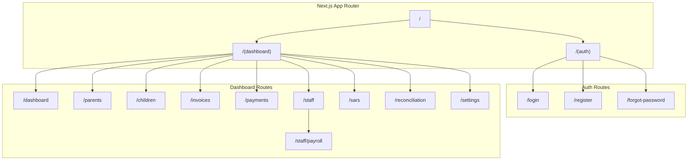
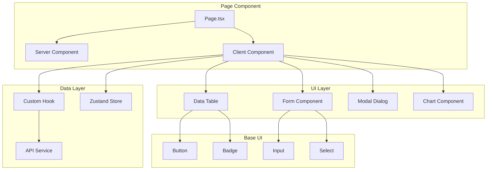
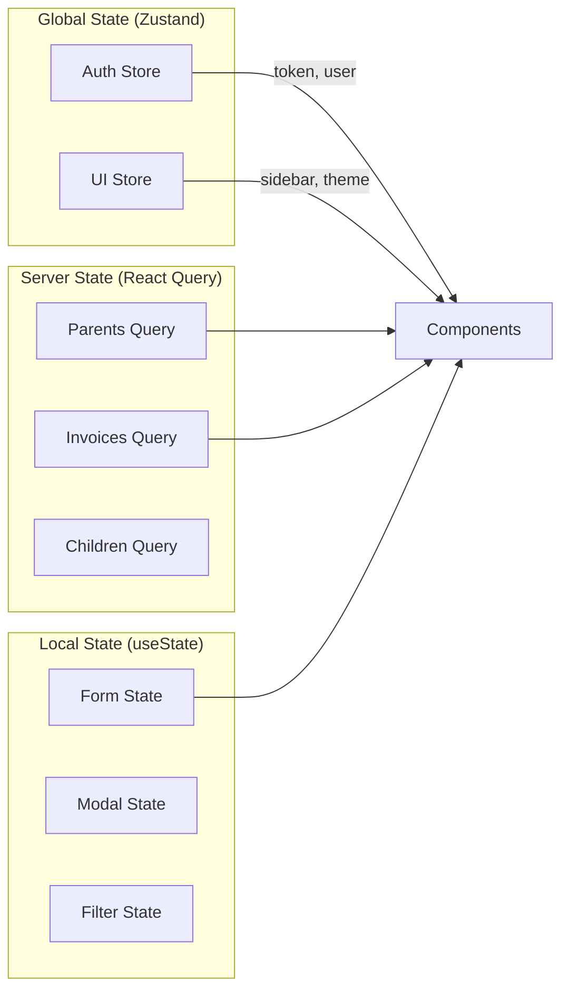
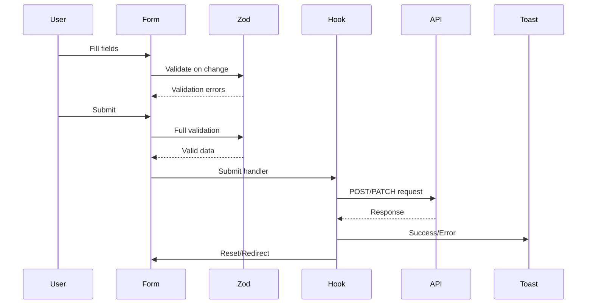
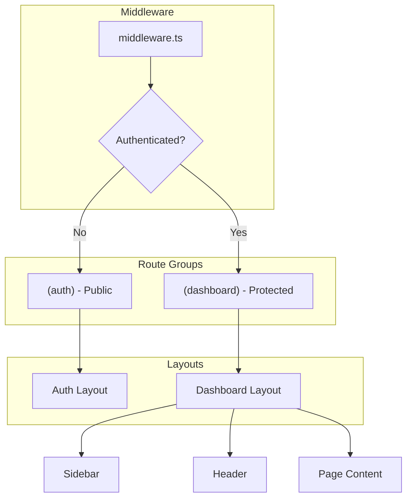

# Frontend Architecture

> Next.js 14 App Router with React 18, TypeScript, and Tailwind CSS.

## Application Structure



## Directory Structure

```
apps/web/src/
├── app/                          # Next.js App Router
│   ├── (auth)/                   # Auth route group
│   │   ├── login/
│   │   │   └── page.tsx
│   │   └── layout.tsx
│   ├── (dashboard)/              # Dashboard route group
│   │   ├── dashboard/
│   │   ├── parents/
│   │   │   ├── [id]/
│   │   │   │   ├── page.tsx      # Parent detail
│   │   │   │   └── edit/
│   │   │   ├── new/
│   │   │   └── page.tsx          # Parent list
│   │   ├── invoices/
│   │   ├── staff/
│   │   │   ├── [id]/
│   │   │   │   ├── onboarding/
│   │   │   │   └── offboarding/
│   │   │   ├── payroll/
│   │   │   └── page.tsx
│   │   ├── sars/
│   │   │   ├── emp201/
│   │   │   └── vat201/
│   │   ├── reconciliation/
│   │   ├── settings/
│   │   │   ├── organization/
│   │   │   ├── users/
│   │   │   ├── fees/
│   │   │   ├── templates/
│   │   │   └── integrations/
│   │   └── layout.tsx
│   ├── layout.tsx                # Root layout
│   └── page.tsx                  # Landing page
│
├── components/                    # React components
│   ├── ui/                       # Base UI components
│   │   ├── button.tsx
│   │   ├── input.tsx
│   │   ├── table.tsx
│   │   ├── modal.tsx
│   │   ├── dropdown.tsx
│   │   └── ...
│   ├── forms/                    # Form components
│   │   ├── parent-form.tsx
│   │   ├── child-form.tsx
│   │   ├── invoice-form.tsx
│   │   └── ...
│   ├── tables/                   # Data tables
│   │   ├── parent-table.tsx
│   │   ├── invoice-table.tsx
│   │   └── ...
│   ├── charts/                   # Dashboard charts
│   │   ├── revenue-chart.tsx
│   │   ├── enrollment-chart.tsx
│   │   └── ...
│   └── layout/                   # Layout components
│       ├── sidebar.tsx
│       ├── header.tsx
│       ├── nav-item.tsx
│       └── ...
│
├── hooks/                        # Custom React hooks
│   ├── use-auth.ts
│   ├── use-parents.ts
│   ├── use-invoices.ts
│   ├── use-pagination.ts
│   ├── use-debounce.ts
│   └── ...
│
├── services/                     # API client services
│   ├── api-client.ts
│   ├── auth-service.ts
│   ├── parent-service.ts
│   ├── invoice-service.ts
│   └── ...
│
├── stores/                       # Zustand stores
│   ├── auth-store.ts
│   ├── ui-store.ts
│   └── ...
│
├── types/                        # TypeScript types
│   ├── api.ts
│   ├── parent.ts
│   ├── invoice.ts
│   └── ...
│
├── lib/                          # Utilities
│   ├── utils.ts
│   ├── validators.ts
│   ├── formatters.ts
│   └── ...
│
└── styles/                       # Global styles
    └── globals.css
```

## Component Architecture



## State Management



### Zustand Store Pattern

```typescript
// stores/auth-store.ts
import { create } from 'zustand';
import { persist } from 'zustand/middleware';

interface AuthState {
  user: User | null;
  token: string | null;
  isAuthenticated: boolean;
  setAuth: (user: User, token: string) => void;
  logout: () => void;
}

export const useAuthStore = create<AuthState>()(
  persist(
    (set) => ({
      user: null,
      token: null,
      isAuthenticated: false,
      setAuth: (user, token) =>
        set({ user, token, isAuthenticated: true }),
      logout: () =>
        set({ user: null, token: null, isAuthenticated: false }),
    }),
    { name: 'auth-storage' }
  )
);
```

## Data Fetching Pattern

```typescript
// hooks/use-parents.ts
import useSWR from 'swr';
import { parentService } from '@/services/parent-service';

export function useParents(query?: PaginationQuery) {
  const { data, error, isLoading, mutate } = useSWR(
    ['parents', query],
    () => parentService.getAll(query),
    {
      revalidateOnFocus: false,
      dedupingInterval: 5000,
    }
  );

  return {
    parents: data?.data ?? [],
    pagination: data?.meta,
    isLoading,
    isError: !!error,
    refresh: mutate,
  };
}

export function useParent(id: string) {
  const { data, error, isLoading } = useSWR(
    id ? ['parent', id] : null,
    () => parentService.getById(id)
  );

  return {
    parent: data,
    isLoading,
    isError: !!error,
  };
}
```

## Form Handling



### Form Component Pattern

```typescript
// components/forms/parent-form.tsx
import { useForm } from 'react-hook-form';
import { zodResolver } from '@hookform/resolvers/zod';
import { parentSchema, ParentFormData } from '@/lib/validators';

export function ParentForm({
  parent,
  onSubmit
}: ParentFormProps) {
  const form = useForm<ParentFormData>({
    resolver: zodResolver(parentSchema),
    defaultValues: parent ?? {
      firstName: '',
      lastName: '',
      email: '',
      phone: '',
    },
  });

  const handleSubmit = async (data: ParentFormData) => {
    try {
      await onSubmit(data);
      toast.success('Parent saved successfully');
    } catch (error) {
      toast.error('Failed to save parent');
    }
  };

  return (
    <form onSubmit={form.handleSubmit(handleSubmit)}>
      <Input
        label="First Name"
        {...form.register('firstName')}
        error={form.formState.errors.firstName?.message}
      />
      <Input
        label="Last Name"
        {...form.register('lastName')}
        error={form.formState.errors.lastName?.message}
      />
      <Input
        label="Email"
        type="email"
        {...form.register('email')}
        error={form.formState.errors.email?.message}
      />
      <Button type="submit" loading={form.formState.isSubmitting}>
        Save Parent
      </Button>
    </form>
  );
}
```

## Routing & Navigation



## UI Component Library

Built with Tailwind CSS and custom components:

| Component | Description |
|-----------|-------------|
| `Button` | Primary, secondary, destructive variants |
| `Input` | Text, email, password, number inputs |
| `Select` | Dropdown select with search |
| `Table` | Sortable, paginated data table |
| `Modal` | Dialog with animations |
| `Card` | Content container |
| `Badge` | Status indicators |
| `Tabs` | Tab navigation |
| `Toast` | Notification system |
| `Skeleton` | Loading placeholders |

## Performance Optimizations

1. **Server Components**: Default for data fetching
2. **Client Components**: Only for interactivity
3. **Code Splitting**: Dynamic imports for heavy components
4. **Image Optimization**: Next.js Image component
5. **Suspense Boundaries**: Loading states
6. **SWR Caching**: Deduplicated API requests
