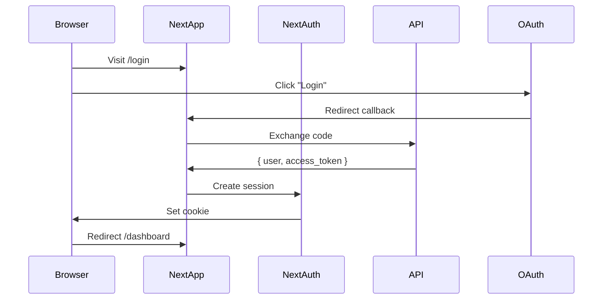

# CrecheBooks Next.js 15 Frontend Architecture

**Last Updated:** 2026-02-03
**Status:** Production Ready
**Generated By:** CrecheBooks Documentation Swarm

## Overview

CrecheBooks Web is a modern Next.js 15 application providing three distinct user experiences:

- **Admin Portal**: System administration, multi-tenant management, audit logs
- **Staff Portal**: Employee management, payroll, onboarding, tax documents
- **Parent Portal**: Invoice viewing, payment tracking, child enrollment
- **Public Site**: Marketing pages, authentication entry points

## Technology Stack

| Component | Technology | Version |
|-----------|-----------|---------|
| Framework | Next.js | 15 |
| React | React | 19 |
| Language | TypeScript | 5 |
| Styling | Tailwind CSS | 4 |
| UI Library | shadcn/ui | Latest |
| Server State | TanStack Query | Latest |
| Client State | Zustand | Latest |
| Auth | NextAuth.js | Latest |
| HTTP Client | Axios | Latest |
| Validation | Zod | Latest |

---

## App Router Structure

```
apps/web/src/app/
├── (auth)/                 # Authentication pages
│   └── login/
├── (public)/               # Public/marketing pages
│   ├── page.tsx            # Home/landing
│   ├── about/
│   ├── features/
│   ├── pricing/
│   └── [legal pages]
├── (dashboard)/            # Main application
│   ├── dashboard/
│   ├── invoices/
│   ├── payments/
│   ├── transactions/
│   ├── reconciliation/
│   ├── arrears/
│   ├── reports/
│   ├── sars/
│   ├── parents/
│   ├── enrollments/
│   ├── staff/
│   ├── communications/
│   ├── statements/
│   └── settings/
├── admin/                  # Admin portal
│   ├── users/
│   ├── tenants/
│   ├── audit-logs/
│   └── analytics/
├── parent/                 # Parent portal
│   ├── dashboard/
│   ├── children/
│   ├── invoices/
│   ├── payments/
│   └── statements/
├── staff/                  # Staff portal
│   ├── dashboard/
│   ├── payslips/
│   ├── leave/
│   └── tax-documents/
└── api/                    # API Routes
    └── auth/[...nextauth]/
```

---

## Route Groups

### Route Group Organization

| Group | Path | Purpose | Layout |
|-------|------|---------|--------|
| `(public)` | `/` | Marketing pages | PublicHeader + Footer |
| `(auth)` | `/login` | Authentication | Minimal |
| `(dashboard)` | `/dashboard/*` | Main app | Sidebar + Header |
| `admin` | `/admin/*` | Admin portal | AdminSidebar |
| `parent` | `/parent/*` | Parent portal | PortalNav |
| `staff` | `/staff/*` | Staff portal | StaffSidebar |

---

## Page Count Summary

| Route Group | Pages | Status |
|-------------|-------|--------|
| (public) | 11 | ✅ 100% |
| (auth) | 1 | ✅ 100% |
| (dashboard) | 60+ | ✅ 92% |
| admin | 6 | ✅ 100% |
| parent | 10 | ✅ 100% |
| staff | 10 | ✅ 100% |
| **Total** | **85** | **88%** |

---

## Component Architecture

### Component Count: 170+ files

```
apps/web/src/components/
├── ui/                    # shadcn/ui (50+ files)
├── layout/                # Dashboard, Header, Sidebar
├── tables/                # DataTable, Pagination
├── forms/                 # Form fields, Currency input
├── loading/               # Skeletons
├── admin/                 # Admin portal components
├── invoices/              # Invoice management
├── payments/              # Payment matching
├── transactions/          # Transaction categorization
├── reports/               # Financial reports
├── reconciliation/        # Bank reconciliation
├── arrears/               # Arrears tracking
├── sars/                  # Tax forms
├── parents/               # Parent management
├── enrollments/           # Enrollment management
├── staff/                 # Staff management
├── parent-portal/         # Parent portal components
├── staff-portal/          # Staff portal components
├── communications/        # Bulk messaging
├── dashboard/             # Dashboard widgets
├── charts/                # Chart components
├── settings/              # Settings pages
├── statements/            # Account statements
├── public/                # Marketing components
└── common/                # Shared utilities
```

---

## State Management

### TanStack Query (Server State)

```typescript
// Query key organization
queryKeys = {
  transactions: { all, lists, list, detail, suggestions },
  invoices: { all, lists, list, detail, adhocCharges },
  payments: { all, lists, list, detail, unmatched, suggestions },
  arrears: { all, list, summary },
  parents: { all, lists, list, detail, children },
  reconciliation: { all, lists, list, summary, discrepancies },
  sars: { all, vat201, emp201, submissions },
  // ... more entities
}
```

**Configuration:**
- Stale time: 60 seconds
- Refetch on window focus: disabled

### Zustand (Client State)

- **UIStore**: Sidebar state, modals, loading
- **FilterStore**: Table/page filter state
- **PreferencesStore**: Theme, date format

---

## API Client

### Axios Configuration

```typescript
apiClient = axios.create({
  baseURL: `${NEXT_PUBLIC_API_URL}/api/v1`,
  timeout: 30000,
  withCredentials: true,  // HttpOnly cookie support
})
```

**Security (TASK-UI-001):**
- No localStorage token storage (XSS protection)
- HttpOnly cookie fallback
- Authorization header with Bearer token

### Custom Hooks (50+)

- `useInvoices()` - Invoice management
- `usePayments()` - Payment matching
- `useTransactions()` - Transaction categorization
- `useParents()` - Parent management
- `useStaff()` - Staff management
- `usePayroll()` - Payroll processing
- `useDashboard()` - Dashboard metrics
- `useReports()` - Report generation
- `useReconciliation()` - Bank reconciliation
- `useSARS()` - Tax form management

---

## Authentication Flow



---

## Layout Structure


### DashboardLayout Features

- **Responsive Sidebar**: Fixed on desktop, drawer on mobile
- **Header**: Logo, search, user menu
- **Safe Area**: Mobile notch-aware
- **Touch Targets**: 44px minimum (accessibility)
- **Impersonation Banner**: Shows when admin impersonates

---

## Portal Features

### Admin Portal (`/admin`)

- Platform metrics and analytics
- Multi-tenant management
- User administration
- Audit log viewing
- Tenant impersonation

### Parent Portal (`/parent`)

- Child management view
- Invoice viewing and filtering
- Payment tracking
- Account statements
- Onboarding flow

### Staff Portal (`/staff`)

- Payslip access
- Leave request system
- Tax documents (IRP5)
- Onboarding/offboarding
- Announcements

---

## Key Shared Components

### DataTable
- TanStack Table v8
- Sorting, filtering, pagination
- Row selection, bulk actions
- Responsive view options

### Forms
- React Hook Form + Zod
- CurrencyInput (ZAR formatting)
- DatePicker with calendar
- FormField with validation

### Loading States
- PageSkeleton
- CardSkeleton
- TableSkeleton
- FormSkeleton

### Badges
- InvoiceStatusBadge
- EnrollmentStatusBadge
- ConfidenceBadge (AI)
- NeedsReviewBadge

---

## Performance

- **Stale Time**: 1 minute cache
- **Request Timeout**: 30 seconds
- **Touch Targets**: 44px (accessibility)
- **Mobile-first**: Responsive design

---

## File Locations

```
apps/web/src/
├── app/              # App Router pages (85 pages)
├── components/       # React components (170+ files)
├── hooks/            # Custom hooks (50+)
├── lib/              # Utilities
│   ├── api/          # API client, query keys
│   └── auth/         # Auth config
├── stores/           # Zustand stores
└── types/            # TypeScript types
```

---

*Generated by CrecheBooks Documentation Swarm*
