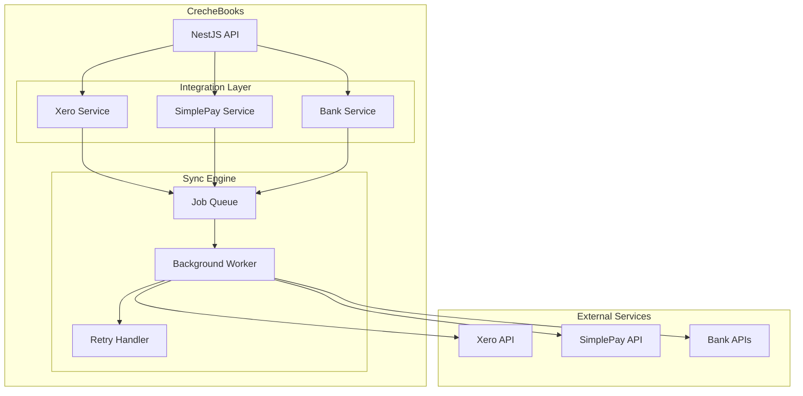
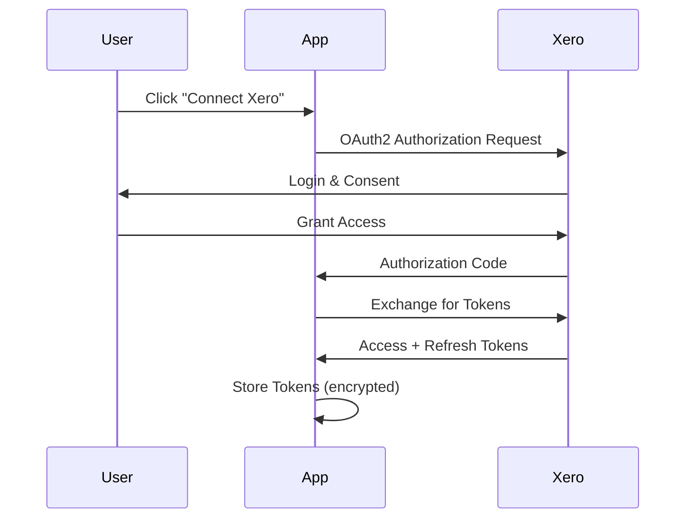
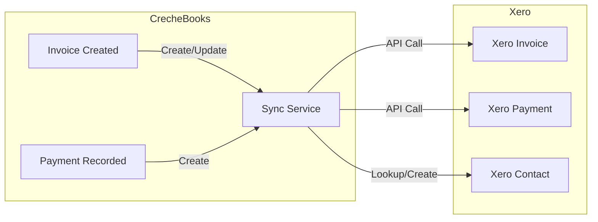
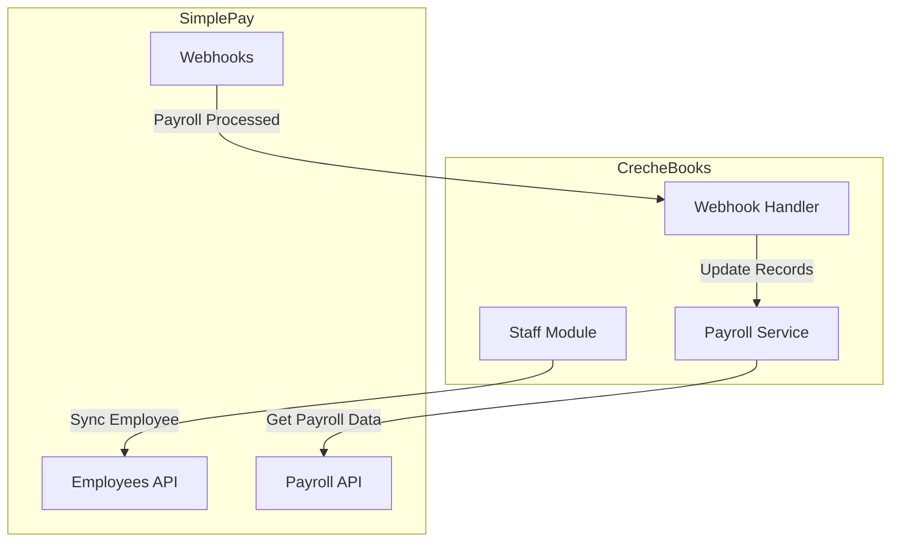
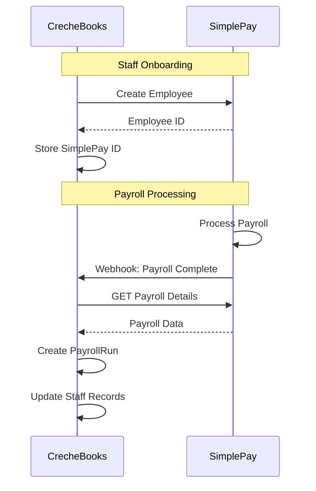
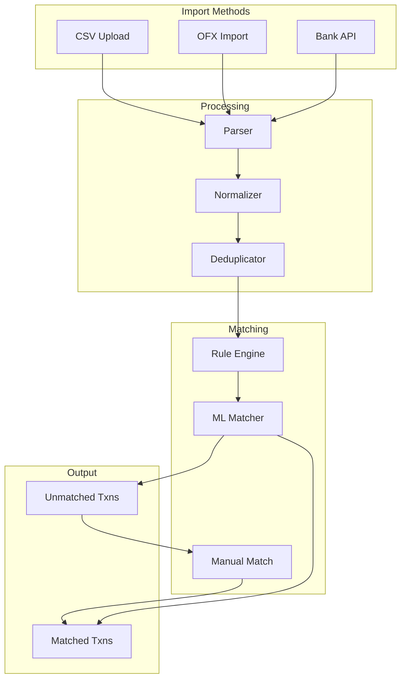
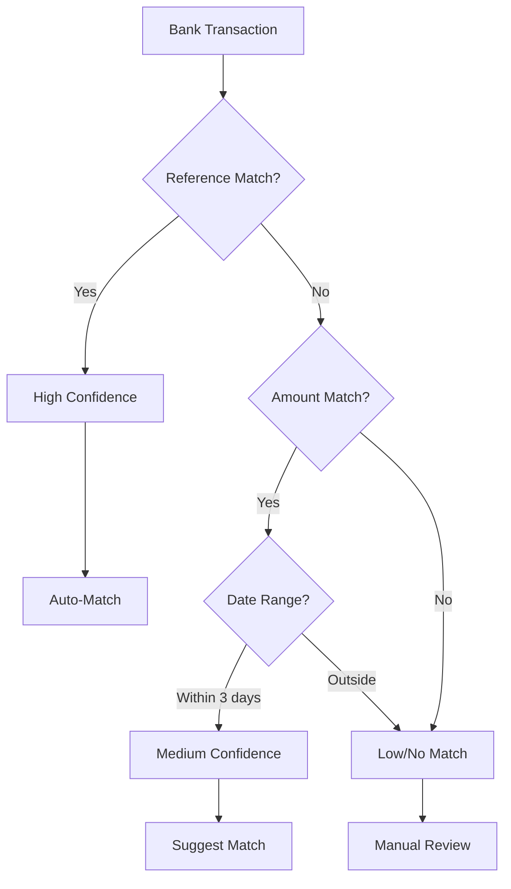
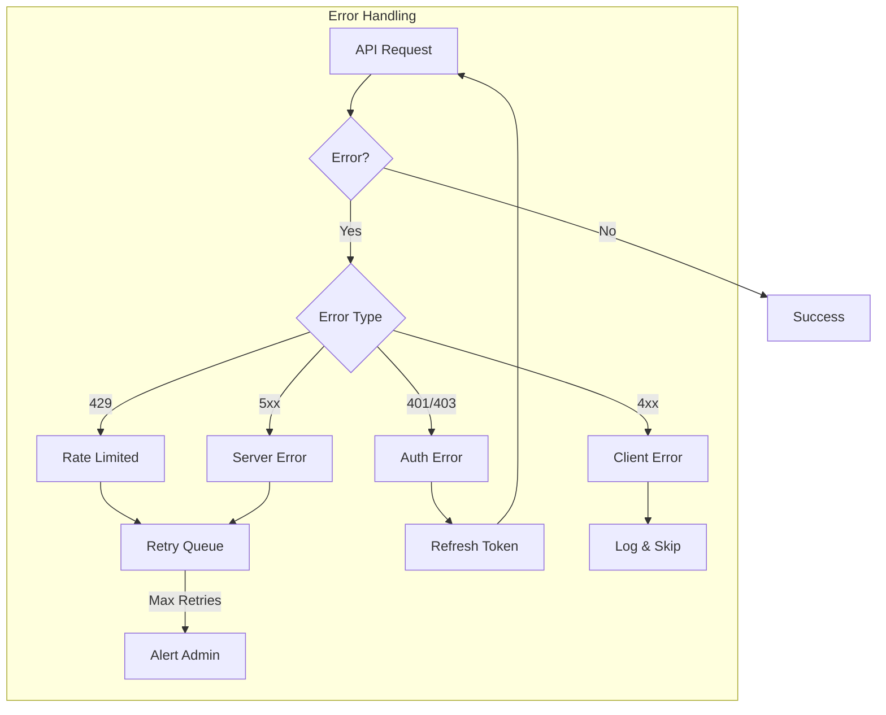

# External Integrations

> Integration architecture for Xero, SimplePay, and banking services.

## Integration Overview



## Xero Integration

### Purpose
- Invoice synchronization
- Payment recording
- Financial reporting

### Authentication Flow



### Data Sync Flow



### API Endpoints

| CrecheBooks Event | Xero API Call |
|-------------------|---------------|
| Invoice created | `POST /Invoices` |
| Invoice updated | `POST /Invoices/{id}` |
| Payment received | `PUT /Payments` |
| Parent created | `POST /Contacts` |

### Configuration

```typescript
// Xero service configuration
interface XeroConfig {
  clientId: string;
  clientSecret: string;
  redirectUri: string;
  scopes: [
    'openid',
    'profile',
    'email',
    'accounting.transactions',
    'accounting.contacts',
    'accounting.settings.read'
  ];
}
```

---

## SimplePay Integration

### Purpose
- Payroll processing
- Employee management
- Leave tracking

### Architecture



### Sync Workflow



### Webhook Events

| Event | Action |
|-------|--------|
| `payroll.processed` | Import payroll run data |
| `employee.updated` | Sync staff details |
| `leave.approved` | Update leave records |
| `employee.terminated` | Mark staff as terminated |

### API Integration

```typescript
// SimplePay service
@Injectable()
export class SimplePayService {
  async syncEmployee(staff: Staff): Promise<void> {
    const employee = {
      firstName: staff.firstName,
      lastName: staff.lastName,
      idNumber: staff.idNumber,
      taxNumber: staff.taxNumber,
      email: staff.email,
      startDate: staff.startDate,
      salary: staff.salary,
      bankDetails: {
        bankName: staff.bankName,
        accountNumber: staff.bankAccount,
        branchCode: staff.bankBranch,
      },
    };

    if (staff.simplePayId) {
      await this.updateEmployee(staff.simplePayId, employee);
    } else {
      const result = await this.createEmployee(employee);
      await this.staffRepo.update(staff.id, {
        simplePayId: result.id,
      });
    }
  }

  async importPayrollRun(payrollId: string): Promise<PayrollRun> {
    const data = await this.client.get(`/payrolls/${payrollId}`);

    return this.payrollService.createFromSimplePay({
      periodStart: data.periodStart,
      periodEnd: data.periodEnd,
      items: data.employees.map(emp => ({
        staffId: this.findStaffBySimplePayId(emp.id),
        grossPay: emp.grossPay,
        paye: emp.paye,
        uif: emp.uif,
        netPay: emp.netPay,
      })),
    });
  }
}
```

---

## Bank Statement Integration

### Purpose
- Import bank statements
- Auto-match transactions
- Reconciliation assistance

### Import Flow



### Matching Algorithm



### Supported Banks

| Bank | Method | Format |
|------|--------|--------|
| FNB | CSV Upload | Custom CSV |
| Standard Bank | OFX Import | OFX 2.0 |
| Nedbank | CSV Upload | Standard CSV |
| ABSA | CSV Upload | Custom CSV |
| Capitec | CSV Upload | Standard CSV |

### Transaction Categorization

```typescript
// Auto-categorization rules
const categorizationRules = [
  {
    pattern: /DEBIT ORDER.*INSURANCE/i,
    category: 'INSURANCE',
    type: 'EXPENSE',
  },
  {
    pattern: /EFT.*SCHOOL FEE|CRECHE/i,
    category: 'FEE_PAYMENT',
    type: 'INCOME',
  },
  {
    pattern: /SALARY|WAGE/i,
    category: 'PAYROLL',
    type: 'EXPENSE',
  },
];
```

---

## Error Handling & Retry



### Retry Configuration

| Error Type | Retry Strategy |
|------------|----------------|
| Rate Limit | Exponential backoff, max 5 retries |
| Auth Error | Refresh token, retry once |
| Server Error | Linear backoff, max 3 retries |
| Client Error | No retry, log and alert |

---

## Integration Settings UI

```
Settings → Integrations
├── Xero
│   ├── Connection Status: Connected ✓
│   ├── Last Sync: 2026-01-18 14:30
│   ├── Auto-sync Invoices: Enabled
│   └── [Disconnect] [Sync Now]
│
├── SimplePay
│   ├── Connection Status: Connected ✓
│   ├── Company ID: SP-12345
│   ├── Webhook Status: Active
│   └── [Disconnect] [Test Webhook]
│
└── Bank Feeds
    ├── FNB Business: Connected
    ├── Auto-import: Daily at 6 AM
    └── [Add Bank] [Import Now]
```
