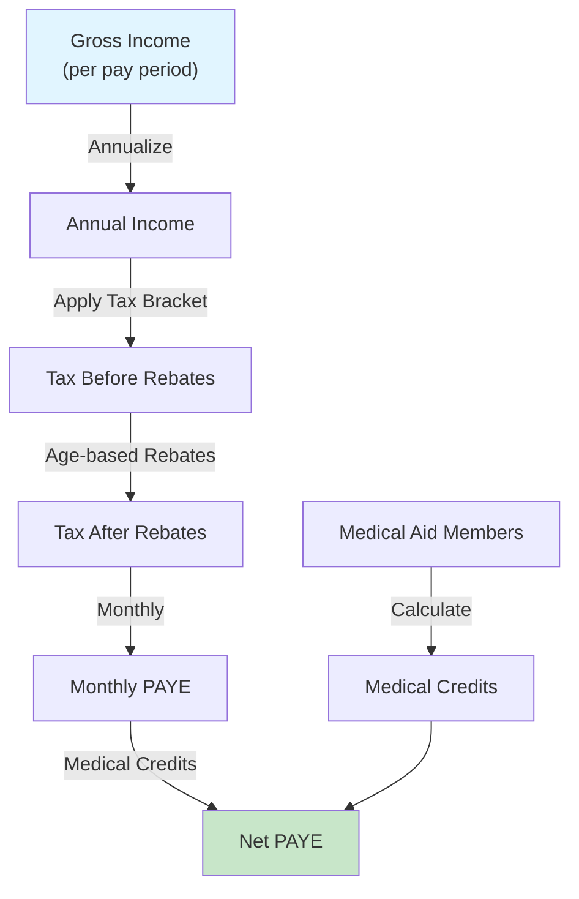

# SARS Compliance Architecture

**Last Updated:** 2026-02-03
**Status:** Production Ready
**Generated By:** CrecheBooks Documentation Swarm

## Overview

CrecheBooks implements a comprehensive South African tax compliance engine that automatically calculates and generates SARS submissions for:

- **VAT201** - Value Added Tax monthly returns
- **EMP201** - Employer monthly PAYE/UIF declarations
- **EMP501** - Annual PAYE reconciliation and IRP5 certificates
- **Deadline tracking** and automated reminders

This system operates at **L2 Autonomy (Collaborator level)** - all calculations are prepared for human review and approval before any SARS submission.

---

## Tax Year Handling

**South African tax year: 1 March - 28 February**

### Multi-Year Support

```
Tax Year 2024/2025 (Active)
├── Effective: 1 March 2024 - 28 February 2025
├── Primary Rebate: R17,235 (annual)
├── Tax Thresholds (various age brackets)
└── 7 Progressive Tax Brackets (18% to 45%)
```

### Dynamic Table Selection

All tax calculations use `getTaxYearTables(payPeriodDate)` to select the correct tax year automatically.

---

## PAYE Calculation

### Components



### Tax Brackets (2024/2025)

| Bracket | Annual Income | Base Tax | Marginal Rate |
|---------|---------------|----------|---------------|
| 1 | R0 - R237,100 | R0 | 18% |
| 2 | R237,100 - R370,500 | R42,678 | 26% |
| 3 | R370,500 - R512,800 | R77,362 | 31% |
| 4 | R512,800 - R673,000 | R121,475 | 36% |
| 5 | R673,000 - R857,900 | R179,147 | 39% |
| 6 | R857,900 - R1,817,000 | R251,258 | 41% |
| 7 | R1,817,000+ | R644,489 | 45% |

### Tax Rebates

| Category | Amount (Annual) |
|----------|-----------------|
| Primary (all) | R17,235 |
| Secondary (65-74) | R9,444 |
| Tertiary (75+) | R3,145 |

### Medical Aid Tax Credits

| Category | Amount (Monthly) |
|----------|-----------------|
| Main member | R364 |
| 1st dependent | R364 |
| Other dependents | R246 each |

### Calculation Formula

```
1. Annualize gross: gross_monthly × pay_frequency_multiplier
2. Find tax bracket from annualized income
3. Tax before rebates = base_tax + (excess × marginal_rate)
4. Apply age-based rebates
5. Annual tax after rebates = max(0, tax_before - total_rebates)
6. Monthly PAYE = annual_tax ÷ 12
7. Medical credits = sum of member credits
8. Net PAYE = max(0, monthly_paye - medical_credits)
```

---

## UIF Calculation

### Rates (2025)

| Component | Rate | Cap | Maximum |
|-----------|------|-----|---------|
| Employee | 1% | R17,712/month | R177.12/month |
| Employer | 1% | R17,712/month | R177.12/month |
| **Total** | **2%** | **R17,712/month** | **R354.24/month** |

### Calculation Formula

```
1. Capped remuneration = min(gross_monthly, R17,712)
2. Employee contribution = capped × 1%
3. Employer contribution = capped × 1%
4. Total UIF = employee + employer
```

---

## EMP201 (Monthly PAYE Declaration)

### Submission Workflow


### Document Contents

```
EMP201 Summary:
├── Employee Count
├── Total Gross Remuneration
├── Total PAYE
├── Total UIF (employee + employer)
├── Total SDL
└── Total Due to SARS
```

### Deadline

- **Due**: 7th of following month
- **Example**: January payroll EMP201 due 7 February

---

## VAT201 (Monthly VAT Return)

### Output VAT (Sales)

```
Output VAT = Invoice Amount (excl VAT) × 15%
```

### Input VAT (Purchases)

```
Input VAT = Invoice Amount (incl VAT) × (15/115)
```

### Net VAT Payable

```
Net VAT = Output VAT - Input VAT

If positive: Creche owes SARS
If negative: Creche gets refund
```

### Validation Issues Flagged

| Issue | Severity | Action |
|-------|----------|--------|
| Missing supplier VAT number | WARNING | Cannot claim input VAT |
| Invoice amount zero | ERROR | Calculation issue |
| No tax code assigned | WARNING | May need reclassification |

### Deadline

- **Due**: 25th of following month
- **Example**: January VAT due 25 February

---

## EMP501 (Annual Reconciliation & IRP5)

### Purpose

Year-end reconciliation of all PAYE paid monthly, and generation of IRP5 certificates for employees.

### Timeline

- **Tax Year**: 1 March - 28 February
- **Due**: 31 May annually

### IRP5 Components

```
For Employee Tax Purposes:
├── Employee Details
├── Employer Details
├── Tax Year
├── Income Code Details
│   ├── 0101 - Remuneration
│   ├── 3650 - Employee UIF
│   └── Other codes
├── PAYE Deducted (annual)
└── Tax Reference Number
```

---

## Deadline Management

### SARS Deadline Calendar

```
┌─────────────────────────────────────────────────┐
│ SARS Submission Deadlines (South Africa)        │
├─────────────────────────────────────────────────┤
│ VAT201   - 25th of following month              │
│ EMP201   - 7th of following month               │
│ IRP5     - 31st May (year-end)                  │
│ EMP501   - 31st May (annual reconciliation)     │
└─────────────────────────────────────────────────┘
```

### Reminder Strategy

Default reminder days before deadline: **30, 14, 7, 3, 1**

Reminders sent via:
- Email (primary)
- WhatsApp (when configured)

---

## SARS Agent (AI-Assisted)

### Autonomy Level

- **L2 - Collaborator**: Agent prepares but never submits
- All calculations logged with decision reasoning
- Human approval mandatory before SARS submission

### Agent Methods

1. `calculatePayeForReview(dto)` - PAYE calculation with explanation
2. `calculateUifForReview(dto)` - UIF calculation with explanation
3. `generateEmp201ForReview(dto)` - Full EMP201 draft
4. `generateVat201ForReview(dto)` - Full VAT201 draft with flagged items

---

## Currency & Decimal Handling

### Critical Rule: All Values in CENTS

```typescript
// Correct:
const grossCents = 250000; // R2,500.00

// WRONG - Never use floats:
const grossRands = 2500.00;  // Precision loss
```

### Rounding Strategy

**Decimal.js with ROUND_HALF_EVEN (Banker's Rounding)**

---

## Feature Status

| Feature | Status | Notes |
|---------|--------|-------|
| PAYE Calculation | ✅ Full | All tax brackets, rebates, medical credits |
| UIF Calculation | ✅ Full | 1% employee/employer, R17,712 cap |
| EMP201 Generation | ✅ Full | Monthly submissions, CSV export |
| VAT201 Generation | ✅ Full | Output/input VAT, flagged items |
| EMP501/IRP5 | ⚠️ Partial | Annual structure in place |
| Deadline Reminders | ✅ Full | Automatic reminders, audit logged |
| SARS eFiling Integration | ❌ Not Implemented | File download only |
| Amendment Returns | ❌ Not Implemented | Cannot generate corrections |

---

## File Locations

```
apps/api/src/
├── api/sars/
│   ├── sars.controller.ts
│   └── dto/
├── sars/
│   ├── sars-deadline.service.ts
│   └── types/deadline.types.ts
├── database/services/
│   ├── paye.service.ts
│   ├── uif.service.ts
│   ├── emp201.service.ts
│   ├── vat201.service.ts
│   └── sars-file-generator.service.ts
├── database/constants/
│   └── tax-tables.constants.ts
└── agents/sars-agent/
    ├── sars.agent.ts
    ├── sars-prompt.ts
    └── sdk-sars-explainer.ts
```

---

## Compliance Checklist

Before SARS submission, verify:

- [ ] All transactions for period are categorized
- [ ] All supplier invoices have VAT numbers (where applicable)
- [ ] All employees have tax reference numbers
- [ ] Tax tables are current for pay period
- [ ] Medical aid details captured correctly
- [ ] No validation issues flagged in draft
- [ ] Calculations reviewed by human accountant
- [ ] Submission approved by OWNER/ADMIN role
- [ ] Deadline not missed
- [ ] Audit trail shows all decisions

---

*Generated by CrecheBooks Documentation Swarm*
