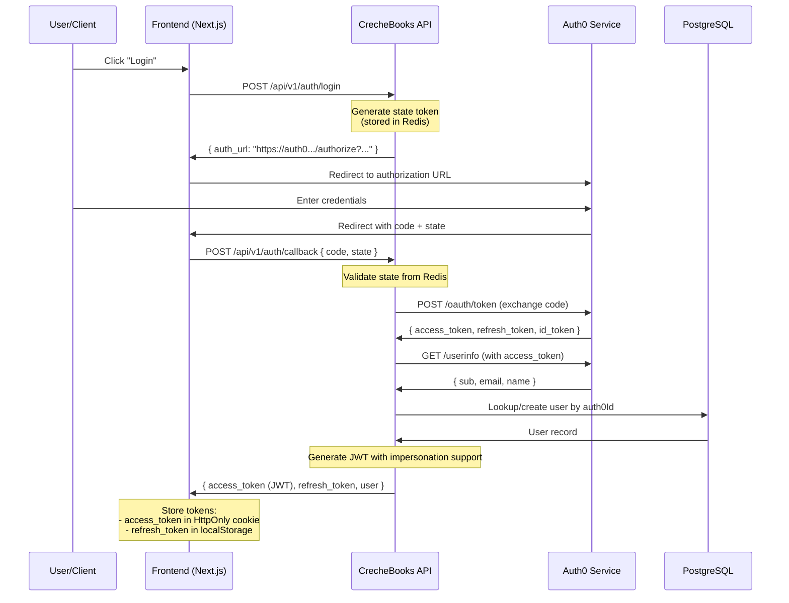
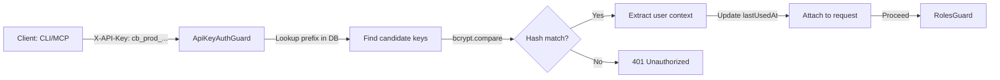
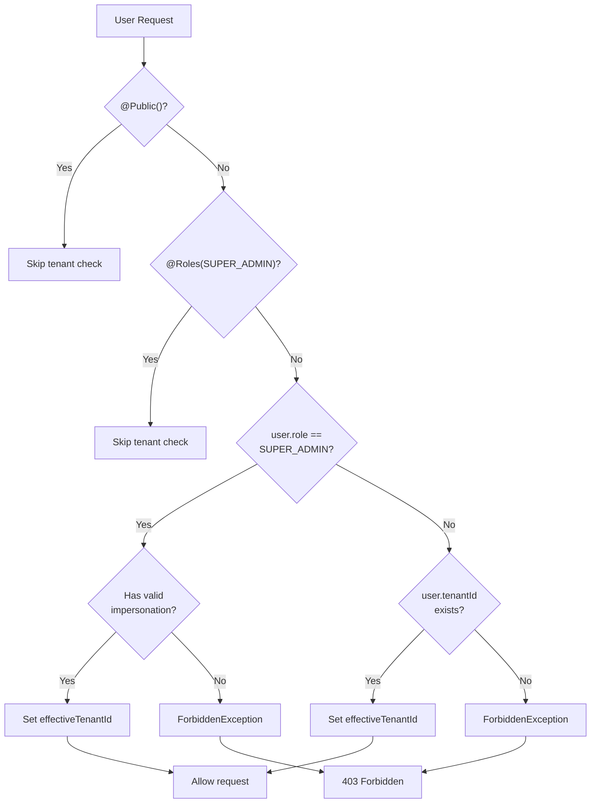
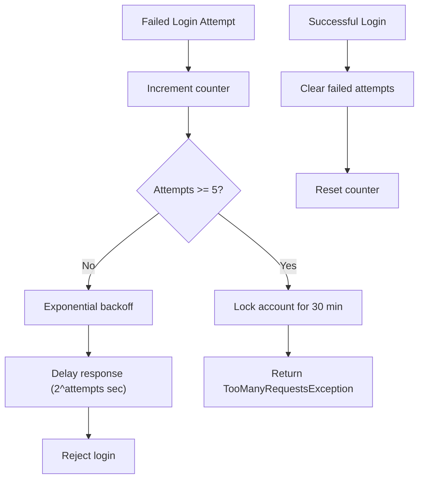

# CrecheBooks Authentication & Security Architecture

**Last Updated:** 2026-02-03
**Status:** Production Ready
**Generated By:** CrecheBooks Documentation Swarm

## Overview

CrecheBooks implements a multi-layered authentication and security architecture with support for both Auth0 OAuth2/OIDC and local JWT authentication. The system enforces strict tenant isolation, role-based access control, and comprehensive rate limiting.

**Key Security Goals:**
- Tenant data isolation across all operations
- Protection against XSS, CSRF, and injection attacks
- Secure credential management with bcrypt and JWT
- Rate limiting and account lockout mechanisms
- Comprehensive security headers and CORS validation

---

## 1. Authentication Methods

### 1.1 Auth0 OAuth2/OIDC (Production)

The primary authentication method uses Auth0 for enterprise-grade security and SSO capabilities.



**Configuration:**
- **AUTH0_DOMAIN**: Auth0 tenant domain
- **AUTH0_CLIENT_ID**: Application client ID
- **AUTH0_CLIENT_SECRET**: Client secret (bcrypt validated)
- **AUTH0_AUDIENCE**: API audience identifier
- **JWT_EXPIRATION**: Access token lifetime (default: 8 hours dev, 1 hour prod)

### 1.2 Local JWT Authentication (Development)

For development and non-Auth0 deployments:

```typescript
// Environment configuration
NODE_ENV=development
AUTH_PROVIDER=jwt  // or 'auth0'
JWT_SECRET=<32+ character random string>
DEV_AUTH_ENABLED=true

// Dev user configuration
DEV_USER_1_EMAIL=admin@example.com
DEV_USER_1_PASSWORD_HASH=<bcrypt hash>
DEV_USER_1_NAME=Admin User
DEV_USER_1_ROLE=OWNER
```

**Flow:**
1. Client POSTs credentials to `/api/v1/auth/dev-login`
2. Password validated against bcrypt hash (trial users) or env config (dev users)
3. JWT generated with 8-hour expiration
4. User created in database if doesn't exist (uses Elle Elephant Creche tenant)

**Security Notes:**
- `DEV_AUTH_ENABLED=true` is BLOCKED in production (fatal error)
- Passwords stored as bcrypt hashes (never plaintext)

### 1.3 API Key Authentication (CLI/MCP)

For programmatic access by CLI tools and MCP servers.



**Key Generation:**
```typescript
// Created via API endpoint
POST /api/v1/api-keys
{
  "name": "CLI Production",
  "scopes": ["FULL_ACCESS", "INVOICES_READ"],
  "environment": "production",
  "expiresAt": "2025-12-31T23:59:59Z"
}

// Response (returned ONLY on creation)
{
  "id": "key_abc123",
  "secretKey": "cb_prod_a1b2c3d4e5f6g7h8i9j0k1l2m3n4o5p6",
  "keyPrefix": "cb_prod_a1b2",
  "scopes": ["FULL_ACCESS"],
  "environment": "production"
}
```

**Security Features:**
- **Format**: `cb_<environment>_<32 random chars>` (256 bits entropy)
- **Storage**: Only bcrypt hash stored (cost factor 12)
- **Validation**: Prefix lookup, then bcrypt comparison
- **Tracking**: Last used timestamp and IP address recorded
- **Scopes**: Fine-grained permission control
- **Expiry**: Optional TTL with automatic soft-revocation
- **Rotation**: Seamless key rotation with old key revocation

---

## 2. Guard Architecture

Guards are applied globally in order in `app.module.ts`:

```typescript
1. CustomThrottlerGuard (rate limiting - early abort)
2. JwtAuthGuard (authentication)
3. TenantGuard (tenant context validation)
4. RolesGuard (authorization)
```

### 2.1 JwtAuthGuard

**Purpose**: Extract and validate JWT tokens

**Token Extraction Priority:**
1. HttpOnly cookie (`access_token`) - most secure
2. Authorization header (`Bearer <token>`) - fallback for API clients

**Validation:**
```typescript
// Payload structure
interface JwtPayload {
  sub: string;                    // auth0Id or userId
  email: string;
  tenantId?: string;
  role?: string;
  iat?: number;                   // Issued at
  exp?: number;                   // Expiration
  impersonation?: {               // TASK-ADMIN-001
    sessionId: string;
    tenantId: string;
    role: string;
    startedAt: number;
    expiresAt: number;
  };
}
```

### 2.2 TenantGuard

**Purpose**: Enforce tenant context for all non-admin routes



### 2.3 RolesGuard

**Purpose**: Enforce role-based access control

**Role Hierarchy:**
- **SUPER_ADMIN**: Platform administrator (access everything via /api/admin/*)
- **OWNER**: Tenant owner (full access to tenant)
- **ADMIN**: Tenant administrator (full access to tenant)
- **ACCOUNTANT**: Finance staff (invoices, payments, reports)
- **VIEWER**: Read-only access (invoices, reports)
- **PARENT**: Parent/guardian (limited to their own child data)

---

## 3. Rate Limiting & Account Lockout

### 3.1 Rate Limit Configuration

```typescript
// Global throttlers configured in app.module.ts
{
  name: 'short',
  ttl: 1000,          // 1 second
  limit: 10           // 10 requests/second
},
{
  name: 'medium',
  ttl: 60000,         // 1 minute
  limit: 100          // 100 requests/minute
},
{
  name: 'long',
  ttl: 3600000,       // 1 hour
  limit: 1000         // 1000 requests/hour
}
```

### 3.2 Account Lockout Mechanism



**Exponential Backoff:**
- Attempt 1: 2 seconds
- Attempt 2: 4 seconds
- Attempt 3: 8 seconds
- Attempt 4: 16 seconds
- Attempt 5+: Account locked for 30 minutes

---

## 4. Security Headers & CORS

### 4.1 Helmet Security Headers

```typescript
// Configured in main.ts via helmet middleware
helmet({
  contentSecurityPolicy: cspConfig,
  frameguard: { action: 'deny' },        // X-Frame-Options: DENY
  hidePoweredBy: true,                   // Hide X-Powered-By
  hsts: {                                // HTTP Strict Transport Security
    maxAge: 31536000,                    // 1 year in production
    includeSubDomains: true,
    preload: true
  },
  noSniff: true,                         // X-Content-Type-Options: nosniff
  referrerPolicy: { policy: 'strict-origin-when-cross-origin' },
  xssFilter: true                        // X-XSS-Protection: 1; mode=block
})
```

### 4.2 Content Security Policy

```typescript
// Environment control
CSP_ENABLED=true
CSP_REPORT_ONLY=true                  // Start in report-only mode
CSP_REPORT_ENDPOINT=/api/v1/csp-report
```

### 4.3 CORS Configuration

```typescript
// Strict CORS with fail-fast in production
{
  origin: createOriginValidator(allowedOrigins),
  methods: ['GET', 'POST', 'PUT', 'DELETE', 'PATCH', 'OPTIONS'],
  allowedHeaders: ['Content-Type', 'Authorization', 'X-CSRF-Token'],
  credentials: true,
  maxAge: 86400
}
```

---

## 5. Tenant Isolation

### 5.1 Tenant Assertion Utilities

```typescript
// Type-safe tenant checks in controllers
import {
  assertTenantUser,
  isTenantUser,
  getTenantId,
  TenantUser
} from '@/api/auth/utils/tenant-assertions';

@Get()
async getData(@CurrentUser() user: IUser) {
  // Assert user has tenantId (throws if not)
  assertTenantUser(user);
  // Now safe to use user.tenantId as string
  return this.service.getData(user.tenantId);
}
```

### 5.2 Tenant Query Scoping (Prisma)

```typescript
// Every database query MUST include tenantId filter
await this.prisma.invoice.findMany({
  where: {
    tenantId: user.tenantId,   // REQUIRED - never query across tenants
    status: 'DRAFT'
  }
});
```

---

## 6. Impersonation Support (TASK-ADMIN-001)

SUPER_ADMIN users can impersonate tenant users for debugging:

```typescript
// Start impersonation session
POST /api/v1/admin/tenants/{tenantId}/impersonate
{
  "role": "OWNER",
  "durationMinutes": 60
}

// JWT now includes impersonation context
{
  sub: "admin-user-id",
  tenantId: null,
  role: "SUPER_ADMIN",
  impersonation: {
    sessionId: "imp-session-123",
    tenantId: "target-tenant-id",
    role: "OWNER",
    startedAt: 1234567890,
    expiresAt: 1234568890
  }
}
```

---

## 7. Security Audit Logging

All authentication and security events are logged:

```typescript
// Login event
{
  tenantId: user.tenantId,
  userId: user.id,
  entityType: 'AUTH_SESSION',
  action: 'LOGIN',
  afterValue: {
    method: 'oauth|jwt|api_key',
    ip: '192.168.1.1',
    userAgent: '...'
  }
}

// Failed login attempt
{
  userId: null,
  entityType: 'AUTH_FAILURE',
  action: 'LOGIN_FAILED',
  afterValue: {
    email: 'user@example.com',
    reason: 'invalid_password|account_locked',
    attempt: 3,
    ip: '192.168.1.1'
  }
}
```

---

## 8. Environment Configuration Reference

### Production Auth Configuration

```bash
# Auth0
AUTH_PROVIDER=auth0
AUTH0_DOMAIN=your-tenant.auth0.com
AUTH0_CLIENT_ID=your_client_id
AUTH0_CLIENT_SECRET=your_very_long_secret_32_chars_minimum
AUTH0_AUDIENCE=https://api.crechebooks.co.za

# JWT
JWT_SECRET=your_jwt_secret_32_chars_minimum
JWT_EXPIRATION=3600                    # 1 hour

# CORS
CORS_ALLOWED_ORIGINS=https://app.crechebooks.co.za,https://www.crechebooks.co.za

# CSP
CSP_ENABLED=true
CSP_REPORT_ONLY=true
```

### Development Configuration

```bash
NODE_ENV=development
AUTH_PROVIDER=jwt
JWT_SECRET=dev_secret_32_chars_minimum
DEV_AUTH_ENABLED=true
CORS_ALLOWED_ORIGINS=http://localhost:3000,http://localhost:3001
```

---

## 9. Common Issues & Troubleshooting

| Issue | Cause | Solution |
|-------|-------|----------|
| **401 Unauthorized** | Missing JWT | Check HttpOnly cookie or Authorization header |
| **403 Forbidden (Tenant)** | SUPER_ADMIN without impersonation | Start impersonation session or use /api/admin/* |
| **429 Too Many Requests** | Rate limit or account lockout | Wait for lockout period (30 min) or check rate limits |
| **CORS Error** | Origin not in whitelist | Add to CORS_ALLOWED_ORIGINS |
| **CSP Violation** | Resource blocked by CSP | Check CSP report endpoint |
| **API Key 401** | Invalid or expired key | Verify key format and expiry |

---

## 10. Security Checklist

### Authentication
- [x] JWT with configurable expiration
- [x] Auth0 OAuth2/OIDC integration
- [x] API key authentication for CLI/MCP
- [x] Password hashing (bcrypt, cost 12)
- [x] Session storage in Redis
- [x] Secure HttpOnly cookie configuration

### Authorization
- [x] Role-based access control (6 roles)
- [x] Tenant isolation at guard level
- [x] TypeScript-enforced tenant parameters
- [x] SUPER_ADMIN impersonation support

### Data Protection
- [x] HTTPS/TLS enforced
- [x] CSRF tokens for state-changing requests
- [x] Input validation with class-validator
- [x] SQL injection prevention (Prisma ORM)
- [x] XSS prevention (React + CSP)

### Rate Limiting
- [x] Global rate limiting (short/medium/long)
- [x] Auth endpoint protection
- [x] Account lockout mechanism
- [x] Exponential backoff

### Monitoring
- [x] Immutable audit logs
- [x] Authentication attempt logging
- [x] CSP violation reporting
- [x] Security headers (Helmet)

---

*Generated by CrecheBooks Documentation Swarm*
