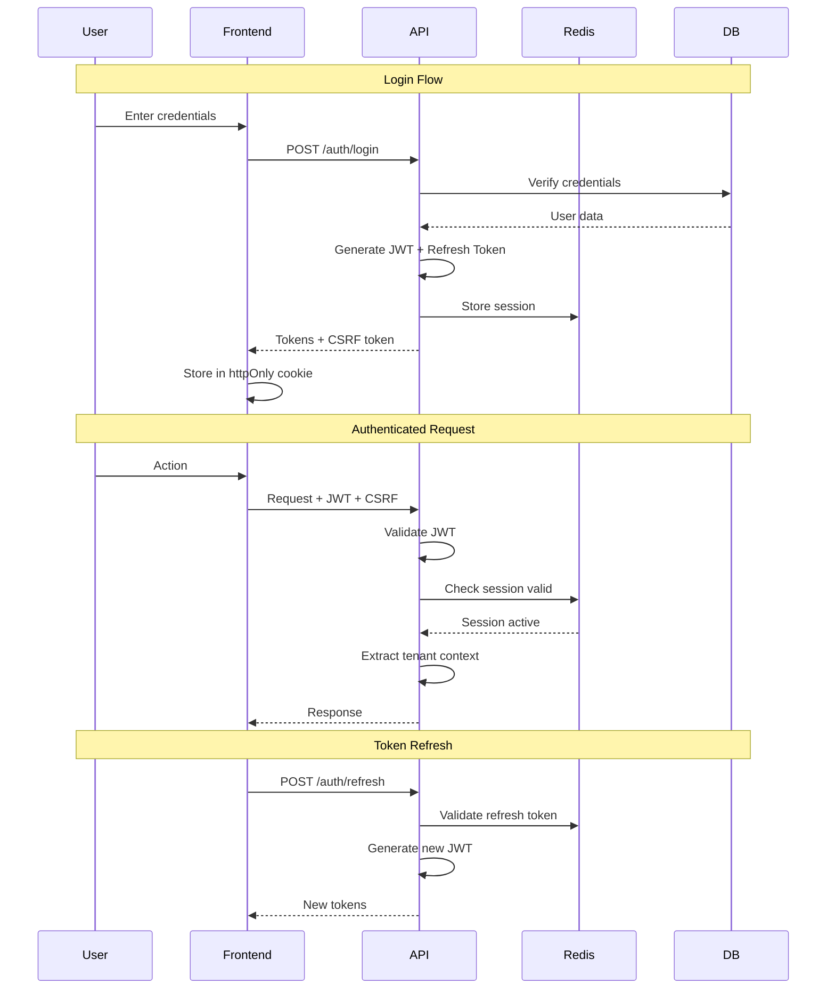
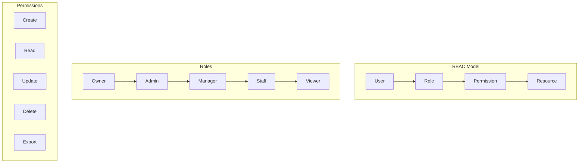
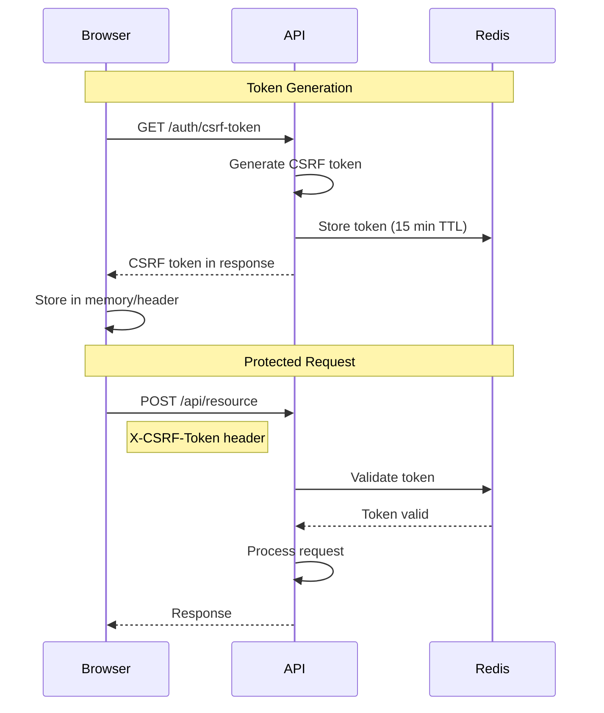
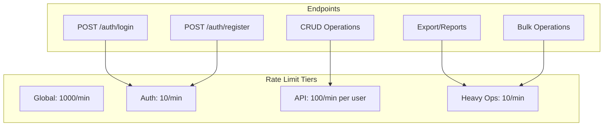
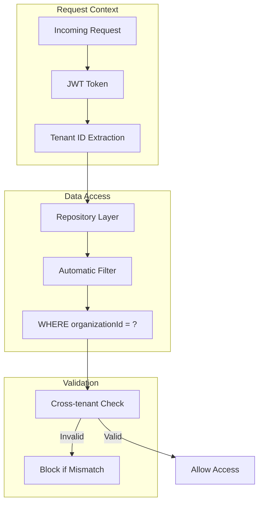
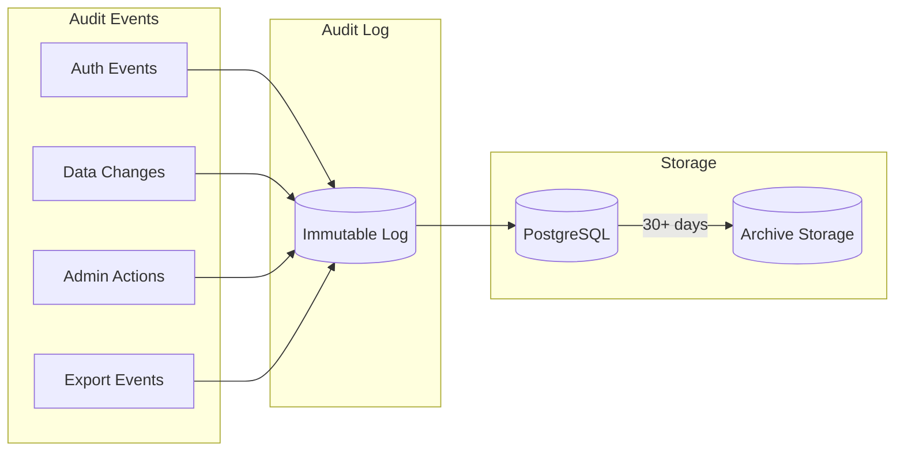

# Security Architecture

> Authentication, authorization, and data protection patterns.

## Security Overview

```mermaid
graph TB
    subgraph "Security Layers"
        L1[Network Security]
        L2[Application Security]
        L3[Data Security]
        L4[Monitoring]
    end

    subgraph "Network"
        TLS[TLS 1.3]
        WAF[Web Application Firewall]
        DDOS[DDoS Protection]
    end

    subgraph "Application"
        AUTH[Authentication]
        AUTHZ[Authorization]
        CSRF[CSRF Protection]
        RATE[Rate Limiting]
        INPUT[Input Validation]
    end

    subgraph "Data"
        ENCRYPT[Encryption at Rest]
        TENANT[Tenant Isolation]
        AUDIT[Audit Logging]
        BACKUP[Encrypted Backups]
    end

    subgraph "Monitoring"
        LOGS[Security Logs]
        ALERTS[Alert System]
        ANOMALY[Anomaly Detection]
    end

    L1 --> TLS
    L1 --> WAF
    L1 --> DDOS

    L2 --> AUTH
    L2 --> AUTHZ
    L2 --> CSRF
    L2 --> RATE
    L2 --> INPUT

    L3 --> ENCRYPT
    L3 --> TENANT
    L3 --> AUDIT
    L3 --> BACKUP

    L4 --> LOGS
    L4 --> ALERTS
    L4 --> ANOMALY
```



## Authentication Flow



## JWT Structure

```typescript
// Access Token Payload
interface JwtPayload {
  sub: string;           // User ID
  email: string;
  organizationId: string; // Tenant ID
  role: UserRole;
  permissions: string[];
  iat: number;           // Issued at
  exp: number;           // Expiration (15 min)
}

// Refresh Token (stored in Redis)
interface RefreshToken {
  userId: string;
  organizationId: string;
  tokenId: string;       // Unique token ID for revocation
  expiresAt: Date;       // 7 days
  deviceInfo: string;
}
```

## Authorization Model



### Role Permissions Matrix

| Resource | Owner | Admin | Manager | Staff | Viewer |
|----------|-------|-------|---------|-------|--------|
| Parents | CRUD | CRUD | CRUD | CR | R |
| Children | CRUD | CRUD | CRUD | CR | R |
| Invoices | CRUD | CRUD | CRU | R | R |
| Payments | CRUD | CRUD | CR | R | R |
| Staff | CRUD | CRUD | R | - | - |
| Payroll | CRUD | CRU | R | - | - |
| Settings | CRUD | RU | R | - | - |
| Users | CRUD | CRU | R | - | - |
| Reports | CRUD | CRU | R | R | R |
| Audit Logs | R | R | - | - | - |

## CSRF Protection



### Implementation

```typescript
// CSRF Store Service
@Injectable()
export class CsrfStoreService {
  constructor(private readonly redis: RedisService) {}

  async generateToken(sessionId: string): Promise<string> {
    const token = crypto.randomBytes(32).toString('hex');
    await this.redis.set(
      `csrf:${sessionId}:${token}`,
      '1',
      'EX',
      900 // 15 minutes
    );
    return token;
  }

  async validateToken(sessionId: string, token: string): Promise<boolean> {
    const key = `csrf:${sessionId}:${token}`;
    const exists = await this.redis.get(key);
    if (exists) {
      await this.redis.del(key); // Single use
      return true;
    }
    return false;
  }
}
```

## Rate Limiting



### Configuration

```typescript
// Rate limit configuration
const rateLimits = {
  global: {
    windowMs: 60 * 1000,
    max: 1000,
  },
  auth: {
    windowMs: 60 * 1000,
    max: 10,
    message: 'Too many login attempts, try again later',
  },
  api: {
    windowMs: 60 * 1000,
    max: 100,
  },
  heavy: {
    windowMs: 60 * 1000,
    max: 10,
  },
};
```

## Tenant Isolation



### Repository Pattern

```typescript
// Base repository with tenant isolation
export abstract class TenantRepository<T> {
  constructor(protected readonly prisma: PrismaService) {}

  protected getWhereClause(tenantId: string, where?: object) {
    return {
      organizationId: tenantId,
      deletedAt: null,
      ...where,
    };
  }

  async findById(id: string, tenantId: string): Promise<T | null> {
    return this.prisma[this.model].findFirst({
      where: this.getWhereClause(tenantId, { id }),
    });
  }

  async findAll(tenantId: string, query: PaginationDto) {
    return this.prisma[this.model].findMany({
      where: this.getWhereClause(tenantId),
      skip: query.offset,
      take: query.limit,
    });
  }
}
```

## Audit Logging



### Audit Log Schema

```typescript
interface AuditLogEntry {
  id: string;
  organizationId: string;
  userId: string;
  action: AuditAction;
  entityType: string;
  entityId: string;
  previousState: object | null;
  newState: object | null;
  ipAddress: string;
  userAgent: string;
  createdAt: Date;
}

enum AuditAction {
  CREATE = 'CREATE',
  UPDATE = 'UPDATE',
  DELETE = 'DELETE',
  LOGIN = 'LOGIN',
  LOGOUT = 'LOGOUT',
  EXPORT = 'EXPORT',
  PERMISSION_CHANGE = 'PERMISSION_CHANGE',
}
```

## Security Checklist

### Authentication
- [x] JWT with short expiration (15 min)
- [x] Refresh tokens with rotation
- [x] Password hashing (bcrypt, cost 12)
- [x] Session storage in Redis
- [x] Secure cookie configuration
- [x] Multi-factor authentication (planned)

### Authorization
- [x] Role-based access control
- [x] Tenant isolation at repository level
- [x] TypeScript-enforced tenant parameters
- [x] Permission guards on all endpoints

### Data Protection
- [x] HTTPS/TLS 1.3 enforced
- [x] CSRF tokens for state-changing requests
- [x] Input validation with Zod
- [x] SQL injection prevention (Prisma ORM)
- [x] XSS prevention (React auto-escaping)
- [x] Sensitive data encryption

### Rate Limiting
- [x] Global rate limiting
- [x] Auth endpoint protection
- [x] Per-user API limits
- [x] Heavy operation throttling

### Monitoring
- [x] Immutable audit logs
- [x] Authentication attempt logging
- [x] Data access logging
- [x] Security alert system (planned)
