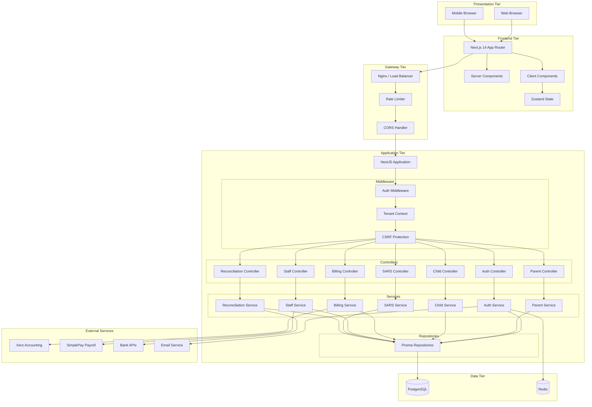
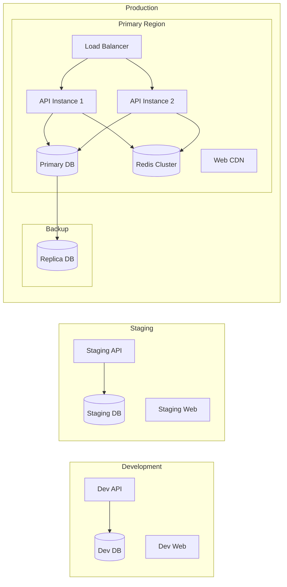
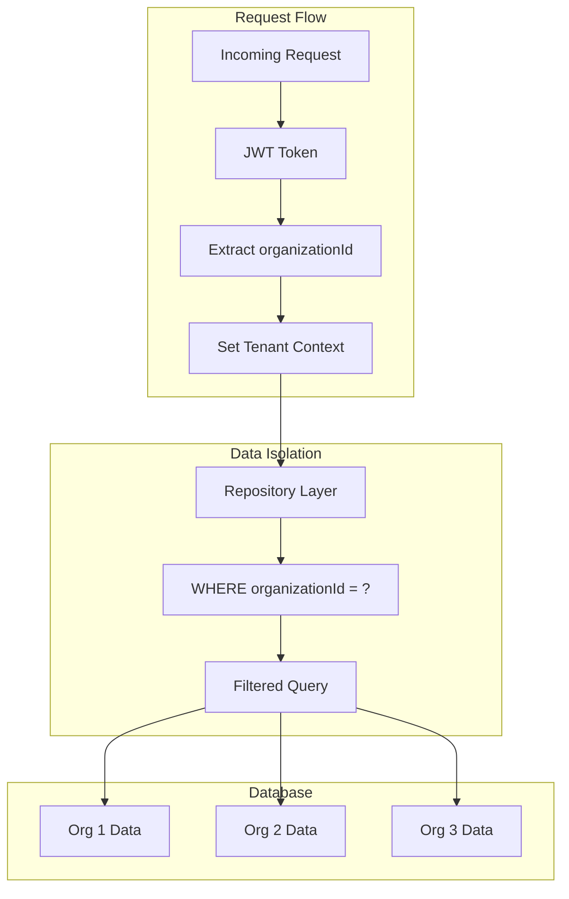

# System Overview

> High-level architecture of the CrecheBooks platform.

## Architecture Diagram



## Component Responsibilities

### Presentation Tier
- **Web/Mobile Browsers**: End-user access points
- Responsive design supporting desktop and mobile

### Frontend Tier
- **Next.js 14**: React framework with App Router
- **Server Components**: SEO, initial data fetching
- **Client Components**: Interactive UI elements
- **Zustand**: Lightweight client state management

### Gateway Tier
- **Load Balancer**: Traffic distribution
- **Rate Limiter**: DDoS protection, API throttling
- **CORS Handler**: Cross-origin request security

### Application Tier
- **NestJS**: Enterprise-grade Node.js framework
- **Middleware**: Request processing pipeline
- **Controllers**: HTTP request handlers
- **Services**: Business logic encapsulation
- **Repositories**: Data access abstraction

### Data Tier
- **PostgreSQL**: Primary relational database
- **Redis**: Session storage, caching, rate limiting

### External Services
- **Xero**: Accounting integration
- **SimplePay**: Payroll processing
- **Bank APIs**: Statement reconciliation
- **Email**: Transactional notifications

## Deployment Architecture



## Multi-Tenant Architecture



### Tenant Isolation Strategy

1. **Authentication**: JWT contains `organizationId`
2. **Middleware**: Extracts tenant context from token
3. **Repository**: All queries filtered by `organizationId`
4. **Type Safety**: TypeScript enforces tenant parameter

```typescript
// Repository pattern with tenant isolation
async findById(id: string, tenantId: string) {
  return this.prisma.entity.findFirst({
    where: {
      id,
      organizationId: tenantId,
      deletedAt: null
    }
  });
}
```

## Key Design Patterns

| Pattern | Usage |
|---------|-------|
| **Repository** | Data access abstraction with tenant filtering |
| **Service Layer** | Business logic encapsulation |
| **Guard** | Authorization and authentication |
| **DTO** | Request/response validation |
| **Decorator** | Metadata injection (tenant, user context) |
| **Module** | Feature-based code organization |

## Scalability Considerations

- **Horizontal Scaling**: Stateless API allows multiple instances
- **Database**: Read replicas for reporting queries
- **Caching**: Redis for session and frequently accessed data
- **CDN**: Static assets served via CDN
- **Queue**: Background jobs for heavy processing (future)
