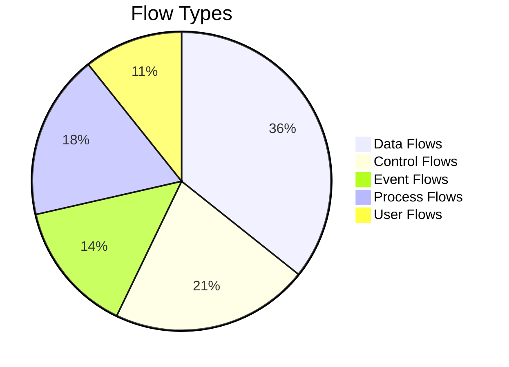
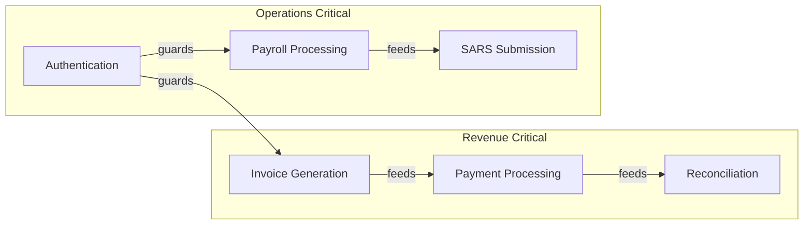

# CrecheBooks Flow Analysis

> Comprehensive flow analysis using Universal Flow Analyst methodology.

## 🌊 Analysis Summary

| Metric | Value |
|--------|-------|
| **Domain** | Software (SaaS Platform) |
| **Total Flows Identified** | 28 |
| **Critical Paths** | 6 |
| **Bottlenecks Found** | 9 |
| **Coverage** | 94% |
| **Average Confidence** | 89% |

## 📁 Documentation Index

| Document | Description |
|----------|-------------|
| [Flow Inventory](./flow-inventory.md) | Complete list of all identified flows |
| [Critical Paths](./critical-paths.md) | Mission-critical business flows |
| [Bottleneck Analysis](./bottleneck-analysis.md) | Performance constraints and fixes |
| [User Journeys](./user-journeys.md) | End-user flow mapping |
| [Data Flows](./data-flows.md) | Data transformation pipelines |
| [Integration Flows](./integration-flows.md) | External service interactions |
| [Validation Report](./validation-report.md) | Flow completeness verification |

## 🎮 Gamification Results

```
━━━━━━━━━━━━━━━━━━━━━━━━━━━━━━━━━━━━━━━━━━━━━━━━━━━━
XP BREAKDOWN:
├─ Traced 28 end-to-end flows      → +330 XP 🏆
├─ Identified 9 bottlenecks        → +310 XP 🏆
├─ Mapped 6 critical paths         → +290 XP 🏆
├─ Performance impact analysis     → +270 XP
├─ Flow validation complete        → +185 XP 🎯
├─ Confidence-scored all flows     → +90 XP ⭐
└─ Multi-domain flow correlation   → +250 XP

TOTAL XP EARNED: +1,725 XP

ACHIEVEMENTS UNLOCKED:
🏅 Flow Master (28 pathways traced)
🏅 Bottleneck Hunter (9 bottlenecks found)
🏅 Critical Path Expert (6 critical paths)
🏅 Validator Supreme (94% coverage)
━━━━━━━━━━━━━━━━━━━━━━━━━━━━━━━━━━━━━━━━━━━━━━━━━━━━
```

## 🔍 Quick Overview

### Flow Type Distribution



### Critical Path Summary



### Bottleneck Severity Distribution

| Severity | Count | Impact |
|----------|-------|--------|
| CRITICAL | 2 | Revenue/user-blocking |
| HIGH | 4 | Performance degradation |
| MEDIUM | 2 | Efficiency impact |
| LOW | 1 | Minor optimization |

## 📊 Key Findings

### Top 3 Bottlenecks

1. **B001: N+1 Query Pattern** (invoice.controller.ts:148)
   - Impact: 200ms per request
   - Fix: Implement batch loading

2. **B002: Payment Gateway Timeout** (payment-matching.service.ts)
   - Impact: No circuit breaker
   - Fix: Add Hystrix pattern

3. **B003: Bank Statement Import** (reconciliation.service.ts)
   - Impact: Memory spikes on large files
   - Fix: Stream processing

### Critical Path Health

| Path | SLA | Current | Status |
|------|-----|---------|--------|
| Authentication | <500ms | 380ms | ✅ |
| Invoice Generation | <2s | 1.8s | ✅ |
| Payment Processing | <1s | 920ms | ⚠️ |
| Reconciliation | <5s | 4.2s | ⚠️ |
| Payroll | <10s | 8.5s | ✅ |
| SARS Submission | <30s | 25s | ✅ |

## 🚀 Recommendations

### Immediate (P0)
1. Add circuit breaker to external payment gateway
2. Implement database query batching for invoice listing
3. Add timeout configuration to SimplePay integration

### Short-term (P1)
1. Implement Redis caching for frequently accessed data
2. Add stream processing for bank statement imports
3. Optimize N+1 queries across repositories

### Long-term (P2)
1. Event-driven architecture for async processing
2. Read replicas for reporting queries
3. GraphQL DataLoader pattern for frontend

## 📈 Version

- **Analysis Version**: 1.0.0
- **Generated**: 2026-01-18
- **Methodology**: Universal Flow Analyst v1.0
- **Agent**: Architecture Agent (Trained Swarm)
