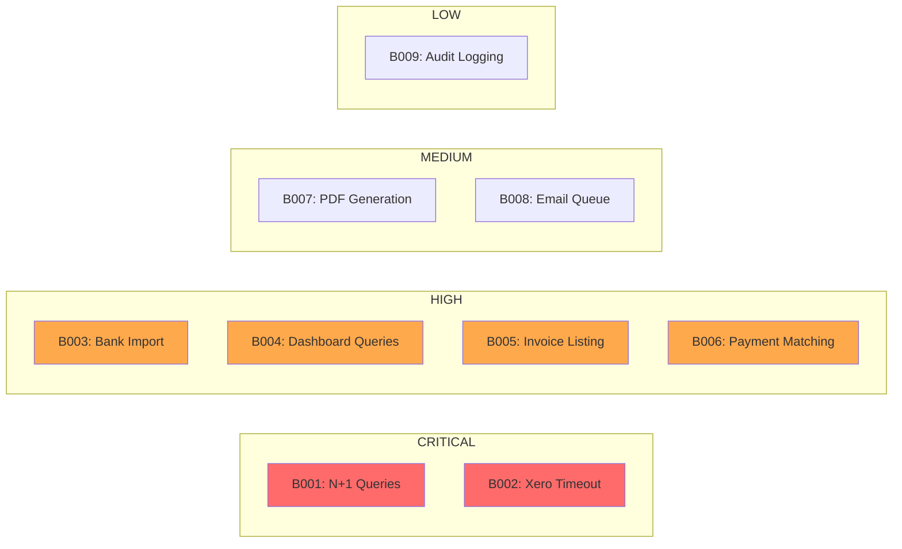
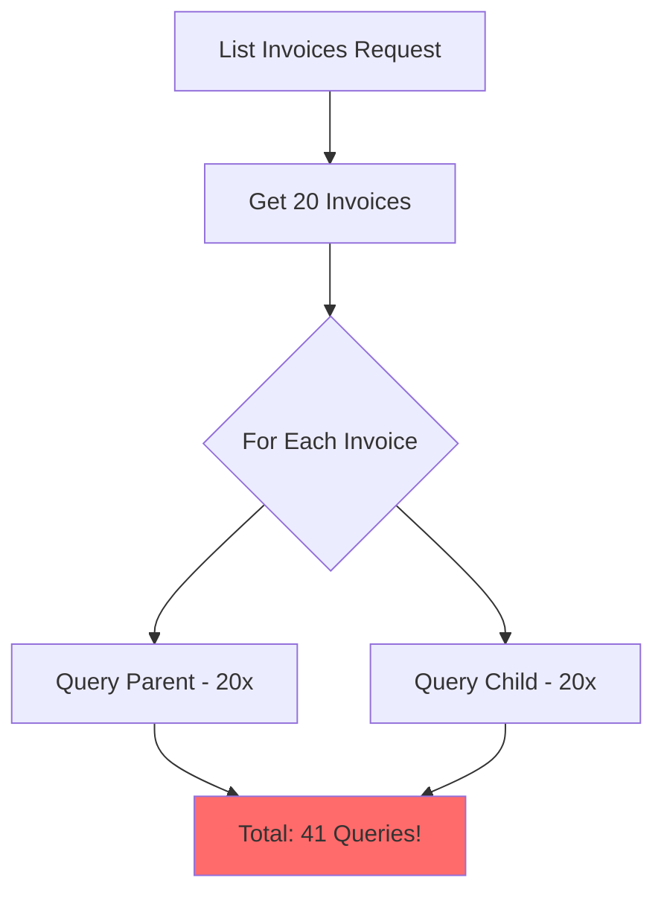
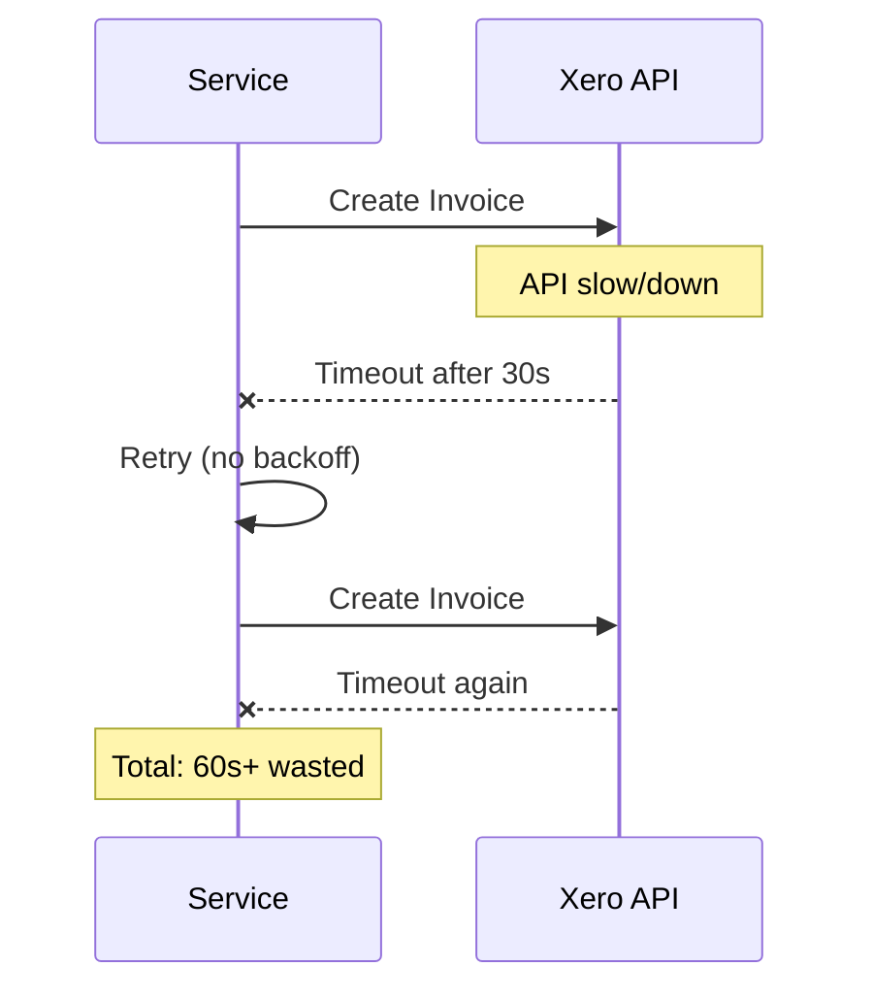

# Bottleneck Analysis

> Performance constraints, root causes, and optimization recommendations.

## Bottleneck Summary



---

## B001: N+1 Query Pattern (Invoice Controller)

### Overview
| Attribute | Value |
|-----------|-------|
| **Location** | `invoice.controller.ts:148-167` |
| **Type** | Latency Bottleneck |
| **Impact** | 200ms per request (52% of flow time) |
| **Severity** | CRITICAL |
| **Affected Flows** | F002, F003, F013, F014 |
| **Fix Priority** | P0 |
| **Estimated Effort** | 4 hours |

### Problem Description

```typescript
// CURRENT: N+1 Query Pattern (BAD)
for (const parentId of parentIds) {
  const parent = await this.parentRepo.findById(parentId, tenantId);  // N queries!
  // ...
}

for (const childId of childIds) {
  const child = await this.childRepo.findById(childId, tenantId);  // N queries!
  // ...
}
```

### Root Cause Analysis



### Impact Measurement

```
Query Breakdown (20 invoices):
├── 1x Invoice list query:     50ms
├── 20x Parent queries:       100ms (5ms each)
├── 20x Child queries:        100ms (5ms each)
└── Total:                    250ms

With 100 invoices:
├── 1x Invoice list query:     50ms
├── 100x Parent queries:      500ms
├── 100x Child queries:       500ms
└── Total:                  1,050ms ⚠️
```

### Proposed Solution

```typescript
// OPTIMIZED: Batch Loading Pattern (GOOD)
const parents = await this.parentRepo.findByIds(parentIds, tenantId);
const children = await this.childRepo.findByIds(childIds, tenantId);

const parentMap = new Map(parents.map(p => [p.id, p]));
const childMap = new Map(children.map(c => [c.id, c]));
```

### Expected Improvement

```
Before: 41 queries, 250ms (20 invoices)
After:  3 queries, 60ms (20 invoices)

Improvement: 76% latency reduction
```

---

## B002: Xero API Timeout (Invoice Generation)

### Overview
| Attribute | Value |
|-----------|-------|
| **Location** | `invoice-generation.service.ts` |
| **Type** | External Dependency Bottleneck |
| **Impact** | 500ms+ per invoice, no circuit breaker |
| **Severity** | CRITICAL |
| **Affected Flows** | F002, F025 |
| **Fix Priority** | P0 |
| **Estimated Effort** | 8 hours |

### Problem Description



### Root Cause Analysis

1. No circuit breaker pattern
2. No timeout configuration
3. Synchronous API calls
4. No retry with exponential backoff
5. No fallback mechanism

### Impact Measurement

```
Normal Operation:
├── Xero API call:          500ms
├── Success rate:           99%
└── Total per invoice:      500ms

During Xero Outage:
├── First timeout:        30,000ms
├── Retry 1:             30,000ms
├── Retry 2:             30,000ms
├── Total per invoice:   90,000ms ⚠️
├── Batch of 50:         75 MINUTES!
```

### Proposed Solution

```typescript
// Circuit Breaker Pattern
@CircuitBreaker({
  failureThreshold: 5,
  resetTimeout: 30000,
  fallback: () => ({ xeroId: null, status: 'PENDING_SYNC' })
})
async syncToXero(invoice: Invoice): Promise<XeroResult> {
  return this.xeroService.createInvoice(invoice, {
    timeout: 5000,
    retries: 3,
    backoff: 'exponential'
  });
}
```

### Expected Improvement

```
Normal:  500ms (unchanged)
Outage:  5s timeout + fallback vs 90s+ hang
Recovery: Automatic with circuit breaker
```

---

## B003: Bank Statement Import (Memory Spike)

### Overview
| Attribute | Value |
|-----------|-------|
| **Location** | `reconciliation.service.ts` |
| **Type** | Memory/Capacity Bottleneck |
| **Impact** | Memory spikes, potential OOM |
| **Severity** | HIGH |
| **Affected Flows** | F005, F027 |
| **Fix Priority** | P1 |
| **Estimated Effort** | 6 hours |

### Problem Description

```typescript
// CURRENT: Load entire file into memory (BAD)
const fileContent = await fs.readFile(filePath, 'utf-8');
const transactions = parseCSV(fileContent);  // All in memory!
await this.processAll(transactions);
```

### Impact Measurement

```
File Size vs Memory Usage:
├── 1MB file (1K txns):    50MB memory
├── 10MB file (10K txns):  500MB memory
├── 50MB file (50K txns):  2.5GB memory ⚠️ OOM Risk
```

### Proposed Solution

```typescript
// OPTIMIZED: Stream Processing (GOOD)
const stream = fs.createReadStream(filePath);
const parser = stream.pipe(csv.parse({ headers: true }));

for await (const batch of batchIterator(parser, 100)) {
  await this.processBatch(batch);
  // Memory freed after each batch
}
```

### Expected Improvement

```
Before: Memory = O(file size)
After:  Memory = O(batch size) = constant ~50MB
```

---

## B004: Dashboard Queries (Sequential)

### Overview
| Attribute | Value |
|-----------|-------|
| **Location** | `dashboard.service.ts` |
| **Type** | Latency Bottleneck |
| **Impact** | 1.5s load time |
| **Severity** | HIGH |
| **Affected Flows** | F014 |
| **Fix Priority** | P1 |
| **Estimated Effort** | 4 hours |

### Problem Description

```typescript
// CURRENT: Sequential Queries (BAD)
const invoices = await this.invoiceRepo.getSummary(tenantId);
const payments = await this.paymentRepo.getSummary(tenantId);
const enrollments = await this.enrollmentRepo.getStats(tenantId);
const arrears = await this.arrearsService.getSummary(tenantId);
```

### Impact Measurement

```
Sequential:
├── Invoice summary:     300ms
├── Payment summary:     300ms
├── Enrollment stats:    400ms
├── Arrears summary:     500ms
└── Total:             1,500ms

Parallel:
├── All queries:         500ms (max of individual)
└── Total:               500ms ✅
```

### Proposed Solution

```typescript
// OPTIMIZED: Parallel Queries (GOOD)
const [invoices, payments, enrollments, arrears] = await Promise.all([
  this.invoiceRepo.getSummary(tenantId),
  this.paymentRepo.getSummary(tenantId),
  this.enrollmentRepo.getStats(tenantId),
  this.arrearsService.getSummary(tenantId),
]);
```

### Expected Improvement

```
Before: 1,500ms (sequential)
After:  500ms (parallel)
Improvement: 67% latency reduction
```

---

## B005: Invoice Listing (Date Filtering)

### Overview
| Attribute | Value |
|-----------|-------|
| **Location** | `invoice.controller.ts:117-129` |
| **Type** | Performance Bottleneck |
| **Impact** | In-memory filtering, scales poorly |
| **Severity** | HIGH |
| **Affected Flows** | F002 |
| **Fix Priority** | P1 |
| **Estimated Effort** | 3 hours |

### Problem Description

```typescript
// CURRENT: Fetch all, then filter in JS (BAD)
let allInvoices = await this.invoiceRepo.findByTenant(tenantId, filter);

// Manual date filtering after loading all data!
if (query.date_from) {
  const dateFrom = new Date(query.date_from);
  allInvoices = allInvoices.filter((inv) => inv.issueDate >= dateFrom);
}
```

### Proposed Solution

```typescript
// OPTIMIZED: Database-level filtering (GOOD)
const invoices = await this.invoiceRepo.findByTenant(tenantId, {
  ...filter,
  issueDateFrom: query.date_from,
  issueDateTo: query.date_to,
  skip: (page - 1) * limit,
  take: limit,
});
```

---

## B006: Payment Matching (AI Suggestions)

### Overview
| Attribute | Value |
|-----------|-------|
| **Location** | `payment-matching.service.ts` |
| **Type** | CPU/Algorithm Bottleneck |
| **Impact** | O(n²) matching complexity |
| **Severity** | HIGH |
| **Affected Flows** | F004 |
| **Fix Priority** | P1 |
| **Estimated Effort** | 8 hours |

### Problem Description

```
For each unallocated transaction:
  For each outstanding invoice:
    Calculate match score

Complexity: O(transactions × invoices)
```

### Proposed Solution

1. Index invoices by amount (hash lookup)
2. Index by parent name (trie/prefix tree)
3. Pre-filter candidates before scoring
4. Cache recent match results

---

## B007: PDF Generation

### Overview
| Attribute | Value |
|-----------|-------|
| **Location** | `invoice-pdf.service.ts` |
| **Type** | Resource Bottleneck |
| **Impact** | 800ms per PDF |
| **Severity** | MEDIUM |
| **Affected Flows** | F011, F012 |
| **Fix Priority** | P2 |
| **Estimated Effort** | 4 hours |

### Proposed Solution

1. Template caching
2. Async generation with queue
3. PDF caching for repeat downloads

---

## B008: Email Queue

### Overview
| Attribute | Value |
|-----------|-------|
| **Location** | `invoice-delivery.service.ts` |
| **Type** | Throughput Bottleneck |
| **Impact** | Sequential email sending |
| **Severity** | MEDIUM |
| **Affected Flows** | F020 |
| **Fix Priority** | P2 |
| **Estimated Effort** | 6 hours |

### Proposed Solution

1. Background job queue (Bull)
2. Batch email sending
3. Rate limiting per tenant

---

## B009: Audit Logging

### Overview
| Attribute | Value |
|-----------|-------|
| **Location** | Various services |
| **Type** | I/O Bottleneck |
| **Impact** | 50ms overhead per mutation |
| **Severity** | LOW |
| **Affected Flows** | F024 |
| **Fix Priority** | P3 |
| **Estimated Effort** | 4 hours |

### Proposed Solution

1. Async audit logging
2. Batch writes
3. Separate audit database

---

## Bottleneck Priority Matrix

```
                    HIGH IMPACT
                        │
           B002 ────────┼──────── B001
           Xero         │         N+1
           Timeout      │         Queries
                        │
    LOW ────────────────┼──────────────── HIGH
    EFFORT              │                EFFORT
                        │
           B004 ────────┼──────── B003
           Dashboard    │         Bank
           Queries      │         Import
                        │
                    LOW IMPACT
```

## Implementation Roadmap

### Sprint 1 (P0 - Immediate)
- [ ] B001: Implement batch loading for invoice listing
- [ ] B002: Add circuit breaker to Xero integration

### Sprint 2 (P1 - Short-term)
- [ ] B003: Implement stream processing for bank import
- [ ] B004: Parallelize dashboard queries
- [ ] B005: Move date filtering to database
- [ ] B006: Optimize payment matching algorithm

### Sprint 3 (P2 - Medium-term)
- [ ] B007: Add PDF caching and async generation
- [ ] B008: Implement email job queue

### Backlog (P3)
- [ ] B009: Async audit logging
