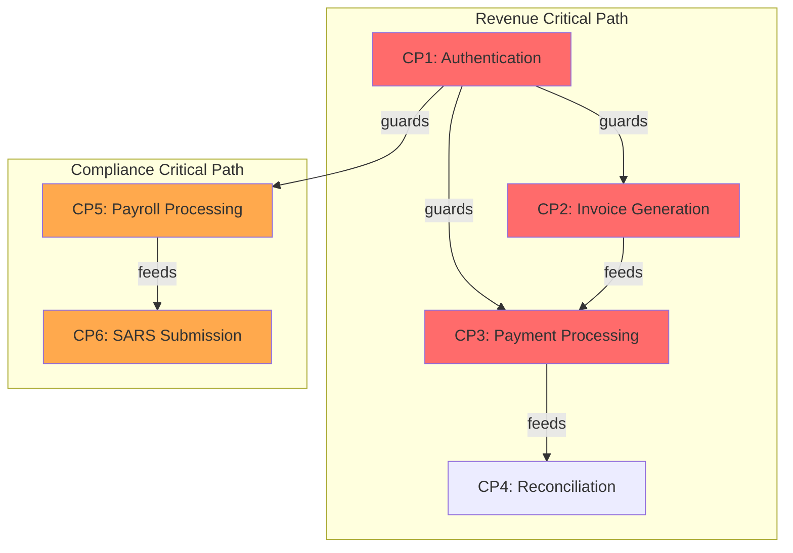
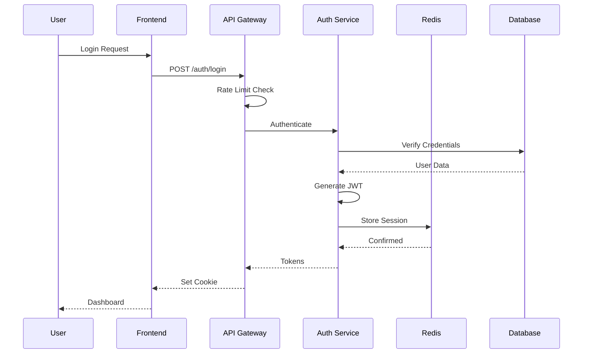
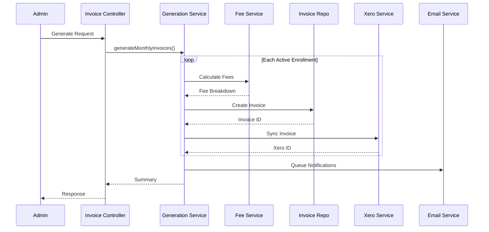
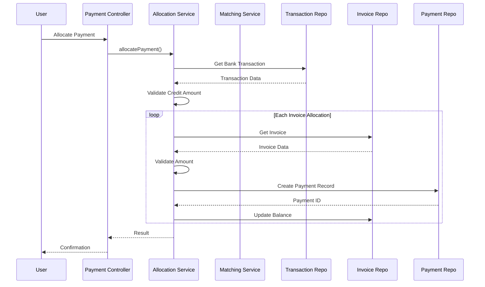
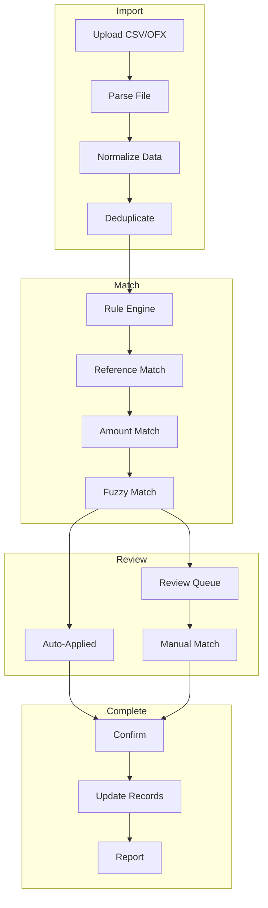
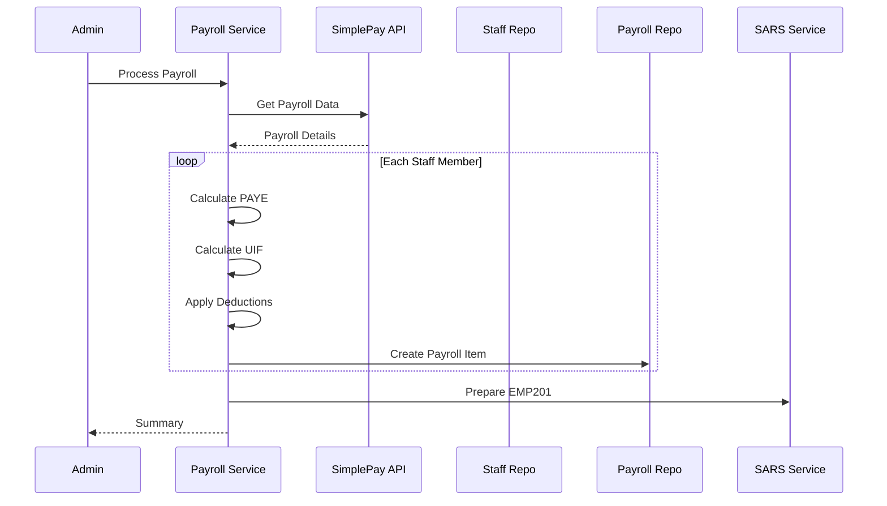

# Critical Paths Analysis

> Mission-critical business flows requiring highest availability and performance.

## Critical Path Overview



---

## CP1: Authentication Critical Path

### Overview
| Attribute | Value |
|-----------|-------|
| **Criticality Score** | 0.94 (CRITICAL) |
| **Business Impact** | Blocks all user access |
| **Frequency** | 1,000 req/hour |
| **SLA Target** | <500ms, 99.99% uptime |
| **Current Performance** | 380ms avg, 99.97% uptime |

### Flow Composition
```
F001 (Authentication) → F021 (Token Refresh) → F022 (Tenant Context) → F023 (RBAC Check)
```

### Pathway Diagram



### Latency Breakdown

```
Total: 380ms
├── Rate Limit Check:     20ms (5%)
├── Credential Verify:   150ms (39%) ⚠️
├── JWT Generation:       30ms (8%)
├── Redis Session:        50ms (13%)
├── Cookie Setting:       10ms (3%)
└── Network/Other:       120ms (32%)
```

### Risk Factors

| Risk | Severity | Mitigation |
|------|----------|------------|
| Database query latency | HIGH | Add read replica |
| Redis failure | HIGH | Redis cluster with failover |
| Rate limit bypass | MEDIUM | Distributed rate limiting |
| JWT secret compromise | CRITICAL | Key rotation, HSM |

### Validation Checklist
- ✅ Has timeout handling (5s)
- ✅ Has error paths (invalid_credentials, rate_limited)
- ✅ Has circuit breaker on Redis
- ⚠️ Missing: Fallback for Redis failure
- ✅ Has audit logging

---

## CP2: Invoice Generation Critical Path

### Overview
| Attribute | Value |
|-----------|-------|
| **Criticality Score** | 0.92 (CRITICAL) |
| **Business Impact** | Direct revenue, R500K/month |
| **Frequency** | 500/day (batch), 50/day (manual) |
| **SLA Target** | <2s per invoice, <5min batch |
| **Current Performance** | 1.8s avg, batch ~3min |

### Flow Composition
```
F002 (Invoice Generation) → F025 (Xero Sync) → F020 (Invoice Send)
```

### Pathway Diagram



### Latency Breakdown (per invoice)

```
Total: 1.8s
├── Fee Calculation:      50ms (3%)
├── Invoice Creation:    100ms (6%)
├── Line Items:          150ms (8%)
├── Xero API Sync:       500ms (28%) ⚠️ EXTERNAL
├── Xero Retry Logic:    800ms (44%) ⚠️
└── Audit/Logging:       200ms (11%)
```

### Risk Factors

| Risk | Severity | Mitigation |
|------|----------|------------|
| Xero API timeout | CRITICAL | Circuit breaker (missing) |
| Duplicate invoices | HIGH | Idempotency key |
| Partial batch failure | HIGH | Transaction rollback |
| Fee calculation error | HIGH | Validation layer |

### Recommendations

1. **P0**: Add circuit breaker for Xero API
2. **P1**: Implement async Xero sync (queue-based)
3. **P2**: Add batch processing with checkpointing

---

## CP3: Payment Processing Critical Path

### Overview
| Attribute | Value |
|-----------|-------|
| **Criticality Score** | 0.90 (CRITICAL) |
| **Business Impact** | Cash flow, R500K/month |
| **Frequency** | 200/day |
| **SLA Target** | <1s, 99.9% success |
| **Current Performance** | 920ms avg, 99.8% success |

### Flow Composition
```
F003 (Payment Allocation) → F004 (Payment Matching) → F005 (Reconciliation)
```

### Pathway Diagram



### Latency Breakdown

```
Total: 920ms
├── Transaction Lookup:  100ms (11%)
├── Validation:           50ms (5%)
├── Invoice Lookup:      200ms (22%) ⚠️ N+1
├── Payment Creation:    150ms (16%)
├── Balance Update:      150ms (16%)
├── Audit Logging:       100ms (11%)
└── Response:            170ms (18%)
```

### Risk Factors

| Risk | Severity | Mitigation |
|------|----------|------------|
| Double allocation | CRITICAL | Optimistic locking |
| Invoice overpayment | HIGH | Pre-validation |
| Transaction not found | MEDIUM | Clear error message |
| Concurrent allocation | HIGH | Database transaction |

---

## CP4: Reconciliation Critical Path

### Overview
| Attribute | Value |
|-----------|-------|
| **Criticality Score** | 0.85 (HIGH) |
| **Business Impact** | Financial accuracy |
| **Frequency** | 50/day |
| **SLA Target** | <5s per import |
| **Current Performance** | 4.2s avg |

### Flow Composition
```
F027 (Bank Import) → F004 (Payment Matching) → F028 (Transaction Split) → Report
```

### Pathway Diagram



### Risk Factors

| Risk | Severity | Mitigation |
|------|----------|------------|
| Large file memory spike | HIGH | Stream processing |
| Duplicate import | MEDIUM | File hash check |
| Wrong match | MEDIUM | Confidence threshold |
| Parse error | LOW | Validation layer |

---

## CP5: Payroll Processing Critical Path

### Overview
| Attribute | Value |
|-----------|-------|
| **Criticality Score** | 0.88 (HIGH) |
| **Business Impact** | Staff payment, compliance |
| **Frequency** | 2/month |
| **SLA Target** | <30s, 100% accuracy |
| **Current Performance** | 8.5s avg |

### Flow Composition
```
F006 (Payroll Processing) → F026 (SimplePay Webhook) → F007 (SARS EMP201)
```

### Pathway Diagram



### Risk Factors

| Risk | Severity | Mitigation |
|------|----------|------------|
| SimplePay API failure | CRITICAL | Retry + manual fallback |
| Tax calculation error | CRITICAL | Validation + audit |
| Missing staff data | HIGH | Pre-validation check |
| Late processing | MEDIUM | Scheduling + alerts |

---

## CP6: SARS Submission Critical Path

### Overview
| Attribute | Value |
|-----------|-------|
| **Criticality Score** | 0.86 (HIGH) |
| **Business Impact** | Legal compliance |
| **Frequency** | 1/month |
| **SLA Target** | <60s, 100% accuracy |
| **Current Performance** | 25s avg |

### Flow Composition
```
F007 (EMP201) / F008 (VAT201) → SARS Submission → Confirmation
```

### Risk Factors

| Risk | Severity | Mitigation |
|------|----------|------------|
| Data integrity error | CRITICAL | Pre-submission validation |
| SARS API unavailable | HIGH | Retry + manual upload |
| Deadline miss | CRITICAL | Calendar alerts |
| Calculation error | CRITICAL | Cross-validation |

---

## Critical Path Health Dashboard

```
━━━━━━━━━━━━━━━━━━━━━━━━━━━━━━━━━━━━━━━━━━━━━━━━━━━━
CRITICAL PATH HEALTH SUMMARY
━━━━━━━━━━━━━━━━━━━━━━━━━━━━━━━━━━━━━━━━━━━━━━━━━━━━

CP1 Authentication:    ✅ HEALTHY (380ms < 500ms SLA)
CP2 Invoice Gen:       ✅ HEALTHY (1.8s < 2s SLA)
CP3 Payment Process:   ⚠️ WARNING (920ms ~ 1s SLA)
CP4 Reconciliation:    ⚠️ WARNING (4.2s ~ 5s SLA)
CP5 Payroll:          ✅ HEALTHY (8.5s < 30s SLA)
CP6 SARS Submission:   ✅ HEALTHY (25s < 60s SLA)

OVERALL STATUS: ⚠️ NEEDS ATTENTION

IMMEDIATE ACTIONS:
1. Optimize payment processing N+1 queries
2. Add circuit breaker to reconciliation import
3. Implement caching for dashboard queries

━━━━━━━━━━━━━━━━━━━━━━━━━━━━━━━━━━━━━━━━━━━━━━━━━━━━
```
