# Data Flows

> Data transformation pipelines and state transitions in CrecheBooks.

## Data Flow Architecture

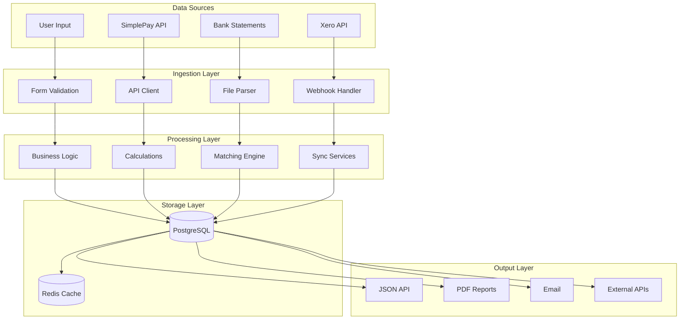

---

## DF001: Invoice Data Flow

### Overview
| Attribute | Value |
|-----------|-------|
| **Type** | Transactional |
| **Source** | Enrollment + Fee Structure |
| **Destination** | Invoice + Xero |
| **Throughput** | 500/day |
| **Latency** | 1.8s |

### Data Transformation Pipeline

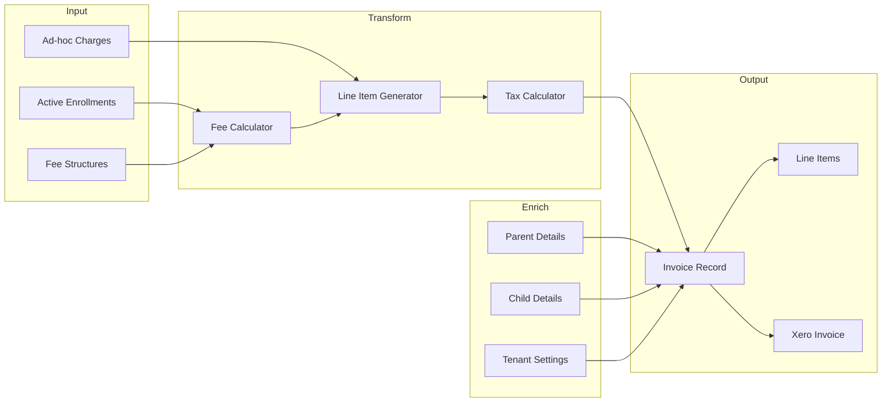

### Data Schema Transformation

```
Input (Enrollment):
{
  id: string
  childId: string
  scheduleType: "FULL_TIME" | "PART_TIME" | "FLEXI"
  startDate: Date
  endDate?: Date
  feeStructureId: string
}

Transform (Fee Calculation):
{
  baseFee: number
  registrationFee: number
  additionalCharges: AdditionalCharge[]
  discounts: Discount[]
  vatAmount: number
  totalAmount: number
}

Output (Invoice):
{
  id: string
  invoiceNumber: string
  parentId: string
  childId: string
  tenantId: string
  issueDate: Date
  dueDate: Date
  subtotal: number
  vatAmount: number
  totalAmount: number
  outstandingAmount: number
  status: "DRAFT" | "SENT" | "PAID" | "OVERDUE"
  xeroId?: string
  lineItems: InvoiceLineItem[]
}
```

### State Machine

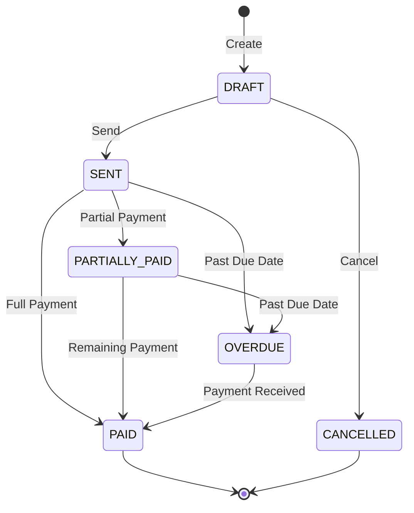

---

## DF002: Payment Data Flow

### Overview
| Attribute | Value |
|-----------|-------|
| **Type** | Transactional |
| **Source** | Bank Transaction |
| **Destination** | Payment + Invoice Update |
| **Throughput** | 200/day |
| **Latency** | 450ms |

### Data Transformation Pipeline

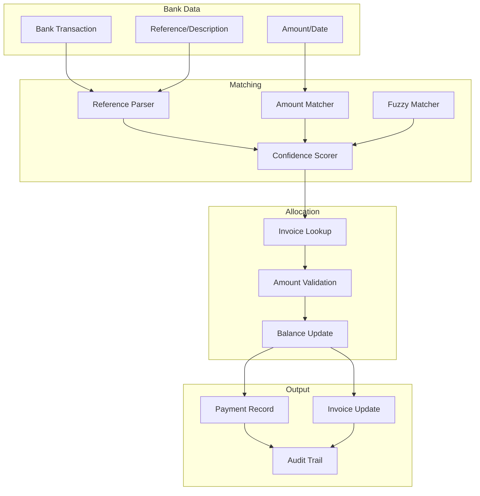

### Allocation Logic

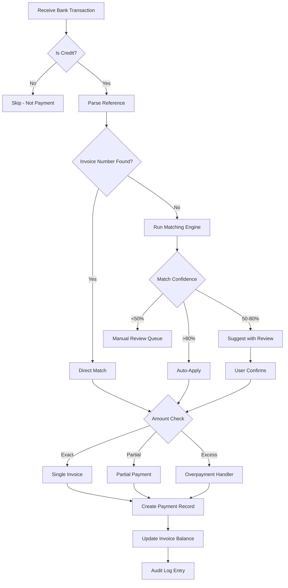

### Split Payment Handling

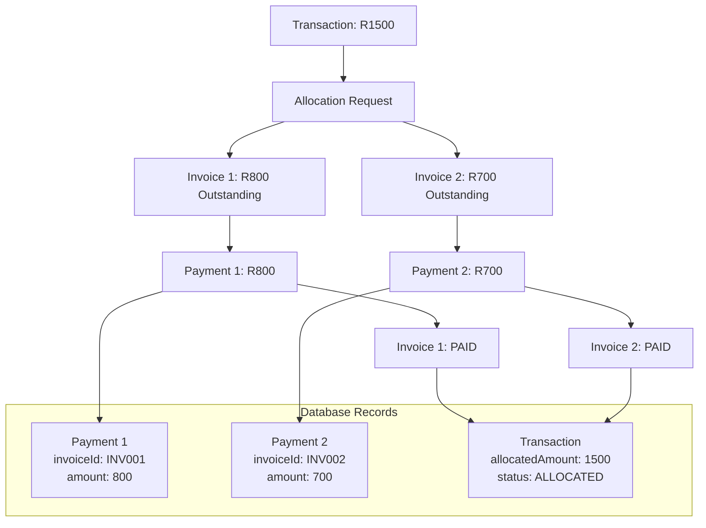

---

## DF003: Bank Statement Import Flow

### Overview
| Attribute | Value |
|-----------|-------|
| **Type** | Batch |
| **Source** | CSV/OFX File |
| **Destination** | Bank Transactions |
| **Throughput** | 1000 txns/import |
| **Latency** | 3s |

### Transformation Pipeline

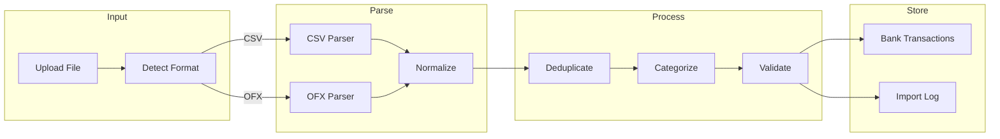

### Format Normalization

```
CSV Input (Standard Bank):
Date,Description,Amount,Balance
2026-01-15,"PAYMENT RECEIVED REF: INV-001",1500.00,25000.00

OFX Input:
<STMTTRN>
  <TRNTYPE>CREDIT
  <DTPOSTED>20260115
  <TRNAMT>1500.00
  <FITID>TXN123456
  <MEMO>PAYMENT RECEIVED REF: INV-001
</STMTTRN>

Normalized Output:
{
  externalId: "TXN123456" | hash(date+amount+desc)
  transactionDate: Date("2026-01-15")
  description: "PAYMENT RECEIVED REF: INV-001"
  amount: 1500.00
  type: "CREDIT"
  category: "PAYMENT"
  reference: "INV-001"
  status: "UNALLOCATED"
  bankAccountId: string
  tenantId: string
}
```

### Deduplication Strategy

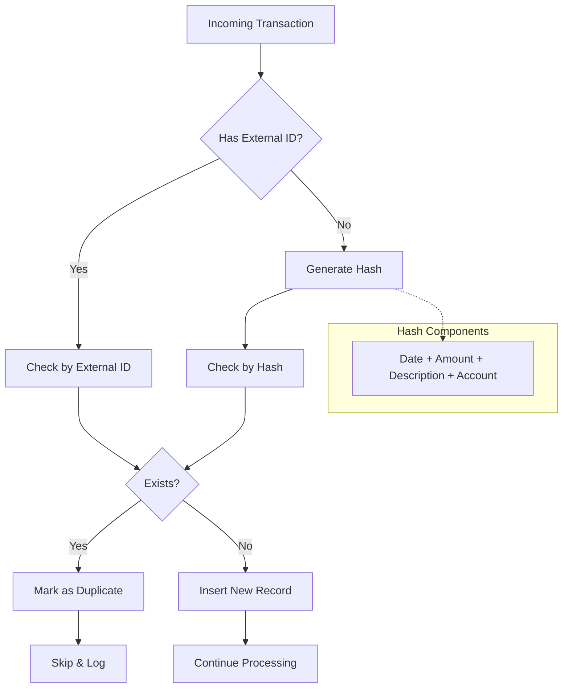

---

## DF004: Payroll Data Flow

### Overview
| Attribute | Value |
|-----------|-------|
| **Type** | Batch |
| **Source** | Staff + SimplePay |
| **Destination** | Payroll Items + SARS |
| **Throughput** | 50 staff/run |
| **Latency** | 8.5s |

### Transformation Pipeline

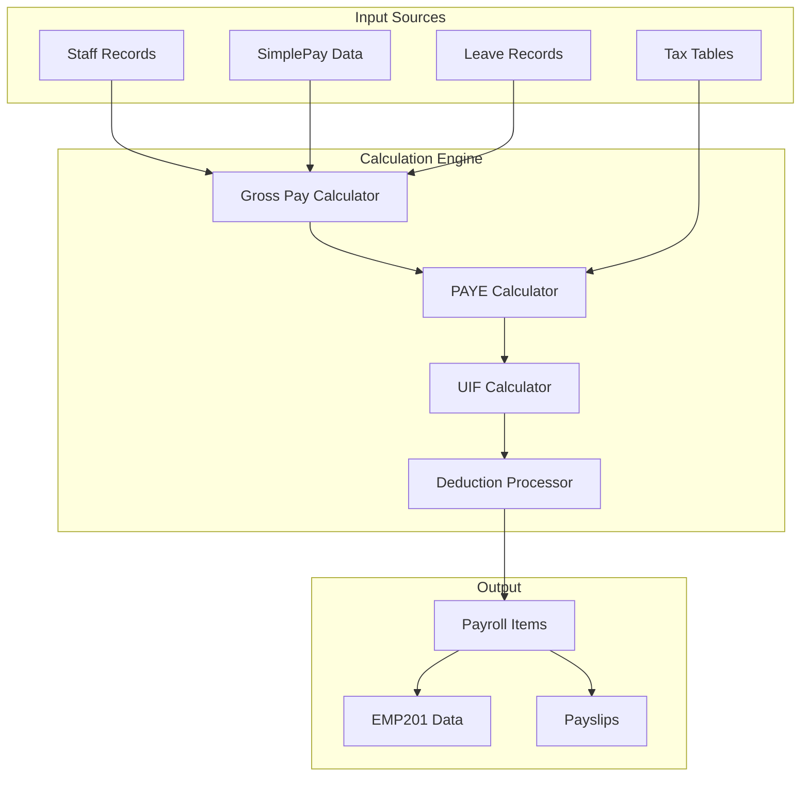

### Tax Calculation Flow

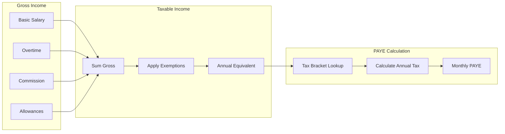

### SARS Data Aggregation

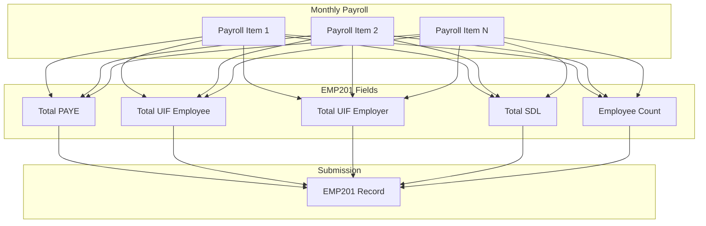

---

## DF005: Xero Sync Data Flow

### Overview
| Attribute | Value |
|-----------|-------|
| **Type** | Event-Driven |
| **Source** | CrecheBooks Invoice |
| **Destination** | Xero Invoice |
| **Throughput** | 500/day |
| **Latency** | 500ms |

### Bidirectional Sync

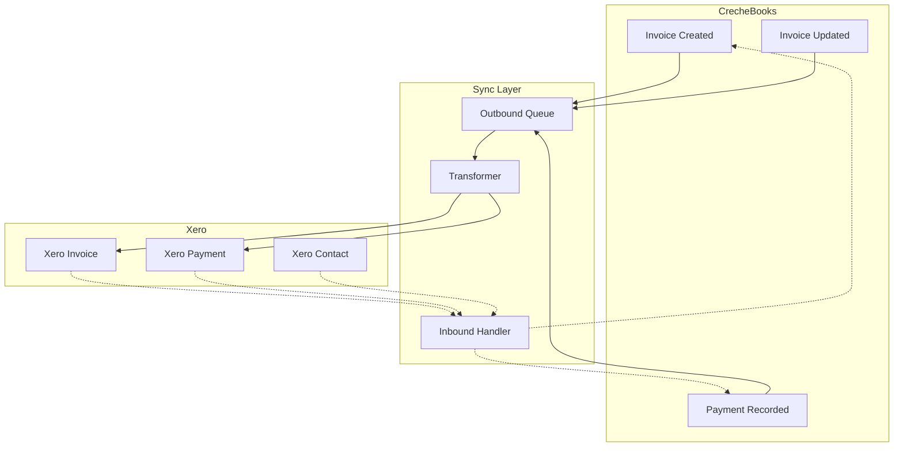

### Field Mapping

```
CrecheBooks Invoice → Xero Invoice:

{                                    {
  invoiceNumber → InvoiceNumber
  parentId → Contact.ContactID (via lookup)
  issueDate → Date
  dueDate → DueDate
  lineItems[] → LineItems[]
    - description → Description
    - amount → UnitAmount
    - quantity → Quantity
    - vatAmount → TaxAmount
  totalAmount → Total
  status → Status (mapped)
}
```

### Conflict Resolution

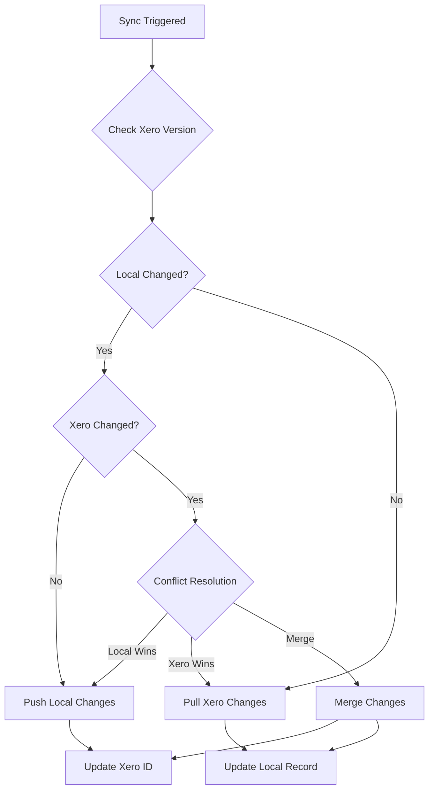

---

## DF006: Audit Trail Data Flow

### Overview
| Attribute | Value |
|-----------|-------|
| **Type** | Event-Driven |
| **Source** | All Mutations |
| **Destination** | Audit Log |
| **Throughput** | 10K/day |
| **Latency** | 50ms |

### Event Capture

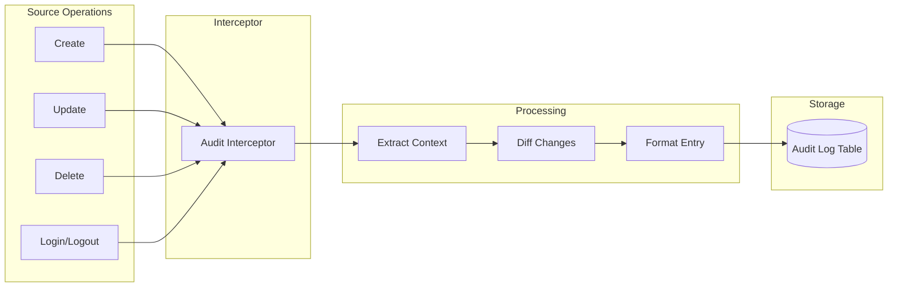

### Audit Entry Schema

```typescript
interface AuditLogEntry {
  id: string;
  timestamp: Date;
  tenantId: string;
  userId: string;
  userEmail: string;
  action: 'CREATE' | 'UPDATE' | 'DELETE' | 'LOGIN' | 'LOGOUT';
  entityType: string;
  entityId: string;
  previousValue?: Record<string, unknown>;
  newValue?: Record<string, unknown>;
  changes?: {
    field: string;
    from: unknown;
    to: unknown;
  }[];
  ipAddress?: string;
  userAgent?: string;
  metadata?: Record<string, unknown>;
}
```

### Retention Policy

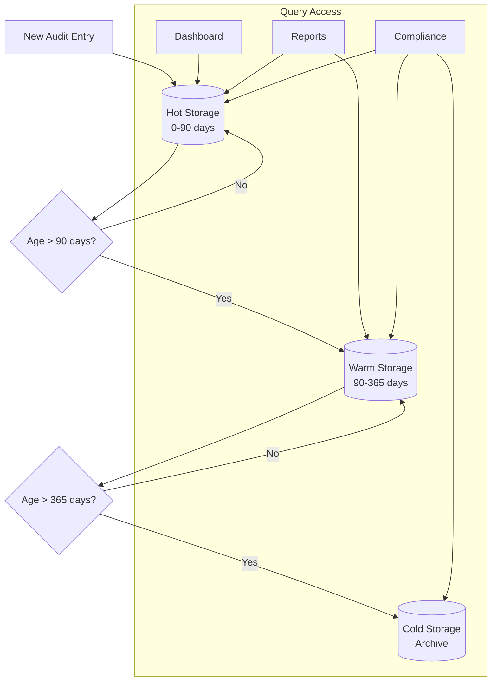

---

## Data Integrity Rules

### Referential Integrity

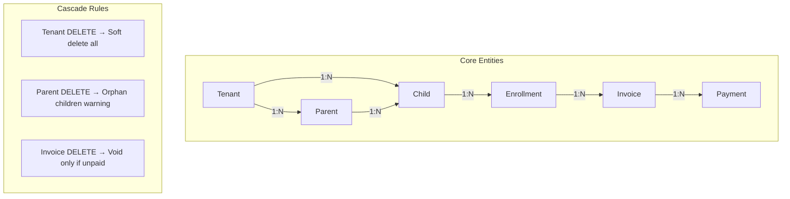

### Validation Rules

| Entity | Field | Rule | Error |
|--------|-------|------|-------|
| Invoice | amount | > 0 | "Amount must be positive" |
| Payment | amount | <= invoice.outstanding | "Exceeds balance" |
| Enrollment | endDate | >= startDate | "Invalid date range" |
| Staff | salary | >= minimum wage | "Below minimum" |

### Transaction Boundaries

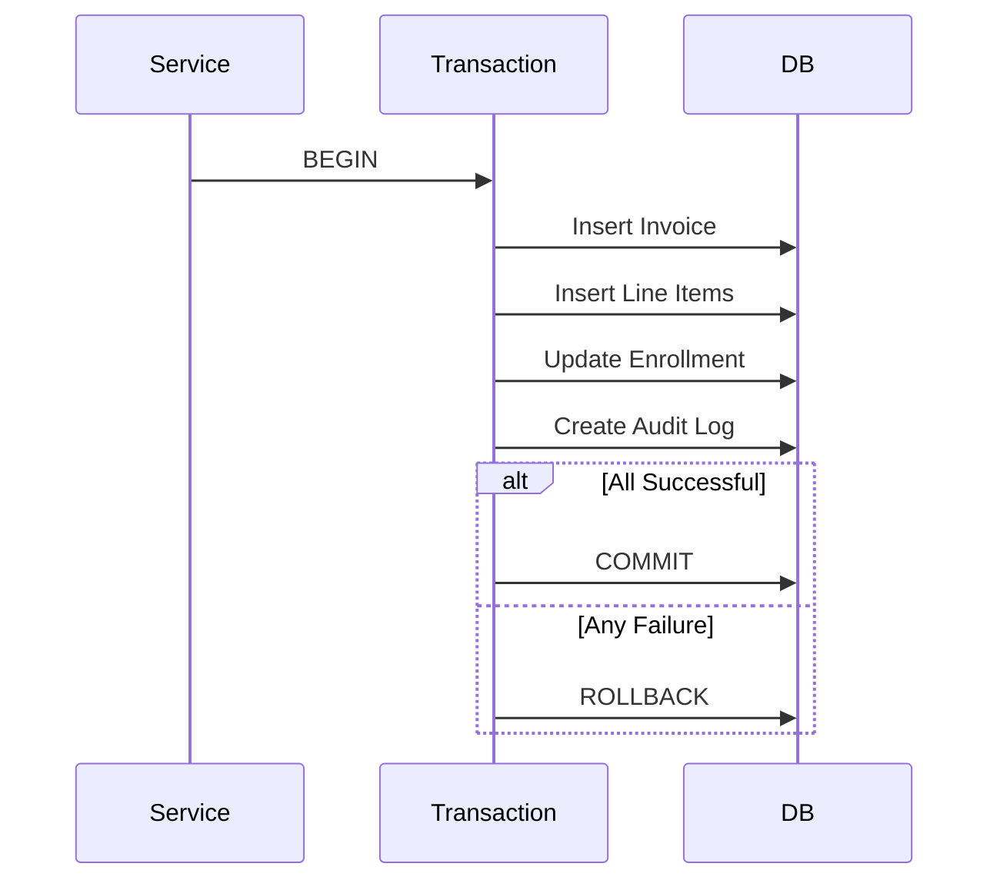

---

## Data Flow Metrics

### Throughput by Flow

| Flow | Daily Volume | Peak Rate | Avg Latency |
|------|--------------|-----------|-------------|
| DF001 Invoice | 500 | 100/min | 1.8s |
| DF002 Payment | 200 | 50/min | 450ms |
| DF003 Import | 30 | 5/min | 3s |
| DF004 Payroll | 2 | 1/run | 8.5s |
| DF005 Xero | 500 | 100/min | 500ms |
| DF006 Audit | 10K | 500/min | 50ms |

### Data Quality Metrics

```
━━━━━━━━━━━━━━━━━━━━━━━━━━━━━━━━━━━━━━━━━━━━━━━━━━━━
DATA QUALITY DASHBOARD
━━━━━━━━━━━━━━━━━━━━━━━━━━━━━━━━━━━━━━━━━━━━━━━━━━━━

Completeness:        98.5%
Accuracy:            99.2%
Consistency:         97.8%
Timeliness:          96.5%

Duplicate Rate:      0.3%
Validation Failures: 1.2%
Sync Conflicts:      0.1%

OVERALL SCORE: 97.4% ✅
━━━━━━━━━━━━━━━━━━━━━━━━━━━━━━━━━━━━━━━━━━━━━━━━━━━━
```
