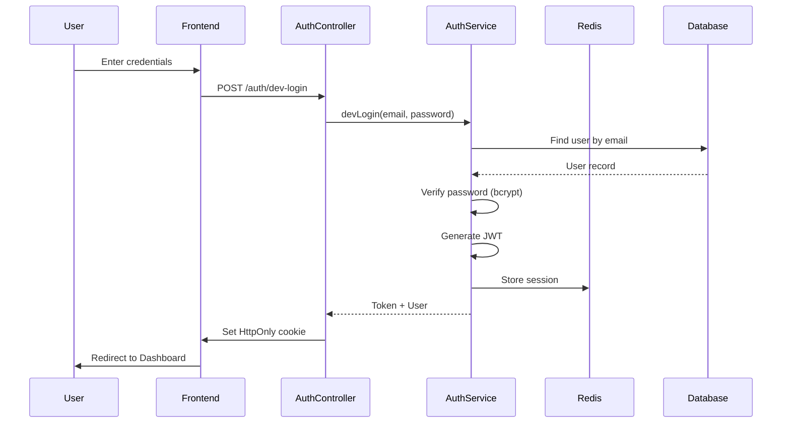
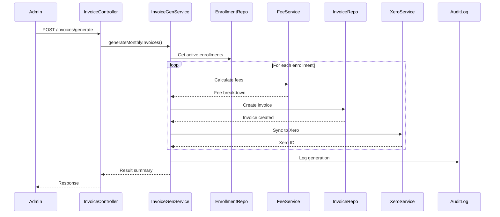
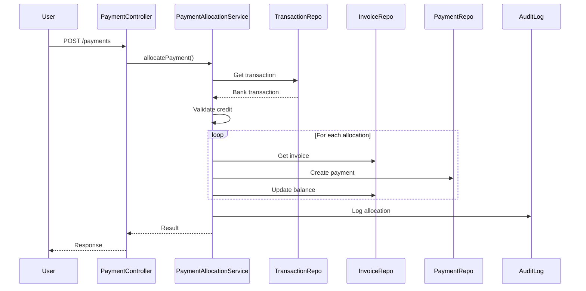
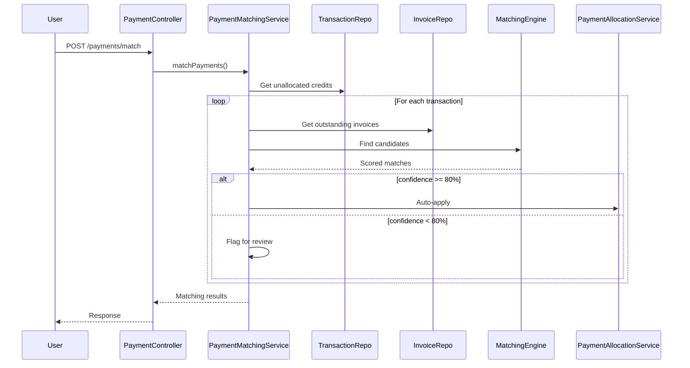
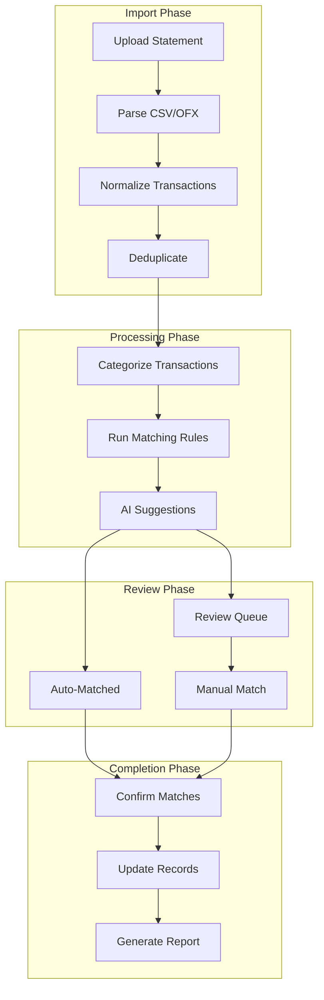
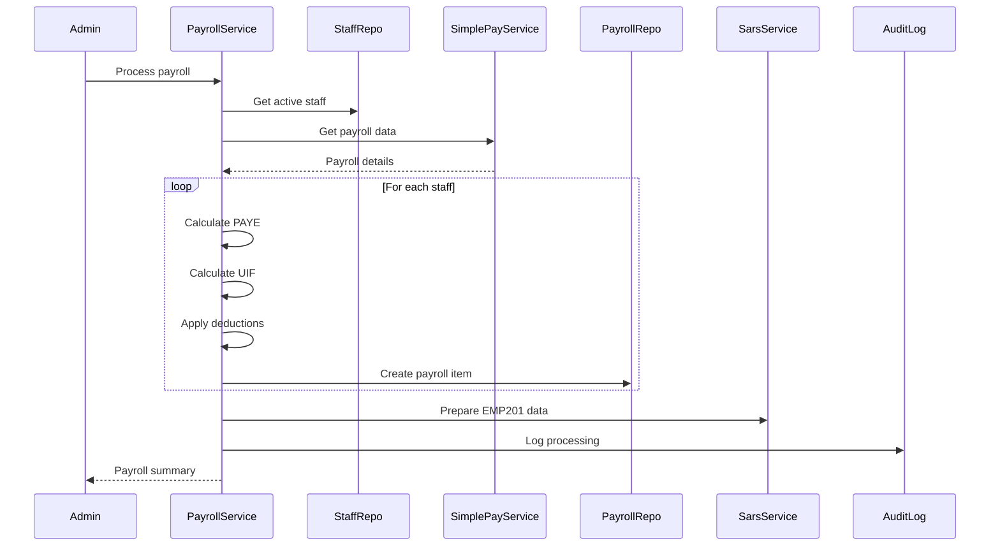
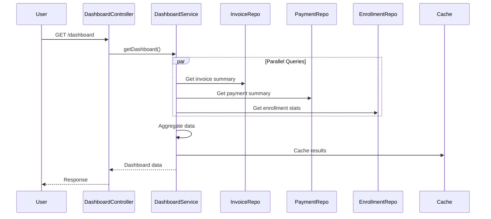

# Flow Inventory

> Complete inventory of all identified flows in the CrecheBooks system.

## Flow Summary

| ID | Name | Type | Source | Destination | Steps | Latency | Frequency | Confidence |
|----|------|------|--------|-------------|-------|---------|-----------|------------|
| F001 | User Authentication | control | LoginPage | Dashboard | 5 | 380ms | 1K/hr | 95% |
| F002 | Invoice Generation | process | Scheduler | Xero | 8 | 1.8s | 500/day | 92% |
| F003 | Payment Allocation | data | BankTxn | Invoice | 6 | 450ms | 200/day | 90% |
| F004 | Payment Matching | data | BankStmt | Payment | 7 | 520ms | 100/day | 88% |
| F005 | Reconciliation | process | Import | Report | 9 | 4.2s | 50/day | 85% |
| F006 | Payroll Processing | process | Trigger | SimplePay | 10 | 8.5s | 2/month | 90% |
| F007 | SARS EMP201 | process | Payroll | SARS | 6 | 25s | 1/month | 92% |
| F008 | SARS VAT201 | process | Invoices | SARS | 5 | 20s | 1/month | 92% |
| F009 | Parent Creation | data | Form | Database | 4 | 200ms | 50/day | 95% |
| F010 | Child Enrollment | data | Form | Database | 5 | 300ms | 30/day | 95% |
| F011 | Invoice PDF Gen | data | Invoice | PDF | 4 | 800ms | 500/day | 93% |
| F012 | Payment Receipt | data | Payment | PDF | 4 | 600ms | 200/day | 93% |
| F013 | Arrears Report | data | Invoices | Report | 5 | 1.2s | 20/day | 90% |
| F014 | Dashboard Load | data | Database | UI | 6 | 1.5s | 2K/day | 88% |
| F015 | Staff Onboarding | process | Form | SimplePay | 7 | 2s | 5/month | 85% |
| F016 | Staff Offboarding | process | Trigger | SimplePay | 6 | 1.5s | 2/month | 85% |
| F017 | Leave Request | data | Form | Database | 4 | 250ms | 10/day | 95% |
| F018 | Fee Structure | data | Settings | Enrollment | 3 | 150ms | 5/month | 95% |
| F019 | Adhoc Charge | data | Form | Invoice | 4 | 300ms | 20/day | 93% |
| F020 | Invoice Send | event | Trigger | Email | 5 | 2s | 500/day | 88% |
| F021 | Token Refresh | control | Cookie | JWT | 3 | 100ms | 5K/day | 95% |
| F022 | Tenant Context | control | JWT | Request | 2 | 20ms | 50K/day | 98% |
| F023 | RBAC Check | control | Request | Guard | 3 | 30ms | 50K/day | 98% |
| F024 | Audit Logging | event | Mutation | AuditLog | 2 | 50ms | 10K/day | 95% |
| F025 | Xero Sync | event | Invoice | Xero | 5 | 1.5s | 500/day | 85% |
| F026 | SimplePay Webhook | event | SimplePay | Database | 4 | 500ms | 50/month | 88% |
| F027 | Bank Import | data | CSV/OFX | Database | 6 | 3s | 30/day | 85% |
| F028 | Transaction Split | data | BankTxn | Categories | 4 | 200ms | 50/day | 90% |

---

## Detailed Flow Specifications

### F001: User Authentication Flow

**Pathway Details:**
| Step | Component | Latency | Confidence |
|------|-----------|---------|------------|
| 1 | Frontend Form | 0ms | 100% |
| 2 | AuthController | 20ms | 100% |
| 3 | AuthService.devLogin | 50ms | 95% |
| 4 | Database Query | 150ms | 100% |
| 5 | JWT Generation | 30ms | 100% |
| 6 | Redis Session | 50ms | 95% |
| 7 | Cookie Set | 10ms | 100% |
| 8 | Redirect | 70ms | 100% |

**Total Latency:** 380ms
**Criticality:** CRITICAL (0.94)
**Error Paths:** invalid_credentials, account_locked, rate_limited

---

### F002: Invoice Generation Flow

**Pathway Details:**
| Step | Component | Latency | Confidence |
|------|-----------|---------|------------|
| 1 | Request Validation | 30ms | 100% |
| 2 | Get Enrollments | 200ms | 95% |
| 3 | Fee Calculation (per child) | 50ms | 90% |
| 4 | Invoice Creation | 100ms | 95% |
| 5 | Xero Sync | 500ms | 85% |
| 6 | Audit Log | 50ms | 95% |

**Total Latency:** ~1.8s (varies with child count)
**Criticality:** CRITICAL (0.92)
**Error Paths:** no_active_enrollments, xero_api_error, duplicate_invoice

---

### F003: Payment Allocation Flow

**Pathway Details:**
| Step | Component | Latency | Confidence |
|------|-----------|---------|------------|
| 1 | Request Validation | 20ms | 100% |
| 2 | Get Transaction | 100ms | 95% |
| 3 | Validate Credit | 10ms | 100% |
| 4 | Get Invoice | 80ms | 95% |
| 5 | Create Payment | 100ms | 95% |
| 6 | Update Invoice | 80ms | 95% |
| 7 | Audit Log | 50ms | 95% |

**Total Latency:** 450ms
**Criticality:** HIGH (0.85)
**Error Paths:** transaction_not_found, invoice_not_found, amount_exceeds_balance

---

### F004: Payment Matching Flow

**Matching Algorithm:**
1. **Exact Reference Match** (100% confidence)
   - Invoice number in transaction description
2. **Parent Name Match** (80-95% confidence)
   - Parent surname in transaction reference
3. **Amount Match** (60-80% confidence)
   - Transaction amount = invoice outstanding
4. **Fuzzy Match** (40-60% confidence)
   - Partial matches, date proximity

---

### F005: Reconciliation Flow

---

### F006: Payroll Processing Flow

---

### F014: Dashboard Load Flow

**Bottleneck:** Multiple sequential database queries
**Optimization:** Parallel queries + Redis caching

---

## Flow Categories

### Data Flows (10)
Flows that transform and move data through the system.

| ID | Name | Source | Destination |
|----|------|--------|-------------|
| F003 | Payment Allocation | BankTxn | Invoice |
| F004 | Payment Matching | BankStmt | Payment |
| F009 | Parent Creation | Form | Database |
| F010 | Child Enrollment | Form | Database |
| F011 | Invoice PDF Gen | Invoice | PDF |
| F012 | Payment Receipt | Payment | PDF |
| F013 | Arrears Report | Invoices | Report |
| F017 | Leave Request | Form | Database |
| F027 | Bank Import | CSV/OFX | Database |
| F028 | Transaction Split | BankTxn | Categories |

### Control Flows (6)
Flows that manage execution paths and access.

| ID | Name | Purpose |
|----|------|---------|
| F001 | Authentication | User identity verification |
| F021 | Token Refresh | Session maintenance |
| F022 | Tenant Context | Multi-tenant isolation |
| F023 | RBAC Check | Permission enforcement |
| F018 | Fee Structure | Configuration management |
| F019 | Adhoc Charge | Invoice modification |

### Process Flows (5)
Business process orchestration flows.

| ID | Name | Trigger | Outcome |
|----|------|---------|---------|
| F002 | Invoice Generation | Monthly/Manual | Invoices created |
| F005 | Reconciliation | Statement import | Matched payments |
| F006 | Payroll Processing | Monthly | Payroll run |
| F015 | Staff Onboarding | New hire | SimplePay employee |
| F016 | Staff Offboarding | Termination | Deactivated |

### Event Flows (4)
Flows triggered by system or external events.

| ID | Name | Trigger | Handler |
|----|------|---------|---------|
| F020 | Invoice Send | Generation/Manual | Email service |
| F024 | Audit Logging | Any mutation | Audit log |
| F025 | Xero Sync | Invoice creation | Xero API |
| F026 | SimplePay Webhook | Payroll processed | Database |

### User Flows (3)
End-user journey flows.

| ID | Name | Entry | Goal |
|----|------|-------|------|
| F007 | SARS EMP201 | Dashboard | Tax submission |
| F008 | SARS VAT201 | Dashboard | Tax submission |
| F014 | Dashboard Load | Login | Overview display |
