# Integration Flows

> External service interactions and API integrations in CrecheBooks.

## Integration Architecture Overview

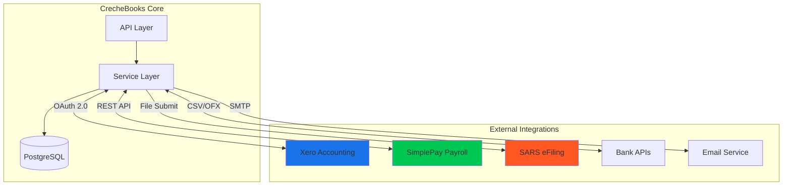
```mermaid
graph TB
    subgraph "CrecheBooks Core"
        API[API Layer]
        SVC[Service Layer]
        DB[(PostgreSQL)]
    end

    subgraph "External Integrations"
        XERO[Xero Accounting]
        SP[SimplePay Payroll]
        SARS[SARS eFiling]
        BANK[Bank APIs]
        EMAIL[Email Service]
    end

    API --> SVC
    SVC --> DB

    SVC <-->|OAuth 2.0| XERO
    SVC <-->|REST API| SP
    SVC -->|File Submit| SARS
    SVC <-->|CSV/OFX| BANK
    SVC -->|SMTP| EMAIL

    style XERO fill:#1a73e8
    style SP fill:#00c853
    style SARS fill:#ff5722
```

---

## INT001: Xero Integration

### Overview
| Attribute | Value |
|-----------|-------|
| **Type** | Accounting Sync |
| **Protocol** | OAuth 2.0 + REST |
| **Direction** | Bidirectional |
| **Frequency** | Real-time |
| **Rate Limit** | 60 calls/minute |

### OAuth Flow

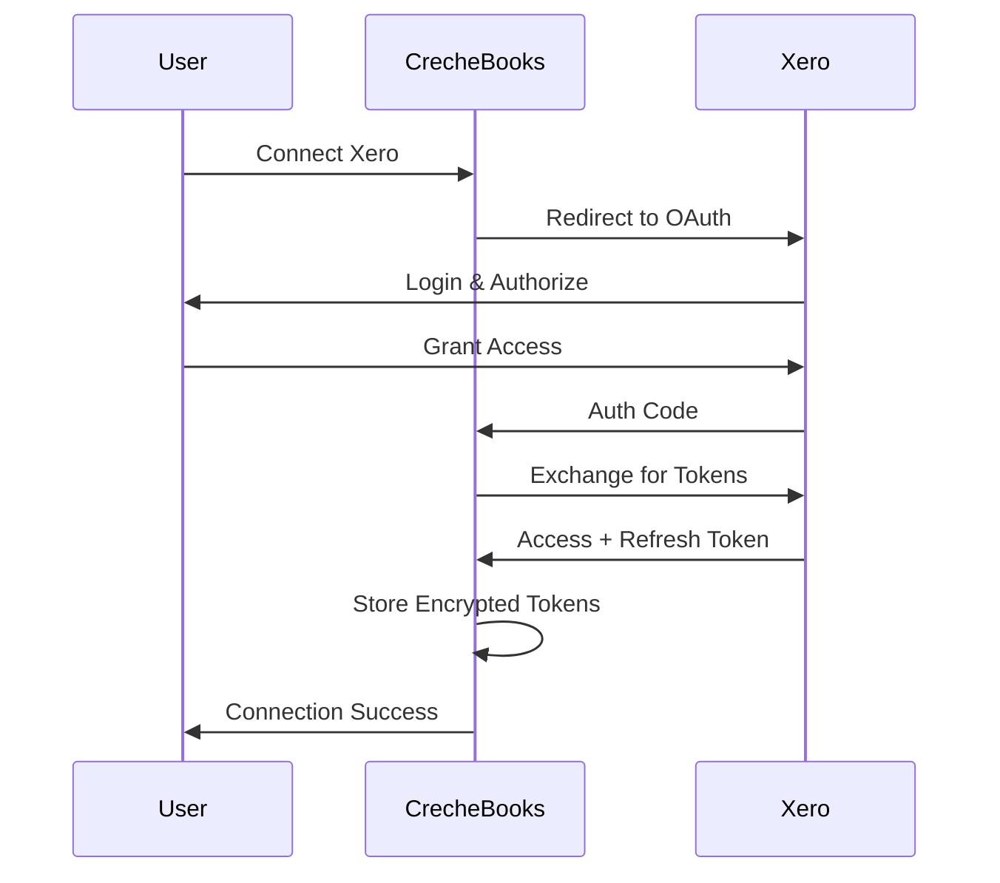
```mermaid
sequenceDiagram
    participant User
    participant CrecheBooks
    participant Xero

    User->>CrecheBooks: Connect Xero
    CrecheBooks->>Xero: Redirect to OAuth
    Xero->>User: Login & Authorize
    User->>Xero: Grant Access
    Xero->>CrecheBooks: Auth Code
    CrecheBooks->>Xero: Exchange for Tokens
    Xero->>CrecheBooks: Access + Refresh Token
    CrecheBooks->>CrecheBooks: Store Encrypted Tokens
    CrecheBooks->>User: Connection Success
```

### Token Refresh Flow

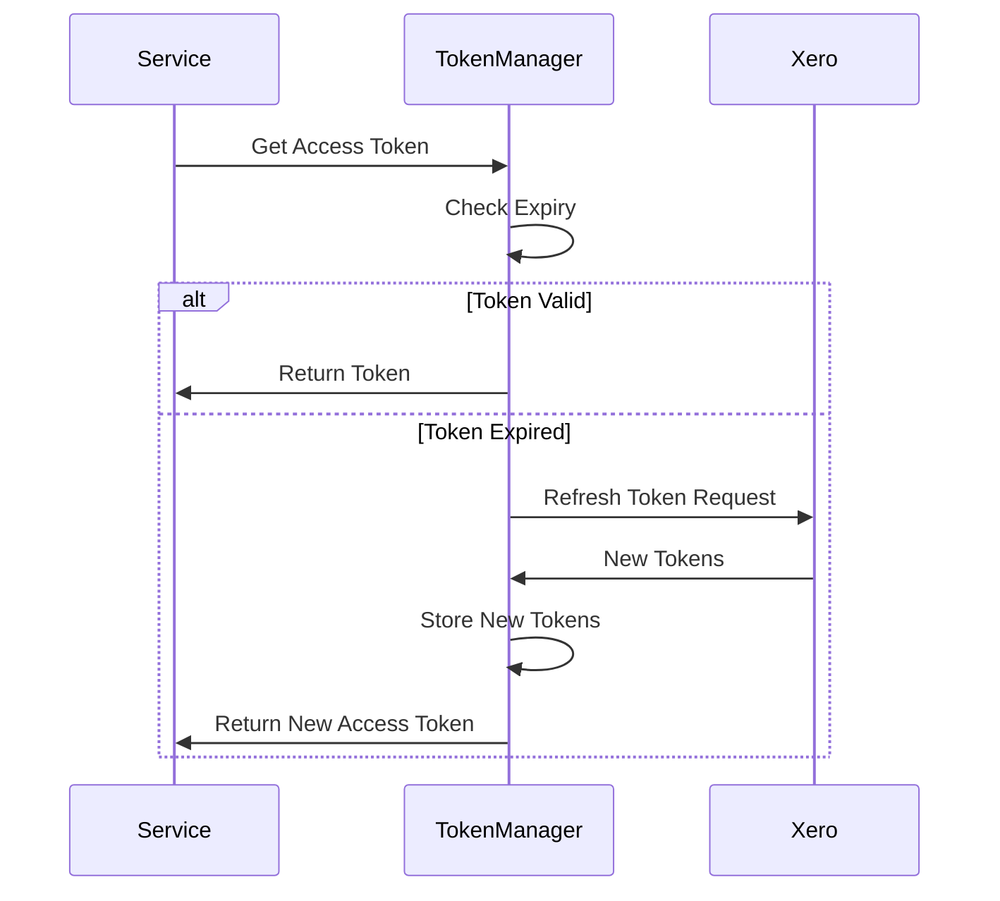
```mermaid
sequenceDiagram
    participant Service
    participant TokenManager
    participant Xero

    Service->>TokenManager: Get Access Token
    TokenManager->>TokenManager: Check Expiry

    alt Token Valid
        TokenManager->>Service: Return Token
    else Token Expired
        TokenManager->>Xero: Refresh Token Request
        Xero->>TokenManager: New Tokens
        TokenManager->>TokenManager: Store New Tokens
        TokenManager->>Service: Return New Access Token
    end
```

### Data Sync Operations

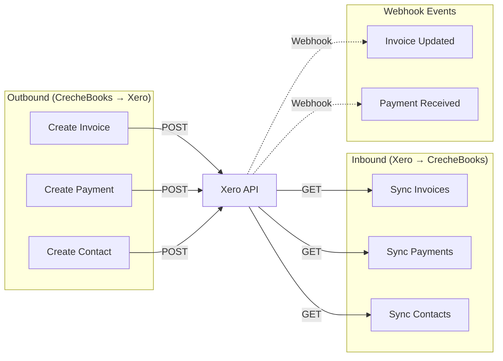
```mermaid
graph LR
    subgraph "Outbound (CrecheBooks → Xero)"
        O1[Create Invoice]
        O2[Create Payment]
        O3[Create Contact]
    end

    subgraph "Inbound (Xero → CrecheBooks)"
        I1[Sync Invoices]
        I2[Sync Payments]
        I3[Sync Contacts]
    end

    subgraph "Webhook Events"
        W1[Invoice Updated]
        W2[Payment Received]
    end

    O1 -->|POST| X[Xero API]
    O2 -->|POST| X
    O3 -->|POST| X

    X -->|GET| I1
    X -->|GET| I2
    X -->|GET| I3

    X -.->|Webhook| W1
    X -.->|Webhook| W2
```

### API Endpoints Used

| Endpoint | Method | Purpose |
|----------|--------|---------|
| `/Invoices` | POST | Create invoice |
| `/Invoices/{id}` | PUT | Update invoice |
| `/Invoices` | GET | Fetch invoices |
| `/Payments` | POST | Record payment |
| `/Contacts` | POST/GET | Manage contacts |
| `/Connections` | GET | Verify connection |

### Error Handling

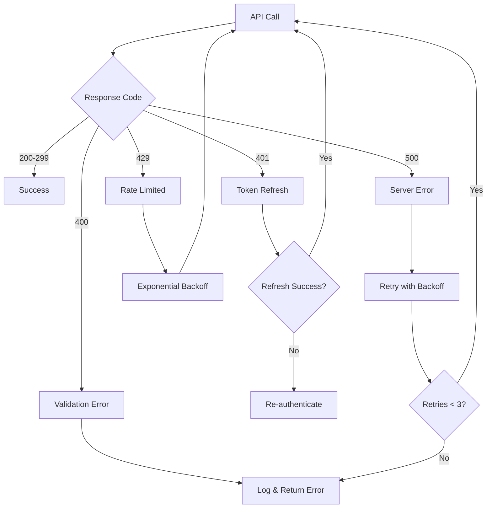
```mermaid
flowchart TB
    A[API Call] --> B{Response Code}

    B -->|200-299| C[Success]
    B -->|401| D[Token Refresh]
    B -->|429| E[Rate Limited]
    B -->|400| F[Validation Error]
    B -->|500| G[Server Error]

    D --> H{Refresh Success?}
    H -->|Yes| A
    H -->|No| I[Re-authenticate]

    E --> J[Exponential Backoff]
    J --> A

    F --> K[Log & Return Error]
    G --> L[Retry with Backoff]
    L --> M{Retries < 3?}
    M -->|Yes| A
    M -->|No| K
```

### Circuit Breaker Pattern (Needed)

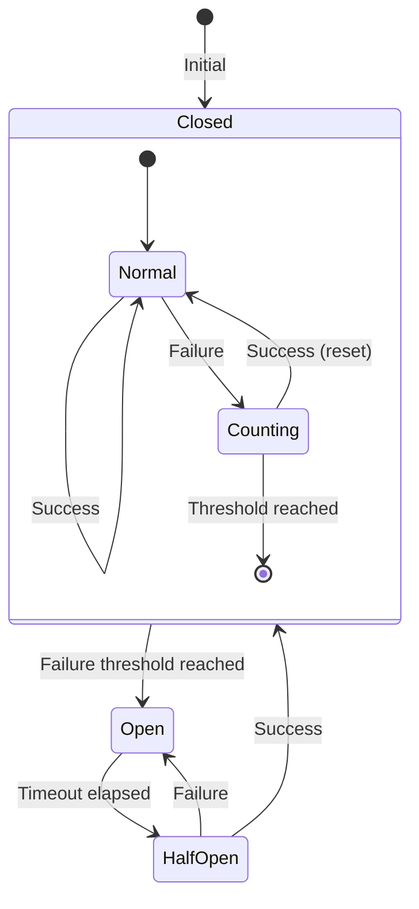
```mermaid
stateDiagram-v2
    [*] --> Closed: Initial
    Closed --> Open: Failure threshold reached
    Open --> HalfOpen: Timeout elapsed
    HalfOpen --> Closed: Success
    HalfOpen --> Open: Failure

    state Closed {
        [*] --> Normal
        Normal --> Normal: Success
        Normal --> Counting: Failure
        Counting --> Normal: Success (reset)
        Counting --> [*]: Threshold reached
    }
```

---

## INT002: SimplePay Integration

### Overview
| Attribute | Value |
|-----------|-------|
| **Type** | Payroll Management |
| **Protocol** | REST API |
| **Direction** | Bidirectional |
| **Frequency** | On-demand + Webhooks |
| **Auth** | API Key |

### Connection Architecture

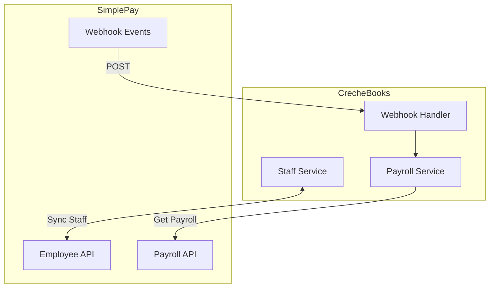
```mermaid
graph TB
    subgraph "CrecheBooks"
        SS[Staff Service]
        PS[Payroll Service]
        WH[Webhook Handler]
    end

    subgraph "SimplePay"
        EA[Employee API]
        PA[Payroll API]
        WE[Webhook Events]
    end

    SS <-->|Sync Staff| EA
    PS -->|Get Payroll| PA
    WE -->|POST| WH
    WH --> PS
```

### Staff Synchronization

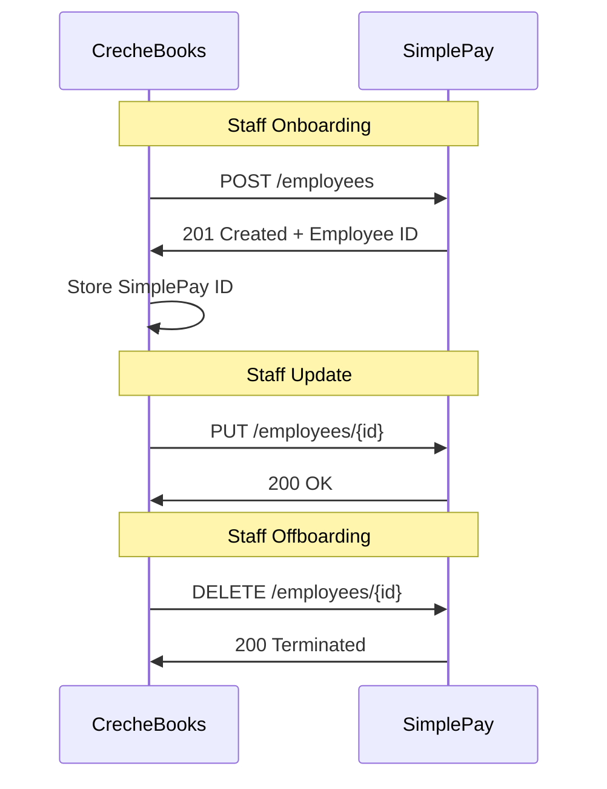
```mermaid
sequenceDiagram
    participant CrecheBooks
    participant SimplePay

    Note over CrecheBooks,SimplePay: Staff Onboarding
    CrecheBooks->>SimplePay: POST /employees
    SimplePay->>CrecheBooks: 201 Created + Employee ID
    CrecheBooks->>CrecheBooks: Store SimplePay ID

    Note over CrecheBooks,SimplePay: Staff Update
    CrecheBooks->>SimplePay: PUT /employees/{id}
    SimplePay->>CrecheBooks: 200 OK

    Note over CrecheBooks,SimplePay: Staff Offboarding
    CrecheBooks->>SimplePay: DELETE /employees/{id}
    SimplePay->>CrecheBooks: 200 Terminated
```

### Payroll Data Retrieval

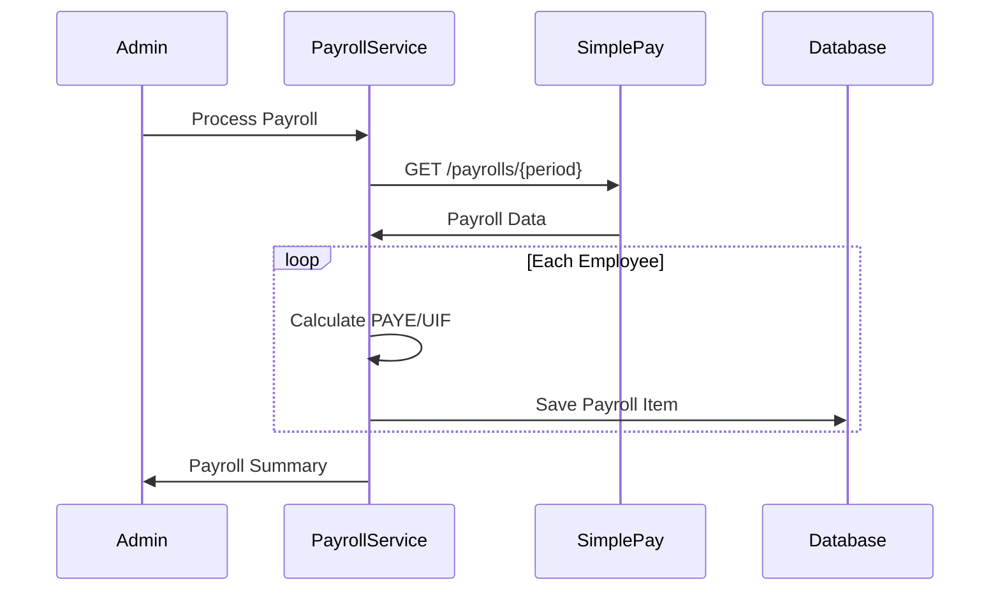
```mermaid
sequenceDiagram
    participant Admin
    participant PayrollService
    participant SimplePay
    participant Database

    Admin->>PayrollService: Process Payroll
    PayrollService->>SimplePay: GET /payrolls/{period}
    SimplePay->>PayrollService: Payroll Data

    loop Each Employee
        PayrollService->>PayrollService: Calculate PAYE/UIF
        PayrollService->>Database: Save Payroll Item
    end

    PayrollService->>Admin: Payroll Summary
```

### Webhook Processing

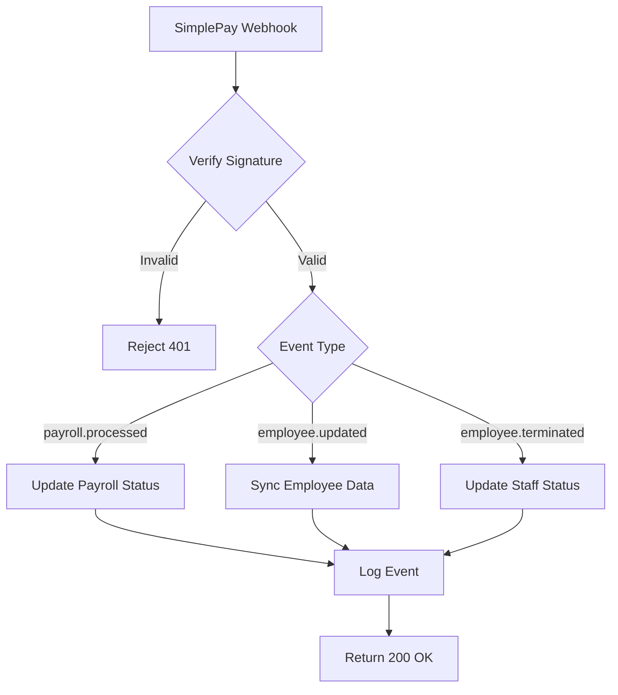
```mermaid
flowchart TB
    A[SimplePay Webhook] --> B{Verify Signature}
    B -->|Invalid| C[Reject 401]
    B -->|Valid| D{Event Type}

    D -->|payroll.processed| E[Update Payroll Status]
    D -->|employee.updated| F[Sync Employee Data]
    D -->|employee.terminated| G[Update Staff Status]

    E --> H[Log Event]
    F --> H
    G --> H

    H --> I[Return 200 OK]
```

### Data Mapping

```
SimplePay Employee → CrecheBooks Staff:

{
  "employee_id" → simplePayId
  "first_name" → firstName
  "last_name" → lastName
  "id_number" → idNumber
  "tax_number" → taxNumber
  "start_date" → startDate
  "salary" → basicSalary
  "department" → department
  "position" → position
}
```

---

## INT003: SARS eFiling Integration

### Overview
| Attribute | Value |
|-----------|-------|
| **Type** | Tax Submission |
| **Protocol** | File Upload / API |
| **Direction** | Outbound |
| **Frequency** | Monthly |
| **Auth** | Client Credentials |

### EMP201 Submission Flow

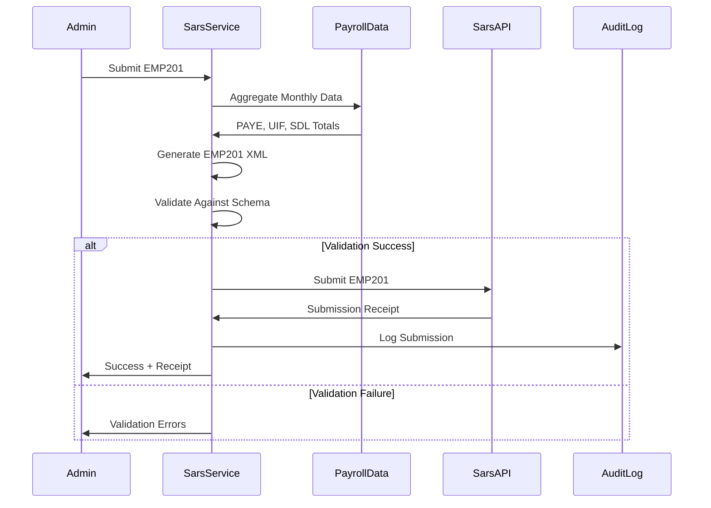
```mermaid
sequenceDiagram
    participant Admin
    participant SarsService
    participant PayrollData
    participant SarsAPI
    participant AuditLog

    Admin->>SarsService: Submit EMP201
    SarsService->>PayrollData: Aggregate Monthly Data
    PayrollData->>SarsService: PAYE, UIF, SDL Totals

    SarsService->>SarsService: Generate EMP201 XML
    SarsService->>SarsService: Validate Against Schema

    alt Validation Success
        SarsService->>SarsAPI: Submit EMP201
        SarsAPI->>SarsService: Submission Receipt
        SarsService->>AuditLog: Log Submission
        SarsService->>Admin: Success + Receipt
    else Validation Failure
        SarsService->>Admin: Validation Errors
    end
```

### VAT201 Submission Flow

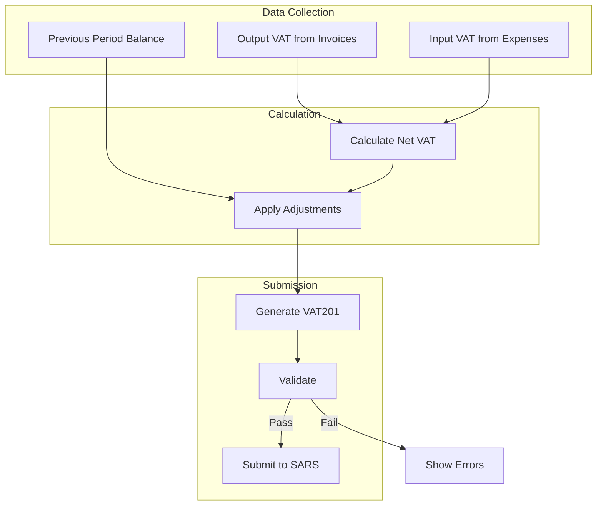
```mermaid
graph TB
    subgraph "Data Collection"
        A[Output VAT from Invoices]
        B[Input VAT from Expenses]
        C[Previous Period Balance]
    end

    subgraph "Calculation"
        D[Calculate Net VAT]
        E[Apply Adjustments]
    end

    subgraph "Submission"
        F[Generate VAT201]
        G[Validate]
        H[Submit to SARS]
    end

    A --> D
    B --> D
    C --> E
    D --> E
    E --> F
    F --> G
    G -->|Pass| H
    G -->|Fail| I[Show Errors]
```

### EMP201 Data Structure

```xml
<EMP201>
  <Header>
    <SubmissionPeriod>202601</SubmissionPeriod>
    <TaxYear>2026</TaxYear>
    <EmployerTaxRef>1234567890</EmployerTaxRef>
  </Header>
  <Summary>
    <TotalEmployees>25</TotalEmployees>
    <TotalPAYE>45000.00</TotalPAYE>
    <TotalUIF>3750.00</TotalUIF>
    <TotalSDL>2500.00</TotalSDL>
    <TotalLiability>51250.00</TotalLiability>
  </Summary>
  <Declaration>
    <DeclarantName>John Doe</DeclarantName>
    <DeclarationDate>2026-02-07</DeclarationDate>
  </Declaration>
</EMP201>
```

### Submission Status Tracking

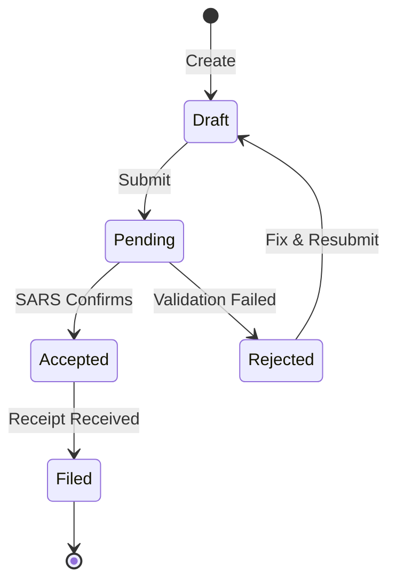
```mermaid
stateDiagram-v2
    [*] --> Draft: Create
    Draft --> Pending: Submit
    Pending --> Accepted: SARS Confirms
    Pending --> Rejected: Validation Failed
    Rejected --> Draft: Fix & Resubmit
    Accepted --> Filed: Receipt Received
    Filed --> [*]
```

---

## INT004: Bank Integration

### Overview
| Attribute | Value |
|-----------|-------|
| **Type** | Transaction Import |
| **Protocol** | File Upload (CSV/OFX) |
| **Direction** | Inbound |
| **Frequency** | Daily/Weekly |
| **Future** | Open Banking API |

### Import Flow

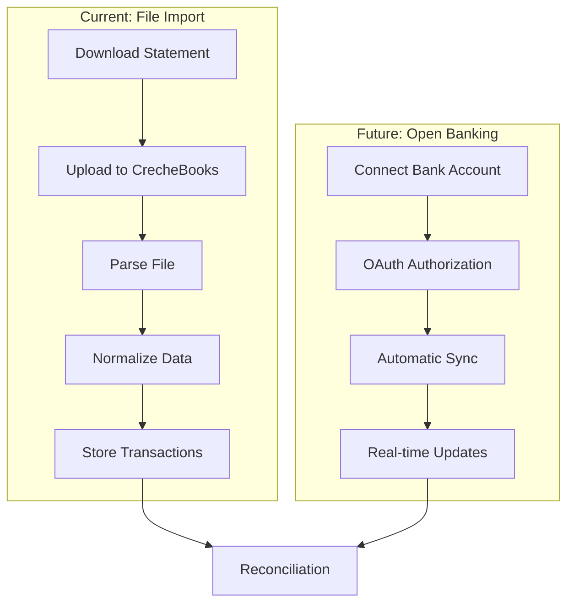
```mermaid
flowchart TB
    subgraph "Current: File Import"
        A1[Download Statement] --> A2[Upload to CrecheBooks]
        A2 --> A3[Parse File]
        A3 --> A4[Normalize Data]
        A4 --> A5[Store Transactions]
    end

    subgraph "Future: Open Banking"
        B1[Connect Bank Account]
        B2[OAuth Authorization]
        B3[Automatic Sync]
        B4[Real-time Updates]

        B1 --> B2 --> B3 --> B4
    end

    A5 --> C[Reconciliation]
    B4 --> C
```

### Multi-Bank Parser

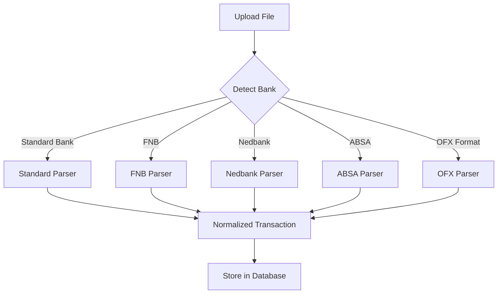
```mermaid
graph TB
    A[Upload File] --> B{Detect Bank}

    B -->|Standard Bank| C[Standard Parser]
    B -->|FNB| D[FNB Parser]
    B -->|Nedbank| E[Nedbank Parser]
    B -->|ABSA| F[ABSA Parser]
    B -->|OFX Format| G[OFX Parser]

    C --> H[Normalized Transaction]
    D --> H
    E --> H
    F --> H
    G --> H

    H --> I[Store in Database]
```

### Bank Format Specifications

| Bank | Format | Date Format | Amount Format |
|------|--------|-------------|---------------|
| Standard Bank | CSV | YYYY/MM/DD | Decimal |
| FNB | CSV | DD/MM/YYYY | Decimal |
| Nedbank | CSV | YYYY-MM-DD | Decimal |
| ABSA | CSV | DD MMM YYYY | Decimal |
| Generic | OFX | YYYYMMDD | Integer (cents) |

---

## INT005: Email Service Integration

### Overview
| Attribute | Value |
|-----------|-------|
| **Type** | Notification |
| **Protocol** | SMTP / API |
| **Direction** | Outbound |
| **Frequency** | Event-driven |
| **Provider** | Configurable |

### Email Queue Architecture

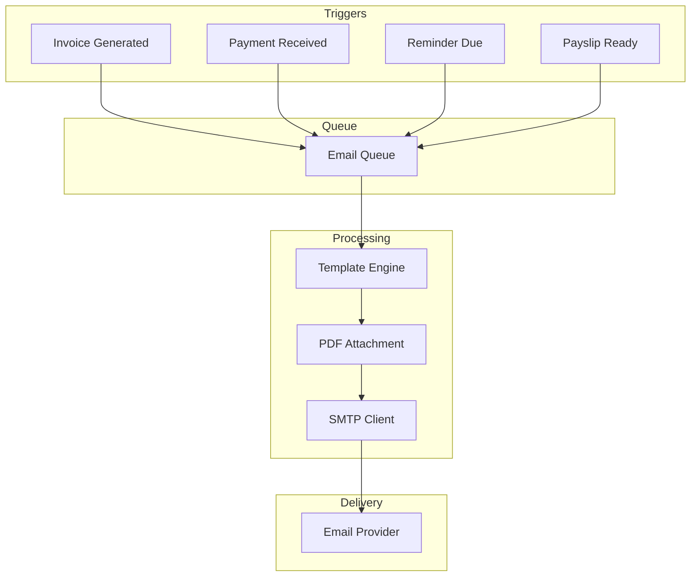
```mermaid
graph TB
    subgraph "Triggers"
        T1[Invoice Generated]
        T2[Payment Received]
        T3[Reminder Due]
        T4[Payslip Ready]
    end

    subgraph "Queue"
        Q[Email Queue]
    end

    subgraph "Processing"
        P1[Template Engine]
        P2[PDF Attachment]
        P3[SMTP Client]
    end

    subgraph "Delivery"
        D[Email Provider]
    end

    T1 --> Q
    T2 --> Q
    T3 --> Q
    T4 --> Q

    Q --> P1
    P1 --> P2
    P2 --> P3
    P3 --> D
```

### Email Templates

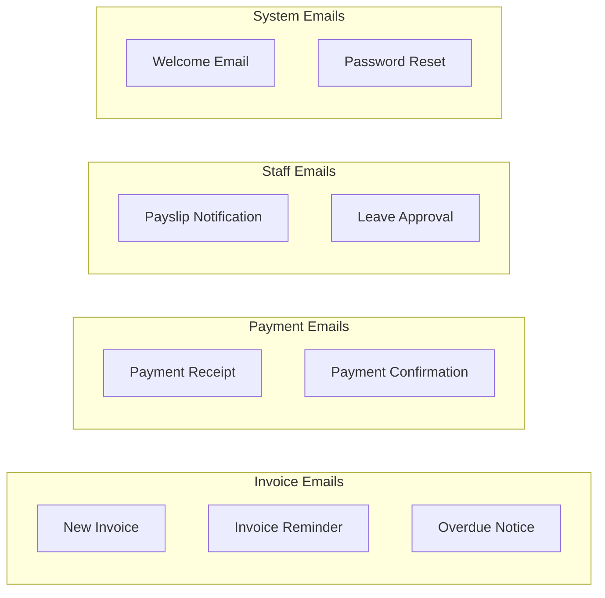
```mermaid
graph LR
    subgraph "Invoice Emails"
        I1[New Invoice]
        I2[Invoice Reminder]
        I3[Overdue Notice]
    end

    subgraph "Payment Emails"
        P1[Payment Receipt]
        P2[Payment Confirmation]
    end

    subgraph "Staff Emails"
        S1[Payslip Notification]
        S2[Leave Approval]
    end

    subgraph "System Emails"
        Y1[Welcome Email]
        Y2[Password Reset]
    end
```

### Delivery Tracking

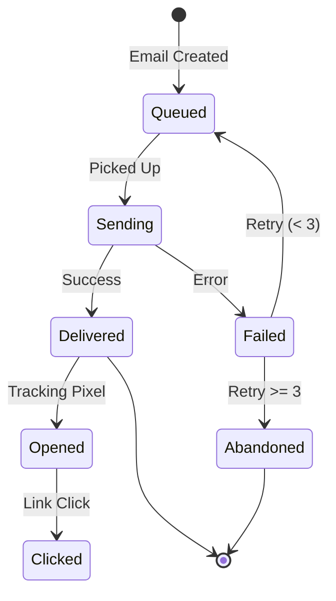
```mermaid
stateDiagram-v2
    [*] --> Queued: Email Created
    Queued --> Sending: Picked Up
    Sending --> Delivered: Success
    Sending --> Failed: Error
    Failed --> Queued: Retry (< 3)
    Failed --> Abandoned: Retry >= 3
    Delivered --> Opened: Tracking Pixel
    Opened --> Clicked: Link Click
    Delivered --> [*]
    Abandoned --> [*]
```

---

## Integration Health Dashboard

### Current Status

```
━━━━━━━━━━━━━━━━━━━━━━━━━━━━━━━━━━━━━━━━━━━━━━━━━━━━
INTEGRATION HEALTH STATUS
━━━━━━━━━━━━━━━━━━━━━━━━━━━━━━━━━━━━━━━━━━━━━━━━━━━━

Xero Accounting:     ✅ CONNECTED (Token valid for 28 min)
SimplePay Payroll:   ✅ CONNECTED (Last sync: 2h ago)
SARS eFiling:        ⚠️ PENDING (EMP201 due in 5 days)
Bank Import:         ✅ READY (Last import: 1 day ago)
Email Service:       ✅ HEALTHY (Queue: 0 pending)

━━━━━━━━━━━━━━━━━━━━━━━━━━━━━━━━━━━━━━━━━━━━━━━━━━━━
```

### API Call Metrics (Last 24h)

| Integration | Calls | Success Rate | Avg Latency |
|-------------|-------|--------------|-------------|
| Xero | 1,250 | 99.8% | 450ms |
| SimplePay | 85 | 100% | 320ms |
| Email | 520 | 99.2% | 180ms |

### Error Distribution

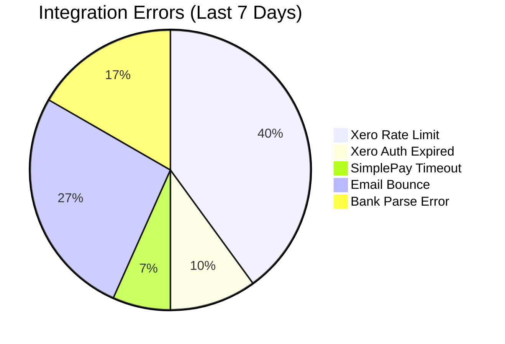
```mermaid
pie title Integration Errors (Last 7 Days)
    "Xero Rate Limit" : 12
    "Xero Auth Expired" : 3
    "SimplePay Timeout" : 2
    "Email Bounce" : 8
    "Bank Parse Error" : 5
```

---

## Security Considerations

### Credential Management

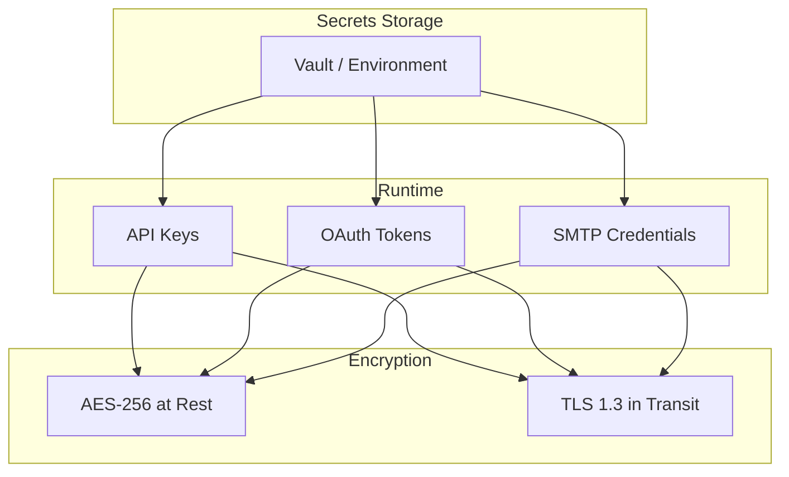
```mermaid
graph TB
    subgraph "Secrets Storage"
        V[Vault / Environment]
    end

    subgraph "Runtime"
        A[API Keys]
        B[OAuth Tokens]
        C[SMTP Credentials]
    end

    subgraph "Encryption"
        E[AES-256 at Rest]
        F[TLS 1.3 in Transit]
    end

    V --> A
    V --> B
    V --> C

    A --> E
    B --> E
    C --> E

    A --> F
    B --> F
    C --> F
```

### API Security Checklist

| Integration | Auth Method | Token Rotation | Rate Limiting | Audit Logging |
|-------------|-------------|----------------|---------------|---------------|
| Xero | OAuth 2.0 | ✅ Auto | ✅ 60/min | ✅ |
| SimplePay | API Key | ❌ Manual | ⚠️ Soft | ✅ |
| SARS | Credentials | ❌ Manual | N/A | ✅ |
| Email | API Key | ❌ Manual | ✅ Provider | ✅ |

---

## Future Integration Roadmap

### Planned Integrations

| Integration | Priority | Target | Status |
|-------------|----------|--------|--------|
| Open Banking APIs | P1 | Q2 2026 | Planning |
| Sage Accounting | P2 | Q3 2026 | Research |
| QuickBooks | P3 | Q4 2026 | Backlog |
| WhatsApp Business | P2 | Q2 2026 | Research |
| SMS Gateway | P2 | Q2 2026 | Evaluation |

### Architecture Evolution

```mermaid
graph TB
    subgraph "Current"
        C1[Direct API Calls]
        C2[Synchronous Processing]
    end

    subgraph "Future"
        F1[Integration Gateway]
        F2[Message Queue]
        F3[Event-Driven]
        F4[Circuit Breakers]
    end

    C1 --> F1
    C2 --> F2
    F2 --> F3
    F1 --> F4
```

### Recommended Improvements

1. **P0: Circuit Breakers**
   - Add to Xero integration
   - Add to SimplePay integration
   - Implement graceful degradation

2. **P1: Async Processing**
   - Queue-based Xero sync
   - Background payroll processing
   - Retry with exponential backoff

3. **P2: Monitoring**
   - Real-time health checks
   - Alerting on failures
   - Dashboard metrics
