# User Journeys

> End-user flow mapping for CrecheBooks platform.

## Journey Overview

```mermaid
graph TB
    subgraph "Primary Personas"
        P1[👤 Creche Owner/Admin]
        P2[👩‍💼 Bookkeeper]
        P3[👨‍👩‍👧 Parent]
        P4[👨‍💻 Staff Member]
    end

    subgraph "Key Journeys"
        J1[Billing Cycle Management]
        J2[Payment Reconciliation]
        J3[Parent Portal Access]
        J4[Payroll Processing]
        J5[SARS Compliance]
    end

    P1 --> J1
    P1 --> J4
    P1 --> J5
    P2 --> J2
    P2 --> J1
    P3 --> J3
    P4 --> J4
```

---

## J1: Monthly Billing Cycle Journey

### Persona: Creche Owner/Admin

### Goal
Generate and send monthly invoices to all parents for enrolled children.

### Journey Map

### Step-by-Step Flow

### Touchpoints

| Step | Screen | Action | Pain Points | Optimization |
|------|--------|--------|-------------|--------------|
| 1 | Login | Authenticate | Session timeout | Remember me |
| 2 | Dashboard | View summary | Data freshness | Real-time updates |
| 3 | Billing | Navigate | Deep navigation | Quick actions |
| 4 | Generate | Select period | Manual selection | Auto-suggest |
| 5 | Preview | Review | Large list | Pagination |
| 6 | Send | Batch email | No progress | Progress bar |

### Metrics

| Metric | Target | Current |
|--------|--------|---------|
| Time to generate | <30s | 45s |
| Clicks to complete | <10 | 12 |
| Error rate | <1% | 0.5% |
| User satisfaction | >4.5/5 | 4.2/5 |

---

## J2: Payment Reconciliation Journey

### Persona: Bookkeeper

### Goal
Match bank transactions to outstanding invoices efficiently.

### Journey Map

### Step-by-Step Flow

### Matching Decision Flow

### Pain Points & Solutions

| Pain Point | Impact | Solution |
|------------|--------|----------|
| Manual statement download | HIGH | Bank API integration |
| Slow large file processing | MEDIUM | Stream processing |
| Low match confidence | MEDIUM | ML-enhanced matching |
| Multiple partial payments | HIGH | Split allocation UI |

---

## J3: Parent Portal Journey

### Persona: Parent

### Goal
View and pay outstanding invoices, manage child information.

### Journey Map

### Portal Navigation

### Authentication Flow

### Mobile Responsiveness

| Screen | Desktop | Tablet | Mobile |
|--------|---------|--------|--------|
| Dashboard | Full layout | Condensed | Cards |
| Invoice List | Table | Table | Cards |
| Invoice Detail | Side-by-side | Stacked | Scrollable |
| Payment | Full form | Full form | Simplified |

---

## J4: Payroll Processing Journey

### Persona: Creche Owner/Admin

### Goal
Process monthly staff payroll accurately and on time.

### Journey Map

### Step-by-Step Flow

### Calculation Breakdown

---

## J5: SARS Compliance Journey

### Persona: Creche Owner/Admin

### Goal
Submit accurate monthly tax returns (EMP201, VAT201).

### Journey Map

### Submission Timeline

### Validation Checklist

---

## User Satisfaction Metrics

### Net Promoter Score by Journey

| Journey | NPS Score | Trend |
|---------|-----------|-------|
| Billing Cycle | 42 | ↑ |
| Reconciliation | 35 | → |
| Parent Portal | 48 | ↑ |
| Payroll | 38 | ↑ |
| SARS Compliance | 32 | → |

### Task Completion Rate

### Time on Task

| Journey | Target | Actual | Status |
|---------|--------|--------|--------|
| Generate invoices | 2 min | 3 min | ⚠️ |
| Reconcile statement | 10 min | 15 min | ⚠️ |
| Pay invoice (parent) | 2 min | 1.5 min | ✅ |
| Process payroll | 5 min | 8 min | ⚠️ |
| Submit SARS | 5 min | 4 min | ✅ |

---

## Improvement Roadmap

### Short-term (P1)
1. Add quick actions to dashboard
2. Implement progress indicators
3. Reduce clicks in billing flow
4. Add inline help tooltips

### Medium-term (P2)
1. Parent mobile app
2. Automated bank statement import
3. Smart reconciliation suggestions
4. Bulk action improvements

### Long-term (P3)
1. AI-powered forecasting
2. Conversational interface
3. Proactive notifications
4. Self-service customization
