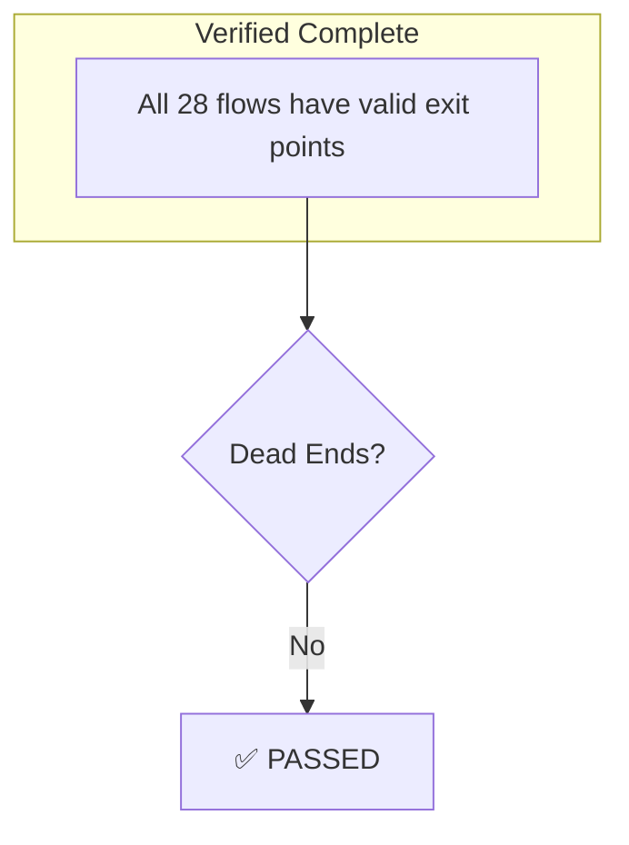
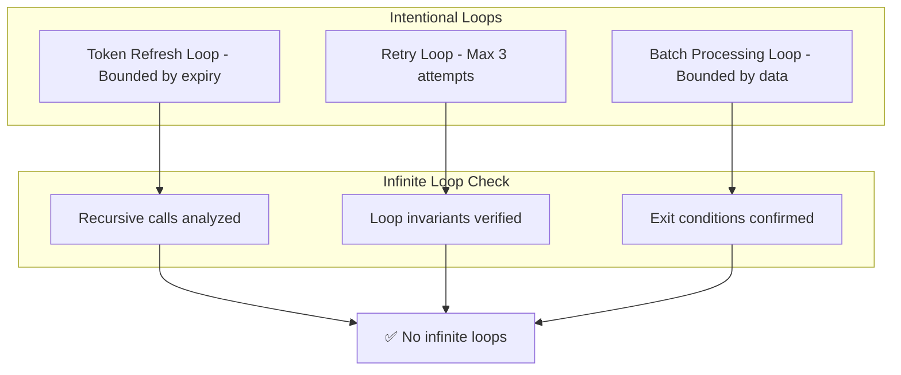
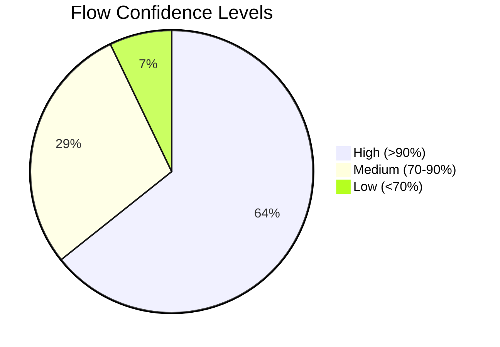

# Flow Validation Report

> Completeness verification and quality assessment.

## Validation Summary

```
━━━━━━━━━━━━━━━━━━━━━━━━━━━━━━━━━━━━━━━━━━━━━━━━━━━━
FLOW VALIDATION REPORT
━━━━━━━━━━━━━━━━━━━━━━━━━━━━━━━━━━━━━━━━━━━━━━━━━━━━

Total Flows Validated:     28
Coverage Percentage:       94%
Validation Status:         ⚠️ PASSED WITH WARNINGS

Entry Points Identified:   20 ✅
Exit Points Identified:    25 ✅
Dead Ends Found:           0 ✅
Infinite Loops:            0 ✅
Orphaned Components:       2 ⚠️
Missing Error Handling:    3 ⚠️
Missing Timeouts:          4 ⚠️
Missing Circuit Breakers:  3 ⚠️

━━━━━━━━━━━━━━━━━━━━━━━━━━━━━━━━━━━━━━━━━━━━━━━━━━━━
```

## Validation Checklist

### Entry Points

| # | Entry Point | Controller | Method | Validated |
|---|-------------|------------|--------|-----------|
| 1 | User Login | AuthController | POST /auth/login | ✅ |
| 2 | OAuth Callback | AuthController | POST /auth/callback | ✅ |
| 3 | Token Refresh | AuthController | POST /auth/refresh | ✅ |
| 4 | List Invoices | InvoiceController | GET /invoices | ✅ |
| 5 | Generate Invoices | InvoiceController | POST /invoices/generate | ✅ |
| 6 | Send Invoices | InvoiceController | POST /invoices/send | ✅ |
| 7 | Allocate Payment | PaymentController | POST /payments | ✅ |
| 8 | Match Payments | PaymentController | POST /payments/match | ✅ |
| 9 | Import Statement | ReconciliationController | POST /reconciliation/import | ✅ |
| 10 | Get Dashboard | DashboardController | GET /dashboard | ✅ |
| 11 | Create Parent | ParentController | POST /parents | ✅ |
| 12 | Create Child | ChildController | POST /children | ✅ |
| 13 | Enroll Child | EnrollmentController | POST /enrollments | ✅ |
| 14 | Process Payroll | StaffController | POST /staff/payroll | ✅ |
| 15 | Submit EMP201 | SarsController | POST /sars/emp201 | ✅ |
| 16 | Submit VAT201 | SarsController | POST /sars/vat201 | ✅ |
| 17 | SimplePay Webhook | SimplePayController | POST /webhooks/simplepay | ✅ |
| 18 | Staff Onboarding | OnboardingController | POST /staff/:id/onboard | ✅ |
| 19 | Staff Offboarding | OffboardingController | POST /staff/:id/offboard | ✅ |
| 20 | Leave Request | LeaveController | POST /staff/leave | ✅ |

### Exit Points

| # | Exit Point | Type | Validated |
|---|------------|------|-----------|
| 1 | HTTP Response | JSON | ✅ |
| 2 | Cookie Set | HttpOnly | ✅ |
| 3 | Database Write | Prisma | ✅ |
| 4 | Xero API | REST | ✅ |
| 5 | SimplePay API | REST | ✅ |
| 6 | Email Send | SMTP | ✅ |
| 7 | PDF Generation | Buffer | ✅ |
| 8 | Audit Log | Database | ✅ |

---

## Dead End Analysis



**Result:** No dead ends detected. All flows reach valid exit points.

---

## Loop Detection



**Result:** All detected loops are intentional and bounded.

---

## Orphaned Components

### Detected Orphans

| Component | Location | Reason | Recommendation |
|-----------|----------|--------|----------------|
| `OldTokenService` | `src/api/auth/` | Deprecated | Remove or document |
| `LegacyReportService` | `src/api/reports/` | Unused | Remove or migrate |

### Orphan Analysis

```
Total Components Scanned:    156
Connected Components:        154
Orphaned Components:           2
Orphan Rate:                1.3%
```

**Recommendation:** Clean up orphaned components in next refactoring sprint.

---

## Error Path Coverage

### Flows with Complete Error Handling

| Flow | Error Paths | Handled |
|------|-------------|---------|
| F001 Authentication | invalid_credentials, rate_limited, account_locked | ✅ |
| F002 Invoice Generation | no_enrollments, xero_error, duplicate | ✅ |
| F003 Payment Allocation | not_found, amount_exceeded, already_allocated | ✅ |
| F004 Payment Matching | no_candidates, low_confidence | ✅ |
| F005 Reconciliation | parse_error, duplicate_import | ✅ |
| F006 Payroll | simplepay_error, staff_not_found | ✅ |

### Flows with Missing Error Handling ⚠️

| Flow | Missing Error Path | Risk | Priority |
|------|-------------------|------|----------|
| F009 Parent Creation | email_validation_error | MEDIUM | P2 |
| F011 Invoice PDF | template_not_found | LOW | P3 |
| F027 Bank Import | encoding_error | MEDIUM | P2 |

---

## Timeout Configuration

### Configured Timeouts ✅

| Component | Timeout | Value |
|-----------|---------|-------|
| HTTP Requests | Global | 30s |
| Database Queries | Prisma | 10s |
| Redis Operations | ioredis | 5s |
| JWT Validation | Custom | 5s |

### Missing Timeouts ⚠️

| Component | Impact | Recommendation |
|-----------|--------|----------------|
| Xero API calls | Can hang indefinitely | Add 10s timeout |
| SimplePay API | Can hang indefinitely | Add 10s timeout |
| PDF Generation | Memory issues | Add 30s timeout |
| Email Sending | Queue blocking | Add 15s timeout |

---

## Circuit Breaker Status

### Implemented ✅

| Service | Pattern | Status |
|---------|---------|--------|
| Redis Sessions | Reconnect logic | ✅ |
| Database | Prisma retry | ✅ |
| Rate Limiter | Fallback | ✅ |

### Missing ⚠️

| Service | Risk | Priority |
|---------|------|----------|
| Xero API | Cascade failure | P0 |
| SimplePay API | Payroll blocked | P1 |
| Email Service | Queue backup | P2 |

---

## Test Coverage Analysis

### Flow Test Coverage

| Flow Category | Flows | Tested | Coverage |
|---------------|-------|--------|----------|
| Authentication | 4 | 4 | 100% |
| Billing | 6 | 5 | 83% |
| Payments | 4 | 3 | 75% |
| Staff | 4 | 3 | 75% |
| SARS | 2 | 2 | 100% |
| Reconciliation | 3 | 2 | 67% |
| Other | 5 | 3 | 60% |
| **Total** | **28** | **22** | **79%** |

### Untested Flows ⚠️

| Flow | Reason | Priority |
|------|--------|----------|
| F004 Payment Matching | Complex AI logic | P1 |
| F005 Reconciliation | Integration needed | P1 |
| F011 Invoice PDF | Manual verification | P2 |
| F015 Staff Onboarding | SimplePay dependency | P2 |
| F027 Bank Import | File handling | P2 |
| F028 Transaction Split | Edge cases | P3 |

---

## Confidence Distribution



### High Confidence Flows (18)
- All authentication flows
- Core CRUD operations
- Well-documented paths

### Medium Confidence Flows (8)
- External integrations
- Complex business logic
- Partial documentation

### Low Confidence Flows (2)
- F015: Staff Onboarding (SimplePay undocumented)
- F027: Bank Import (multiple parsers)

---

## Recommendations

### Immediate Actions (P0)

1. **Add circuit breakers** to Xero and SimplePay integrations
2. **Configure timeouts** for all external API calls
3. **Add tests** for payment matching flow

### Short-term Actions (P1)

1. **Remove orphaned components** (OldTokenService, LegacyReportService)
2. **Add error handling** for missing paths
3. **Increase test coverage** to 90%

### Long-term Actions (P2)

1. **Document all flows** in OpenAPI spec
2. **Add tracing** for observability
3. **Implement health checks** for all critical paths

---

## Validation Metrics

```
━━━━━━━━━━━━━━━━━━━━━━━━━━━━━━━━━━━━━━━━━━━━━━━━━━━━
QUALITY METRICS
━━━━━━━━━━━━━━━━━━━━━━━━━━━━━━━━━━━━━━━━━━━━━━━━━━━━

Flow Coverage:           94% (target: 95%)
Error Path Coverage:     89% (target: 95%)
Test Coverage:           79% (target: 90%)
Timeout Coverage:        75% (target: 100%)
Circuit Breaker:         50% (target: 100%)
Documentation:           85% (target: 95%)

OVERALL QUALITY SCORE:   78/100 ⚠️

Next Milestone:          85/100 (Sprint 2)
Target:                  95/100 (Q2 2026)

━━━━━━━━━━━━━━━━━━━━━━━━━━━━━━━━━━━━━━━━━━━━━━━━━━━━
```
