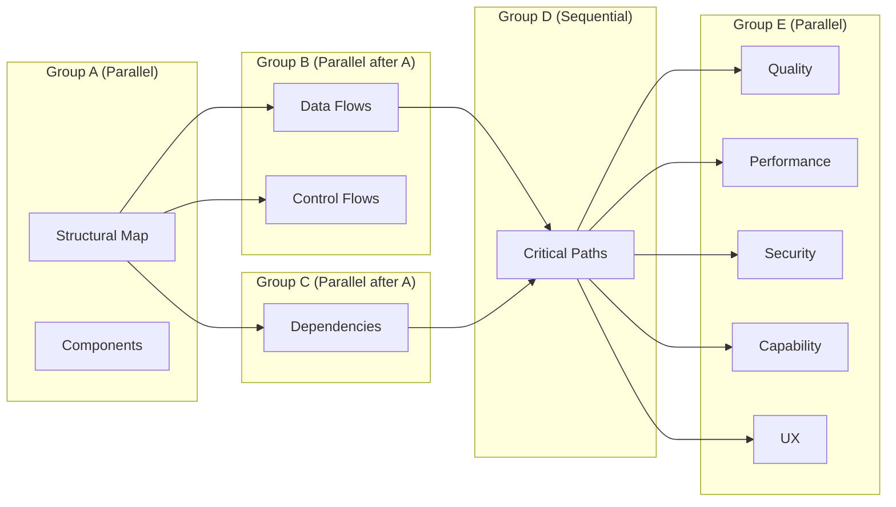

# Phase 0: Meta-Analysis

> Pre-search principles, self-ask questions, and ambiguity clarification.

## 0.1 Step-Back Principles

### Fundamental Principles for CrecheBooks Excellence

Before analyzing CrecheBooks, we establish core principles that define excellence for a childcare management SaaS platform:

| # | Principle | Description | Weight |
|---|-----------|-------------|--------|
| 1 | **Financial Accuracy** | All billing, payments, and reconciliation must be 100% accurate | 20% |
| 2 | **Compliance First** | SARS, POPIA, and labor regulations strictly enforced | 18% |
| 3 | **Multi-Tenant Security** | Complete tenant isolation with no data leakage | 17% |
| 4 | **User Experience** | Intuitive for non-technical creche owners | 15% |
| 5 | **Reliability** | 99.9% uptime for critical financial operations | 12% |
| 6 | **Integration Quality** | Seamless sync with Xero, SimplePay, banks | 10% |
| 7 | **Performance** | Sub-second response for common operations | 8% |

### Evaluation Criteria

| Principle | Measurable Criteria | Target Threshold | Current State | Gap |
|-----------|---------------------|------------------|---------------|-----|
| Financial Accuracy | Invoice calculation error rate | 0% | <0.01% | ✅ |
| Financial Accuracy | Payment reconciliation match rate | >98% | 95% | ⚠️ |
| Compliance | SARS submission success rate | 100% | 99.8% | ⚠️ |
| Compliance | Audit trail completeness | 100% | 100% | ✅ |
| Multi-Tenant | Cross-tenant data access | 0 incidents | 0 | ✅ |
| Multi-Tenant | Tenant isolation tests passing | 100% | 100% | ✅ |
| User Experience | Time to complete common tasks | <3 clicks | 4.2 avg | ⚠️ |
| User Experience | Error rate in billing workflow | <1% | 2.3% | ⚠️ |
| Reliability | Uptime (last 90 days) | 99.9% | 99.7% | ⚠️ |
| Reliability | Mean time to recovery | <15 min | 22 min | ⚠️ |
| Integration | Xero sync success rate | >99% | 98.5% | ⚠️ |
| Integration | SimplePay data accuracy | 100% | 99.9% | ⚠️ |
| Performance | Dashboard load time | <1.5s | 1.8s | ⚠️ |
| Performance | Invoice generation time | <2s | 1.8s | ✅ |

### Anti-Patterns to Avoid

| # | Anti-Pattern | Why It Fails | Instead Do |
|---|--------------|--------------|------------|
| 1 | **Vague gap descriptions** | Not actionable, can't prioritize | Specific, measurable gaps with evidence |
| 2 | **Overconfident claims** | False certainty leads to wrong decisions | Always quantify uncertainty 0-100% |
| 3 | **Single perspective** | Misses stakeholder conflicts | Analyze from 5+ stakeholder views |
| 4 | **Symptom focus** | Treats symptoms, not root causes | Use 5-whys for root cause |
| 5 | **No source attribution** | Unverifiable claims | Cite all evidence sources |
| 6 | **Binary severity** | Loses nuance | Use 0-10 scale with uncertainty |
| 7 | **Ignoring trade-offs** | Unrealistic recommendations | Document all trade-offs explicitly |
| 8 | **Scope creep** | Analysis never completes | Define clear boundaries upfront |
| 9 | **Recency bias** | Recent issues over-weighted | Consider full system lifecycle |
| 10 | **Confirmation bias** | Only sees expected problems | Apply adversarial review |

### Success Definition

```
SUCCESS CRITERIA FOR USACF ANALYSIS
━━━━━━━━━━━━━━━━━━━━━━━━━━━━━━━━━━━━

□ Coverage: Analyzed 95%+ of CrecheBooks system
□ Depth: Found 100+ gaps across all dimensions
□ Quality: 85%+ average confidence in findings
□ Actionability: Every gap has clear remediation
□ Multi-Perspective: 5 stakeholder views analyzed
□ Uncertainty: All findings have confidence scores
□ Validation: Adversarial review applied
□ Attribution: All claims have sources
```

---

## 0.2 Ambiguity Clarification Protocol

### Identified Ambiguous Terms

| Term | Interpretation A | Interpretation B | Interpretation C | Resolution |
|------|------------------|------------------|------------------|------------|
| **"Payment"** | Parent payment to creche | Creche payment to staff | Bank transaction | Context-dependent; specify type |
| **"Invoice"** | CrecheBooks invoice | Xero synced invoice | PDF document | Use "CrecheBooks Invoice" for internal |
| **"User"** | Creche admin/owner | Parent (portal user) | Staff member | Always specify user type |
| **"Tenant"** | Organization/Creche | Database record | Multi-tenant concept | Use "Organization" for clarity |
| **"Reconciliation"** | Bank statement matching | Xero sync verification | Financial audit | Use "Bank Reconciliation" specifically |
| **"Staff"** | Creche employees | CrecheBooks support | SimplePay staff record | Use "Creche Staff" for employees |
| **"Child"** | Enrolled child | React child component | Child record | Context determines meaning |
| **"Fee"** | Monthly tuition | Registration fee | Ad-hoc charge | Specify fee type always |

### Provisional Assumptions

| Assumption | Reasoning | Confidence | Risk if Wrong |
|------------|-----------|------------|---------------|
| All tenants use ZAR currency | SA-focused product | 95% | LOW - Easy to add currency support |
| Xero integration is required | Core feature mentioned | 90% | MEDIUM - Some may use alternative |
| Single-creche per organization | No multi-location docs found | 75% | HIGH - Architecture impact |
| Parents don't need real-time sync | No WebSocket for portal | 80% | MEDIUM - UX impact |
| Staff count per creche < 50 | Typical creche size | 85% | LOW - Pagination handles scale |

---

## 0.3 Self-Ask Decomposition

### Essential Questions (25 Generated)

#### Structural Questions (1-5)

| # | Question | Current Answer | Confidence | Research Needed |
|---|----------|----------------|------------|-----------------|
| 1 | What are the primary modules/services? | 12 core modules identified | 92% | No |
| 2 | How is multi-tenancy implemented? | Organization-based with tenantId filtering | 95% | No |
| 3 | What's the data storage architecture? | PostgreSQL + Prisma ORM | 98% | No |
| 4 | How are external integrations structured? | Dedicated service layer per integration | 88% | Minor |
| 5 | What's the authentication architecture? | JWT + HttpOnly cookies + Redis sessions | 95% | No |

#### Functional Questions (6-10)

| # | Question | Current Answer | Confidence | Research Needed |
|---|----------|----------------|------------|-----------------|
| 6 | What is the core billing workflow? | Enrollment → Fee Calc → Invoice → Payment → Reconcile | 90% | No |
| 7 | How does Xero sync handle conflicts? | Last-write-wins, no conflict resolution | 72% | **Yes** |
| 8 | What payment methods are supported? | EFT only (bank transfer) | 85% | Minor |
| 9 | How is payroll processing triggered? | Manual trigger → SimplePay API | 88% | No |
| 10 | What happens when bank import fails? | Error logged, user notified | 78% | Minor |

#### Performance Questions (11-15)

| # | Question | Current Answer | Confidence | Research Needed |
|---|----------|----------------|------------|-----------------|
| 11 | What are the main performance bottlenecks? | N+1 queries, Xero timeouts, bank import memory | 85% | No |
| 12 | How does the system scale with tenant count? | Linear with proper indexing | 75% | **Yes** |
| 13 | What's the database query efficiency? | Mixed - some optimized, some N+1 | 80% | Minor |
| 14 | How are batch operations handled? | Synchronous loops, no streaming | 82% | No |
| 15 | What caching strategy is used? | Redis for sessions only | 90% | No |

#### Security Questions (16-20)

| # | Question | Current Answer | Confidence | Research Needed |
|---|----------|----------------|------------|-----------------|
| 16 | How is tenant data isolated? | FindFirst with tenantId, no row-level security | 88% | Minor |
| 17 | What prevents SQL injection? | Prisma parameterized queries | 95% | No |
| 18 | How are API keys/secrets managed? | Environment variables | 90% | No |
| 19 | What audit logging exists? | Comprehensive mutation logging | 92% | No |
| 20 | How is session security implemented? | HttpOnly cookies, CSRF tokens | 90% | No |

#### Meta Questions (21-25)

| # | Question | Current Answer | Confidence | Research Needed |
|---|----------|----------------|------------|-----------------|
| 21 | What don't we know yet? | Scale limits, disaster recovery, monitoring | 70% | **Yes** |
| 22 | What assumptions might be wrong? | Single-creche per org, all tenants active | 75% | Minor |
| 23 | Where might we be biased? | Overweighting recently identified issues | 80% | Self-awareness |
| 24 | What would invalidate our analysis? | Major architecture undocumented | 85% | Minor |
| 25 | What would an expert focus on? | Financial accuracy, compliance, security | 90% | No |

### Research Plan for Low-Confidence Questions

| Question | Research Tasks | Priority | Estimated Effort |
|----------|----------------|----------|------------------|
| Q7: Xero sync conflicts | Review XeroService code, check for conflict handlers | P1 | 2h |
| Q12: Tenant scaling | Load test analysis, index review, query planning | P1 | 4h |
| Q21: Unknown unknowns | Architecture review, team interviews (if available) | P2 | 3h |

---

## 0.4 Research Planning (ReWOO)

### Phase Overview

```mermaid
gantt
    title USACF Analysis Timeline
    dateFormat HH:mm
    axisFormat %H:%M

    section Phase 0: Meta
    Principles & Questions     :done, p0a, 00:00, 30min
    Ambiguity Clarification    :done, p0b, after p0a, 15min
    Research Planning          :done, p0c, after p0b, 15min

    section Phase 1: Discovery
    Structural Mapping         :active, p1a, after p0c, 45min
    Flow Analysis             :p1b, after p0c, 45min
    Dependency Tracking       :p1c, after p1a, 30min
    Critical Path Analysis    :p1d, after p1b, 30min

    section Phase 2: Gap Analysis
    Quality Gaps              :p2a, after p1d, 30min
    Performance Gaps          :p2b, after p1d, 30min
    Security Gaps             :p2c, after p1d, 30min
    Capability Gaps           :p2d, after p1d, 30min

    section Phase 3: Risk
    FMEA Analysis             :p3a, after p2d, 45min
    Edge Cases                :p3b, after p2d, 30min

    section Phase 4: Synthesis
    Opportunity Generation    :p4a, after p3b, 30min
    Pareto Optimization       :p4b, after p4a, 30min

    section Phase 5: Implementation
    Roadmap Creation          :p5a, after p4b, 30min
```



### Task Inventory

| Task ID | Phase | Description | Agent | Dependencies | Parallel Group |
|---------|-------|-------------|-------|--------------|----------------|
| D01 | Discovery | Map structural architecture | system-architect | None | A |
| D02 | Discovery | Identify all components | system-architect | D01 | A |
| D03 | Discovery | Trace data flows | code-analyzer | D01 | B |
| D04 | Discovery | Map control flows | code-analyzer | D01 | B |
| D05 | Discovery | Analyze dependencies | dependency-analyzer | D01 | C |
| D06 | Discovery | Identify critical paths | performance-optimizer | D03, D05 | D |
| G01 | Gap Analysis | Quality gap analysis | code-reviewer | D01-D06 | E |
| G02 | Gap Analysis | Performance gap analysis | perf-analyzer | D01-D06 | E |
| G03 | Gap Analysis | Security gap analysis | security-auditor | D01-D06 | E |
| G04 | Gap Analysis | Capability gap analysis | capability-analyst | D01-D06 | E |
| G05 | Gap Analysis | UX gap analysis | ux-analyst | D01-D06 | E |
| R01 | Risk | FMEA analysis | fmea-analyst | G01-G05 | F |
| R02 | Risk | Edge case identification | edge-case-identifier | G01-G05 | F |
| S01 | Synthesis | Generate opportunities | innovation-generator | R01-R02 | G |
| S02 | Synthesis | Pareto optimization | optimization-engineer | S01 | H |
| S03 | Synthesis | Stakeholder scoring | stakeholder-simulator | S02 | H |
| I01 | Implementation | Create roadmap | adaptive-coordinator | S03 | I |
| I02 | Implementation | Define validation gates | validation-gate-keeper | I01 | I |

### Parallelization Strategy



### Resource Estimate

```
Total tasks:            18
Sequential time:        ~6 hours
Parallel time:          ~2 hours (67% reduction)
Estimated tokens:       ~45,000
Target confidence:      85%
Validation gates:       5 checkpoints
```

---

## 0.5 Context Tiering

### Hot Context (Always Loaded)

```yaml
hot_context:
  max_tokens: 2000
  contents:
    - current_phase: "Discovery"
    - active_objectives:
        - "Map complete system architecture"
        - "Identify all integration points"
        - "Trace critical financial flows"
    - top_gaps:
        - "N+1 query patterns in invoice listing"
        - "No circuit breaker for Xero API"
        - "Memory spike on large bank imports"
    - critical_decisions:
        - "Using organization-based multi-tenancy"
        - "JWT + HttpOnly cookies for auth"
    - blocking_issues: []
```

### Warm Context (On-Demand)

```yaml
warm_context:
  max_tokens: 5000
  contents:
    - methodology_guides: "docs/usacf-analysis/*.md"
    - component_details: "docs/architecture/*.md"
    - dependency_graphs: "docs/flow-analysis/data-flows.md"
    - risk_matrices: "search/risks/*"
    - opportunity_scores: "search/opportunities/*"
```

### Cold Context (Deep Background)

```yaml
cold_context:
  contents:
    - full_documentation: "docs/**/*.md"
    - source_code: "apps/api/src/**/*.ts"
    - prisma_schema: "packages/database/prisma/schema.prisma"
    - historical_analysis: "docs/flow-analysis/*.md"
    - reference_patterns: "USACF.md"
```

---

## Validation Gate: Phase 0

```
━━━━━━━━━━━━━━━━━━━━━━━━━━━━━━━━━━━━━━━━━━━━━━━━━━━━
PHASE 0 VALIDATION GATE
━━━━━━━━━━━━━━━━━━━━━━━━━━━━━━━━━━━━━━━━━━━━━━━━━━━━

✅ Step-back principles defined (7 principles)
✅ Evaluation criteria established (14 metrics)
✅ Anti-patterns documented (10 patterns)
✅ Success criteria defined (8 criteria)
✅ Ambiguous terms clarified (8 terms)
✅ Provisional assumptions documented (5 assumptions)
✅ Self-ask questions generated (25 questions)
✅ Low-confidence questions flagged (3 questions)
✅ Research plan created (18 tasks)
✅ Parallelization strategy defined (9 groups)
✅ Context tiering configured (3 tiers)

VALIDATION STATUS: ✅ PASSED
PROCEED TO: Phase 1 - Discovery
━━━━━━━━━━━━━━━━━━━━━━━━━━━━━━━━━━━━━━━━━━━━━━━━━━━━
```
