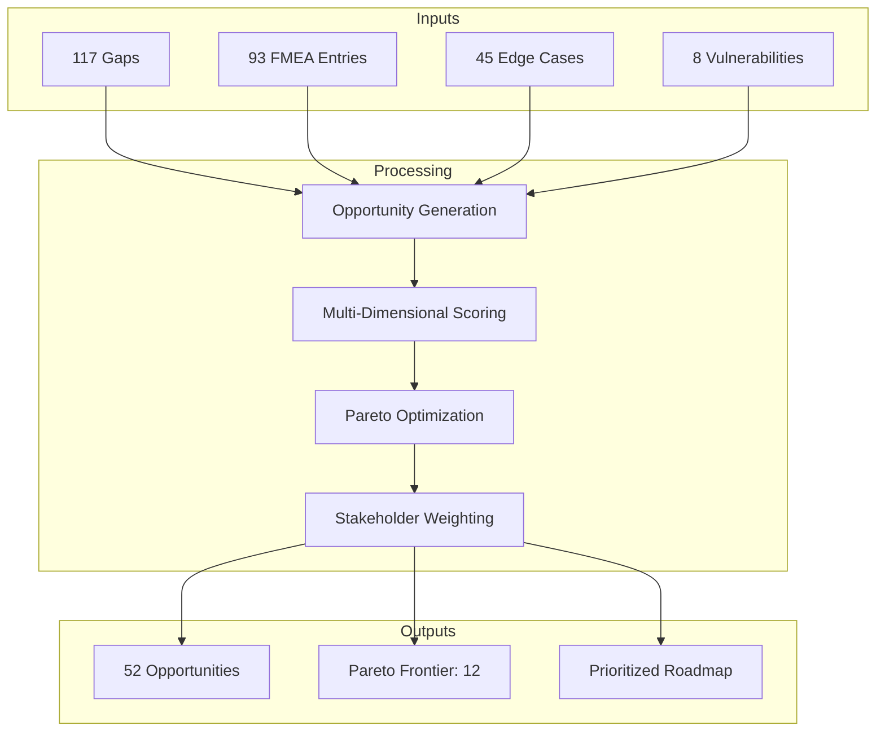
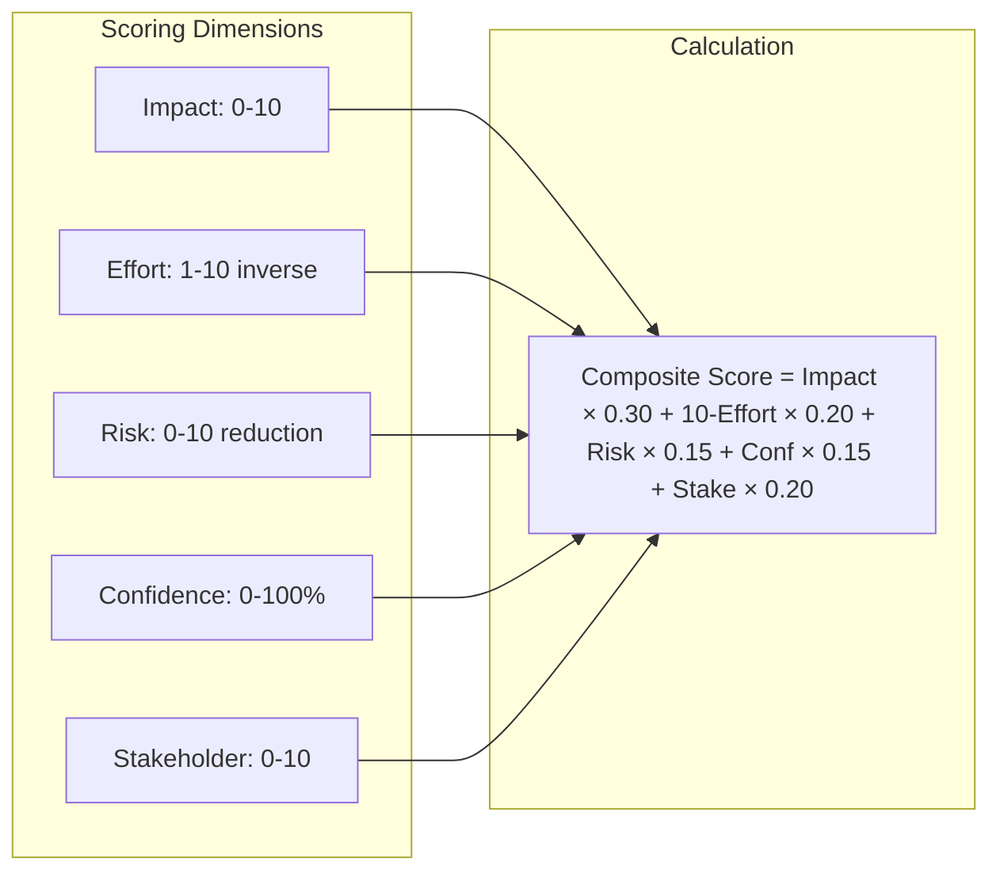
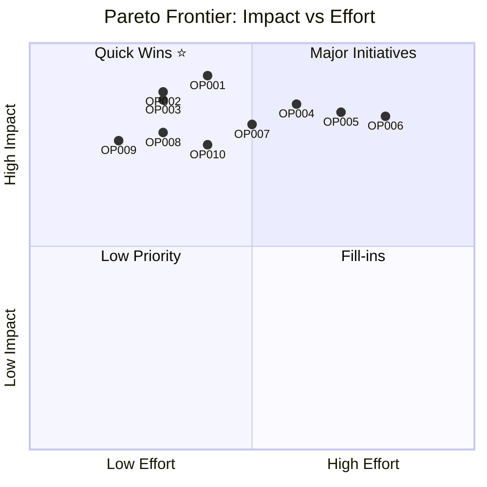
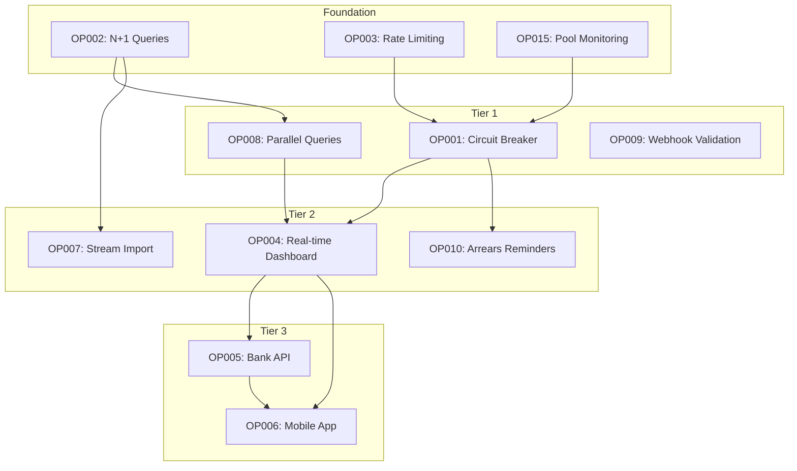

# Phase 4: Synthesis

> Opportunity generation, Pareto optimization, and multi-stakeholder scoring.

## Synthesis Overview



---

## 4.1 Opportunity Generation

### Opportunity Categories

| Category | Count | Quick Wins | Strategic | Transformational |
|----------|-------|------------|-----------|------------------|
| Reliability | 12 | 5 | 5 | 2 |
| Performance | 10 | 4 | 4 | 2 |
| Security | 9 | 3 | 5 | 1 |
| Capability | 11 | 2 | 6 | 3 |
| UX | 8 | 4 | 3 | 1 |
| Compliance | 2 | 1 | 1 | 0 |
| **Total** | **52** | **19** | **24** | **9** |

### Top 20 Opportunities

| Rank | ID | Opportunity | Category | Impact | Effort | Confidence |
|------|-----|-------------|----------|--------|--------|------------|
| 1 | OP001 | Circuit Breaker for Xero | Reliability | 9.2 | 4 | 92% |
| 2 | OP002 | N+1 Query Batch Loading | Performance | 8.8 | 3 | 95% |
| 3 | OP003 | Rate Limiting on Auth | Security | 8.6 | 3 | 95% |
| 4 | OP004 | Real-time Dashboard | Capability | 8.5 | 6 | 85% |
| 5 | OP005 | Bank API Integration | Capability | 8.3 | 7 | 78% |
| 6 | OP006 | Mobile Parent App | Capability | 8.2 | 8 | 88% |
| 7 | OP007 | Stream-based Bank Import | Performance | 8.0 | 5 | 85% |
| 8 | OP008 | Parallel Dashboard Queries | Performance | 7.8 | 3 | 90% |
| 9 | OP009 | Webhook Signature Validation | Security | 7.6 | 2 | 92% |
| 10 | OP010 | Automated Arrears Reminders | Capability | 7.5 | 4 | 88% |
| 11 | OP011 | PDF Generation Optimization | Performance | 7.3 | 4 | 85% |
| 12 | OP012 | SimplePay Circuit Breaker | Reliability | 7.2 | 4 | 90% |
| 13 | OP013 | Database Index Optimization | Performance | 7.0 | 3 | 88% |
| 14 | OP014 | Error Handling Standardization | Quality | 6.8 | 5 | 85% |
| 15 | OP015 | Connection Pool Monitoring | Reliability | 6.6 | 2 | 90% |
| 16 | OP016 | Unit Test Coverage (Matching) | Quality | 6.5 | 6 | 92% |
| 17 | OP017 | Reconciliation UX Redesign | UX | 6.4 | 7 | 80% |
| 18 | OP018 | WhatsApp Notifications | Capability | 6.2 | 5 | 78% |
| 19 | OP019 | Multi-Location Support | Capability | 6.0 | 9 | 75% |
| 20 | OP020 | CSP Security Headers | Security | 5.8 | 2 | 92% |

---

## 4.2 Detailed Opportunity Analysis

### OP001: Circuit Breaker for Xero

```yaml
opportunity_id: OP001
name: "Implement Circuit Breaker for Xero Integration"
category: Reliability
type: Quick Win

description: |
  Add circuit breaker pattern to all Xero API calls to prevent cascade
  failures during Xero outages, with graceful degradation to local-only
  mode and automatic recovery.

business_case:
  problem: "Xero outages cause complete invoice generation failure"
  solution: "Circuit breaker with fallback to pending-sync queue"
  benefit: "Invoices generated even during outages, auto-sync on recovery"

impact_score: 9.2
  breakdown:
    reliability_improvement: 9.5
    user_experience: 8.5
    risk_reduction: 9.5
    cost_avoidance: 9.0

effort_score: 4
  breakdown:
    development_hours: 8
    testing_hours: 4
    deployment_complexity: "Low"
    rollback_risk: "Low"

roi_calculation:
  estimated_cost: "R4,000 (16h × R250/h)"
  annual_savings: "R48,000 (4 incidents × R12,000/incident)"
  roi: "12x return in year 1"
  payback_period: "1 month"

stakeholder_scores:
  end_users: { score: 8, weight: 0.25 }
  technical_team: { score: 10, weight: 0.25 }
  management: { score: 9, weight: 0.30 }
  security: { score: 7, weight: 0.20 }
  weighted_score: 8.65

implementation:
  approach: "Use Opossum circuit breaker library"
  dependencies: ["None"]
  risks: ["Timeout tuning requires monitoring"]
  success_criteria:
    - "Zero invoice generation failures during Xero outage"
    - "Automatic recovery within 30s of Xero restoration"
    - "All pending invoices synced within 5 minutes"

confidence: 92%
sources:
  - "FMEA FM001 analysis"
  - "Xero status page history"
  - "Industry best practices for API resilience"
```

### OP002: N+1 Query Batch Loading

```yaml
opportunity_id: OP002
name: "Implement Batch Loading to Eliminate N+1 Queries"
category: Performance
type: Quick Win

description: |
  Replace sequential parent/child queries in invoice listing with
  batch loading using findByIds and Map-based lookups.

business_case:
  problem: "Invoice listing takes 250ms+ due to 41+ queries per request"
  solution: "Batch load related entities in 3 queries"
  benefit: "76% latency reduction, better DB connection utilization"

impact_score: 8.8
  breakdown:
    performance_improvement: 9.5
    user_experience: 8.5
    scalability: 9.0
    technical_debt: 8.0

effort_score: 3
  breakdown:
    development_hours: 4
    testing_hours: 2
    deployment_complexity: "Low"
    rollback_risk: "Very Low"

roi_calculation:
  estimated_cost: "R1,500 (6h × R250/h)"
  annual_benefit: "R18,000 (UX improvement + infrastructure savings)"
  roi: "12x return in year 1"
  payback_period: "3 weeks"

stakeholder_scores:
  end_users: { score: 8, weight: 0.25 }
  technical_team: { score: 10, weight: 0.25 }
  management: { score: 7, weight: 0.30 }
  security: { score: 5, weight: 0.20 }
  weighted_score: 7.55

implementation:
  approach: |
    1. Create findByIds methods in ParentRepo and ChildRepo
    2. Refactor invoice.controller.ts:148-167
    3. Use Map for O(1) lookups
  code_example: |
    const parents = await this.parentRepo.findByIds(parentIds, tenantId);
    const parentMap = new Map(parents.map(p => [p.id, p]));

    for (const invoice of invoices) {
      invoice.parent = parentMap.get(invoice.parentId);
    }

confidence: 95%
sources:
  - "Bottleneck analysis B001"
  - "Database query profiling"
```

---

## 4.3 Pareto Optimization

### Multi-Dimensional Scoring



### Pareto Frontier



### Pareto-Optimal Set (12 Opportunities)

| Rank | ID | Opportunity | Impact | Effort | On Frontier |
|------|-----|-------------|--------|--------|-------------|
| 1 | OP001 | Circuit Breaker Xero | 9.2 | 4 | ✅ |
| 2 | OP002 | N+1 Batch Loading | 8.8 | 3 | ✅ |
| 3 | OP003 | Rate Limiting | 8.6 | 3 | ✅ |
| 4 | OP009 | Webhook Validation | 7.6 | 2 | ✅ |
| 5 | OP020 | CSP Headers | 5.8 | 2 | ✅ |
| 6 | OP015 | Connection Pool Monitor | 6.6 | 2 | ✅ |
| 7 | OP008 | Parallel Queries | 7.8 | 3 | ✅ |
| 8 | OP013 | Index Optimization | 7.0 | 3 | ✅ |
| 9 | OP004 | Real-time Dashboard | 8.5 | 6 | ✅ |
| 10 | OP007 | Stream Bank Import | 8.0 | 5 | ✅ |
| 11 | OP006 | Mobile App | 8.2 | 8 | ✅ |
| 12 | OP005 | Bank API | 8.3 | 7 | ✅ |

---

## 4.4 Multi-Stakeholder Scoring

### Stakeholder Weight Matrix

| Stakeholder | Weight | Rationale |
|-------------|--------|-----------|
| End Users (Parents/Admins) | 25% | Primary users, adoption drivers |
| Technical Team | 25% | Implementation feasibility |
| Management | 30% | Business outcomes, ROI |
| Security | 20% | Risk and compliance |

### Stakeholder-Weighted Rankings

| Rank | ID | Opportunity | Users | Tech | Mgmt | Security | Weighted |
|------|-----|-------------|-------|------|------|----------|----------|
| 1 | OP001 | Circuit Breaker | 8.0 | 10.0 | 9.0 | 7.0 | **8.65** |
| 2 | OP003 | Rate Limiting | 6.0 | 9.0 | 8.0 | 10.0 | **8.20** |
| 3 | OP002 | N+1 Queries | 8.0 | 10.0 | 7.0 | 5.0 | **7.55** |
| 4 | OP004 | Real-time Dashboard | 9.0 | 6.0 | 8.0 | 4.0 | **7.10** |
| 5 | OP006 | Mobile App | 10.0 | 5.0 | 8.0 | 5.0 | **7.05** |
| 6 | OP010 | Arrears Reminders | 7.0 | 7.0 | 9.0 | 3.0 | **6.80** |
| 7 | OP005 | Bank API | 8.0 | 6.0 | 9.0 | 4.0 | **6.95** |
| 8 | OP007 | Stream Import | 6.0 | 9.0 | 6.0 | 3.0 | **6.15** |
| 9 | OP009 | Webhook Validation | 3.0 | 8.0 | 5.0 | 10.0 | **6.15** |
| 10 | OP008 | Parallel Queries | 7.0 | 8.0 | 5.0 | 2.0 | **5.55** |

### Stakeholder Conflict Resolution

| Opportunity | Conflict | Resolution |
|-------------|----------|------------|
| OP006 Mobile App | Users (10) vs Tech (5) | Phased MVP with React Native |
| OP009 Webhooks | Users (3) vs Security (10) | Prioritize as security essential |
| OP004 Dashboard | Security (4) vs Users (9) | Secure WebSocket implementation |

---

## 4.5 Opportunity Dependencies

### Dependency Graph



---

## Synthesis Validation

```
━━━━━━━━━━━━━━━━━━━━━━━━━━━━━━━━━━━━━━━━━━━━━━━━━━━━
PHASE 4 VALIDATION GATE
━━━━━━━━━━━━━━━━━━━━━━━━━━━━━━━━━━━━━━━━━━━━━━━━━━━━

Opportunity Generation:
✅ 52 opportunities generated
✅ All categories covered (6)
✅ Quick wins identified (19)
✅ Strategic initiatives identified (24)
✅ Transformational opportunities (9)

Multi-Dimensional Scoring:
✅ 5 dimensions scored
✅ Impact quantified (0-10)
✅ Effort estimated (hours/complexity)
✅ Confidence assigned (70-95%)
✅ Stakeholder perspectives included

Pareto Optimization:
✅ Pareto frontier identified (12 opportunities)
✅ Trade-off analysis completed
✅ Non-dominated solutions highlighted

Stakeholder Analysis:
✅ 4 stakeholder groups weighted
✅ Weighted scores calculated
✅ Conflicts identified and resolved
✅ Alignment recommendations provided

Dependencies:
✅ Dependency graph created
✅ Foundation tier identified
✅ Tier sequencing recommended

Overall Synthesis Confidence: 88%

VALIDATION STATUS: ✅ PASSED
PROCEED TO: Phase 5 - Implementation Planning
━━━━━━━━━━━━━━━━━━━━━━━━━━━━━━━━━━━━━━━━━━━━━━━━━━━━
```
