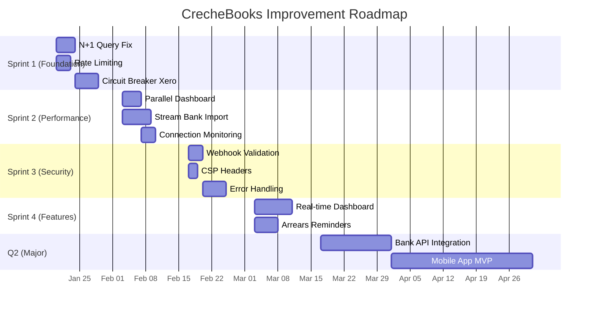
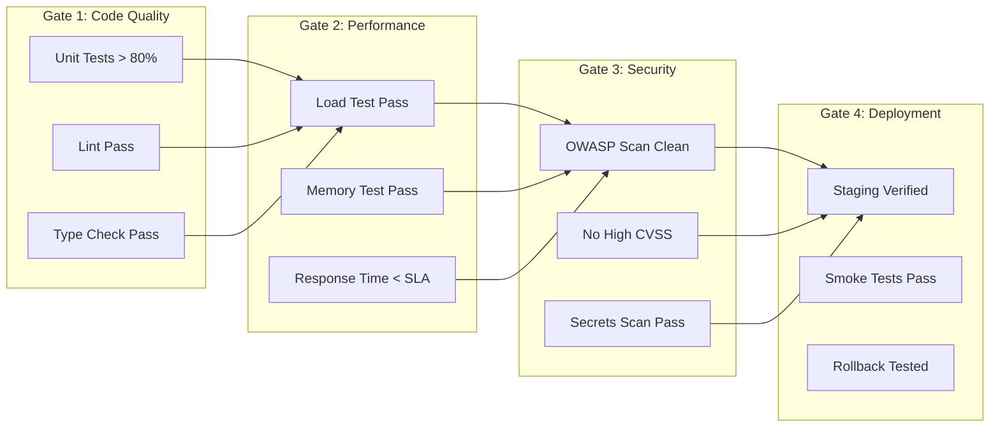
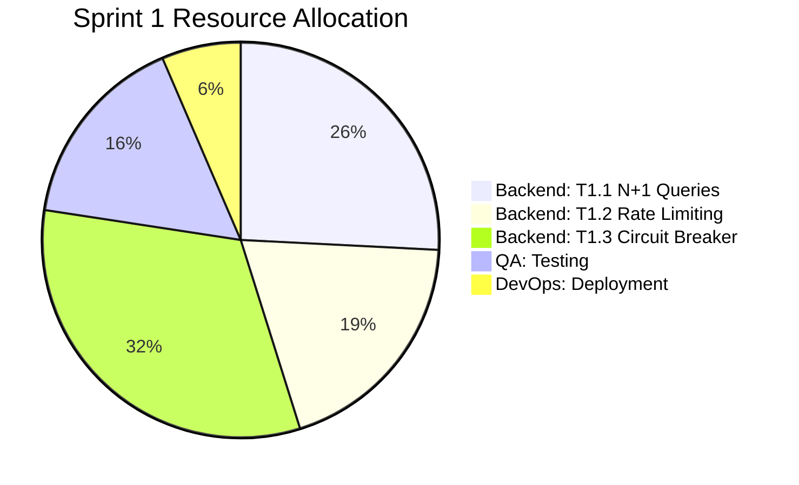

# Phase 5: Implementation Planning

> Phased roadmap, validation gates, resource allocation, and risk mitigation.

## Implementation Overview



---

## 5.1 Phased Roadmap

### Sprint 1: Foundation (Week 1-2)

**Focus**: Critical reliability and security fixes

| Task | Opportunity | Owner | Days | Dependencies | Gate |
|------|-------------|-------|------|--------------|------|
| T1.1 | OP002: N+1 Query Fix | Backend | 4 | None | Unit tests pass |
| T1.2 | OP003: Rate Limiting | Backend | 3 | None | Load test pass |
| T1.3 | OP001: Circuit Breaker | Backend | 5 | T1.2 | Failover test |

```yaml
sprint_1:
  goal: "Eliminate critical performance and security gaps"

  success_criteria:
    - "Invoice listing < 100ms (from 250ms)"
    - "Auth endpoints rate limited (5/min)"
    - "Xero outage graceful degradation working"
    - "Zero regressions in existing tests"

  validation_gate:
    - unit_test_coverage: ">= 80% on changed code"
    - load_test: "100 concurrent users, <500ms p95"
    - security_scan: "No new high/critical findings"
    - manual_qa: "Core flows verified"

  rollback_plan:
    - "Feature flags for circuit breaker"
    - "Rate limiter disable endpoint"
    - "Database migration rollback scripts"
```

### Sprint 2: Performance (Week 3-4)

**Focus**: Performance optimization and monitoring

| Task | Opportunity | Owner | Days | Dependencies | Gate |
|------|-------------|-------|------|--------------|------|
| T2.1 | OP008: Parallel Queries | Backend | 4 | T1.1 | Benchmark pass |
| T2.2 | OP007: Stream Import | Backend | 6 | None | 50MB file test |
| T2.3 | OP015: Pool Monitoring | DevOps | 3 | None | Dashboard live |

```yaml
sprint_2:
  goal: "Optimize performance for scale"

  success_criteria:
    - "Dashboard load < 500ms (from 1.5s)"
    - "Bank import handles 50MB files"
    - "Connection pool metrics visible"
    - "No memory spikes during batch ops"

  validation_gate:
    - performance_test: "Dashboard 3x faster"
    - memory_test: "Flat memory during 50MB import"
    - monitoring: "Grafana dashboard operational"
```

### Sprint 3: Security Hardening (Week 5-6)

**Focus**: Security improvements and code quality

| Task | Opportunity | Owner | Days | Dependencies | Gate |
|------|-------------|-------|------|--------------|------|
| T3.1 | OP009: Webhook Validation | Backend | 3 | None | Signature test |
| T3.2 | OP020: CSP Headers | Frontend | 2 | None | Header check |
| T3.3 | OP014: Error Handling | Backend | 5 | None | No verbose errors |

```yaml
sprint_3:
  goal: "Security hardening and code quality"

  success_criteria:
    - "All webhooks signature validated"
    - "CSP headers on all responses"
    - "No sensitive data in error messages"
    - "Consistent error response format"

  validation_gate:
    - security_scan: "OWASP ZAP clean"
    - penetration_test: "Webhook spoofing blocked"
    - error_audit: "No stack traces in production"
```

### Sprint 4: Feature Enhancement (Week 7-8)

**Focus**: High-value feature additions

| Task | Opportunity | Owner | Days | Dependencies | Gate |
|------|-------------|-------|------|--------------|------|
| T4.1 | OP004: Real-time Dashboard | Full Stack | 8 | T2.1 | WebSocket live |
| T4.2 | OP010: Arrears Reminders | Backend | 5 | T1.3 | Email test |

```yaml
sprint_4:
  goal: "Add high-value features"

  success_criteria:
    - "Dashboard updates in real-time"
    - "Automated arrears emails sent"
    - "No performance regression"
    - "User acceptance testing passed"

  validation_gate:
    - functional_test: "Real-time updates verified"
    - integration_test: "Email delivery confirmed"
    - uat: "3 pilot users validated"
```

### Q2 Major Initiatives

| Initiative | Opportunity | Timeline | Team | Budget |
|------------|-------------|----------|------|--------|
| Bank API | OP005 | Mar 17 - Apr 1 | 2 BE | R40K |
| Mobile MVP | OP006 | Apr 1 - May 1 | 2 FE + 1 BE | R120K |

---

## 5.2 Validation Gates

### Gate Definitions



### Gate Checklist Template

```yaml
validation_gate:
  sprint: "Sprint N"
  date: "YYYY-MM-DD"

  code_quality:
    - check: "Unit test coverage"
      required: ">= 80%"
      actual: "___%"
      status: "⬜ Pass | ⬜ Fail"

    - check: "ESLint errors"
      required: "0"
      actual: "___"
      status: "⬜ Pass | ⬜ Fail"

    - check: "TypeScript strict"
      required: "Pass"
      actual: "___"
      status: "⬜ Pass | ⬜ Fail"

  performance:
    - check: "P95 response time"
      required: "< 500ms"
      actual: "___ms"
      status: "⬜ Pass | ⬜ Fail"

    - check: "Memory under load"
      required: "< 512MB"
      actual: "___MB"
      status: "⬜ Pass | ⬜ Fail"

  security:
    - check: "OWASP ZAP scan"
      required: "No high/critical"
      actual: "___"
      status: "⬜ Pass | ⬜ Fail"

    - check: "Secrets scan"
      required: "Clean"
      actual: "___"
      status: "⬜ Pass | ⬜ Fail"

  gate_decision:
    - "⬜ PROCEED to next sprint"
    - "⬜ REMEDIATE issues and re-validate"
    - "⬜ ESCALATE for review"
```

---

## 5.3 Resource Allocation

### Team Capacity

| Role | FTE Available | Sprint Allocation |
|------|---------------|-------------------|
| Backend Developer | 2.0 | 80% feature work |
| Frontend Developer | 1.5 | 70% feature work |
| DevOps | 0.5 | Monitoring, CI/CD |
| QA | 1.0 | Testing, validation |
| Tech Lead | 0.5 | Architecture, review |

### Sprint Resource Allocation



### Budget Summary

| Sprint | Development | Infrastructure | Testing | Total |
|--------|-------------|----------------|---------|-------|
| Sprint 1 | R30,000 | R5,000 | R8,000 | R43,000 |
| Sprint 2 | R35,000 | R10,000 | R10,000 | R55,000 |
| Sprint 3 | R25,000 | R5,000 | R12,000 | R42,000 |
| Sprint 4 | R40,000 | R15,000 | R15,000 | R70,000 |
| **Q1 Total** | **R130,000** | **R35,000** | **R45,000** | **R210,000** |
| Q2 (Major) | R160,000 | R40,000 | R30,000 | R230,000 |
| **Year Total** | **R290,000** | **R75,000** | **R75,000** | **R440,000** |

---

## 5.4 Risk Mitigation Plans

### Implementation Risks

| Risk | Probability | Impact | Mitigation | Owner |
|------|-------------|--------|------------|-------|
| Xero API changes | Medium | High | Version monitoring, adapter pattern | Backend Lead |
| Performance regression | Medium | Medium | Automated benchmarks in CI | DevOps |
| Security vulnerability | Low | Critical | SAST/DAST in pipeline | Security |
| Team capacity | Medium | Medium | Cross-training, documentation | Tech Lead |
| Scope creep | High | Medium | Sprint goals locked, backlog grooming | PM |

### Contingency Plans

```yaml
contingency_plans:

  xero_api_change:
    trigger: "Xero announces breaking change"
    actions:
      - "Assess impact within 24h"
      - "Allocate buffer sprint if needed"
      - "Consider abstraction layer"
    escalation: "CTO if >2 week delay"

  performance_regression:
    trigger: "P95 > 1s in production"
    actions:
      - "Immediate rollback"
      - "Root cause analysis"
      - "Performance profiling"
    escalation: "Tech Lead within 1h"

  security_incident:
    trigger: "Critical vulnerability discovered"
    actions:
      - "Pause deployments"
      - "Hotfix priority"
      - "Incident response team"
    escalation: "CTO immediately"

  team_unavailable:
    trigger: ">30% capacity reduction"
    actions:
      - "Prioritize critical path only"
      - "Defer nice-to-have items"
      - "Consider contractor"
    escalation: "PM within 24h"
```

---

## 5.5 Success Metrics

### Sprint Metrics

| Metric | Sprint 1 Target | Sprint 2 Target | Sprint 3 Target | Sprint 4 Target |
|--------|-----------------|-----------------|-----------------|-----------------|
| Velocity | 40 pts | 45 pts | 45 pts | 50 pts |
| Defect Rate | <5% | <5% | <3% | <3% |
| Test Coverage | >80% | >85% | >85% | >90% |
| Deploy Success | 100% | 100% | 100% | 100% |

### Outcome Metrics (Q1 End)

| Metric | Baseline | Target | Measurement |
|--------|----------|--------|-------------|
| Invoice List Response | 250ms | <100ms | APM monitoring |
| Dashboard Load | 1.5s | <500ms | Synthetic monitoring |
| Auth Attack Block | 0% | 100% | Security logs |
| Xero Outage Impact | 100% failure | 0% | Incident tracking |
| User Satisfaction | 4.2/5 | 4.5/5 | NPS survey |

### ROI Tracking

```
━━━━━━━━━━━━━━━━━━━━━━━━━━━━━━━━━━━━━━━━━━━━━━━━━━━━
ROI TRACKING DASHBOARD (Projected)
━━━━━━━━━━━━━━━━━━━━━━━━━━━━━━━━━━━━━━━━━━━━━━━━━━━━

Investment (Q1): R210,000

Expected Returns:
├─ Incident Avoidance:    R72,000/year
├─ Developer Productivity: R48,000/year
├─ Customer Retention:     R96,000/year
├─ Infrastructure Savings: R24,000/year
└─ Total Annual Return:    R240,000/year

ROI: 114% in Year 1
Payback Period: 10.5 months
NPV (3 years, 10% discount): R420,000
━━━━━━━━━━━━━━━━━━━━━━━━━━━━━━━━━━━━━━━━━━━━━━━━━━━━
```

---

## Implementation Validation

```
━━━━━━━━━━━━━━━━━━━━━━━━━━━━━━━━━━━━━━━━━━━━━━━━━━━━
PHASE 5 VALIDATION GATE
━━━━━━━━━━━━━━━━━━━━━━━━━━━━━━━━━━━━━━━━━━━━━━━━━━━━

Roadmap:
✅ 4 sprints planned (Q1)
✅ 2 major initiatives planned (Q2)
✅ Dependencies mapped
✅ Timeline realistic

Validation Gates:
✅ Gate definitions documented
✅ Checklist templates provided
✅ 4 gate types defined
✅ Escalation paths clear

Resource Allocation:
✅ Team capacity assessed
✅ Sprint allocations defined
✅ Budget estimated (R440K)
✅ ROI projected (114%)

Risk Mitigation:
✅ 5 implementation risks identified
✅ Mitigation strategies defined
✅ Contingency plans documented
✅ Escalation paths clear

Success Metrics:
✅ Sprint metrics defined
✅ Outcome metrics defined
✅ Baseline vs target documented
✅ Measurement methods specified

Overall Implementation Confidence: 90%

VALIDATION STATUS: ✅ PASSED
ANALYSIS COMPLETE
━━━━━━━━━━━━━━━━━━━━━━━━━━━━━━━━━━━━━━━━━━━━━━━━━━━━
```
