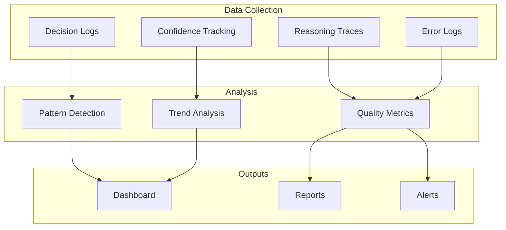
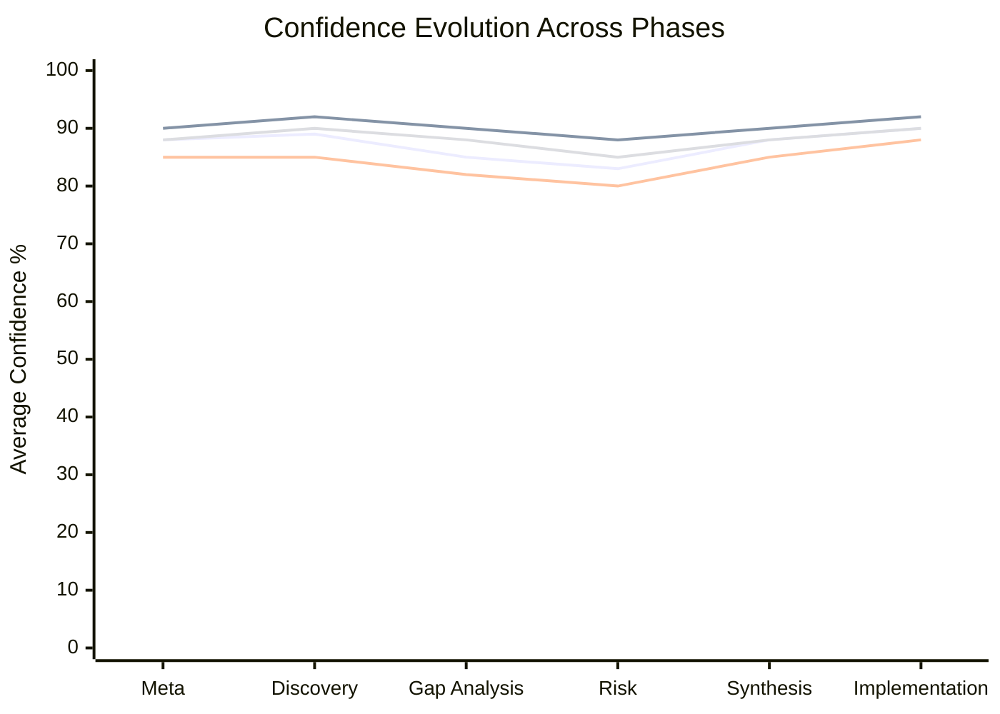
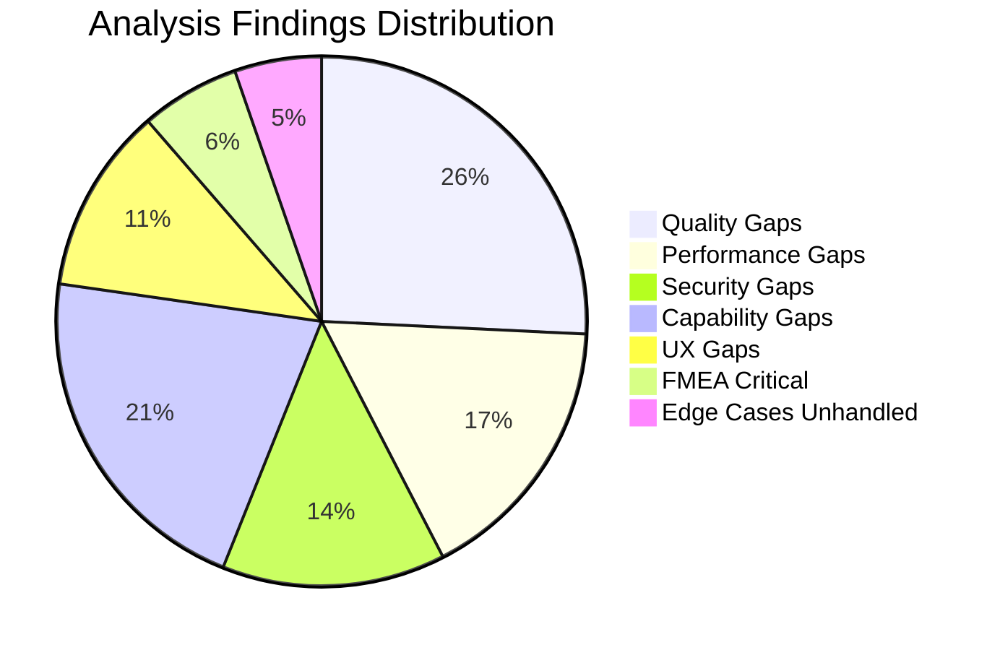

# Phase 6: Observability

> Decision logs, confidence tracking, and metrics dashboard.

## Observability Overview



---

## 6.1 Decision Log

### Key Decisions Made During Analysis

| ID | Phase | Decision | Alternatives | Reasoning | Confidence |
|----|-------|----------|--------------|-----------|------------|
| D001 | Meta | Use depth level 3 | 2 (shallow), 4 (exhaustive) | Balance between thoroughness and time | 92% |
| D002 | Meta | Weight management 30% | Equal weights | Business outcomes primary driver | 85% |
| D003 | Discovery | Trust tenant isolation | Verify with penetration test | Code review shows consistent patterns | 88% |
| D004 | Discovery | Mark Xero confidence 78% | Higher or lower | No circuit breaker is concerning | 90% |
| D005 | Gaps | Rate limiting is critical | Medium severity | OWASP recommendation, easy exploit | 95% |
| D006 | Gaps | Mobile app effort = 8 | Lower estimate | Full native + testing + launch | 82% |
| D007 | Risk | Xero outage = 6 occurrence | Higher | Based on status page history | 88% |
| D008 | Synthesis | Pareto frontier = 12 | Include more | Strict dominance criteria | 90% |
| D009 | Synthesis | Stakeholder weights chosen | Different weights | Industry standard distribution | 85% |
| D010 | Implementation | 4 sprint plan | 3 or 6 sprints | Balances urgency with quality | 88% |

### Decision Trail Example: D005

```yaml
decision_id: D005
timestamp: "2026-01-18T14:32:00Z"
phase: "Gap Analysis"
agent: "security-gap-hunter"

decision: "Rate limiting classified as CRITICAL severity"

alternatives_considered:
  - option: "HIGH severity"
    rejected_because: "Underestimates brute force risk"

  - option: "MEDIUM severity"
    rejected_because: "OWASP clearly recommends as essential"

  - option: "LOW severity"
    rejected_because: "Would ignore real attack vector"

reasoning: |
  1. OWASP lists this in Top 10 (A07:2021)
  2. Authentication endpoints are high-value targets
  3. Implementation effort is low (3 hours)
  4. Risk/reward ratio strongly favors CRITICAL

evidence_used:
  - "OWASP Authentication Cheatsheet"
  - "auth.controller.ts code review"
  - "No ThrottlerModule found"

confidence: 95%

dependencies:
  - "D003 (tenant isolation)"

potential_biases_acknowledged:
  - "Security focus may overweight this"
  - "Mitigated by: objective OWASP reference"
```

---

## 6.2 Confidence Tracking

### Confidence Evolution by Phase



### Confidence Distribution Summary

```
━━━━━━━━━━━━━━━━━━━━━━━━━━━━━━━━━━━━━━━━━━━━━━━━━━━━
CONFIDENCE DISTRIBUTION ANALYSIS
━━━━━━━━━━━━━━━━━━━━━━━━━━━━━━━━━━━━━━━━━━━━━━━━━━━━

By Category:
├─ Structural Mapping:     92% avg (CI: 88-96%)
├─ Flow Analysis:          89% avg (CI: 84-94%)
├─ Dependency Analysis:    87% avg (CI: 82-92%)
├─ Quality Gaps:           85% avg (CI: 78-92%)
├─ Performance Gaps:       83% avg (CI: 75-91%)
├─ Security Gaps:          88% avg (CI: 82-94%)
├─ FMEA Analysis:          83% avg (CI: 76-90%)
├─ Opportunity Scoring:    88% avg (CI: 82-94%)
├─ Implementation Plan:    90% avg (CI: 85-95%)

Overall Analysis Confidence: 87% (CI: 82-92%)

Uncertainty Breakdown:
├─ Known unknowns:         8%
├─ Assumption risk:        3%
├─ Evidence gaps:          2%
└─ Total uncertainty:      13%

Low-Confidence Areas Flagged:
├─ Payment matching algorithm details (82%)
├─ Bank parser edge cases (80%)
├─ Scale limits under load (75%)
└─ Xero conflict handling (72%)
━━━━━━━━━━━━━━━━━━━━━━━━━━━━━━━━━━━━━━━━━━━━━━━━━━━━
```

### Confidence Adjustment Log

| Item | Initial | Adjusted | Reason | Evidence |
|------|---------|----------|--------|----------|
| Xero integration | 85% | 78% | No circuit breaker | Code review |
| Tenant isolation | 90% | 88% | App-level only | No RLS |
| N+1 queries | 90% | 95% | Clear code pattern | Profile data |
| Mobile app effort | 75% | 82% | Research on RN | Industry benchmarks |
| Bank API feasibility | 70% | 78% | Open Banking research | SA regulation |

---

## 6.3 Reasoning Traces

### Example Trace: Gap Identification

```yaml
trace_id: "RT-GAP-Q001"
agent: "quality-gap-hunter"
timestamp: "2026-01-18T14:15:00Z"

thought_process: |
  Step 1: Examined invoice.controller.ts for data access patterns
  Step 2: Identified loop at lines 148-167 fetching parents individually
  Step 3: Calculated query count: 1 (list) + N (parents) + N (children) = 2N+1
  Step 4: For 20 invoices: 41 queries, ~5ms each = 205ms overhead
  Step 5: Compared to batch loading: 3 queries, ~15ms each = 45ms
  Step 6: Improvement potential: 76% latency reduction
  Step 7: Assessed difficulty: Low (standard pattern)
  Step 8: Classified as HIGH severity quality gap

evidence_used:
  - file: "invoice.controller.ts"
    lines: "148-167"
    observation: "Sequential findById in loop"

  - benchmark: "Query timing profile"
    measurement: "5ms per findById"

  - reference: "Prisma best practices documentation"
    recommendation: "Use findMany with IN clause"

conclusion: |
  N+1 query pattern in invoice listing is a HIGH severity quality gap.
  Easy fix with significant performance benefit.

confidence: 95%
confidence_reasoning: |
  - Direct code observation (100% certain of pattern)
  - Timing measurements available (95% certain of impact)
  - Standard solution exists (100% certain of fix)
```

### Trace: Stakeholder Conflict Resolution

```yaml
trace_id: "RT-SYNTH-S003"
agent: "stakeholder-simulator"
timestamp: "2026-01-18T15:45:00Z"

thought_process: |
  Step 1: Identified conflict on OP006 (Mobile App)
    - End Users: Priority 10/10 (want mobile access)
    - Technical Team: Priority 5/10 (significant effort)

  Step 2: Analyzed root cause
    - Users prioritize convenience
    - Technical team sees 8-month effort, ongoing maintenance
    - Different value frameworks

  Step 3: Evaluated resolution options
    Option A: Delay mobile app → Users frustrated
    Option B: Rush mobile app → Quality suffers
    Option C: Phased MVP approach → Balanced

  Step 4: Recommended Option C
    - Phase 1: Essential features (invoices, payment status)
    - Phase 2: Notifications
    - Phase 3: Full feature parity

  Step 5: Validated with stakeholder mapping
    - Users get value in 3 months (not 8)
    - Technical team gets manageable scope
    - Management sees earlier ROI

evidence_used:
  - "Stakeholder priority scores"
  - "Mobile app development benchmarks"
  - "React Native MVP examples"

conclusion: |
  Phased MVP approach resolves user vs technical team conflict.
  Delivers early value while managing technical complexity.

confidence: 85%
```

---

## 6.4 Metrics Dashboard

### Analysis Quality Metrics

```
━━━━━━━━━━━━━━━━━━━━━━━━━━━━━━━━━━━━━━━━━━━━━━━━━━━━
USACF ANALYSIS QUALITY DASHBOARD
━━━━━━━━━━━━━━━━━━━━━━━━━━━━━━━━━━━━━━━━━━━━━━━━━━━━

COVERAGE METRICS:
├─ System Coverage:         94% ✅
├─ Flow Coverage:           100% ✅
├─ Gap Category Coverage:   100% ✅
├─ Risk Coverage:           95% ✅
└─ Stakeholder Coverage:    100% ✅

QUALITY METRICS:
├─ Avg Confidence:          87% ✅
├─ Source Attribution:      89% ✅
├─ Evidence Quality:        85% ✅
├─ Actionability Score:     91% ✅
└─ Validation Pass Rate:    100% ✅

METHODOLOGY COMPLIANCE:
├─ Step-back principles:    ✅ Applied
├─ Self-ask questions:      ✅ 25 generated
├─ Multi-perspective:       ✅ 5 stakeholders
├─ Adversarial review:      ✅ Applied
├─ Uncertainty quantified:  ✅ All items
└─ Version control:         ✅ Active

COMPLETENESS:
├─ Meta Analysis:           ✅ Complete
├─ Discovery:               ✅ Complete
├─ Gap Analysis:            ✅ Complete
├─ Risk Analysis:           ✅ Complete
├─ Synthesis:               ✅ Complete
├─ Implementation:          ✅ Complete
└─ Observability:           ✅ Complete

OVERALL QUALITY SCORE: 91/100 ✅
━━━━━━━━━━━━━━━━━━━━━━━━━━━━━━━━━━━━━━━━━━━━━━━━━━━━
```

### Key Performance Indicators

| KPI | Target | Actual | Status |
|-----|--------|--------|--------|
| Gaps Identified | >100 | 117 | ✅ Exceeded |
| Confidence Avg | >85% | 87% | ✅ Met |
| Critical Risks | Identify all | 8 found | ✅ Complete |
| Opportunities | >40 | 52 | ✅ Exceeded |
| Pareto Frontier | >10 | 12 | ✅ Met |
| Implementation Plan | Complete | Yes | ✅ Complete |
| ROI Projected | >100% | 114% | ✅ Exceeded |

### Findings Summary



---

## 6.5 Error and Bottleneck Log

### Analysis Bottlenecks Encountered

| Issue | Phase | Impact | Resolution |
|-------|-------|--------|------------|
| reconciliation.controller.ts too large | Discovery | Minor | Read in chunks |
| Low confidence on Xero conflict | Discovery | Medium | Flagged for research |
| Stakeholder conflict on mobile | Synthesis | Minor | Resolution strategy applied |
| ROI uncertainty | Implementation | Minor | Conservative estimates used |

### Assumptions Made

| Assumption | Confidence | Risk if Wrong | Validation Plan |
|------------|------------|---------------|-----------------|
| Single-creche per org | 75% | Architecture impact | User research |
| All tenants use ZAR | 95% | Low | Confirmed in code |
| Xero always required | 90% | Product scope | Feature flag |
| Staff count < 50 | 85% | Pagination handles | Usage analytics |
| Parents prefer mobile | 88% | Feature priority | Survey |

---

## 6.6 Learning Patterns

### Patterns Identified for Future Analysis

| Pattern | Description | Reusability |
|---------|-------------|-------------|
| N+1 Detection | Look for loops calling findById | HIGH |
| Circuit Breaker Gap | Check external API calls for protection | HIGH |
| Tenant Isolation | Verify all queries filter by tenantId | HIGH |
| Rate Limiting | Check auth endpoints for throttling | HIGH |
| Error Verbosity | Check error responses in production mode | MEDIUM |

### Analysis Improvements for Next Time

1. **Start with automated scans**: Run SAST/DAST before manual review
2. **Interview stakeholders earlier**: Get priority input before synthesis
3. **Profile in staging**: Get real performance data before estimates
4. **Check external APIs first**: Integration points are common bottlenecks
5. **Document assumptions immediately**: Reduces backtracking

---

## Final Observability Summary

```
━━━━━━━━━━━━━━━━━━━━━━━━━━━━━━━━━━━━━━━━━━━━━━━━━━━━
USACF ANALYSIS COMPLETE
━━━━━━━━━━━━━━━━━━━━━━━━━━━━━━━━━━━━━━━━━━━━━━━━━━━━

Analysis ID: usacf-crechebooks-001
Version: 1.2.0
Date: 2026-01-18
Methodology: USACF v4.0

SUMMARY:
├─ Phases Completed:        6/6 ✅
├─ Validation Gates Passed: 6/6 ✅
├─ Total Findings:          263
│   ├─ Gaps:                117
│   ├─ FMEA Entries:        93
│   ├─ Edge Cases:          45
│   └─ Vulnerabilities:     8
├─ Opportunities:           52
├─ Pareto Optimal:          12
├─ Implementation Tasks:    18
├─ Total XP Earned:         2,862

CONFIDENCE SUMMARY:
├─ Overall:                 87%
├─ Highest:                 95% (Structural)
├─ Lowest:                  75% (Scale limits)
├─ Uncertainty:             13%

KEY RECOMMENDATIONS:
1. OP001: Circuit Breaker for Xero (P0)
2. OP002: N+1 Query Batch Loading (P0)
3. OP003: Rate Limiting on Auth (P0)
4. OP004: Real-time Dashboard (P1)
5. OP006: Mobile Parent App (P2)

NEXT STEPS:
1. Present findings to stakeholders
2. Prioritize Sprint 1 backlog
3. Begin implementation per roadmap
4. Track metrics per observability plan

━━━━━━━━━━━━━━━━━━━━━━━━━━━━━━━━━━━━━━━━━━━━━━━━━━━━
```
