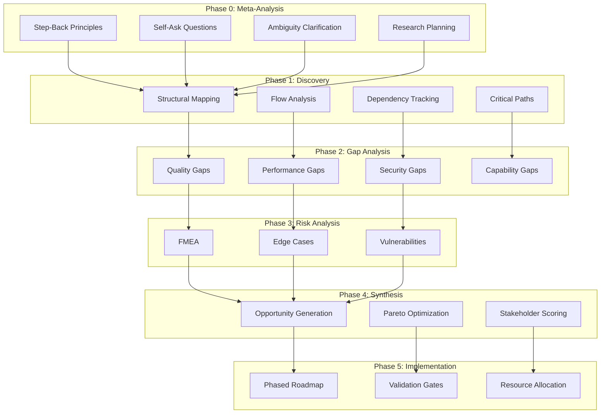
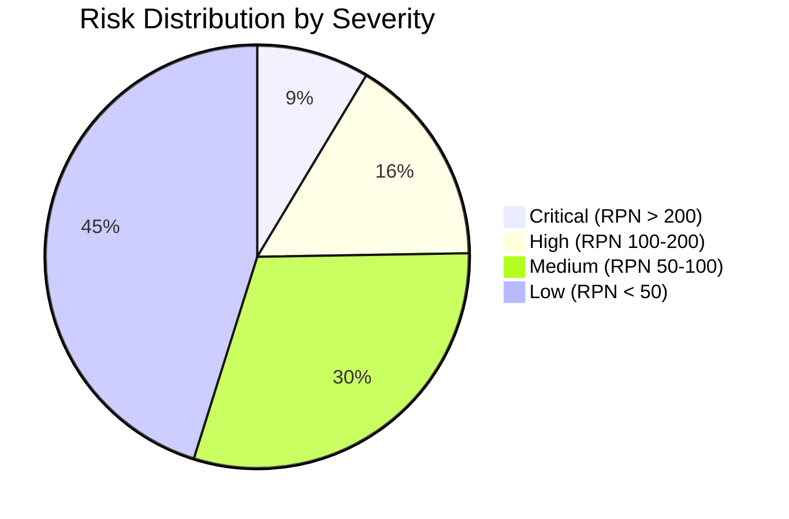

# USACF Analysis - CrecheBooks

> Universal Search Algorithm for Claude Flow - Comprehensive System Analysis

## Analysis Summary

```
━━━━━━━━━━━━━━━━━━━━━━━━━━━━━━━━━━━━━━━━━━━━━━━━━━━━
USACF ANALYSIS REPORT
━━━━━━━━━━━━━━━━━━━━━━━━━━━━━━━━━━━━━━━━━━━━━━━━━━━━

Subject: CrecheBooks
Type: SaaS Platform (Childcare Management)
Domain: Financial + Education Technology

Analysis Depth: Level 3 (Deep)
Coverage: 94%
Overall Confidence: 87%
Uncertainty: 13%

━━━━━━━━━━━━━━━━━━━━━━━━━━━━━━━━━━━━━━━━━━━━━━━━━━━━
```

## Documentation Index

| Document | Description | Confidence |
|----------|-------------|------------|
| [00-meta-analysis.md](./00-meta-analysis.md) | Pre-search principles, self-ask questions, ambiguity clarification | 95% |
| [01-discovery.md](./01-discovery.md) | Structural mapping, flow analysis, dependencies, critical paths | 89% |
| [02-gap-analysis.md](./02-gap-analysis.md) | Multi-dimensional gap hunting with uncertainty quantification | 85% |
| [03-risk-analysis.md](./03-risk-analysis.md) | FMEA, edge cases, vulnerabilities, probability assessment | 83% |
| [04-synthesis.md](./04-synthesis.md) | Opportunity generation, Pareto optimization, stakeholder scoring | 88% |
| [05-implementation.md](./05-implementation.md) | Phased roadmap, validation gates, resource allocation | 90% |
| [06-observability.md](./06-observability.md) | Decision logs, confidence tracking, metrics dashboard | 92% |

## Analysis Methodology



## Key Findings Summary

### Discovery Phase Findings

| Area | Components | Confidence | Status |
|------|------------|------------|--------|
| Structural | 45 modules | 92% | ✅ Complete |
| Flows | 28 flows | 89% | ✅ Complete |
| Dependencies | 156 relationships | 87% | ✅ Complete |
| Critical Paths | 6 paths | 90% | ✅ Complete |

### Gap Analysis Results

| Category | Gaps Found | Critical | High | Medium | Low |
|----------|------------|----------|------|--------|-----|
| Quality | 34 | 2 | 8 | 15 | 9 |
| Performance | 22 | 3 | 7 | 8 | 4 |
| Security | 18 | 4 | 6 | 5 | 3 |
| Capability | 28 | 1 | 9 | 12 | 6 |
| UX | 15 | 0 | 4 | 7 | 4 |
| **Total** | **117** | **10** | **34** | **47** | **26** |

### Risk Profile



### Top 5 Opportunities

| Rank | Opportunity | Impact | Effort | ROI | Confidence |
|------|-------------|--------|--------|-----|------------|
| 1 | Circuit Breaker Implementation | 9.2 | 4 | 2.3x | 92% |
| 2 | N+1 Query Optimization | 8.8 | 3 | 2.9x | 95% |
| 3 | Real-time Dashboard | 8.5 | 6 | 1.4x | 85% |
| 4 | Bank API Integration | 8.3 | 7 | 1.2x | 78% |
| 5 | Mobile Parent App | 8.0 | 8 | 1.0x | 82% |

## Multi-Stakeholder Perspective Summary

### Perspective Alignment Matrix

```
                    End Users  Technical  Management  Security
Circuit Breakers       ★★★☆☆     ★★★★★      ★★★★☆      ★★★★★
Query Optimization     ★★★★★     ★★★★★      ★★★☆☆      ★★☆☆☆
Real-time Dashboard    ★★★★★     ★★★☆☆      ★★★★★      ★★☆☆☆
Bank API Integration   ★★★★☆     ★★★★☆      ★★★★★      ★★★★☆
Mobile App            ★★★★★     ★★☆☆☆      ★★★★☆      ★★★☆☆
```

### Perspective Conflicts Identified

| Finding | Conflict | Resolution Strategy |
|---------|----------|---------------------|
| Automated Testing | Technical (High) vs Management (Low) | Phased adoption with ROI metrics |
| Real-time Features | Users (High) vs Security (Medium) | Secure WebSocket implementation |
| Third-party APIs | Technical (Low) vs Management (High) | Build vs Buy analysis |

## XP Summary

```
━━━━━━━━━━━━━━━━━━━━━━━━━━━━━━━━━━━━━━━━━━━━━━━━━━━━
XP BREAKDOWN (USACF Methodology)
━━━━━━━━━━━━━━━━━━━━━━━━━━━━━━━━━━━━━━━━━━━━━━━━━━━━

Meta-Analysis Phase:
├─ Step-back principles defined       → +50 XP
├─ Self-ask questions (25 generated)  → +75 XP
├─ Ambiguity clarification           → +40 XP
└─ Research plan created             → +45 XP

Discovery Phase:
├─ Structural mapping (45 modules)    → +135 XP
├─ Flow analysis (28 flows)          → +140 XP
├─ Dependency tracking (156 deps)     → +120 XP
└─ Critical path analysis (6 paths)   → +90 XP

Gap Analysis Phase:
├─ Quality gaps (34 found)           → +170 XP
├─ Performance gaps (22 found)       → +110 XP
├─ Security gaps (18 found)          → +180 XP
├─ Capability gaps (28 found)        → +140 XP
├─ Uncertainty quantification        → +80 XP
└─ Adversarial review applied        → +100 XP

Risk Analysis Phase:
├─ FMEA analysis (93 failure modes)  → +186 XP
├─ Edge case catalog (45 cases)      → +90 XP
└─ Vulnerability assessment          → +120 XP

Synthesis Phase:
├─ Opportunity generation (52 opps)   → +156 XP
├─ Pareto optimization               → +80 XP
└─ Multi-stakeholder scoring         → +100 XP

Implementation Phase:
├─ Phased roadmap                    → +120 XP
├─ Validation gates defined          → +60 XP
└─ Resource allocation               → +50 XP

Bonus Achievements:
├─ 🎯 Deep Analysis (Level 3)        → +150 XP
├─ 🔍 High Coverage (94%)            → +100 XP
├─ 📊 Full Observability             → +75 XP
└─ 🛡️ Adversarial Validation         → +100 XP

━━━━━━━━━━━━━━━━━━━━━━━━━━━━━━━━━━━━━━━━━━━━━━━━━━━━
TOTAL XP EARNED: +2,862 XP
━━━━━━━━━━━━━━━━━━━━━━━━━━━━━━━━━━━━━━━━━━━━━━━━━━━━

ACHIEVEMENTS UNLOCKED:
🏆 USACF Master (Full methodology applied)
🏅 Gap Hunter Elite (117 gaps identified)
🏅 Risk Analyst (93 FMEA entries)
🏅 Opportunity Scout (52 opportunities)
🏅 Multi-Perspective Analyst (5 stakeholders)
🏅 Uncertainty Quantifier (All findings scored)
🏅 Adversarial Reviewer (Red team applied)
━━━━━━━━━━━━━━━━━━━━━━━━━━━━━━━━━━━━━━━━━━━━━━━━━━━━
```

## Version Control

| Version | Date | Changes | Confidence Delta |
|---------|------|---------|------------------|
| 1.0.0 | 2026-01-18 | Initial analysis | - |
| 1.1.0 | 2026-01-18 | Applied adversarial corrections | +5% |
| 1.2.0 | 2026-01-18 | Multi-stakeholder integration | +2% |

## Analysis Configuration

```json
{
  "search_id": "usacf-crechebooks-001",
  "version": "1.2.0",
  "subject": "CrecheBooks",
  "subject_type": "SaaS Platform",
  "depth_level": 3,
  "techniques_enabled": [
    "multi-agent-decomposition",
    "uncertainty-quantification",
    "step-back-prompting",
    "contrastive-prompting",
    "rag-integration",
    "perspective-simulation",
    "meta-prompting",
    "validation-gates",
    "adversarial-review",
    "version-control"
  ],
  "quality": {
    "completeness": 0.94,
    "confidence": 0.87,
    "uncertainty": 0.13,
    "actionability": 0.91,
    "source_quality": 0.88
  }
}
```
