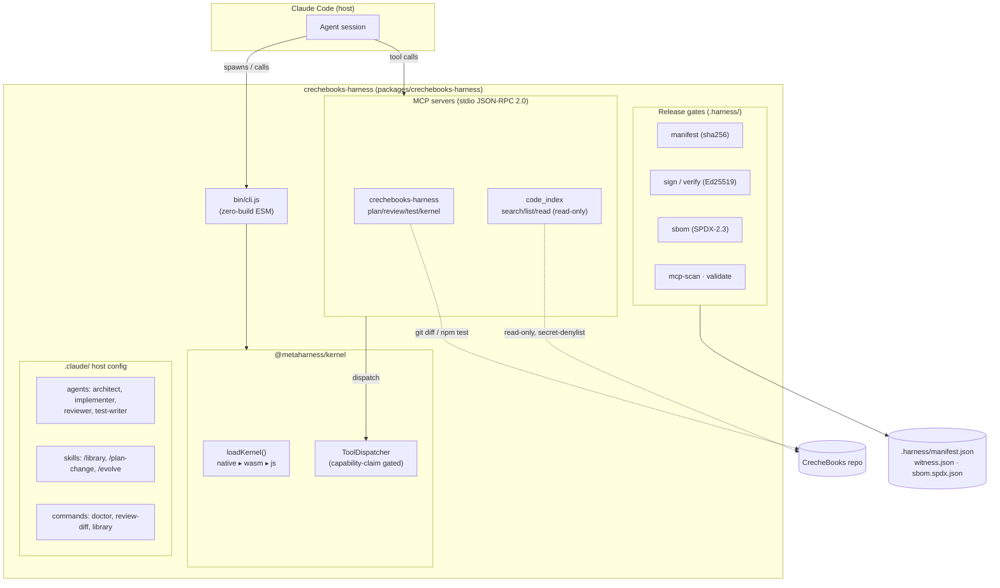
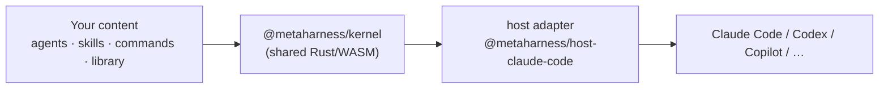
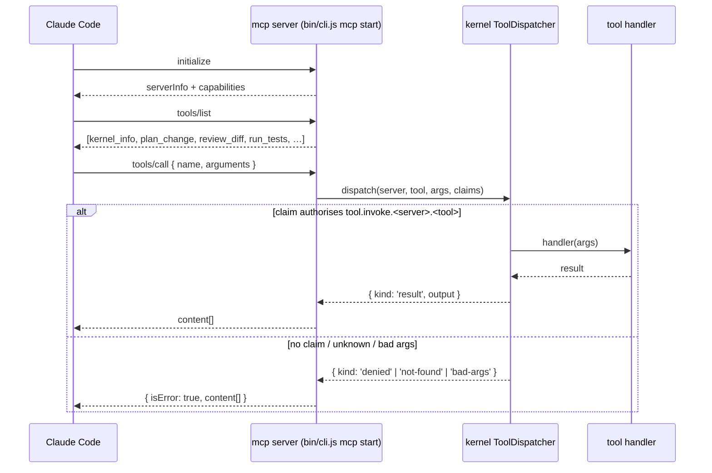
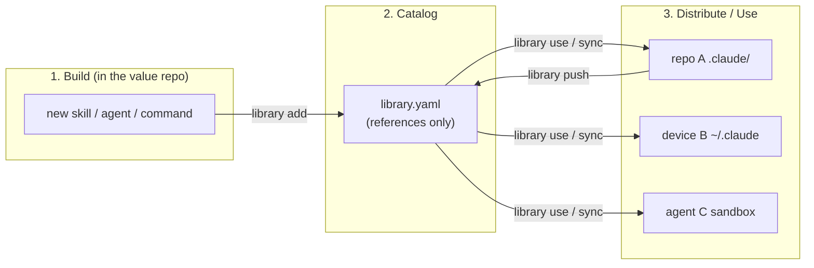
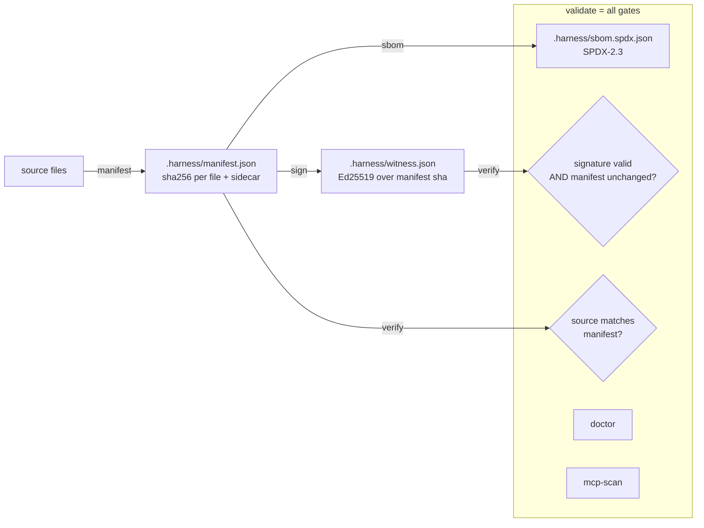
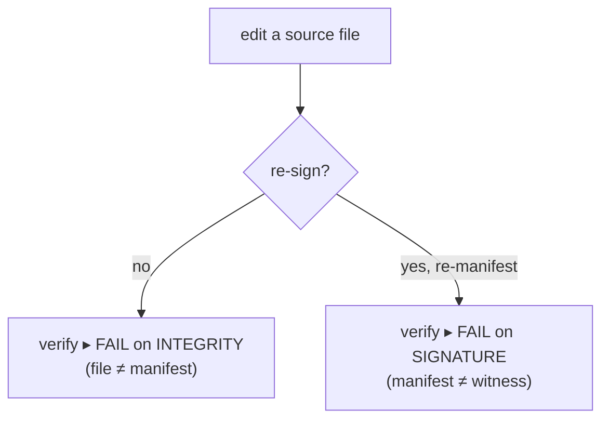
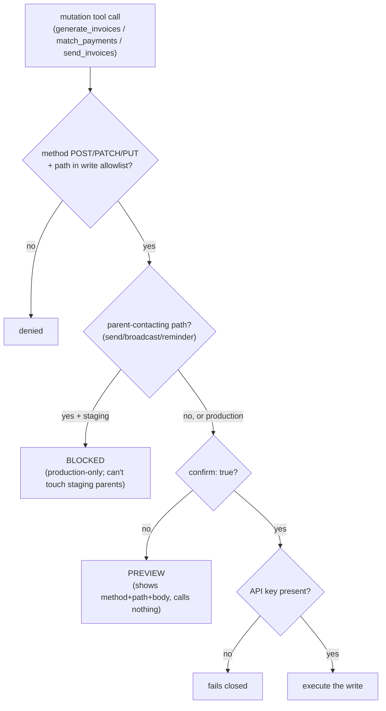
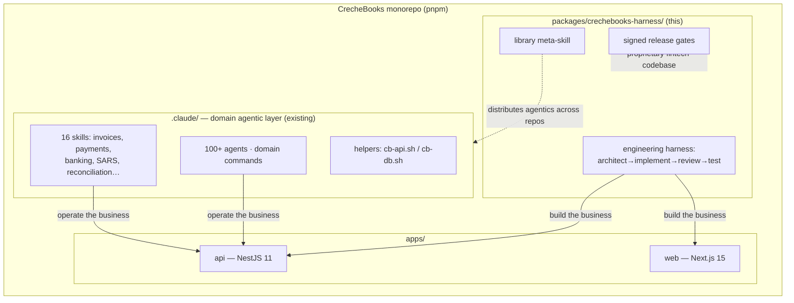

# crechebooks-harness — Architecture & Fit

> A branded, npm-publishable AI agent harness for the CrecheBooks monorepo, generated with
> [`metaharness`](https://github.com/ruvnet/agent-harness-generator) (`vertical:coding` ·
> host `claude-code`) and then extended into a fully working harness: real MCP servers, a
> distribution meta-skill, and signed release gates.
>
> **The model is replaceable; the harness is the product.**

This document explains what we built, how the pieces fit together, and where the harness
sits inside CrecheBooks.

---

## 1. What this is (and isn't)

| It **is** | It is **not** |
|---|---|
| An *engineering* harness — a shippable agent for building/maintaining the codebase | A replacement for the domain `.claude/` skills (invoices, payments, SARS…) |
| A standalone `npx crechebooks-harness` CLI backed by a Rust→WASM kernel | A new framework you must adopt — it's "a starting point you own" |
| **Three** stdio MCP servers (engineering + code-index + **read-only CrecheBooks finance**), a `library` meta-skill, and signed release gates | A *write* path to the business — every domain tool is read-only; mutations stay in the app |

> **Product surface (shipped):** the `crechebooks` MCP server (`mcp domain`) exposes read-only
> finance tools (`tenant_info`, `dashboard_metrics`, `list_invoices`, `list_payments`,
> `arrears_report`, `reconciliation_summary`) **plus phase-2b guarded writes** (`generate_invoices`,
> `match_payments`, `send_invoices`) and a `bookkeeper` agent. Writes are preview-default;
> parent-contacting sends are hard-blocked on staging (see §6b).

It lives as a workspace package at **`packages/crechebooks-harness/`** and complements the
existing CrecheBooks agentic layer rather than competing with it.

---

## 2. The big picture



**Reading it:** the host (Claude Code) drives the harness two ways — by running the **CLI**
and by calling the **MCP tools**. Every tool call is dispatched through the kernel's
`ToolDispatcher`, which checks a capability claim before the handler runs. The `.claude/`
config makes the agents/skills/commands discoverable; the `.harness/` gates attest the
whole thing.

---

## 3. The three layers MetaHarness produces



- **Your content** — what makes *this* harness CrecheBooks-specific.
- **Kernel** — `loadKernel()` resolves `native ▸ wasm ▸ js` (js is the floor, so the harness
  is always loadable); also provides `ToolDispatcher` and `mcpValidate`.
- **Host adapter** — renders the host's config (`settingsFor`, `claudeMd`, `agentMarkdown`).

Users only ever touch the branded CLI; the factory stays invisible.

---

## 4. MCP servers & tools

Two **zero-dependency** stdio servers (newline-delimited JSON-RPC 2.0), wired in
`.claude/settings.json`. Tool execution is routed through the kernel's capability-gated
`ToolDispatcher` — so the kernel owns the allow/deny decision and the server owns host-side
execution.



| Server | Tool | Purpose |
|---|---|---|
| `crechebooks-harness` | `kernel_info` | Resolved backend + version + diagnostics |
| | `harness_doctor` | End-to-end health check |
| | `list_agents` | Agent roster (name, tier, role) |
| | `plan_change` | Minimal file-level plan for a request |
| | `review_diff` | Current `git diff` (read-only) for review |
| | `run_tests` | The project's own `pnpm/npm test` |
| `code_index` | `search_code` | ripgrep/grep, cwd-confined, secrets filtered |
| | `list_files` | git-tracked files, secrets excluded |
| | `read_file` | symlink-safe, secret-denylist, size-capped |

**Safety by design:** there is no arbitrary-shell tool. Everything is read-only or runs the
project's declared test script. `read_file`/`search_code`/`list_files` enforce a
secret-file denylist (`.env*`, keys, `.npmrc`, …) *in the handler* — so the protection holds
even when the MCP server runs outside Claude Code's `deny` rules.

---

## 5. The `library` meta-skill — multi-repo distribution

The harness ships the "one skill to unlock them all" pattern: a **reference catalog**
(`library.yaml`) that points at where each skill/agent/command actually lives — references,
not copies. This directly addresses the real problem of running agentics across *many* repos
and devices (CrecheBooks + every other repo you work in).



`add` · `use` · `push` · `list` · `search` · `sync` — each is a plain-English file in
`.claude/skills/library/cookbook/`. `sync` pulls the latest *code*, not just the catalog, so
every device/teammate/agent stays on one version. It's a pure-agentic application: just
`SKILL.md` + `library.yaml` + the cookbook, no code.

---

## 6. Release gates — provenance & audit

Zero-dependency gates (Node's built-in `crypto` for Ed25519). A fresh harness passes; once
signed + SBOM'd, those gates become enforcing.



**Two-layer tamper detection** (proven in tests):



Either path is caught. The private key (`.harness/keys/signing.key`) is gitignored; the
public key, witness, and SBOM are committed so anyone can verify a release.

`mcp-scan` statically audits the MCP surface — wildcard grants, missing secret-denies, and
`exec`/`eval`/`shell:true`/network patterns in tool code — and fails on HIGH.

---

## 6b. Write safety (phase 2b)

The product surface can *write*, but only through a safety gate that makes a dangerous
action impossible to do by accident. The repo's hard rule — never contact real parents from
staging — is enforced in code, not convention.



Three layers, each independent: the **staging hard-block** for parent contact, the
**preview-default** (`confirm:true` required), and the **per-use approval** in Claude Code
(`send_invoices` is deliberately left out of the pre-authorized allow-list). `match_payments`
and `generate_invoices` are internal (no parent contact), so they're confirm-gated but allowed
on either environment.

## 7. How it fits CrecheBooks



**The division of labour:**

- The **existing `.claude/` skills** *operate* CrecheBooks — invoices, payments, SARS returns,
  reconciliation. They talk to the live API via `cb-api.sh` / `cb-db.sh`. Untouched.
- **This harness** *builds* CrecheBooks — a self-contained, branded engineering agent
  (architect → implementer → reviewer → test-writer) with code-search, plan, diff-review, and
  test MCP tools. It's the development counterpart to the operational skills.
- The **`library` meta-skill** is the bridge across your *other* repos: catalog a great
  CrecheBooks skill/agent once, distribute it everywhere by reference, keep it in sync.
- The **release gates** matter specifically because CrecheBooks is a **proprietary financial
  app** handling tenant financial data: Ed25519 provenance (what shipped, signed), an SPDX
  SBOM (what's in it), and a secret-aware MCP layer (`.env`/keys never leak through a tool)
  align with the project's audit-logging and tenant-isolation posture.

**Product surface — what's shipped vs. deferred:** the `crechebooks` MCP server now provides
**read-only** access to invoices, payments, arrears, reconciliation, and the dashboard, driven
by a `bookkeeper` agent — a branded "CrecheBooks bookkeeping agent" you can point at staging or
production. What it deliberately does **not** do yet is *write*: generating/sending invoices,
matching payments, or broadcasting. Those side-effecting paths are hard-denied at the client
(even under GET), honouring the repo's staging-comms safety rule. Adding them — preview-default,
env-guarded, never auto-sending on staging — is phase 2b.

---

## 8. Command reference

```bash
# lifecycle
crechebooks-harness init           # boot kernel + host adapter
crechebooks-harness doctor         # verify the install

# MCP servers (stdio)
crechebooks-harness mcp start      # harness tools
crechebooks-harness mcp index      # read-only code search

# release gates
crechebooks-harness manifest       # refresh integrity manifest
crechebooks-harness sbom           # SPDX-2.3 SBOM
crechebooks-harness sign           # Ed25519 witness
crechebooks-harness verify         # signature + integrity
crechebooks-harness mcp-scan       # static MCP audit
crechebooks-harness validate       # all gates, one report

# self-evolution (Darwin Mode)
npm run evolve                     # frozen model, evolving harness (sandboxed)
npm run evolve:dry                 # offline, no test execution
```

Slash commands / skills inside Claude Code: `/library`, `/plan-change`, `/evolve`,
`/review-diff`, `/doctor`.

---

## 9. File map

```
packages/crechebooks-harness/
├── bin/cli.js                 # branded CLI (init/doctor/mcp/gates) — zero build step
├── src/
│   ├── agents/                # architect, implementer, reviewer, test-writer
│   ├── mcp/
│   │   ├── server.js          # JSON-RPC 2.0 stdio transport + kernel dispatch
│   │   ├── tools.js           # harness toolset
│   │   └── index-tools.js     # read-only code_index toolset (secret-guarded)
│   └── gates/
│       ├── manifest.js        # content-addressed integrity manifest
│       ├── sign.js            # Ed25519 sign/verify
│       ├── sbom.js            # SPDX-2.3 emitter
│       ├── mcp-scan.js        # static MCP audit
│       └── validate.js        # gate orchestrator
├── .claude/
│   ├── settings.json          # MCP servers + scoped permissions
│   ├── agents/ skills/ commands/   # incl. skills/library/ (meta-skill + cookbook)
├── .harness/
│   ├── manifest.json + .sha256     # integrity
│   ├── witness.json                # Ed25519 signature (committed)
│   ├── sbom.spdx.json              # SBOM (committed)
│   └── keys/ (signing.pub tracked, signing.key gitignored)
├── __tests__/                 # smoke + mcp + gates (21 tests)
├── CLAUDE.md  README.md
```

Verify any release with `crechebooks-harness validate`.
