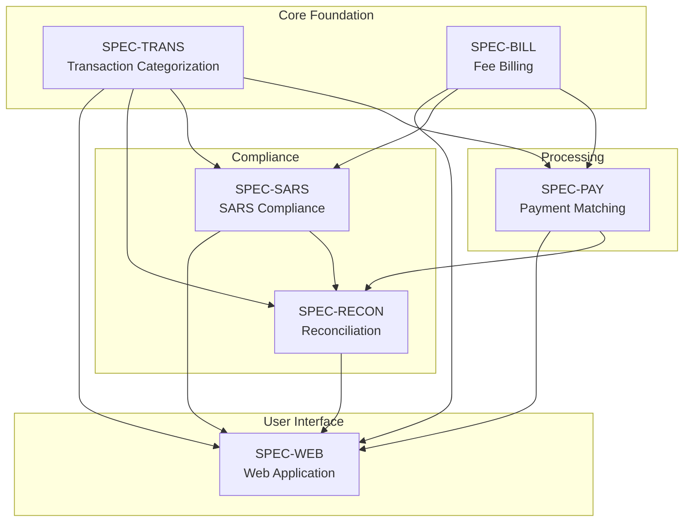

# Functional Specifications Index

## CrecheBooks AI Bookkeeping System

**Version**: 1.0
**Last Updated**: 2025-12-19
**Status**: Complete

---

## Specification Manifest

| ID | Domain | Title | Priority | Status | File |
|----|--------|-------|----------|--------|------|
| SPEC-TRANS | Transaction Categorization | Smart Transaction Categorization | MUST | Complete | [transaction-categorization.md](./transaction-categorization.md) |
| SPEC-BILL | Fee Billing | Automated Fee Billing | MUST | Complete | [fee-billing.md](./fee-billing.md) |
| SPEC-PAY | Payment Matching | Payment Matching & Arrears | MUST | Complete | [payment-matching.md](./payment-matching.md) |
| SPEC-SARS | SARS Compliance | SARS Compliance Engine | MUST | Complete | [sars-compliance.md](./sars-compliance.md) |
| SPEC-RECON | Reconciliation | Intelligent Reconciliation | MUST | Complete | [reconciliation.md](./reconciliation.md) |
| SPEC-WEB | Web Application | CrecheBooks Web Application UI | MUST | Ready | [web-application.md](./web-application.md) |

---

## Dependency Graph

---

## Domain Overview

### SPEC-TRANS: Transaction Categorization
**Purpose**: Automatically categorize bank transactions to Chart of Accounts using Claude Code AI agents.
**Key Capabilities**:
- Bank feed import (Yodlee, CSV, PDF)
- AI-powered categorization with 95%+ accuracy
- Learning from user corrections
- Bi-directional Xero sync

### SPEC-BILL: Fee Billing
**Purpose**: Generate, send, and track school fee invoices for enrolled children.
**Key Capabilities**:
- Automated monthly invoice generation
- Variable fee structures (full-day, half-day, siblings)
- Multi-channel delivery (email, WhatsApp)
- Pro-rata calculations

### SPEC-PAY: Payment Matching
**Purpose**: Match incoming bank payments to outstanding invoices and manage arrears.
**Key Capabilities**:
- Intelligent payment matching (reference, amount, name)
- Partial and combined payment support
- Arrears tracking and automated reminders
- Parent payment history

### SPEC-SARS: SARS Compliance
**Purpose**: Calculate and generate South African tax submissions (VAT, PAYE, UIF).
**Key Capabilities**:
- VAT201 return generation
- EMP201 payroll submission
- IRP5 certificate generation
- Deadline tracking and reminders

### SPEC-RECON: Reconciliation
**Purpose**: Automatic bank reconciliation and financial reporting.
**Key Capabilities**:
- Automated transaction matching
- Discrepancy detection
- Financial statement generation
- Audit trail maintenance

### SPEC-WEB: Web Application
**Purpose**: Responsive Next.js frontend for creche owners, admins, and accountants.
**Key Capabilities**:
- Financial dashboard with key metrics and charts
- Transaction management with AI categorization UI
- Invoice generation, preview, and delivery
- Payment matching interface with AI suggestions
- Arrears tracking and reminder sending
- SARS submission preparation and export
- Bank reconciliation view
- Financial reporting with export options
- Parent and child enrollment management
- Staff and payroll management

---

## Cross-Domain Requirements

| ID | Requirement | Domains Affected |
|----|-------------|------------------|
| CROSS-001 | All financial calculations use Decimal.js with banker's rounding | ALL |
| CROSS-002 | All data operations maintain complete audit trail | ALL |
| CROSS-003 | Xero is single source of truth for Chart of Accounts | TRANS, BILL, PAY, RECON |
| CROSS-004 | Multi-tenant isolation enforced at all levels | ALL |
| CROSS-005 | POPIA compliance for all personal data handling | ALL |
| CROSS-006 | Claude Code agents follow defined autonomy levels | TRANS, PAY, SARS, RECON |

---

## Review Status

| Specification | Author Review | Technical Review | Stakeholder Approval |
|---------------|---------------|------------------|---------------------|
| SPEC-TRANS | Complete | Pending | Pending |
| SPEC-BILL | Complete | Pending | Pending |
| SPEC-PAY | Complete | Pending | Pending |
| SPEC-SARS | Complete | Pending | Pending |
| SPEC-RECON | Complete | Pending | Pending |
| SPEC-WEB | Complete | Pending | Pending |
