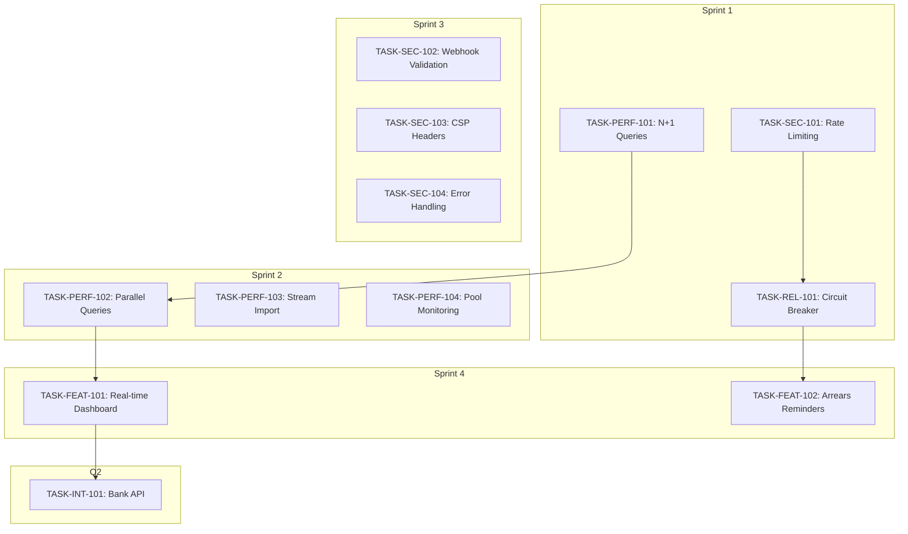

# USACF Sprint Tasks Index

> Task specifications generated from USACF Analysis v1.0 (docs/usacf-analysis/)

## Overview

This index tracks all tasks derived from the USACF (Universal Search Algorithm for Claude Flow)
analysis of the CrecheBooks codebase. Tasks are organized by sprint and priority, covering
performance, security, reliability, and feature improvements.

### Analysis Summary

| Metric | Value |
|--------|-------|
| Total Gaps Identified | 117 |
| Opportunities Generated | 52 |
| Pareto-Optimal Opportunities | 12 |
| Tasks Created | 12 |
| Overall Confidence | 87% |
| Projected ROI | 114% |

---

## Sprint 1: Foundation (Week 1-2)

**Focus**: Critical reliability and security fixes

| Task ID | Title | Priority | Effort | Opportunity | Status |
|---------|-------|----------|--------|-------------|--------|
| [TASK-PERF-101](TASK-PERF-101.md) | N+1 Query Batch Loading Fix | P0 | 4 days | OP002 | Ready |
| [TASK-SEC-101](TASK-SEC-101.md) | Rate Limiting on Auth Endpoints | P0 | 3 days | OP003 | Ready |
| [TASK-REL-101](TASK-REL-101.md) | Circuit Breaker for Xero | P0 | 5 days | OP001 | Ready |

**Sprint 1 Goals**:
- Invoice listing < 100ms (from 250ms)
- Auth endpoints rate limited (5/min)
- Xero outage graceful degradation working
- Zero regressions in existing tests

**Budget**: R43,000

---

## Sprint 2: Performance (Week 3-4)

**Focus**: Performance optimization and monitoring

| Task ID | Title | Priority | Effort | Opportunity | Status |
|---------|-------|----------|--------|-------------|--------|
| [TASK-PERF-102](TASK-PERF-102.md) | Parallel Dashboard Queries | P1 | 4 days | OP008 | Ready |
| [TASK-PERF-103](TASK-PERF-103.md) | Stream-based Bank Import | P1 | 6 days | OP007 | Ready |
| [TASK-PERF-104](TASK-PERF-104.md) | Connection Pool Monitoring | P1 | 3 days | OP015 | Ready |

**Sprint 2 Goals**:
- Dashboard load < 500ms (from 1.5s)
- Bank import handles 50MB files
- Connection pool metrics visible
- No memory spikes during batch ops

**Budget**: R55,000

---

## Sprint 3: Security Hardening (Week 5-6)

**Focus**: Security improvements and code quality

| Task ID | Title | Priority | Effort | Opportunity | Status |
|---------|-------|----------|--------|-------------|--------|
| [TASK-SEC-102](TASK-SEC-102.md) | Webhook Signature Validation | P1 | 3 days | OP009 | Ready |
| [TASK-SEC-103](TASK-SEC-103.md) | CSP Security Headers | P2 | 2 days | OP020 | Ready |
| [TASK-SEC-104](TASK-SEC-104.md) | Error Handling Standardization | P1 | 5 days | OP014 | Ready |

**Sprint 3 Goals**:
- All webhooks signature validated
- CSP headers on all responses
- No sensitive data in error messages
- Consistent error response format

**Budget**: R42,000

---

## Sprint 4: Feature Enhancement (Week 7-8)

**Focus**: High-value feature additions

| Task ID | Title | Priority | Effort | Opportunity | Status |
|---------|-------|----------|--------|-------------|--------|
| [TASK-FEAT-101](TASK-FEAT-101.md) | Real-time Dashboard (WebSocket) | P1 | 8 days | OP004 | Ready |
| [TASK-FEAT-102](TASK-FEAT-102.md) | Automated Arrears Reminders | P1 | 5 days | OP010 | Ready |

**Sprint 4 Goals**:
- Dashboard updates in real-time
- Automated arrears emails sent
- No performance regression
- User acceptance testing passed

**Budget**: R70,000

---

## Q2: Major Initiative

**Focus**: Strategic capability addition

| Task ID | Title | Priority | Effort | Opportunity | Status |
|---------|-------|----------|--------|-------------|--------|
| [TASK-INT-101](TASK-INT-101.md) | Bank API Integration (Open Banking) | P1 | 15 days | OP005 | Ready |

**Q2 Goals**:
- Automated bank transaction retrieval
- Support for major SA banks
- 80% reduction in manual imports
- POPIA compliant data handling

**Budget**: R40,000

---

## Task Dependencies

---

## Budget Summary

| Phase | Development | Infrastructure | Testing | Total |
|-------|-------------|----------------|---------|-------|
| Sprint 1 | R30,000 | R5,000 | R8,000 | R43,000 |
| Sprint 2 | R35,000 | R10,000 | R10,000 | R55,000 |
| Sprint 3 | R25,000 | R5,000 | R12,000 | R42,000 |
| Sprint 4 | R40,000 | R15,000 | R15,000 | R70,000 |
| **Q1 Total** | **R130,000** | **R35,000** | **R45,000** | **R210,000** |
| Q2 (Bank API) | R160,000 | R40,000 | R30,000 | R40,000* |

*Q2 budget shown is for Bank API only; Mobile App excluded per requirements

---

## Success Metrics

### Performance Targets

| Metric | Baseline | Target | Task |
|--------|----------|--------|------|
| Invoice List Response | 250ms | < 100ms | TASK-PERF-101 |
| Dashboard Load | 1.5s | < 500ms | TASK-PERF-102 |
| Bank Import Memory | 150MB | < 100MB | TASK-PERF-103 |

### Security Targets

| Metric | Baseline | Target | Task |
|--------|----------|--------|------|
| Auth Attack Block | 0% | 100% | TASK-SEC-101 |
| Webhook Spoofing | Vulnerable | Blocked | TASK-SEC-102 |
| XSS Prevention | None | Full CSP | TASK-SEC-103 |

### Reliability Targets

| Metric | Baseline | Target | Task |
|--------|----------|--------|------|
| Xero Outage Impact | 100% failure | 0% | TASK-REL-101 |
| Pool Exhaustion Detection | None | < 30s | TASK-PERF-104 |

---

## Validation Gates

Each sprint must pass these gates before proceeding:

### Gate 1: Code Quality
- Unit test coverage >= 80% on changed code
- ESLint passes with no warnings
- TypeScript strict mode passes

### Gate 2: Performance
- Load test: 100 concurrent users
- P95 response time < 500ms
- Memory usage < 512MB

### Gate 3: Security
- OWASP ZAP scan clean
- No high/critical CVSS findings
- Secrets scan passes

### Gate 4: Deployment
- Staging environment verified
- Smoke tests pass
- Rollback tested

---

## Related Documentation

- [USACF Analysis README](../../docs/usacf-analysis/README.md)
- [Meta Analysis](../../docs/usacf-analysis/00-meta-analysis.md)
- [Discovery](../../docs/usacf-analysis/01-discovery.md)
- [Gap Analysis](../../docs/usacf-analysis/02-gap-analysis.md)
- [Risk Analysis](../../docs/usacf-analysis/03-risk-analysis.md)
- [Synthesis](../../docs/usacf-analysis/04-synthesis.md)
- [Implementation Plan](../../docs/usacf-analysis/05-implementation.md)
- [Observability](../../docs/usacf-analysis/06-observability.md)

---

## Task Naming Convention

Tasks follow the pattern: `TASK-{CATEGORY}-{NUMBER}`

| Category | Description | Examples |
|----------|-------------|----------|
| PERF | Performance optimization | TASK-PERF-101 |
| SEC | Security hardening | TASK-SEC-101 |
| REL | Reliability improvement | TASK-REL-101 |
| FEAT | Feature addition | TASK-FEAT-101 |
| INT | Integration | TASK-INT-101 |

Numbers:
- 101-199: USACF-derived tasks (this batch)
- 001-099: Original tasks (existing)
- 200+: Future additions

---

## Changelog

| Date | Version | Changes |
|------|---------|---------|
| 2026-01-18 | 1.0.0 | Initial task generation from USACF analysis |

