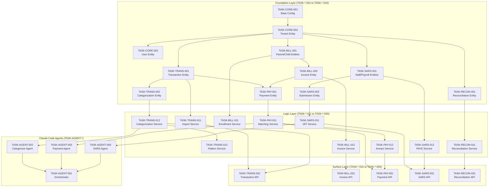

# Task Index: CrecheBooks Implementation

## Overview

This document defines the complete task sequence for implementing CrecheBooks. Tasks are organized in strict dependency order following the Inside-Out, Bottom-Up principle:

1. **Foundation Layer** - Data models, types, migrations (no dependencies)
2. **Logic Layer** - Services, business rules (depends on Foundation)
3. **Surface Layer** - Controllers, APIs, UI (depends on Logic)

**Critical Rule**: Task N cannot reference any file created in Task N+1 or later.

---

## Dependency Graph

---

## Execution Order

### Phase 1: Foundation Layer

| Order | Task ID | Title | Layer | Dependencies | Status |
|-------|---------|-------|-------|--------------|--------|
| 1 | TASK-CORE-001 | Project Setup and Base Configuration | foundation | — | ✅ Complete |
| 2 | TASK-CORE-002 | Tenant Entity and Migration | foundation | TASK-CORE-001 | ✅ Complete |
| 3 | TASK-CORE-003 | User Entity and Authentication Types | foundation | TASK-CORE-002 | ✅ Complete |
| 4 | TASK-CORE-004 | Audit Log Entity and Trail System | foundation | TASK-CORE-002 | ✅ Complete |
| 5 | TASK-TRANS-001 | Transaction Entity and Migration | foundation | TASK-CORE-002 | ✅ Complete |
| 6 | TASK-TRANS-002 | Categorization Entity and Types | foundation | TASK-TRANS-001 | ✅ Complete |
| 7 | TASK-TRANS-003 | Payee Pattern Entity | foundation | TASK-TRANS-001, TASK-TRANS-002 | ✅ Complete |
| 8 | TASK-BILL-001 | Parent and Child Entities | foundation | TASK-CORE-002 | ✅ Complete |
| 9 | TASK-BILL-002 | Fee Structure and Enrollment Entities | foundation | TASK-BILL-001 | ✅ Complete |
| 10 | TASK-BILL-003 | Invoice and Invoice Line Entities | foundation | TASK-BILL-001 | ✅ Complete |
| 11 | TASK-PAY-001 | Payment Entity and Types | foundation | TASK-TRANS-001, TASK-BILL-003 | ✅ Complete |
| 12 | TASK-SARS-001 | Staff and Payroll Entities | foundation | TASK-CORE-002 | ✅ Complete |
| 13 | TASK-SARS-002 | SARS Submission Entity | foundation | TASK-SARS-001 | ✅ Complete |
| 14 | TASK-RECON-001 | Reconciliation Entity | foundation | TASK-TRANS-001 | ✅ Complete |
| 15 | TASK-MCP-001 | Xero MCP Server Foundation | foundation | TASK-CORE-001 | ✅ Complete |

### Phase 2: Logic Layer

| Order | Task ID | Title | Layer | Dependencies | Status |
|-------|---------|-------|-------|--------------|--------|
| 16 | TASK-TRANS-011 | Transaction Import Service | logic | TASK-TRANS-001 | ✅ Complete |
| 17 | TASK-TRANS-012 | Transaction Categorization Service | logic | TASK-TRANS-002, TASK-TRANS-003 | ✅ Complete |
| 18 | TASK-TRANS-013 | Payee Pattern Learning Service | logic | TASK-TRANS-003 | ✅ Complete |
| 19 | TASK-TRANS-014 | Xero Sync Service | logic | TASK-MCP-001, TASK-TRANS-001 | ✅ Complete |
| 20 | TASK-BILL-011 | Enrollment Management Service | logic | TASK-BILL-002 | ✅ Complete |
| 21 | TASK-BILL-012 | Invoice Generation Service | logic | TASK-BILL-003, TASK-BILL-002 | ✅ Complete |
| 22 | TASK-BILL-013 | Invoice Delivery Service | logic | TASK-BILL-003 | ✅ Complete |
| 23 | TASK-BILL-014 | Pro-rata Calculation Service | logic | TASK-BILL-012 | ✅ Complete |
| 24 | TASK-PAY-011 | Payment Matching Service | logic | TASK-PAY-001 | ✅ Complete |
| 25 | TASK-PAY-012 | Payment Allocation Service | logic | TASK-PAY-001, TASK-BILL-003 | ✅ Complete |
| 26 | TASK-PAY-013 | Arrears Calculation Service | logic | TASK-PAY-001, TASK-BILL-003 | ✅ Complete |
| 27 | TASK-PAY-014 | Payment Reminder Service | logic | TASK-PAY-013 | ✅ Complete |
| 28 | TASK-SARS-011 | VAT Calculation Service | logic | TASK-TRANS-002, TASK-BILL-003 | ✅ Complete |
| 29 | TASK-SARS-012 | PAYE Calculation Service | logic | TASK-SARS-001 | ✅ Complete |
| 30 | TASK-SARS-013 | UIF Calculation Service | logic | TASK-SARS-001 | ✅ Complete |
| 31 | TASK-SARS-014 | VAT201 Generation Service | logic | TASK-SARS-011, TASK-SARS-002 | ✅ Complete |
| 32 | TASK-SARS-015 | EMP201 Generation Service | logic | TASK-SARS-012, TASK-SARS-013, TASK-SARS-002 | ✅ Complete |
| 33 | TASK-SARS-016 | IRP5 Generation Service | logic | TASK-SARS-012, TASK-SARS-001 | ✅ Complete |
| 34 | TASK-RECON-011 | Bank Reconciliation Service | logic | TASK-RECON-001, TASK-TRANS-001 | ✅ Complete |
| 35 | TASK-RECON-012 | Discrepancy Detection Service | logic | TASK-RECON-011 | ✅ Complete |
| 36 | TASK-RECON-013 | Financial Report Service | logic | TASK-TRANS-002, TASK-BILL-003 | ✅ Complete |
| 37 | TASK-TRANS-015 | LLMWhisperer PDF Extraction | logic | TASK-TRANS-011 | ✅ Complete |

### Phase 3: Claude Code Agents

| Order | Task ID | Title | Layer | Dependencies | Status |
|-------|---------|-------|-------|--------------|--------|
| 37 | TASK-AGENT-001 | Claude Code Configuration and Context | agent | TASK-CORE-001 | ✅ Complete |
| 38 | TASK-AGENT-002 | Transaction Categorizer Agent | agent | TASK-TRANS-012, TASK-AGENT-001 | ✅ Complete |
| 39 | TASK-AGENT-003 | Payment Matcher Agent | agent | TASK-PAY-011, TASK-AGENT-001 | ✅ Complete |
| 40 | TASK-AGENT-004 | SARS Calculation Agent | agent | TASK-SARS-011, TASK-AGENT-001 | ✅ Complete |
| 41 | TASK-AGENT-005 | Orchestrator Agent Setup | agent | TASK-AGENT-002, TASK-AGENT-003, TASK-AGENT-004 | ✅ Complete |

### Phase 4: Surface Layer (API)

| Order | Task ID | Title | Layer | Dependencies | Status |
|-------|---------|-------|-------|--------------|--------|
| 42 | TASK-API-001 | Authentication Controller and Guards | surface | TASK-CORE-003 | ✅ Complete |
| 43 | TASK-TRANS-031 | Transaction Controller and DTOs | surface | TASK-TRANS-011, TASK-TRANS-012 | ✅ Complete |
| 44 | TASK-TRANS-032 | Transaction Import Endpoint | surface | TASK-TRANS-031 | ✅ Complete |
| 45 | TASK-TRANS-033 | Categorization Endpoint | surface | TASK-TRANS-031, TASK-AGENT-002 | ✅ Complete |
| 46 | TASK-BILL-031 | Invoice Controller and DTOs | surface | TASK-BILL-012 | ✅ Complete |
| 47 | TASK-BILL-032 | Invoice Generation Endpoint | surface | TASK-BILL-031 | ✅ Complete |
| 48 | TASK-BILL-033 | Invoice Delivery Endpoint | surface | TASK-BILL-031, TASK-BILL-013 | ✅ Complete |
| 49 | TASK-BILL-034 | Enrollment Controller | surface | TASK-BILL-011 | ✅ Complete |
| 50 | TASK-PAY-031 | Payment Controller and DTOs | surface | TASK-PAY-011, TASK-PAY-012 | ✅ Complete |
| 51 | TASK-PAY-032 | Payment Matching Endpoint | surface | TASK-PAY-031, TASK-AGENT-003 | ✅ Complete |
| 52 | TASK-PAY-033 | Arrears Dashboard Endpoint | surface | TASK-PAY-013 | ✅ Complete |
| 53 | TASK-SARS-031 | SARS Controller and DTOs | surface | TASK-SARS-014, TASK-SARS-015 | ✅ Complete |
| 54 | TASK-SARS-032 | VAT201 Endpoint | surface | TASK-SARS-031 | ✅ Complete |
| 55 | TASK-SARS-033 | EMP201 Endpoint | surface | TASK-SARS-031 | ✅ Complete |
| 56 | TASK-RECON-031 | Reconciliation Controller | surface | TASK-RECON-011, TASK-RECON-012 | ✅ Complete |
| 57 | TASK-RECON-032 | Financial Reports Endpoint | surface | TASK-RECON-013, TASK-RECON-031 | ✅ Complete |

### Phase 5: Integration and Testing

| Order | Task ID | Title | Layer | Dependencies | Status |
|-------|---------|-------|-------|--------------|--------|
| 58 | TASK-INT-001 | E2E Transaction Categorization Flow | integration | TASK-TRANS-033 | ✅ Complete |
| 59 | TASK-INT-002 | E2E Billing Cycle Flow | integration | TASK-BILL-033 | ✅ Complete |
| 60 | TASK-INT-003 | E2E Payment Matching Flow | integration | TASK-PAY-032 | ✅ Complete |
| 61 | TASK-INT-004 | E2E SARS Submission Flow | integration | TASK-SARS-033 | ✅ Complete |
| 62 | TASK-INT-005 | E2E Reconciliation Flow | integration | TASK-RECON-032 | ✅ Complete |

### Phase 6: Web Application (Frontend)

#### Web Foundation Layer

| Order | Task ID | Title | Layer | Dependencies | Status |
|-------|---------|-------|-------|--------------|--------|
| 63 | TASK-WEB-001 | Next.js Project Setup and Configuration | foundation | — | ✅ Complete |
| 64 | TASK-WEB-002 | UI Component Library Setup (shadcn/ui) | foundation | TASK-WEB-001 | ✅ Complete |
| 65 | TASK-WEB-003 | API Client and React Query Setup | foundation | TASK-WEB-001 | ✅ Complete |
| 66 | TASK-WEB-004 | Authentication Setup (NextAuth.js) | foundation | TASK-WEB-001, TASK-WEB-003 | ✅ Complete |
| 67 | TASK-WEB-005 | Zustand State Management Setup | foundation | TASK-WEB-001 | ✅ Complete |
| 68 | TASK-WEB-006 | Layout Components (Sidebar, Header, Navigation) | foundation | TASK-WEB-002, TASK-WEB-004, TASK-WEB-005 | ✅ Complete |
| 69 | TASK-WEB-007 | Data Table Component with Sorting and Filtering | foundation | TASK-WEB-002 | ✅ Complete |
| 70 | TASK-WEB-008 | Form Components with React Hook Form | foundation | TASK-WEB-002 | ✅ Complete |
| 71 | TASK-WEB-009 | Chart Components (Recharts) | foundation | TASK-WEB-002 | ✅ Complete |
| 72 | TASK-WEB-010 | Utility Functions and Formatters | foundation | TASK-WEB-001 | ✅ Complete |

#### Web Logic Layer (Components)

| Order | Task ID | Title | Layer | Dependencies | Status |
|-------|---------|-------|-------|--------------|--------|
| 73 | TASK-WEB-011 | Transaction List and Categorization Components | logic | TASK-WEB-003, TASK-WEB-007 | ✅ Complete |
| 74 | TASK-WEB-012 | Invoice List and Generation Components | logic | TASK-WEB-003, TASK-WEB-007, TASK-WEB-008 | ✅ Complete |
| 75 | TASK-WEB-013 | Payment Matching and Allocation Components | logic | TASK-WEB-003, TASK-WEB-007 | ✅ Complete |
| 76 | TASK-WEB-014 | Arrears Dashboard Components | logic | TASK-WEB-003, TASK-WEB-007 | ✅ Complete |
| 77 | TASK-WEB-015 | SARS Submission Components | logic | TASK-WEB-003, TASK-WEB-007 | ✅ Complete |
| 78 | TASK-WEB-016 | Reconciliation Components | logic | TASK-WEB-003, TASK-WEB-007 | ✅ Complete |
| 79 | TASK-WEB-017 | Dashboard Widgets and Metrics Components | logic | TASK-WEB-003, TASK-WEB-009 | ✅ Complete |
| 80 | TASK-WEB-018 | Parent and Child Management Components | logic | TASK-WEB-003, TASK-WEB-007, TASK-WEB-008 | ✅ Complete |
| 81 | TASK-WEB-019 | Staff and Payroll Components | logic | TASK-WEB-003, TASK-WEB-007, TASK-WEB-008 | ✅ Complete |
| 82 | TASK-WEB-020 | Financial Reports Components | logic | TASK-WEB-003, TASK-WEB-007, TASK-WEB-009 | ✅ Complete |

#### Web Surface Layer (Pages)

| Order | Task ID | Title | Layer | Dependencies | Status |
|-------|---------|-------|-------|--------------|--------|
| 83 | TASK-WEB-031 | Dashboard Page | surface | TASK-WEB-006, TASK-WEB-017 | ✅ Complete |
| 84 | TASK-WEB-032 | Transactions Page | surface | TASK-WEB-006, TASK-WEB-011 | ✅ Complete |
| 85 | TASK-WEB-033 | Invoices Page | surface | TASK-WEB-006, TASK-WEB-012 | ✅ Complete |
| 86 | TASK-WEB-034 | Payments and Arrears Pages | surface | TASK-WEB-006, TASK-WEB-013, TASK-WEB-014 | ✅ Complete |
| 87 | TASK-WEB-035 | SARS Compliance Page | surface | TASK-WEB-006, TASK-WEB-015 | ✅ Complete |
| 88 | TASK-WEB-036 | Reconciliation Page | surface | TASK-WEB-006, TASK-WEB-016 | ✅ Complete |
| 89 | TASK-WEB-037 | Parents and Enrollment Pages | surface | TASK-WEB-006, TASK-WEB-018 | ✅ Complete |
| 90 | TASK-WEB-038 | Staff and Payroll Pages | surface | TASK-WEB-006, TASK-WEB-019 | ✅ Complete |
| 91 | TASK-WEB-039 | Reports Page | surface | TASK-WEB-006, TASK-WEB-020 | ✅ Complete |
| 92 | TASK-WEB-040 | Settings Page | surface | TASK-WEB-006, TASK-WEB-008 | ✅ Complete |

---

## Progress Summary

| Phase | Tasks | Completed | Percentage |
|-------|-------|-----------|------------|
| Foundation (API) | 15 | 15 | 100% |
| Logic (API) | 22 | 22 | 100% |
| Agents | 5 | 5 | 100% |
| Surface (API) | 16 | 16 | 100% |
| Integration | 5 | 5 | 100% |
| Web Foundation | 10 | 10 | 100% |
| Web Logic | 10 | 10 | 100% |
| Web Surface | 10 | 10 | 100% |
| **Subtotal (Phases 1-6)** | **93** | **93** | **100%** |
| Remediation - Foundation | 1 | 1 | 100% |
| Remediation - Infrastructure | 2 | 2 | 100% |
| Remediation - Logic P0 | 4 | 4 | 100% |
| Remediation - Logic P1 | 7 | 7 | 100% |
| Remediation - Logic P2 | 4 | 4 | 100% |
| Remediation - Surface API | 4 | 4 | 100% |
| Remediation - Surface WEB | 6 | 6 | 100% |
| **Subtotal (Phase 7)** | **28** | **28** | **100%** |
| Gap Remediation - Trans | 4 | 1 | 25% |
| Gap Remediation - Bill | 2 | 2 | 100% |
| Gap Remediation - User | 2 | 2 | 100% |
| Gap Remediation - Xero | 2 | 1 | 50% |
| Gap Remediation - Edge Cases | 3 | 2 | 67% |
| **Subtotal (Phase 8)** | **13** | **8** | **62%** |
| **Grand Total** | **134** | **129** | **96%** |

**Last Updated**: 2026-01-04
- Phases 1-6 (Core): 93/93 tasks complete (100%) ✅
- Phase 7 (Remediation): 28/28 tasks complete (100%) ✅
- Phase 8 (Gap Remediation): 8/13 tasks complete (62%) 🔄
- Overall Progress: 129/134 tasks (96%)

---

## Phase 7: Remediation Tasks

These tasks address critical issues identified in the validation analysis (`/docs/VALIDATION_ANALYSIS.md`).

### 7.1 Foundation Layer (Remediation)

| Order | Task ID | Title | Layer | Dependencies | Priority | Status |
|-------|---------|-------|-------|--------------|----------|--------|
| 93 | TASK-SARS-004 | Fix PAYE Tax Bracket 1 Maximum Value | foundation | TASK-SARS-001 | P0-BLOCKER | ✅ Complete |

### 7.2 Infrastructure Layer (Remediation)

| Order | Task ID | Title | Layer | Dependencies | Priority | Status |
|-------|---------|-------|-------|--------------|----------|--------|
| 94 | TASK-INFRA-011 | Centralized Scheduling Service with BullMQ | logic | TASK-CORE-001 | P0-BLOCKER | ✅ Complete |
| 95 | TASK-INFRA-012 | Multi-Channel Notification Service Enhancement | logic | TASK-BILL-015 | P2-HIGH | ✅ Complete |

### 7.3 Logic Layer - P0 Blockers (Remediation)

| Order | Task ID | Title | Layer | Dependencies | Priority | Status |
|-------|---------|-------|-------|--------------|----------|--------|
| 96 | TASK-RECON-014 | Reconciled Transaction Delete Protection | logic | TASK-RECON-001, TASK-TRANS-001 | P0-BLOCKER | ✅ Complete |
| 97 | TASK-TRANS-016 | Bank Feed Integration Service via Xero API | logic | TASK-TRANS-001, TASK-MCP-001 | P0-BLOCKER | ✅ Complete |
| 98 | TASK-TRANS-017 | Transaction Categorization Accuracy Tracking | logic | TASK-TRANS-012 | P0-BLOCKER | ✅ Complete |
| 99 | TASK-SARS-017 | SARS Deadline Reminder System | logic | TASK-INFRA-011 | P0-BLOCKER | ✅ Complete |

### 7.4 Logic Layer - P1 Critical (Remediation)

| Order | Task ID | Title | Layer | Dependencies | Priority | Status |
|-------|---------|-------|-------|--------------|----------|--------|
| 100 | TASK-BILL-015 | WhatsApp Business API Integration | logic | TASK-BILL-013 | P1-CRITICAL | ✅ Complete |
| 101 | TASK-BILL-016 | Invoice Generation Scheduling Cron Job | logic | TASK-BILL-012, TASK-INFRA-011 | P1-CRITICAL | ✅ Complete |
| 102 | TASK-PAY-015 | Payment Reminder Scheduler Service | logic | TASK-INFRA-011, TASK-PAY-014 | P1-CRITICAL | ✅ Complete |
| 103 | TASK-PAY-016 | Invoke PaymentMatcherAgent in PaymentMatchingService | logic | TASK-PAY-011, TASK-AGENT-003 | P1-CRITICAL | ✅ Complete |
| 104 | TASK-TRANS-018 | Enable Payee Alias Matching in Categorization | logic | TASK-TRANS-013 | P1-CRITICAL | ✅ Complete |
| 105 | TASK-RECON-015 | Reconciliation Duplicate Detection Service | logic | TASK-TRANS-001, TASK-RECON-001 | P1-CRITICAL | ✅ Complete |
| 106 | TASK-RECON-016 | 3-Day Business Day Timing Window for Reconciliation | logic | TASK-RECON-011 | P1-CRITICAL | ✅ Complete |

### 7.5 Logic Layer - P2 High (Remediation)

| Order | Task ID | Title | Layer | Dependencies | Priority | Status |
|-------|---------|-------|-------|--------------|----------|--------|
| 107 | TASK-TRANS-019 | Recurring Transaction Detection Integration | logic | TASK-TRANS-013 | P2-HIGH | ✅ Complete |
| 108 | TASK-BILL-017 | Ad-Hoc Charges in Monthly Invoice Generation | logic | TASK-BILL-012 | P2-HIGH | ✅ Complete |
| 109 | TASK-PAY-017 | Arrears Report PDF Export | logic | TASK-PAY-013 | P2-HIGH | ✅ Complete |
| 114 | TASK-SARS-018 | SARS eFiling Submission Error Handling and Retry | logic | TASK-SARS-014, TASK-SARS-015 | P2-HIGH | ✅ Complete |

### 7.6 Surface Layer - API (Remediation)

| Order | Task ID | Title | Layer | Dependencies | Priority | Status |
|-------|---------|-------|-------|--------------|----------|--------|
| 110 | TASK-RECON-033 | Balance Sheet API Endpoint | surface | TASK-RECON-013 | P0-BLOCKER | ✅ Complete |
| 111 | TASK-TRANS-034 | Xero Sync REST API Endpoints | surface | TASK-TRANS-014, TASK-TRANS-016 | P2-HIGH | ✅ Complete |
| 112 | TASK-BILL-035 | Delivery Status Webhook Handlers | surface | TASK-BILL-013, TASK-BILL-015 | P2-HIGH | ✅ Complete |
| 113 | TASK-RECON-034 | Audit Log Pagination and Filtering | surface | TASK-CORE-004 | P2-HIGH | ✅ Complete |

### 7.7 Surface Layer - WEB (Remediation)

| Order | Task ID | Title | Layer | Dependencies | Priority | Status |
|-------|---------|-------|-------|--------------|----------|--------|
| 120 | TASK-WEB-041 | SARS VAT201 Real Data Hook | surface | TASK-SARS-014, TASK-WEB-003 | P0-BLOCKER | ✅ Complete |
| 121 | TASK-WEB-042 | Invoice Send Button API Integration | surface | TASK-BILL-013, TASK-BILL-015 | P0-BLOCKER | ✅ Complete |
| 122 | TASK-WEB-043 | Reports PDF/CSV Export Implementation | surface | TASK-RECON-013, TASK-RECON-033 | P1-CRITICAL | ✅ Complete |
| 123 | TASK-WEB-044 | Pro-Rata Fee Display Component | surface | TASK-BILL-014 | P2-HIGH | ✅ Complete |
| 124 | TASK-WEB-045 | Payment Reminder Template Editor | surface | TASK-PAY-015 | P2-HIGH | ✅ Complete |
| 125 | TASK-WEB-046 | Mobile Responsive Improvements | surface | TASK-WEB-006 | P2-HIGH | ✅ Complete |

---

## Phase 8: Gap Remediation (Outstanding Requirements)

Based on PRD analysis review against AI-Agent-SpecTaskCreator methodology, the following requirements need additional work:

### 8.1 Transaction Domain Gaps

| Order | Task ID | Title | Layer | Dependencies | Priority | Status |
|-------|---------|-------|-------|--------------|----------|--------|
| 126 | TASK-TRANS-020 | Split Transaction UI Implementation | surface | TASK-WEB-011, TASK-TRANS-002 | P2-HIGH | ⭕ Pending |
| 127 | TASK-TRANS-021 | Categorization Explainability Display | surface | TASK-AGENT-002, TASK-WEB-011 | P2-HIGH | ⭕ Pending |
| 128 | TASK-TRANS-022 | Reversal Transaction Detection | logic | TASK-TRANS-012 | P3-MEDIUM | ✅ Complete |
| 129 | TASK-TRANS-023 | Learning Mode Indicator for New Tenants | surface | TASK-TRANS-017, TASK-WEB-017 | P3-MEDIUM | ⭕ Pending |

### 8.2 Billing Domain Gaps

| Order | Task ID | Title | Layer | Dependencies | Priority | Status |
|-------|---------|-------|-------|--------------|----------|--------|
| 130 | TASK-BILL-018 | VAT Calculation for VAT-Registered Creches | logic | TASK-BILL-012, TASK-SARS-011 | P1-CRITICAL | ✅ Complete |
| 131 | TASK-BILL-019 | Enrollment Register Dedicated View | surface | TASK-WEB-037, TASK-BILL-011 | P2-HIGH | ✅ Complete |

### 8.3 User Management Domain (New)

| Order | Task ID | Title | Layer | Dependencies | Priority | Status |
|-------|---------|-------|-------|--------------|----------|--------|
| 132 | TASK-USER-001 | Multi-Tenant User Role Assignment | logic | TASK-CORE-003 | P2-HIGH | ✅ Complete |
| 133 | TASK-USER-002 | User Management Admin Page | surface | TASK-WEB-040, TASK-API-001 | P2-HIGH | ✅ Complete |

### 8.4 Xero Integration Gaps

| Order | Task ID | Title | Layer | Dependencies | Priority | Status |
|-------|---------|-------|-------|--------------|----------|--------|
| 134 | TASK-XERO-001 | Bi-directional Sync Conflict Resolution | logic | TASK-TRANS-014 | P2-HIGH | ✅ Complete |
| 135 | TASK-XERO-002 | Xero Connection Status Dashboard Widget | surface | TASK-WEB-017, TASK-MCP-001 | P3-MEDIUM | ⭕ Pending |

### 8.5 Edge Case Implementations

| Order | Task ID | Title | Layer | Dependencies | Priority | Status |
|-------|---------|-------|-------|--------------|----------|--------|
| 136 | TASK-EC-001 | Payee Name Variation Detection Algorithm | logic | TASK-TRANS-013 | P2-HIGH | ✅ Complete |
| 137 | TASK-EC-002 | Conflicting Correction Resolution UI | surface | TASK-TRANS-013, TASK-WEB-011 | P3-MEDIUM | ⭕ Pending |
| 138 | TASK-EC-003 | Recurring Amount Variation Threshold Config | logic | TASK-TRANS-019 | P3-MEDIUM | ✅ Complete |

---

## Phase 8 Progress Summary

| Priority | Tasks | Complete | Pending | Percentage |
|----------|-------|----------|---------|------------|
| P1-CRITICAL | 1 | 1 | 0 | 100% |
| P2-HIGH | 8 | 6 | 2 | 75% |
| P3-MEDIUM | 4 | 1 | 3 | 25% |
| **Total Phase 8** | **13** | **8** | **5** | **62%** |

---

## Layer Verification Checklist

Before starting Phase 2 (Logic):
- [x] All Phase 1 entities created with migrations
- [x] All migrations run successfully
- [x] TypeScript compiles with no errors
- [x] All entity tests pass

Before starting Phase 3 (Agents):
- [x] All Phase 2 services implemented
- [x] Unit tests for all services pass
- [x] MCP servers functional

Before starting Phase 4 (Surface):
- [x] Claude Code configuration complete
- [x] All agents tested in isolation
- [x] Agent communication contracts verified

Before starting Phase 5 (Integration):
- [x] All API endpoints implemented
- [x] API integration tests pass
- [x] Xero sync functional

Before Phase 6 (Web Frontend) Complete:
- [x] Next.js 15 project configured (TASK-WEB-001)
- [x] shadcn/ui component library set up (TASK-WEB-002)
- [x] API client with React Query (TASK-WEB-003)
- [x] Authentication with NextAuth.js (TASK-WEB-004)
- [x] Zustand state management (TASK-WEB-005)
- [x] Layout components (TASK-WEB-006)
- [x] Data table, form, chart components (TASK-WEB-007-009)
- [x] All logic layer components (TASK-WEB-011-020)
- [x] All surface layer pages (TASK-WEB-031-040)
- [x] TypeScript compiles with no errors
- [x] ESLint passes with no critical errors
