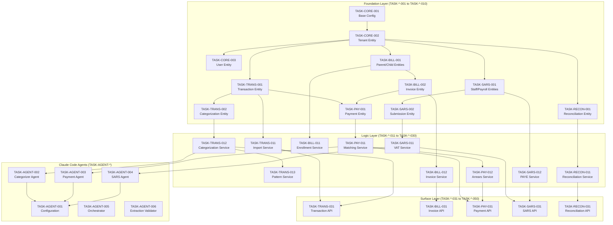
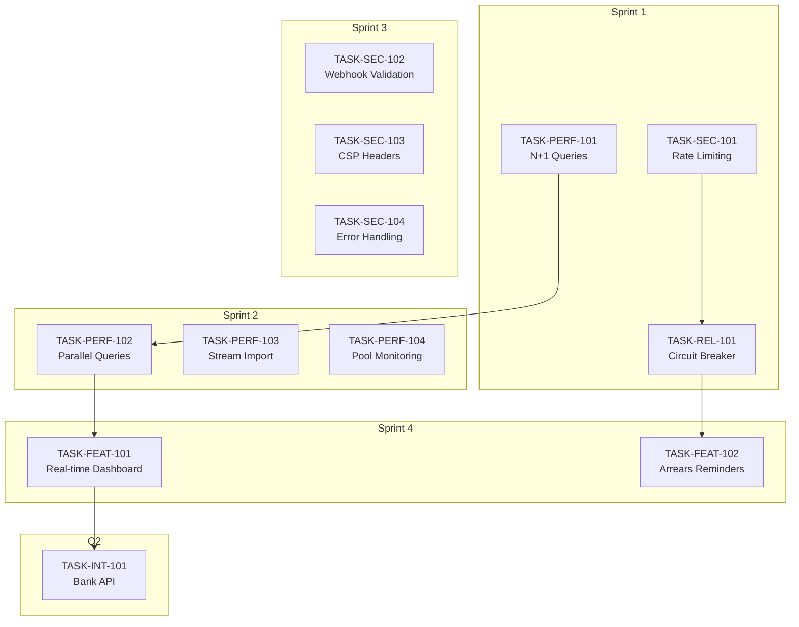
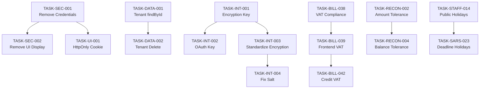
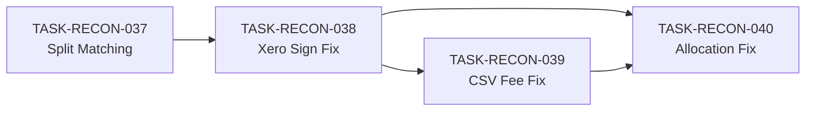

# Task Index: CrecheBooks Implementation

## Overview

This document defines the complete task sequence for implementing CrecheBooks. Tasks are organized in strict dependency order following the Inside-Out, Bottom-Up principle:

1. **Foundation Layer** - Data models, types, migrations (no dependencies)
2. **Logic Layer** - Services, business rules (depends on Foundation)
3. **Surface Layer** - Controllers, APIs, UI (depends on Logic)

**Critical Rule**: Task N cannot reference any file created in Task N+1 or later.

---

## Dependency Graph



---

## Execution Order

### Phase 1: Foundation Layer

| Order | Task ID | Title | Layer | Dependencies | Status |
|-------|---------|-------|-------|--------------|--------|
| 1 | TASK-CORE-001 | Project Setup and Base Configuration | foundation | — | ✅ Complete |
| 2 | TASK-CORE-002 | Tenant Entity and Migration | foundation | TASK-CORE-001 | ✅ Complete |
| 3 | TASK-CORE-003 | User Entity and Authentication Types | foundation | TASK-CORE-002 | ✅ Complete |
| 4 | TASK-CORE-004 | Audit Log Entity and Trail System | foundation | TASK-CORE-002 | ✅ Complete |
| 5 | TASK-TRANS-001 | Transaction Entity and Migration | foundation | TASK-CORE-002 | ✅ Complete |
| 6 | TASK-TRANS-002 | Categorization Entity and Types | foundation | TASK-TRANS-001 | ✅ Complete |
| 7 | TASK-TRANS-003 | Payee Pattern Entity | foundation | TASK-TRANS-001, TASK-TRANS-002 | ✅ Complete |
| 8 | TASK-BILL-001 | Parent and Child Entities | foundation | TASK-CORE-002 | ✅ Complete |
| 9 | TASK-BILL-002 | Fee Structure and Enrollment Entities | foundation | TASK-BILL-001 | ✅ Complete |
| 10 | TASK-BILL-003 | Invoice and Invoice Line Entities | foundation | TASK-BILL-001 | ✅ Complete |
| 11 | TASK-PAY-001 | Payment Entity and Types | foundation | TASK-TRANS-001, TASK-BILL-003 | ✅ Complete |
| 12 | TASK-SARS-001 | Staff and Payroll Entities | foundation | TASK-CORE-002 | ✅ Complete |
| 13 | TASK-SARS-002 | SARS Submission Entity | foundation | TASK-SARS-001 | ✅ Complete |
| 14 | TASK-RECON-001 | Reconciliation Entity | foundation | TASK-TRANS-001 | ✅ Complete |
| 15 | TASK-MCP-001 | Xero MCP Server Foundation | foundation | TASK-CORE-001 | ✅ Complete |

### Phase 2: Logic Layer

| Order | Task ID | Title | Layer | Dependencies | Status |
|-------|---------|-------|-------|--------------|--------|
| 16 | TASK-TRANS-011 | Transaction Import Service | logic | TASK-TRANS-001 | ✅ Complete |
| 17 | TASK-TRANS-012 | Transaction Categorization Service | logic | TASK-TRANS-002, TASK-TRANS-003 | ✅ Complete |
| 18 | TASK-TRANS-013 | Payee Pattern Learning Service | logic | TASK-TRANS-003 | ✅ Complete |
| 19 | TASK-TRANS-014 | Xero Sync Service | logic | TASK-MCP-001, TASK-TRANS-001 | ✅ Complete |
| 20 | TASK-BILL-011 | Enrollment Management Service | logic | TASK-BILL-002 | ✅ Complete |
| 21 | TASK-BILL-012 | Invoice Generation Service | logic | TASK-BILL-003, TASK-BILL-002 | ✅ Complete |
| 22 | TASK-BILL-013 | Invoice Delivery Service | logic | TASK-BILL-003 | ✅ Complete |
| 23 | TASK-BILL-014 | Pro-rata Calculation Service | logic | TASK-BILL-012 | ✅ Complete |
| 24 | TASK-PAY-011 | Payment Matching Service | logic | TASK-PAY-001 | ✅ Complete |
| 25 | TASK-PAY-012 | Payment Allocation Service | logic | TASK-PAY-001, TASK-BILL-003 | ✅ Complete |
| 26 | TASK-PAY-013 | Arrears Calculation Service | logic | TASK-PAY-001, TASK-BILL-003 | ✅ Complete |
| 27 | TASK-PAY-014 | Payment Reminder Service | logic | TASK-PAY-013 | ✅ Complete |
| 28 | TASK-SARS-011 | VAT Calculation Service | logic | TASK-TRANS-002, TASK-BILL-003 | ✅ Complete |
| 29 | TASK-SARS-012 | PAYE Calculation Service | logic | TASK-SARS-001 | ✅ Complete |
| 30 | TASK-SARS-013 | UIF Calculation Service | logic | TASK-SARS-001 | ✅ Complete |
| 31 | TASK-SARS-014 | VAT201 Generation Service | logic | TASK-SARS-011, TASK-SARS-002 | ✅ Complete |
| 32 | TASK-SARS-015 | EMP201 Generation Service | logic | TASK-SARS-012, TASK-SARS-013, TASK-SARS-002 | ✅ Complete |
| 33 | TASK-SARS-016 | IRP5 Generation Service | logic | TASK-SARS-012, TASK-SARS-001 | ✅ Complete |
| 34 | TASK-RECON-011 | Bank Reconciliation Service | logic | TASK-RECON-001, TASK-TRANS-001 | ✅ Complete |
| 35 | TASK-RECON-012 | Discrepancy Detection Service | logic | TASK-RECON-011 | ✅ Complete |
| 36 | TASK-RECON-013 | Financial Report Service | logic | TASK-TRANS-002, TASK-BILL-003 | ✅ Complete |
| 37 | TASK-TRANS-015 | LLMWhisperer PDF Extraction | logic | TASK-TRANS-011 | ✅ Complete |

### Phase 3: Claude Code Agents

| Order | Task ID | Title | Layer | Dependencies | Status |
|-------|---------|-------|-------|--------------|--------|
| 37 | TASK-AGENT-001 | Claude Code Configuration and Context | agent | TASK-CORE-001 | ✅ Complete |
| 38 | TASK-AGENT-002 | Transaction Categorizer Agent | agent | TASK-TRANS-012, TASK-AGENT-001 | ✅ Complete |
| 39 | TASK-AGENT-003 | Payment Matcher Agent | agent | TASK-PAY-011, TASK-AGENT-001 | ✅ Complete |
| 40 | TASK-AGENT-004 | SARS Calculation Agent | agent | TASK-SARS-011, TASK-AGENT-001 | ✅ Complete |
| 41 | TASK-AGENT-005 | Orchestrator Agent Setup | agent | TASK-AGENT-002, TASK-AGENT-003, TASK-AGENT-004 | ✅ Complete |
| 42 | TASK-AGENT-006 | PDF Extraction Validation Agent | agent | TASK-TRANS-015, TASK-AGENT-001 | ✅ Complete |

### Phase 4: Surface Layer (API)

| Order | Task ID | Title | Layer | Dependencies | Status |
|-------|---------|-------|-------|--------------|--------|
| 42 | TASK-API-001 | Authentication Controller and Guards | surface | TASK-CORE-003 | ✅ Complete |
| 43 | TASK-TRANS-031 | Transaction Controller and DTOs | surface | TASK-TRANS-011, TASK-TRANS-012 | ✅ Complete |
| 44 | TASK-TRANS-032 | Transaction Import Endpoint | surface | TASK-TRANS-031 | ✅ Complete |
| 45 | TASK-TRANS-033 | Categorization Endpoint | surface | TASK-TRANS-031, TASK-AGENT-002 | ✅ Complete |
| 46 | TASK-BILL-031 | Invoice Controller and DTOs | surface | TASK-BILL-012 | ✅ Complete |
| 47 | TASK-BILL-032 | Invoice Generation Endpoint | surface | TASK-BILL-031 | ✅ Complete |
| 48 | TASK-BILL-033 | Invoice Delivery Endpoint | surface | TASK-BILL-031, TASK-BILL-013 | ✅ Complete |
| 49 | TASK-BILL-034 | Enrollment Controller | surface | TASK-BILL-011 | ✅ Complete |
| 50 | TASK-PAY-031 | Payment Controller and DTOs | surface | TASK-PAY-011, TASK-PAY-012 | ✅ Complete |
| 51 | TASK-PAY-032 | Payment Matching Endpoint | surface | TASK-PAY-031, TASK-AGENT-003 | ✅ Complete |
| 52 | TASK-PAY-033 | Arrears Dashboard Endpoint | surface | TASK-PAY-013 | ✅ Complete |
| 53 | TASK-SARS-031 | SARS Controller and DTOs | surface | TASK-SARS-014, TASK-SARS-015 | ✅ Complete |
| 54 | TASK-SARS-032 | VAT201 Endpoint | surface | TASK-SARS-031 | ✅ Complete |
| 55 | TASK-SARS-033 | EMP201 Endpoint | surface | TASK-SARS-031 | ✅ Complete |
| 56 | TASK-RECON-031 | Reconciliation Controller | surface | TASK-RECON-011, TASK-RECON-012 | ✅ Complete |
| 57 | TASK-RECON-032 | Financial Reports Endpoint | surface | TASK-RECON-013, TASK-RECON-031 | ✅ Complete |

### Phase 5: Integration and Testing

| Order | Task ID | Title | Layer | Dependencies | Status |
|-------|---------|-------|-------|--------------|--------|
| 58 | TASK-INT-001 | E2E Transaction Categorization Flow | integration | TASK-TRANS-033 | ✅ Complete |
| 59 | TASK-INT-002 | E2E Billing Cycle Flow | integration | TASK-BILL-033 | ✅ Complete |
| 60 | TASK-INT-003 | E2E Payment Matching Flow | integration | TASK-PAY-032 | ✅ Complete |
| 61 | TASK-INT-004 | E2E SARS Submission Flow | integration | TASK-SARS-033 | ✅ Complete |
| 62 | TASK-INT-005 | E2E Reconciliation Flow | integration | TASK-RECON-032 | ✅ Complete |

### Phase 6: Web Application (Frontend)

#### Web Foundation Layer

| Order | Task ID | Title | Layer | Dependencies | Status |
|-------|---------|-------|-------|--------------|--------|
| 63 | TASK-WEB-001 | Next.js Project Setup and Configuration | foundation | — | ✅ Complete |
| 64 | TASK-WEB-002 | UI Component Library Setup (shadcn/ui) | foundation | TASK-WEB-001 | ✅ Complete |
| 65 | TASK-WEB-003 | API Client and React Query Setup | foundation | TASK-WEB-001 | ✅ Complete |
| 66 | TASK-WEB-004 | Authentication Setup (NextAuth.js) | foundation | TASK-WEB-001, TASK-WEB-003 | ✅ Complete |
| 67 | TASK-WEB-005 | Zustand State Management Setup | foundation | TASK-WEB-001 | ✅ Complete |
| 68 | TASK-WEB-006 | Layout Components (Sidebar, Header, Navigation) | foundation | TASK-WEB-002, TASK-WEB-004, TASK-WEB-005 | ✅ Complete |
| 69 | TASK-WEB-007 | Data Table Component with Sorting and Filtering | foundation | TASK-WEB-002 | ✅ Complete |
| 70 | TASK-WEB-008 | Form Components with React Hook Form | foundation | TASK-WEB-002 | ✅ Complete |
| 71 | TASK-WEB-009 | Chart Components (Recharts) | foundation | TASK-WEB-002 | ✅ Complete |
| 72 | TASK-WEB-010 | Utility Functions and Formatters | foundation | TASK-WEB-001 | ✅ Complete |

#### Web Logic Layer (Components)

| Order | Task ID | Title | Layer | Dependencies | Status |
|-------|---------|-------|-------|--------------|--------|
| 73 | TASK-WEB-011 | Transaction List and Categorization Components | logic | TASK-WEB-003, TASK-WEB-007 | ✅ Complete |
| 74 | TASK-WEB-012 | Invoice List and Generation Components | logic | TASK-WEB-003, TASK-WEB-007, TASK-WEB-008 | ✅ Complete |
| 75 | TASK-WEB-013 | Payment Matching and Allocation Components | logic | TASK-WEB-003, TASK-WEB-007 | ✅ Complete |
| 76 | TASK-WEB-014 | Arrears Dashboard Components | logic | TASK-WEB-003, TASK-WEB-007 | ✅ Complete |
| 77 | TASK-WEB-015 | SARS Submission Components | logic | TASK-WEB-003, TASK-WEB-007 | ✅ Complete |
| 78 | TASK-WEB-016 | Reconciliation Components | logic | TASK-WEB-003, TASK-WEB-007 | ✅ Complete |
| 79 | TASK-WEB-017 | Dashboard Widgets and Metrics Components | logic | TASK-WEB-003, TASK-WEB-009 | ✅ Complete |
| 80 | TASK-WEB-018 | Parent and Child Management Components | logic | TASK-WEB-003, TASK-WEB-007, TASK-WEB-008 | ✅ Complete |
| 81 | TASK-WEB-019 | Staff and Payroll Components | logic | TASK-WEB-003, TASK-WEB-007, TASK-WEB-008 | ✅ Complete |
| 82 | TASK-WEB-020 | Financial Reports Components | logic | TASK-WEB-003, TASK-WEB-007, TASK-WEB-009 | ✅ Complete |

#### Web Surface Layer (Pages)

| Order | Task ID | Title | Layer | Dependencies | Status |
|-------|---------|-------|-------|--------------|--------|
| 83 | TASK-WEB-031 | Dashboard Page | surface | TASK-WEB-006, TASK-WEB-017 | ✅ Complete |
| 84 | TASK-WEB-032 | Transactions Page | surface | TASK-WEB-006, TASK-WEB-011 | ✅ Complete |
| 85 | TASK-WEB-033 | Invoices Page | surface | TASK-WEB-006, TASK-WEB-012 | ✅ Complete |
| 86 | TASK-WEB-034 | Payments and Arrears Pages | surface | TASK-WEB-006, TASK-WEB-013, TASK-WEB-014 | ✅ Complete |
| 87 | TASK-WEB-035 | SARS Compliance Page | surface | TASK-WEB-006, TASK-WEB-015 | ✅ Complete |
| 88 | TASK-WEB-036 | Reconciliation Page | surface | TASK-WEB-006, TASK-WEB-016 | ✅ Complete |
| 89 | TASK-WEB-037 | Parents and Enrollment Pages | surface | TASK-WEB-006, TASK-WEB-018 | ✅ Complete |
| 90 | TASK-WEB-038 | Staff and Payroll Pages | surface | TASK-WEB-006, TASK-WEB-019 | ✅ Complete |
| 91 | TASK-WEB-039 | Reports Page | surface | TASK-WEB-006, TASK-WEB-020 | ✅ Complete |
| 92 | TASK-WEB-040 | Settings Page | surface | TASK-WEB-006, TASK-WEB-008 | ✅ Complete |

---

## Progress Summary

| Phase | Tasks | Completed | Percentage |
|-------|-------|-----------|------------|
| Foundation (API) | 15 | 15 | 100% |
| Logic (API) | 22 | 22 | 100% |
| Agents | 6 | 6 | 100% |
| Surface (API) | 16 | 16 | 100% |
| Integration | 5 | 5 | 100% |
| Web Foundation | 10 | 10 | 100% |
| Web Logic | 10 | 10 | 100% |
| Web Surface | 10 | 10 | 100% |
| **Subtotal (Phases 1-6)** | **93** | **93** | **100%** |
| Remediation - Foundation | 1 | 1 | 100% |
| Remediation - Infrastructure | 2 | 2 | 100% |
| Remediation - Logic P0 | 4 | 4 | 100% |
| Remediation - Logic P1 | 7 | 7 | 100% |
| Remediation - Logic P2 | 4 | 4 | 100% |
| Remediation - Surface API | 4 | 4 | 100% |
| Remediation - Surface WEB | 6 | 6 | 100% |
| **Subtotal (Phase 7)** | **28** | **28** | **100%** |
| Gap Remediation - Trans | 4 | 4 | 100% |
| Gap Remediation - Bill | 2 | 2 | 100% |
| Gap Remediation - User | 2 | 2 | 100% |
| Gap Remediation - Xero | 2 | 2 | 100% |
| Gap Remediation - Edge Cases | 3 | 3 | 100% |
| **Subtotal (Phase 8)** | **13** | **13** | **100%** |
| PRD Compliance - Billing | 4 | 4 | 100% |
| PRD Compliance - Payment | 3 | 3 | 100% |
| PRD Compliance - Notifications | 2 | 2 | 100% |
| PRD Compliance - SARS | 1 | 1 | 100% |
| PRD Compliance - Reports | 2 | 2 | 100% |
| PRD Compliance - Xero | 1 | 1 | 100% |
| PRD Compliance - Foundation | 2 | 2 | 100% |
| **Subtotal (Phase 9)** | **15** | **15** | **100%** |
| E2E Bug Fixes - Foundation | 1 | 1 | 100% |
| E2E Bug Fixes - Logic | 1 | 1 | 100% |
| E2E Bug Fixes - Surface | 3 | 3 | 100% |
| **Subtotal (Phase 10)** | **5** | **5** | **100%** |
| **Subtotal (Phase 11)** | **4** | **4** | **100%** |
| Statement - Foundation | 1 | 1 | 100% |
| Statement - Logic | 5 | 5 | 100% |
| Statement - Surface | 2 | 2 | 100% |
| **Subtotal (Phase 12)** | **8** | **8** | **100%** |
| Staff - Onboarding/Offboarding | 2 | 2 | 100% |
| Staff - Integrations | 2 | 2 | 100% |
| **Subtotal (Phase 13)** | **4** | **4** | **100%** |
| SimplePay Comprehensive - Leave | 1 | 1 | 100% |
| SimplePay Comprehensive - Pay Runs | 1 | 1 | 100% |
| SimplePay Comprehensive - Calculations | 1 | 1 | 100% |
| SimplePay Comprehensive - Service Periods | 1 | 1 | 100% |
| SimplePay Comprehensive - Reports | 1 | 1 | 100% |
| SimplePay Comprehensive - Profiles | 1 | 1 | 100% |
| SimplePay Comprehensive - Bulk Ops | 1 | 1 | 100% |
| SimplePay Comprehensive - Auto-Setup | 1 | 1 | 100% |
| **Subtotal (Phase 14)** | **8** | **8** | **100%** |
| VAT Compliance - Invoice Generation | 1 | 1 | 100% |
| **Subtotal (Phase 15)** | **1** | **1** | **100%** |
| **Subtotal (Phase 16)** | **63** | **15** | **24%** |
| Code Review - Critical | 3 | 3 | 100% |
| Code Review - High | 5 | 5 | 100% |
| Code Review - Medium | 2 | 2 | 100% |
| **Subtotal (Phase 17)** | **10** | **10** | **100%** |
| **Subtotal (Phase 18)** | **3** | **3** | **100%** |
| **Grand Total** | **192** | **191** | **99.5%** |

**Last Updated**: 2026-01-18
- Phases 1-6 (Core): 93/93 tasks complete (100%) ✅
- Phase 7 (Remediation): 28/28 tasks complete (100%) ✅
- Phase 8 (Gap Remediation): 13/13 tasks complete (100%) ✅
- Phase 9 (PRD Compliance): 15/15 tasks complete (100%) ✅
- Phase 10 (E2E Bug Fixes): 5/5 tasks complete (100%) ✅
- Phase 11 (E2E Bug Fixes R2): 4/4 tasks complete (100%) ✅
- Phase 12 (Account Statements): 8/8 tasks complete (100%) ✅
- Phase 13 (Staff Management & Integrations): 4/4 tasks complete (100%) ✅
- Phase 14 (Comprehensive SimplePay Integration): 8/8 tasks complete (100%) ✅
- Phase 15 (VAT Compliance Enhancement): 1/1 tasks complete (100%) ✅
- Phase 17 (Code Review Remediation): 10/10 tasks complete (100%) ✅
- Phase 18 (Reconciliation Sign Convention): 3/3 tasks complete (100%) ✅
- Overall Progress: 191/192 tasks (99.5%)

---

## Phase 7: Remediation Tasks

These tasks address critical issues identified in the validation analysis (`/docs/VALIDATION_ANALYSIS.md`).

### 7.1 Foundation Layer (Remediation)

| Order | Task ID | Title | Layer | Dependencies | Priority | Status |
|-------|---------|-------|-------|--------------|----------|--------|
| 93 | TASK-SARS-004 | Fix PAYE Tax Bracket 1 Maximum Value | foundation | TASK-SARS-001 | P0-BLOCKER | ✅ Complete |

### 7.2 Infrastructure Layer (Remediation)

| Order | Task ID | Title | Layer | Dependencies | Priority | Status |
|-------|---------|-------|-------|--------------|----------|--------|
| 94 | TASK-INFRA-011 | Centralized Scheduling Service with BullMQ | logic | TASK-CORE-001 | P0-BLOCKER | ✅ Complete |
| 95 | TASK-INFRA-012 | Multi-Channel Notification Service Enhancement | logic | TASK-BILL-015 | P2-HIGH | ✅ Complete |

### 7.3 Logic Layer - P0 Blockers (Remediation)

| Order | Task ID | Title | Layer | Dependencies | Priority | Status |
|-------|---------|-------|-------|--------------|----------|--------|
| 96 | TASK-RECON-014 | Reconciled Transaction Delete Protection | logic | TASK-RECON-001, TASK-TRANS-001 | P0-BLOCKER | ✅ Complete |
| 97 | TASK-TRANS-016 | Bank Feed Integration Service via Xero API | logic | TASK-TRANS-001, TASK-MCP-001 | P0-BLOCKER | ✅ Complete |
| 98 | TASK-TRANS-017 | Transaction Categorization Accuracy Tracking | logic | TASK-TRANS-012 | P0-BLOCKER | ✅ Complete |
| 99 | TASK-SARS-017 | SARS Deadline Reminder System | logic | TASK-INFRA-011 | P0-BLOCKER | ✅ Complete |

### 7.4 Logic Layer - P1 Critical (Remediation)

| Order | Task ID | Title | Layer | Dependencies | Priority | Status |
|-------|---------|-------|-------|--------------|----------|--------|
| 100 | TASK-BILL-015 | WhatsApp Business API Integration | logic | TASK-BILL-013 | P1-CRITICAL | ✅ Complete |
| 101 | TASK-BILL-016 | Invoice Generation Scheduling Cron Job | logic | TASK-BILL-012, TASK-INFRA-011 | P1-CRITICAL | ✅ Complete |
| 102 | TASK-PAY-015 | Payment Reminder Scheduler Service | logic | TASK-INFRA-011, TASK-PAY-014 | P1-CRITICAL | ✅ Complete |
| 103 | TASK-PAY-016 | Invoke PaymentMatcherAgent in PaymentMatchingService | logic | TASK-PAY-011, TASK-AGENT-003 | P1-CRITICAL | ✅ Complete |
| 104 | TASK-TRANS-018 | Enable Payee Alias Matching in Categorization | logic | TASK-TRANS-013 | P1-CRITICAL | ✅ Complete |
| 105 | TASK-RECON-015 | Reconciliation Duplicate Detection Service | logic | TASK-TRANS-001, TASK-RECON-001 | P1-CRITICAL | ✅ Complete |
| 106 | TASK-RECON-016 | 3-Day Business Day Timing Window for Reconciliation | logic | TASK-RECON-011 | P1-CRITICAL | ✅ Complete |

### 7.5 Logic Layer - P2 High (Remediation)

| Order | Task ID | Title | Layer | Dependencies | Priority | Status |
|-------|---------|-------|-------|--------------|----------|--------|
| 107 | TASK-TRANS-019 | Recurring Transaction Detection Integration | logic | TASK-TRANS-013 | P2-HIGH | ✅ Complete |
| 108 | TASK-BILL-017 | Ad-Hoc Charges in Monthly Invoice Generation | logic | TASK-BILL-012 | P2-HIGH | ✅ Complete |
| 109 | TASK-PAY-017 | Arrears Report PDF Export | logic | TASK-PAY-013 | P2-HIGH | ✅ Complete |
| 114 | TASK-SARS-018 | SARS eFiling Submission Error Handling and Retry | logic | TASK-SARS-014, TASK-SARS-015 | P2-HIGH | ✅ Complete |

### 7.6 Surface Layer - API (Remediation)

| Order | Task ID | Title | Layer | Dependencies | Priority | Status |
|-------|---------|-------|-------|--------------|----------|--------|
| 110 | TASK-RECON-033 | Balance Sheet API Endpoint | surface | TASK-RECON-013 | P0-BLOCKER | ✅ Complete |
| 111 | TASK-TRANS-034 | Xero Sync REST API Endpoints | surface | TASK-TRANS-014, TASK-TRANS-016 | P2-HIGH | ✅ Complete |
| 112 | TASK-BILL-035 | Delivery Status Webhook Handlers | surface | TASK-BILL-013, TASK-BILL-015 | P2-HIGH | ✅ Complete |
| 113 | TASK-RECON-034 | Audit Log Pagination and Filtering | surface | TASK-CORE-004 | P2-HIGH | ✅ Complete |

### 7.7 Surface Layer - WEB (Remediation)

| Order | Task ID | Title | Layer | Dependencies | Priority | Status |
|-------|---------|-------|-------|--------------|----------|--------|
| 120 | TASK-WEB-041 | SARS VAT201 Real Data Hook | surface | TASK-SARS-014, TASK-WEB-003 | P0-BLOCKER | ✅ Complete |
| 121 | TASK-WEB-042 | Invoice Send Button API Integration | surface | TASK-BILL-013, TASK-BILL-015 | P0-BLOCKER | ✅ Complete |
| 122 | TASK-WEB-043 | Reports PDF/CSV Export Implementation | surface | TASK-RECON-013, TASK-RECON-033 | P1-CRITICAL | ✅ Complete |
| 123 | TASK-WEB-044 | Pro-Rata Fee Display Component | surface | TASK-BILL-014 | P2-HIGH | ✅ Complete |
| 124 | TASK-WEB-045 | Payment Reminder Template Editor | surface | TASK-PAY-015 | P2-HIGH | ✅ Complete |
| 125 | TASK-WEB-046 | Mobile Responsive Improvements | surface | TASK-WEB-006 | P2-HIGH | ✅ Complete |

---

## Phase 8: Gap Remediation (Outstanding Requirements)

Based on PRD analysis review against AI-Agent-SpecTaskCreator methodology, the following requirements need additional work:

### 8.1 Transaction Domain Gaps

| Order | Task ID | Title | Layer | Dependencies | Priority | Status |
|-------|---------|-------|-------|--------------|----------|--------|
| 126 | TASK-TRANS-020 | Split Transaction UI Implementation | surface | TASK-WEB-011, TASK-TRANS-002 | P2-HIGH | ✅ Complete |
| 127 | TASK-TRANS-021 | Categorization Explainability Display | surface | TASK-AGENT-002, TASK-WEB-011 | P2-HIGH | ✅ Complete |
| 128 | TASK-TRANS-022 | Reversal Transaction Detection | logic | TASK-TRANS-012 | P3-MEDIUM | ✅ Complete |
| 129 | TASK-TRANS-023 | Learning Mode Indicator for New Tenants | surface | TASK-TRANS-017, TASK-WEB-017 | P3-MEDIUM | ✅ Complete |

### 8.2 Billing Domain Gaps

| Order | Task ID | Title | Layer | Dependencies | Priority | Status |
|-------|---------|-------|-------|--------------|----------|--------|
| 130 | TASK-BILL-018 | VAT Calculation for VAT-Registered Creches | logic | TASK-BILL-012, TASK-SARS-011 | P1-CRITICAL | ✅ Complete |
| 131 | TASK-BILL-019 | Enrollment Register Dedicated View | surface | TASK-WEB-037, TASK-BILL-011 | P2-HIGH | ✅ Complete |

### 8.3 User Management Domain (New)

| Order | Task ID | Title | Layer | Dependencies | Priority | Status |
|-------|---------|-------|-------|--------------|----------|--------|
| 132 | TASK-USER-001 | Multi-Tenant User Role Assignment | logic | TASK-CORE-003 | P2-HIGH | ✅ Complete |
| 133 | TASK-USER-002 | User Management Admin Page | surface | TASK-WEB-040, TASK-API-001 | P2-HIGH | ✅ Complete |

### 8.4 Xero Integration Gaps

| Order | Task ID | Title | Layer | Dependencies | Priority | Status |
|-------|---------|-------|-------|--------------|----------|--------|
| 134 | TASK-XERO-001 | Bi-directional Sync Conflict Resolution | logic | TASK-TRANS-014 | P2-HIGH | ✅ Complete |
| 135 | TASK-XERO-002 | Xero Connection Status Dashboard Widget | surface | TASK-WEB-017, TASK-MCP-001 | P3-MEDIUM | ✅ Complete |

### 8.5 Edge Case Implementations

| Order | Task ID | Title | Layer | Dependencies | Priority | Status |
|-------|---------|-------|-------|--------------|----------|--------|
| 136 | TASK-EC-001 | Payee Name Variation Detection Algorithm | logic | TASK-TRANS-013 | P2-HIGH | ✅ Complete |
| 137 | TASK-EC-002 | Conflicting Correction Resolution UI | surface | TASK-TRANS-013, TASK-WEB-011 | P3-MEDIUM | ✅ Complete |
| 138 | TASK-EC-003 | Recurring Amount Variation Threshold Config | logic | TASK-TRANS-019 | P3-MEDIUM | ✅ Complete |

---

## Phase 8 Progress Summary

| Priority | Tasks | Complete | Pending | Percentage |
|----------|-------|----------|---------|------------|
| P1-CRITICAL | 1 | 1 | 0 | 100% |
| P2-HIGH | 8 | 8 | 0 | 100% |
| P3-MEDIUM | 4 | 4 | 0 | 100% |
| **Total Phase 8** | **13** | **13** | **0** | **100%** |

---

## Phase 9: PRD Compliance (Critical Implementation Gaps)

Analysis Date: 2026-01-06
These tasks address critical PRD violations discovered during comprehensive gap analysis.

### 9.1 Billing Domain (Auto-Invoice on Enrollment)

| Order | Task ID | Title | Layer | Dependencies | Priority | Status |
|-------|---------|-------|-------|--------------|----------|--------|
| 139 | TASK-BILL-020 | Add registrationFeeCents to FeeStructure Entity | foundation | TASK-BILL-002 | P0-BLOCKER | ✅ Complete |
| 140 | TASK-BILL-021 | Trigger Auto-Invoice on Enrollment | logic | TASK-BILL-012, TASK-BILL-020 | P0-BLOCKER | ✅ Complete |
| 141 | TASK-BILL-022 | Credit Note Generation for Mid-Month Withdrawal | logic | TASK-BILL-014 | P1-CRITICAL | ✅ Complete |
| 142 | TASK-BILL-023 | Enrollment Invoice UI Integration | surface | TASK-BILL-021, TASK-WEB-037 | P2-HIGH | ✅ Complete |

### 9.2 Payment Domain

| Order | Task ID | Title | Layer | Dependencies | Priority | Status |
|-------|---------|-------|-------|--------------|----------|--------|
| 143 | TASK-PAY-018 | Overpayment Credit Balance Implementation | logic | TASK-PAY-012 | P1-CRITICAL | ✅ Complete |
| 144 | TASK-PAY-019 | Payment Receipt PDF Generation | logic | TASK-PAY-012 | P1-CRITICAL | ✅ Complete |
| 145 | TASK-PAY-020 | Credit Balance Application to Future Invoices | logic | TASK-PAY-018, TASK-BILL-012 | P2-HIGH | ✅ Complete |

### 9.3 Notification Domain

| Order | Task ID | Title | Layer | Dependencies | Priority | Status |
|-------|---------|-------|-------|--------------|----------|--------|
| 146 | TASK-NOTIF-001 | Implement SMS Channel Adapter (Replace NOT_IMPLEMENTED) | logic | TASK-BILL-015 | P0-BLOCKER | ✅ Complete |
| 147 | TASK-NOTIF-002 | SMS Gateway Integration (Twilio/Africa's Talking) | logic | TASK-NOTIF-001 | P1-CRITICAL | ✅ Complete |

### 9.4 SARS Compliance

| Order | Task ID | Title | Layer | Dependencies | Priority | Status |
|-------|---------|-------|-------|--------------|----------|--------|
| 148 | TASK-SARS-019 | SARS eFiling API Real Integration (Replace Mock) | logic | TASK-SARS-018 | P1-CRITICAL | ✅ Complete |

### 9.5 Financial Reports

| Order | Task ID | Title | Layer | Dependencies | Priority | Status |
|-------|---------|-------|-------|--------------|----------|--------|
| 149 | TASK-RECON-017 | Income Statement PDF/Excel Export | logic | TASK-RECON-013 | P1-CRITICAL | ✅ Complete |
| 150 | TASK-RECON-018 | Balance Sheet PDF/Excel Export | logic | TASK-RECON-013 | P1-CRITICAL | ✅ Complete |

### 9.6 Xero Integration

| Order | Task ID | Title | Layer | Dependencies | Priority | Status |
|-------|---------|-------|-------|--------------|----------|--------|
| 151 | TASK-XERO-003 | Payment Sync to Xero (Replace Stub) | logic | TASK-PAY-012, TASK-MCP-001 | P1-CRITICAL | ✅ Complete |
| 180 | TASK-XERO-004 | Push Categorizations to Xero API Endpoint | logic | TASK-XERO-001, TASK-TRANS-014 | P1-CRITICAL | ⭕ Pending |
| 181 | TASK-XERO-005 | Auto-Push Categorization on User Review | logic | TASK-XERO-004 | P2-HIGH | ⭕ Pending |
| 182 | TASK-XERO-006 | Chart of Accounts Database Sync | logic | TASK-XERO-001 | P3-MEDIUM | ⭕ Pending |

### 9.8 Bank Statement Reconciliation

| Order | Task ID | Title | Layer | Dependencies | Priority | Status |
|-------|---------|-------|-------|--------------|----------|--------|
| 183 | TASK-RECON-019 | Bank Statement to Xero Transaction Reconciliation | logic | TASK-RECON-011, TASK-TRANS-015, TASK-XERO-001 | P1-CRITICAL | ⭕ Pending |

### 9.7 Foundation (Testing Infrastructure)

| Order | Task ID | Title | Layer | Dependencies | Priority | Status |
|-------|---------|-------|-------|--------------|----------|--------|
| 152 | TASK-TEST-001 | Remove Mock Data from E2E Tests | testing | — | P0-BLOCKER | ✅ Complete |
| 153 | TASK-TEST-002 | Add Fail-Fast Error Logging Throughout | testing | — | P0-BLOCKER | ✅ Complete |

---

## Phase 10: E2E Bug Fixes (Playwright Testing)

Analysis Date: 2026-01-06
These tasks address bugs discovered during comprehensive Playwright E2E testing.

### 10.1 Foundation Layer (Database)

| Order | Task ID | Title | Layer | Dependencies | Priority | Status |
|-------|---------|-------|-------|--------------|----------|--------|
| 154 | TASK-E2E-001 | Critical Prisma Schema Mismatch Fix | foundation | — | P0-BLOCKER | ✅ Complete |

### 10.2 Logic Layer (Services)

| Order | Task ID | Title | Layer | Dependencies | Priority | Status |
|-------|---------|-------|-------|--------------|----------|--------|
| 157 | TASK-E2E-004 | VAT201 Duplicate Submission Error | logic | TASK-SARS-014 | P1-CRITICAL | ✅ Complete |

### 10.3 Surface Layer (UI/UX)

| Order | Task ID | Title | Layer | Dependencies | Priority | Status |
|-------|---------|-------|-------|--------------|----------|--------|
| 155 | TASK-E2E-002 | Date Picker Year Range for DOB Fields | surface | TASK-WEB-008 | P2-HIGH | ✅ Complete |
| 156 | TASK-E2E-003 | SA ID Validation Too Strict | surface | — | P2-HIGH | ✅ Complete |
| 158 | TASK-E2E-005 | Arrears Page Data Mismatch | surface | TASK-PAY-033 | P2-HIGH | ✅ Complete |

---

## Phase 10 Progress Summary

| Priority | Tasks | Complete | Pending | Percentage |
|----------|-------|----------|---------|------------|
| P0-BLOCKER | 1 | 1 | 0 | 100% |
| P1-CRITICAL | 1 | 1 | 0 | 100% |
| P2-HIGH | 3 | 3 | 0 | 100% |
| **Total Phase 10** | **5** | **5** | **0** | **100%** |

---

## Phase 11: E2E Bug Fixes - Round 2 (Playwright Testing)

Analysis Date: 2026-01-06
These tasks address bugs discovered during comprehensive Playwright E2E testing (second round).

### 11.1 Surface Layer (UI/UX)

| Order | Task ID | Title | Layer | Dependencies | Priority | Status |
|-------|---------|-------|-------|--------------|----------|--------|
| 159 | TASK-E2E-006 | Enrollment Success Modal Shows R 0.00 | surface | TASK-BILL-023 | P2-MEDIUM | ✅ Complete |
| 162 | TASK-E2E-009 | React Hydration Error on Arrears Page | surface | — | P3-LOW | ✅ Complete |

### 11.2 Logic Layer (API)

| Order | Task ID | Title | Layer | Dependencies | Priority | Status |
|-------|---------|-------|-------|--------------|----------|--------|
| 161 | TASK-E2E-008 | Staff Creation Fails with 400 Bad Request | logic | TASK-SARS-001 | P1-HIGH | ✅ Complete |

### 11.3 Foundation Layer (Schema)

| Order | Task ID | Title | Layer | Dependencies | Priority | Status |
|-------|---------|-------|-------|--------------|----------|--------|
| 160 | TASK-E2E-007 | Add Registration Fee to Fee Structures | foundation | TASK-BILL-003 | P3-LOW | ✅ Complete |

---

## Phase 11 Progress Summary

| Priority | Tasks | Complete | Pending | Percentage |
|----------|-------|----------|---------|------------|
| P1-HIGH | 1 | 1 | 0 | 100% |
| P2-MEDIUM | 1 | 1 | 0 | 100% |
| P3-LOW | 2 | 2 | 0 | 100% |
| **Total Phase 11** | **4** | **4** | **0** | **100%** |

### E2E Testing Summary - Round 2 (2026-01-06)

| Page | Status | Issue | Task |
|------|--------|-------|------|
| Dashboard | ✅ Works | Shows metrics correctly | — |
| Parents | ✅ Works | CRUD operations work | — |
| Parents > Add Child | ✅ Fixed | ~~Success modal shows R 0.00~~ | TASK-E2E-006 ✅ |
| Invoices | ✅ Works | Lists and details work | — |
| Transactions | ✅ Works | Filters and pagination work | — |
| Staff List | ✅ Works | Shows staff members | — |
| Staff > New | ✅ Fixed | ~~400 Bad Request on submit~~ | TASK-E2E-008 ✅ |
| Payroll | ✅ Works | Shows deductions, no staff to process | — |
| Reconciliation | ✅ Works | Form and history work | — |
| SARS | ✅ Works | VAT201/EMP201 pages work | — |
| Payments | ✅ Works | Empty state, filters work | — |
| Arrears | ✅ Fixed | ~~Hydration error in console~~ | TASK-E2E-009 ✅ |
| Settings | ✅ Works | Fee structures work | — |
| Fee Structures | ✅ Fixed | ~~No registration fee field~~ | TASK-E2E-007 ✅ |

---

## Phase 12: Account Statements

Analysis Date: 2026-01-06
These tasks implement parent account statements, payment allocation, and periodic statement generation.

### 12.1 Foundation Layer

| Order | Task ID | Title | Layer | Dependencies | Priority | Status |
|-------|---------|-------|-------|--------------|----------|--------|
| 163 | TASK-STMT-001 | Statement Entity and Data Model | foundation | TASK-BILL-003, TASK-PAY-001 | P1-CRITICAL | ✅ Complete |

### 12.2 Logic Layer

| Order | Task ID | Title | Layer | Dependencies | Priority | Status |
|-------|---------|-------|-------|--------------|----------|--------|
| 164 | TASK-STMT-002 | Payment Allocation to Invoices Service | logic | TASK-STMT-001, TASK-PAY-012 | P1-CRITICAL | ✅ Complete |
| 165 | TASK-STMT-003 | Statement Generation Service | logic | TASK-STMT-001, TASK-STMT-002 | P1-CRITICAL | ✅ Complete |
| 166 | TASK-STMT-005 | Statement PDF Generation Service | logic | TASK-STMT-003 | P2-HIGH | ✅ Complete |
| 167 | TASK-STMT-007 | Statement Delivery Service | logic | TASK-STMT-005, TASK-BILL-015, TASK-NOTIF-002 | P2-HIGH | ✅ Complete |
| 168 | TASK-STMT-008 | Scheduled Monthly Statement Generation | logic | TASK-STMT-003, TASK-STMT-007, TASK-INFRA-011 | P2-HIGH | ✅ Complete |

### 12.3 Surface Layer

| Order | Task ID | Title | Layer | Dependencies | Priority | Status |
|-------|---------|-------|-------|--------------|----------|--------|
| 169 | TASK-STMT-004 | Statement API Endpoints | surface | TASK-STMT-003 | P1-CRITICAL | ✅ Complete |
| 170 | TASK-STMT-006 | Statement UI Components | surface | TASK-STMT-004 | P1-CRITICAL | ✅ Complete |

---

## Phase 12 Progress Summary

| Priority | Tasks | Complete | Pending | Percentage |
|----------|-------|----------|---------|------------|
| P1-CRITICAL | 5 | 5 | 0 | 100% |
| P2-HIGH | 3 | 3 | 0 | 100% |
| **Total Phase 12** | **8** | **8** | **0** | **100%** |

---

## Phase 13: Staff Management & Integrations

Analysis Date: 2026-01-07
These tasks implement comprehensive staff onboarding/offboarding workflows with SA HR compliance, and payroll system integrations with Xero and SimplePay.

### 13.1 Foundation Layer (Staff Management)

| Order | Task ID | Title | Layer | Dependencies | Priority | Status |
|-------|---------|-------|-------|--------------|----------|--------|
| 171 | TASK-STAFF-001 | Staff Onboarding Workflow with Welcome Pack | foundation + logic + surface | TASK-SARS-001 | P1-CRITICAL | ✅ Complete |
| 172 | TASK-STAFF-002 | Staff Offboarding Workflow with Exit Pack | foundation + logic + surface | TASK-STAFF-001 | P1-CRITICAL | ✅ Complete |

### 13.2 Integration Layer (Payroll Systems)

| Order | Task ID | Title | Layer | Dependencies | Priority | Status |
|-------|---------|-------|-------|--------------|----------|--------|
| 173 | TASK-STAFF-003 | Xero Integration for Payroll Journal Entries | integration | TASK-MCP-001, TASK-SARS-001 | P2-HIGH | ✅ Complete |
| 174 | TASK-STAFF-004 | SimplePay Integration for Payroll Processing | integration | TASK-SARS-001 | P3-MEDIUM | ✅ Complete |

### Phase 13 Key Features

**Staff Onboarding (TASK-STAFF-001)**:
- Document upload system (CV, ID copy, qualifications, Police Clearance, Medical, First Aid)
- DSD compliance checklist for childcare workers
- Probation tracking (3-month period)
- Welcome Pack PDF generation
- POPIA-compliant data collection

**Staff Offboarding (TASK-STAFF-002)**:
- BCEA-compliant notice period tracking (1 week < 6 months, 2 weeks 6-12 months, 4 weeks > 12 months)
- Final pay calculation (outstanding salary + leave payout + notice pay - deductions)
- UI-19 form generation for UIF claims
- Certificate of Service generation (BCEA Section 42)
- Exit Pack PDF with all required documents
- Asset return tracking

**Xero Integration (TASK-STAFF-003)**:
- Manual Journals API for payroll entries (no native SA Payroll API)
- Chart of Accounts mapping (Salaries, PAYE, UIF, SDL)
- Monthly payroll journal posting
- Configurable account codes

**SimplePay Integration (TASK-STAFF-004)**:
- REST API integration (https://api.payroll.simplepay.cloud/v1/)
- Employee sync between CrecheBooks and SimplePay
- Payslip import with PDF storage
- IRP5/EMP201 document fetching for SARS compliance

---

## Phase 13 Progress Summary

| Priority | Tasks | Complete | Pending | Percentage |
|----------|-------|----------|---------|------------|
| P1-CRITICAL | 2 | 2 | 0 | 100% |
| P2-HIGH | 1 | 1 | 0 | 100% |
| P3-MEDIUM | 1 | 1 | 0 | 100% |
| **Total Phase 13** | **4** | **4** | **0** | **100%** |

### E2E Testing Summary (2026-01-06)

| Page | Status | Issue | Fix |
|------|--------|-------|-----|
| Dashboard | ✅ Works | — | — |
| Transactions | ✅ Works | — | — |
| Parents | ✅ Fixed | ~~500 - Prisma schema mismatch~~ | TASK-E2E-001 ✅ |
| Invoices | ✅ Fixed | ~~500 - Same as Parents~~ | TASK-E2E-001 ✅ |
| Staff List | ✅ Works | — | — |
| Staff Form | ✅ Fixed | ~~DOB picker + SA ID validation~~ | TASK-E2E-002/003 ✅ |
| Reconciliation | ✅ Works | Form tested, submission works | — |
| SARS | ✅ Works | — | — |
| VAT201 | ✅ Fixed | ~~500 - Duplicate constraint~~ | TASK-E2E-004 ✅ |
| Payments | ✅ Works | — | — |
| Arrears | ✅ Fixed | ~~Summary/table mismatch~~ | TASK-E2E-005 ✅ |
| Settings | ✅ Works | — | — |
| Integrations | ✅ Works | Xero connected | — |

---

## Phase 9 Progress Summary

| Priority | Tasks | Complete | Pending | Percentage |
|----------|-------|----------|---------|------------|
| P0-BLOCKER | 4 | 4 | 0 | 100% |
| P1-CRITICAL | 8 | 8 | 0 | 100% |
| P2-HIGH | 3 | 3 | 0 | 100% |
| **Total Phase 9** | **15** | **15** | **0** | **100%** |

### Critical Gaps Summary

| Gap ID | Description | PRD Reference | Code Location | Impact |
|--------|-------------|---------------|---------------|--------|
| GAP-001 | ~~Registration fee field missing~~ | EC-BILL-001 | `fee-structure.entity.ts` | ✅ Fixed (TASK-BILL-020) |
| GAP-002 | Auto-invoice on enrollment missing | EC-BILL-001 | `enrollment.service.ts:48-130` | No invoice generated when child enrolled |
| GAP-003 | ~~SMS channel NOT_IMPLEMENTED~~ | REQ-BILL-007 | `sms-channel.adapter.ts` | ✅ Fixed (TASK-NOTIF-001) |
| GAP-004 | SARS eFiling API mocked | EC-SARS-010 | `sars-submission-retry.service.ts:98-502` | No actual SARS submission |
| GAP-005 | Payment Xero sync stub | REQ-XERO-004 | `payment-allocation.service.ts:687-695` | Payments not synced to Xero |
| GAP-006 | Financial report export NOT_IMPLEMENTED | REQ-RECON-008 | `financial-report.service.ts:463-486` | Cannot export PDF/Excel |
| GAP-007 | Overpayment credit balance missing | EC-PAY-008 | `payment-allocation.service.ts:469-474` | Overpayments not credited |
| GAP-008 | Payment receipt generation missing | EC-PAY-009 | N/A (no service exists) | No payment receipts for parents |
| GAP-009 | Credit note for withdrawal missing | EC-BILL-002 | N/A (no service exists) | No refund on mid-month withdrawal |

---

## Layer Verification Checklist

Before starting Phase 2 (Logic):
- [x] All Phase 1 entities created with migrations
- [x] All migrations run successfully
- [x] TypeScript compiles with no errors
- [x] All entity tests pass

Before starting Phase 3 (Agents):
- [x] All Phase 2 services implemented
- [x] Unit tests for all services pass
- [x] MCP servers functional

Before starting Phase 4 (Surface):
- [x] Claude Code configuration complete
- [x] All agents tested in isolation
- [x] Agent communication contracts verified

Before starting Phase 5 (Integration):
- [x] All API endpoints implemented
- [x] API integration tests pass
- [x] Xero sync functional

Before Phase 6 (Web Frontend) Complete:
- [x] Next.js 15 project configured (TASK-WEB-001)
- [x] shadcn/ui component library set up (TASK-WEB-002)
- [x] API client with React Query (TASK-WEB-003)
- [x] Authentication with NextAuth.js (TASK-WEB-004)
- [x] Zustand state management (TASK-WEB-005)
- [x] Layout components (TASK-WEB-006)
- [x] Data table, form, chart components (TASK-WEB-007-009)
- [x] All logic layer components (TASK-WEB-011-020)
- [x] All surface layer pages (TASK-WEB-031-040)
- [x] TypeScript compiles with no errors
- [x] ESLint passes with no critical errors

---

## Phase 14: Comprehensive SimplePay Integration

Analysis Date: 2026-01-08
These tasks extend the basic SimplePay integration (TASK-STAFF-004) to leverage the full SimplePay API capabilities, making CrecheBooks the primary point of interaction for all payroll operations.

### 14.1 Leave Management

| Order | Task ID | Title | Layer | Dependencies | Priority | Status |
|-------|---------|-------|-------|--------------|----------|--------|
| 175 | TASK-SPAY-001 | SimplePay Leave Management Service | logic | TASK-STAFF-004 | P2-HIGH | ✅ Complete |

### 14.2 Pay Run & Accounting

| Order | Task ID | Title | Layer | Dependencies | Priority | Status |
|-------|---------|-------|-------|--------------|----------|--------|
| 176 | TASK-SPAY-002 | SimplePay Pay Run Service | logic | TASK-STAFF-004 | P2-HIGH | ✅ Complete |

### 14.3 Calculations Management

| Order | Task ID | Title | Layer | Dependencies | Priority | Status |
|-------|---------|-------|-------|--------------|----------|--------|
| 177 | TASK-SPAY-003 | SimplePay Calculations Service | logic | TASK-STAFF-004, TASK-SPAY-002 | P2-HIGH | ✅ Complete |

### 14.4 Service Period Management

| Order | Task ID | Title | Layer | Dependencies | Priority | Status |
|-------|---------|-------|-------|--------------|----------|--------|
| 178 | TASK-SPAY-004 | SimplePay Service Period Management | logic | TASK-STAFF-004, TASK-STAFF-002 | P1-CRITICAL | ✅ Complete |

### 14.5 Payroll Reports

| Order | Task ID | Title | Layer | Dependencies | Priority | Status |
|-------|---------|-------|-------|--------------|----------|--------|
| 179 | TASK-SPAY-005 | SimplePay Reports Service | logic | TASK-STAFF-004, TASK-SPAY-002 | P2-HIGH | ✅ Complete |

### 14.6 Profile/Template Management

| Order | Task ID | Title | Layer | Dependencies | Priority | Status |
|-------|---------|-------|-------|--------------|----------|--------|
| 180 | TASK-SPAY-006 | SimplePay Profile Mappings Service | logic | TASK-STAFF-004, TASK-SPAY-003 | P3-MEDIUM | ✅ Complete |

### 14.7 Bulk Operations

| Order | Task ID | Title | Layer | Dependencies | Priority | Status |
|-------|---------|-------|-------|--------------|----------|--------|
| 181 | TASK-SPAY-007 | SimplePay Bulk Operations Service | logic | TASK-STAFF-004, TASK-SPAY-003 | P3-MEDIUM | ✅ Complete |

### 14.8 Auto-Setup Pipeline

| Order | Task ID | Title | Layer | Dependencies | Priority | Status |
|-------|---------|-------|-------|--------------|----------|--------|
| 182 | TASK-SPAY-008 | SimplePay Auto-Setup on Employee Creation | logic | TASK-SPAY-001, TASK-SPAY-003, TASK-SPAY-006 | P1-CRITICAL | ✅ Complete |

---

## Phase 14 Progress Summary

| Priority | Tasks | Complete | Pending | Percentage |
|----------|-------|----------|---------|------------|
| P1-CRITICAL | 2 | 2 | 0 | 100% |
| P2-HIGH | 4 | 4 | 0 | 100% |
| P3-MEDIUM | 2 | 2 | 0 | 100% |
| **Total Phase 14** | **8** | **8** | **0** | **100%** |

### Phase 14 Key Features

**Leave Management (TASK-SPAY-001)**:
- Leave type caching from SimplePay
- Leave balance retrieval per employee
- Leave day CRUD operations
- Leave request workflow with approval
- BCEA-compliant leave entitlements (Annual: 15 days, Sick: 30/3yr, Family: 3/yr)

**Pay Run Service (TASK-SPAY-002)**:
- Pay run listing and filtering
- Payslips per pay run
- Accounting journal extraction
- Xero journal posting with configurable account codes

**Calculations Service (TASK-SPAY-003)**:
- Calculation items caching
- Recurring employee calculations
- One-time payslip additions
- Inherited calculation updates (salary changes)
- SA payroll item support (PAYE, UIF, SDL, etc.)

**Service Period Management (TASK-SPAY-004)**:
- Employment period tracking
- Termination with SA termination codes (UI-19)
- Employee reinstatement
- Integration with staff offboarding workflow

**Reports Service (TASK-SPAY-005)**:
- ETI (Employment Tax Incentive) report
- Transaction history report
- Variance analysis report
- Leave comparison report
- Leave liability report
- Tracked balances report (loans, garnishees)
- Async report handling for large datasets

**Profile Mappings (TASK-SPAY-006)**:
- Profile/template assignment
- Calculation toggles per employee
- Bulk profile assignment
- Integration with onboarding workflow

**Bulk Operations (TASK-SPAY-007)**:
- Generic bulk input processing
- Bulk salary adjustments
- Bulk bonus distribution (13th cheque)
- Bulk deduction setup
- Bulk employee updates

**Auto-Setup Pipeline (TASK-SPAY-008)**:
- Comprehensive employee setup on creation
- Profile auto-selection by role
- Leave balance initialization (pro-rata)
- Tax configuration
- Additional calculations setup
- Setup verification and notification
- Retry mechanism for failures

### SimplePay API Integration Summary

| API Resource | Implemented (TASK-STAFF-004) | Phase 14 Extension |
|--------------|------------------------------|-------------------|
| Clients | ✅ | — |
| Employees | ✅ Create, Update | TASK-SPAY-004: Terminate, Reinstate |
| Waves | ✅ | TASK-SPAY-002: Full integration |
| Payslips | ✅ Import, PDF | TASK-SPAY-002: Per pay run |
| Tax Certificates | ✅ IRP5, EMP201 | — |
| Leave | ❌ | TASK-SPAY-001: Full CRUD |
| Calculations | ❌ | TASK-SPAY-003: Full CRUD |
| Pay Runs | ❌ | TASK-SPAY-002: List, Accounting |
| Reports | ❌ | TASK-SPAY-005: All reports |
| Profile Mappings | ❌ | TASK-SPAY-006: Full CRUD |
| Bulk Input | ❌ | TASK-SPAY-007: All operations |
| Service Periods | ❌ | TASK-SPAY-004: Full CRUD |

---

## Phase 15: VAT Compliance Enhancement

Analysis Date: 2026-01-13
These tasks ensure proper VAT application according to South African VAT Act No. 89 of 1991, Section 12(h).

### 15.1 Invoice Generation VAT Compliance

| Order | Task ID | Title | Layer | Dependencies | Priority | Status |
|-------|---------|-------|-------|--------------|----------|--------|
| 183 | TASK-BILL-038 | South African VAT Compliance for Invoice Generation | logic | TASK-BILL-012, TASK-SARS-011 | P1-CRITICAL | ✅ Complete |

---

## Phase 15 Progress Summary

| Priority | Tasks | Complete | Pending | Percentage |
|----------|-------|----------|---------|------------|
| P1-CRITICAL | 1 | 1 | 0 | 100% |
| **Total Phase 15** | **1** | **1** | **0** | **100%** |

### Phase 15 Key Features

**SA VAT Compliance (TASK-BILL-038)**:
- Add new LineTypes: MEALS, TRANSPORT, LATE_PICKUP, DAMAGED_EQUIPMENT, RE_REGISTRATION, EXTRA_MURAL
- Update `isVatApplicable()` function with legal references to VAT Act Section 12(h)
- Add configurable VAT exemption for ad-hoc charges
- Ensure childcare/educational fees are VAT exempt
- Ensure goods and non-educational services have 15% VAT applied
- Support for VAT-registered and non-VAT-registered tenants

### SA VAT Rules for Creches

| Category | VAT Treatment | Legal Basis |
|----------|--------------|-------------|
| Childcare fees | EXEMPT | VAT Act s.12(h)(iii) |
| Registration fees | EXEMPT | VAT Act s.12(h)(ii) |
| Extra-mural (educational) | EXEMPT | VAT Act s.12(h)(ii) |
| Uniforms, books, stationery | 15% APPLICABLE | Goods - not exempt |
| Prepared meals | 15% APPLICABLE | Not zero-rated when ready to eat |
| Transport fees | 15% APPLICABLE | Service - not educational |
| Late pickup penalties | 15% APPLICABLE | Penalty - not educational |

---

## Phase 16: Code Review Remediation

Analysis Date: 2026-01-15
Source: Coordinated multi-agent code review using claude-flow with unified memory.

These tasks address security vulnerabilities, data integrity issues, and code quality findings from the comprehensive codebase review.

### 16.1 Security Remediation (CRITICAL)

| Order | Task ID | Title | Layer | Dependencies | Priority | Status |
|-------|---------|-------|-------|--------------|----------|--------|
| 184 | TASK-SEC-001 | Remove Hardcoded Dev Credentials | security | - | P1-CRITICAL | ✅ Complete |
| 185 | TASK-SEC-002 | Remove Dev Login UI Credentials Display | security | TASK-SEC-001 | P1-CRITICAL | ✅ Complete |
| 186 | TASK-SEC-003 | Migrate CSRF State to Redis | security | - | P1-CRITICAL | ✅ Complete |
| 187 | TASK-SEC-004 | Implement Auth Rate Limiting | security | - | P1-CRITICAL | ✅ Complete |
| 188 | TASK-SEC-005 | Configure Restrictive CORS | security | - | P1-CRITICAL | ✅ Complete |
| 189 | TASK-SEC-006 | Remove Webhook Signature Bypass | security | - | P1-CRITICAL | ✅ Complete |

### 16.2 Database & Data Integrity (CRITICAL/HIGH)

| Order | Task ID | Title | Layer | Dependencies | Priority | Status |
|-------|---------|-------|-------|--------------|----------|--------|
| 190 | TASK-DATA-001 | Fix Tenant Isolation in findById | data | - | P1-CRITICAL | ✅ Complete |
| 191 | TASK-DATA-002 | Fix Cross-Tenant Deletion | data | TASK-DATA-001 | P1-CRITICAL | ✅ Complete |
| 192 | TASK-DATA-003 | Add Audit Logging to Deletes | data | - | P2-HIGH | ✅ Complete |
| 193 | TASK-DATA-004 | Add Pagination to findByTenant | data | - | P2-HIGH | ⭕ Pending |
| 194 | TASK-DATA-005 | Add AuditLog Action Index | data | - | P3-MEDIUM | ⭕ Pending |

### 16.3 Billing & Invoicing (CRITICAL/HIGH)

| Order | Task ID | Title | Layer | Dependencies | Priority | Status |
|-------|---------|-------|-------|--------------|----------|--------|
| 195 | TASK-BILL-039 | Fix Frontend VAT Calculation Mismatch | logic | TASK-BILL-038 | P1-CRITICAL | ✅ Complete |
| 196 | TASK-BILL-040 | Add Transaction Isolation to Batch Invoice | logic | - | P1-CRITICAL | ✅ Complete |
| 197 | TASK-BILL-041 | Fix Invoice Number Race Condition | logic | - | P2-HIGH | ⭕ Pending |
| 198 | TASK-BILL-042 | Fix Credit Balance VAT Recalculation | logic | TASK-BILL-039 | P2-HIGH | ⭕ Pending |
| 199 | TASK-BILL-043 | Fix Payment Matching Threshold | logic | - | P2-HIGH | ⭕ Pending |
| 200 | TASK-BILL-044 | Remove Hardcoded Xero Account Codes | logic | - | P3-MEDIUM | ⭕ Pending |

### 16.4 Integration Security (CRITICAL/HIGH)

| Order | Task ID | Title | Layer | Dependencies | Priority | Status |
|-------|---------|-------|-------|--------------|----------|--------|
| 201 | TASK-INT-001 | Remove Default Encryption Key Fallback | security | - | P1-CRITICAL | ✅ Complete |
| 202 | TASK-INT-002 | Remove Default OAuth State Key | security | TASK-INT-001 | P1-CRITICAL | ✅ Complete |
| 203 | TASK-INT-003 | Standardize Encryption Implementation | security | TASK-INT-001 | P2-HIGH | ⭕ Pending |
| 204 | TASK-INT-004 | Fix Static Salt in Key Derivation | security | TASK-INT-003 | P2-HIGH | ⭕ Pending |
| 205 | TASK-INT-005 | Fix WhatsApp Webhook Signature Key | security | - | P2-HIGH | ⭕ Pending |
| 206 | TASK-INT-006 | Add Input Validation Before DB Query | security | - | P2-HIGH | ⭕ Pending |
| 207 | TASK-INT-007 | Implement OAuth2 PKCE | security | - | P3-MEDIUM | ⭕ Pending |

### 16.5 Staff & Payroll (CRITICAL/HIGH)

| Order | Task ID | Title | Layer | Dependencies | Priority | Status |
|-------|---------|-------|-------|--------------|----------|--------|
| 208 | TASK-STAFF-008 | Implement Xero Journal Posting | logic | - | P1-CRITICAL | ✅ Complete |
| 209 | TASK-STAFF-009 | Add Class-Validator to Staff DTOs | logic | - | P1-CRITICAL | ✅ Complete |
| 210 | TASK-STAFF-010 | Add SimplePay Sync Retry Queue | logic | - | P2-HIGH | ⭕ Pending |
| 211 | TASK-STAFF-011 | Complete Leave Type Mapping | logic | - | P2-HIGH | ⭕ Pending |
| 212 | TASK-STAFF-012 | Make Tax Tables Configurable | logic | - | P2-HIGH | ⭕ Pending |
| 213 | TASK-STAFF-013 | Enforce UI-19 14-Day Deadline | logic | - | P3-MEDIUM | ⭕ Pending |
| 214 | TASK-STAFF-014 | Integrate SA Public Holiday Calendar | logic | - | P3-MEDIUM | ⭕ Pending |

### 16.6 Infrastructure (HIGH/MEDIUM)

| Order | Task ID | Title | Layer | Dependencies | Priority | Status |
|-------|---------|-------|-------|--------------|----------|--------|
| 215 | TASK-INFRA-001 | Add Database Health Check | infra | - | P2-HIGH | ⭕ Pending |
| 216 | TASK-INFRA-002 | Add Redis Health Check | infra | - | P2-HIGH | ⭕ Pending |
| 217 | TASK-INFRA-003 | Add Global Rate Limiting | infra | - | P2-HIGH | ⭕ Pending |
| 218 | TASK-INFRA-004 | Add Helmet Security Headers | infra | - | P2-HIGH | ⭕ Pending |
| 219 | TASK-INFRA-005 | Implement Structured JSON Logging | infra | - | P2-HIGH | ⭕ Pending |
| 220 | TASK-INFRA-006 | Add Webhook Idempotency Deduplication | infra | - | P2-HIGH | ⭕ Pending |
| 221 | TASK-INFRA-007 | Add Bull Queue Graceful Shutdown | infra | - | P3-MEDIUM | ⭕ Pending |
| 222 | TASK-INFRA-008 | Add Request Payload Size Limit | infra | - | P3-MEDIUM | ⭕ Pending |

### 16.7 Reconciliation (CRITICAL/HIGH)

| Order | Task ID | Title | Layer | Dependencies | Priority | Status |
|-------|---------|-------|-------|--------------|----------|--------|
| 223 | TASK-RECON-002 | Add Amount Tolerance to Matching | logic | - | P1-CRITICAL | ✅ Complete |
| 224 | TASK-RECON-003 | Add Reconciliation Service Unit Tests | test | - | P2-HIGH | ⭕ Pending |
| 225 | TASK-RECON-004 | Standardize Balance Tolerance | logic | TASK-RECON-002 | P3-MEDIUM | ⭕ Pending |
| 226 | TASK-RECON-005 | Improve Multiple Match Ambiguity | logic | - | P3-MEDIUM | ⭕ Pending |
| 227 | TASK-RECON-006 | Align Discrepancy Service Logic | logic | - | P3-MEDIUM | ⭕ Pending |

### 16.8 Frontend UI (HIGH/MEDIUM/LOW)

| Order | Task ID | Title | Layer | Dependencies | Priority | Status |
|-------|---------|-------|-------|--------------|----------|--------|
| 228 | TASK-UI-001 | Migrate Auth Token to HttpOnly Cookie | security | TASK-SEC-001 | P2-HIGH | ⭕ Pending |
| 229 | TASK-UI-002 | Add Frontend Unit Tests | test | - | P2-HIGH | ⭕ Pending |
| 230 | TASK-UI-003 | Add Error Boundaries | surface | - | P2-HIGH | ⭕ Pending |
| 231 | TASK-UI-004 | Add Suspense Boundaries | surface | - | P3-MEDIUM | ⭕ Pending |
| 232 | TASK-UI-005 | Configure CSP Headers | security | - | P3-MEDIUM | ⭕ Pending |
| 233 | TASK-UI-006 | Remove Console Logging from Middleware | surface | - | P3-MEDIUM | ⭕ Pending |
| 234 | TASK-UI-007 | Add Accessibility Skip Links | surface | - | P4-LOW | ⭕ Pending |
| 235 | TASK-UI-008 | Remove Backup Files | cleanup | - | P4-LOW | ⭕ Pending |

### 16.9 Transaction Processing (HIGH/MEDIUM/LOW)

| Order | Task ID | Title | Layer | Dependencies | Priority | Status |
|-------|---------|-------|-------|--------------|----------|--------|
| 236 | TASK-TXN-007 | Fix Split Transaction Validation | logic | - | P2-HIGH | ⭕ Pending |
| 237 | TASK-TXN-008 | Make Bank Fee Amounts Configurable | logic | - | P3-MEDIUM | ⭕ Pending |
| 238 | TASK-TXN-009 | Improve AI Categorization | logic | - | P3-MEDIUM | ⭕ Pending |
| 239 | TASK-TXN-010 | Fix VAT Integer Division | logic | - | P3-MEDIUM | ⭕ Pending |
| 240 | TASK-TXN-011 | Optimize Duplicate Detection Memory | logic | - | P3-MEDIUM | ⭕ Pending |
| 241 | TASK-TXN-012 | Improve Transaction Hash Algorithm | logic | - | P4-LOW | ⭕ Pending |

### 16.10 SARS Tax Compliance (MEDIUM/LOW)

| Order | Task ID | Title | Layer | Dependencies | Priority | Status |
|-------|---------|-------|-------|--------------|----------|--------|
| 242 | TASK-SARS-020 | Use Typed NestJS Exceptions | logic | - | P3-MEDIUM | ⭕ Pending |
| 243 | TASK-SARS-021 | Implement VAT201 Adjustment Fields | logic | - | P3-MEDIUM | ⭕ Pending |
| 244 | TASK-SARS-022 | Share UIF Cap Constant | logic | - | P4-LOW | ⭕ Pending |
| 245 | TASK-SARS-023 | Add Public Holiday Deadline Handling | logic | TASK-STAFF-014 | P4-LOW | ⭕ Pending |
| 246 | TASK-SARS-024 | Complete Period Format Validation Tests | test | - | P4-LOW | ⭕ Pending |

---

## Phase 16 Progress Summary

| Priority | Tasks | Complete | Pending | Percentage |
|----------|-------|----------|---------|------------|
| P1-CRITICAL | 15 | 15 | 0 | 100% |
| P2-HIGH | 22 | 0 | 22 | 0% |
| P3-MEDIUM | 18 | 0 | 18 | 0% |
| P4-LOW | 8 | 0 | 8 | 0% |
| **Total Phase 16** | **63** | **15** | **48** | **24%** |

---

## Phase 17: Code Review Remediation (2026-01-17)

Analysis Date: 2026-01-17
Source: Coordinated multi-agent code review using claude-flow swarm orchestration.

These tasks address critical issues identified through comprehensive 8-domain code review.

### 17.1 Critical Fixes (Sequence 180-184)

| Order | Task ID | Title | Layer | Dependencies | Priority | Status |
|-------|---------|-------|-------|--------------|----------|--------|
| 247 | TASK-DB-001 | Add Transaction Handling to completeOffboarding | logic | - | P0-CRITICAL | ✅ Complete |
| 248 | TASK-SARS-034 | Update PAYE Tax Tables to 2025/2026 | logic | - | P0-CRITICAL | ✅ Complete |
| 249 | TASK-SARS-035 | Replace Mock eFiling with File Generation | logic | TASK-SARS-034, TASK-SPAY-001 | P0-CRITICAL | ✅ Complete |
| 250 | TASK-AUTH-001 | Add Role Enforcement to Tenant Controller | surface | - | P1-HIGH | ✅ Complete |
| 251 | TASK-XERO-008 | Implement Distributed Rate Limiting for Xero API | logic | - | P1-HIGH | ✅ Complete |

### 17.2 High Priority Fixes (Sequence 190-194)

| Order | Task ID | Title | Layer | Dependencies | Priority | Status |
|-------|---------|-------|-------|--------------|----------|--------|
| 252 | TASK-XERO-009 | Implement Bidirectional Invoice Sync with Xero | logic | TASK-XERO-008 | P1-HIGH | ✅ Complete |
| 253 | TASK-XERO-010 | Implement Xero Contact and Payment Sync | logic | TASK-XERO-009 | P1-HIGH | ✅ Complete |
| 254 | TASK-SPAY-009 | Add SimplePay Webhook Handler | logic | TASK-SPAY-008 | P1-HIGH | ✅ Complete |
| 255 | TASK-RECON-035 | Implement Split Transaction Matching | logic | TASK-RECON-011 | P2-MEDIUM | ✅ Complete |
| 256 | TASK-RECON-036 | Complete Balance Sheet Implementation | logic | TASK-RECON-013 | P2-MEDIUM | ✅ Complete |

---

## Phase 17 Progress Summary

| Priority | Tasks | Complete | Pending | Percentage |
|----------|-------|----------|---------|------------|
| P0-CRITICAL | 3 | 3 | 0 | 100% |
| P1-HIGH | 5 | 5 | 0 | 100% |
| P2-MEDIUM | 2 | 2 | 0 | 100% |
| **Total Phase 17** | **10** | **10** | **0** | **100%** |

### Phase 17 Key Issues Addressed

**SARS Compliance**:
- TASK-SARS-034: Tax tables outdated (2024/2025 vs 2025/2026)
- TASK-SARS-035: eFiling client uses hypothetical SARS API

**Database Integrity**:
- TASK-DB-001: Missing transaction handling in completeOffboarding

**Integration Reliability**:
- TASK-XERO-008: Rate limiter not distributed
- TASK-XERO-009/010: Bidirectional sync incomplete
- TASK-SPAY-009: No SimplePay webhook handler

**Reconciliation**:
- TASK-RECON-035: No split transaction matching
- TASK-RECON-036: Balance Sheet incomplete

### Review Source

Findings stored in claude-flow memory:
- `review/database/findings` - Database layer issues
- `review/auth/findings` - Authentication findings
- `review/billing/findings` - Billing/invoicing gaps
- `review/staff-payroll/findings` - SimplePay integration
- `review/sars/findings` - SARS compliance issues
- `review/reconciliation/findings` - Matching gaps
- `review/integrations/findings` - Xero/email issues
- `review/frontend/findings` - Frontend integration
- `review/synthesis` - Consolidated findings

---

## Phase 19: USACF Sprint Tasks (2026-01-18)

Analysis Date: 2026-01-18
Source: USACF (Universal Search Algorithm for Claude Flow) analysis of codebase.

These tasks address performance, security, reliability, and feature gaps identified through comprehensive USACF analysis. See `docs/usacf-analysis/` for full methodology.

### USACF Analysis Summary

| Metric | Value |
|--------|-------|
| Total Gaps Identified | 117 |
| Opportunities Generated | 52 |
| Pareto-Optimal Opportunities | 12 |
| Tasks Created | 12 |
| Overall Confidence | 87% |
| Projected ROI | 114% |

### 19.1 Sprint 1: Foundation (Week 1-2)

**Focus**: Critical reliability and security fixes

| Order | Task ID | Title | Layer | Dependencies | Priority | Status |
|-------|---------|-------|-------|--------------|----------|--------|
| 260 | TASK-PERF-101 | N+1 Query Batch Loading Fix | performance | - | P0-CRITICAL | ⭕ Ready |
| 261 | TASK-SEC-101 | Rate Limiting on Auth Endpoints | security | - | P0-CRITICAL | ⭕ Ready |
| 262 | TASK-REL-101 | Circuit Breaker Pattern for Xero | reliability | TASK-SEC-101 | P0-CRITICAL | ⭕ Ready |

**Sprint 1 Goals**:
- Invoice listing < 100ms (from 250ms)
- Auth endpoints rate limited (5/min)
- Xero outage graceful degradation working
- Zero regressions in existing tests

**Budget**: R43,000

### 19.2 Sprint 2: Performance (Week 3-4)

**Focus**: Performance optimization and monitoring

| Order | Task ID | Title | Layer | Dependencies | Priority | Status |
|-------|---------|-------|-------|--------------|----------|--------|
| 263 | TASK-PERF-102 | Parallel Dashboard Queries | performance | TASK-PERF-101 | P1-HIGH | ⭕ Ready |
| 264 | TASK-PERF-103 | Stream-based Bank Statement Import | performance | - | P1-HIGH | ⭕ Ready |
| 265 | TASK-PERF-104 | Database Connection Pool Monitoring | infrastructure | - | P1-HIGH | ⭕ Ready |

**Sprint 2 Goals**:
- Dashboard load < 500ms (from 1.5s)
- Bank import handles 50MB files
- Connection pool metrics visible
- No memory spikes during batch ops

**Budget**: R55,000

### 19.3 Sprint 3: Security Hardening (Week 5-6)

**Focus**: Security improvements and code quality

| Order | Task ID | Title | Layer | Dependencies | Priority | Status |
|-------|---------|-------|-------|--------------|----------|--------|
| 266 | TASK-SEC-102 | Webhook Signature Validation | security | - | P1-HIGH | ⭕ Ready |
| 267 | TASK-SEC-103 | Content Security Policy Headers | security | - | P2-MEDIUM | ⭕ Ready |
| 268 | TASK-SEC-104 | Error Handling Standardization | quality | - | P1-HIGH | ⭕ Ready |

**Sprint 3 Goals**:
- All webhooks signature validated
- CSP headers on all responses
- No sensitive data in error messages
- Consistent error response format

**Budget**: R42,000

### 19.4 Sprint 4: Feature Enhancement (Week 7-8)

**Focus**: High-value feature additions

| Order | Task ID | Title | Layer | Dependencies | Priority | Status |
|-------|---------|-------|-------|--------------|----------|--------|
| 269 | TASK-FEAT-101 | Real-time Dashboard (WebSocket) | feature | TASK-PERF-102 | P1-HIGH | ⭕ Ready |
| 270 | TASK-FEAT-102 | Automated Arrears Reminders | feature | TASK-REL-101 | P1-HIGH | ⭕ Ready |

**Sprint 4 Goals**:
- Dashboard updates in real-time
- Automated arrears emails sent
- No performance regression
- User acceptance testing passed

**Budget**: R70,000

### 19.5 Q2: Major Initiative

**Focus**: Strategic capability addition

| Order | Task ID | Title | Layer | Dependencies | Priority | Status |
|-------|---------|-------|-------|--------------|----------|--------|
| 271 | TASK-INT-101 | Bank API Integration (Open Banking) | integration | TASK-FEAT-101 | P1-HIGH | ⭕ Ready |

**Q2 Goals**:
- Automated bank transaction retrieval
- Support for major SA banks (FNB, Standard Bank, Nedbank, ABSA, Capitec)
- 80% reduction in manual imports
- POPIA compliant data handling

**Budget**: R40,000

---

## Phase 19 Progress Summary

| Sprint | Tasks | Complete | Pending | Percentage |
|--------|-------|----------|---------|------------|
| Sprint 1 (Foundation) | 3 | 0 | 3 | 0% |
| Sprint 2 (Performance) | 3 | 0 | 3 | 0% |
| Sprint 3 (Security) | 3 | 0 | 3 | 0% |
| Sprint 4 (Features) | 2 | 0 | 2 | 0% |
| Q2 (Bank API) | 1 | 0 | 1 | 0% |
| **Total Phase 19** | **12** | **0** | **12** | **0%** |

### USACF Task Dependencies



### USACF Performance Targets

| Metric | Baseline | Target | Task |
|--------|----------|--------|------|
| Invoice List Response | 250ms | < 100ms | TASK-PERF-101 |
| Dashboard Load | 1.5s | < 500ms | TASK-PERF-102 |
| Bank Import Memory | 150MB | < 100MB | TASK-PERF-103 |

### USACF Security Targets

| Metric | Baseline | Target | Task |
|--------|----------|--------|------|
| Auth Attack Block | 0% | 100% | TASK-SEC-101 |
| Webhook Spoofing | Vulnerable | Blocked | TASK-SEC-102 |
| XSS Prevention | None | Full CSP | TASK-SEC-103 |

### USACF Reliability Targets

| Metric | Baseline | Target | Task |
|--------|----------|--------|------|
| Xero Outage Impact | 100% failure | 0% | TASK-REL-101 |
| Pool Exhaustion Detection | None | < 30s | TASK-PERF-104 |

### Related USACF Documentation

- [USACF Analysis README](../../docs/usacf-analysis/README.md)
- [Meta Analysis](../../docs/usacf-analysis/00-meta-analysis.md)
- [Discovery](../../docs/usacf-analysis/01-discovery.md)
- [Gap Analysis](../../docs/usacf-analysis/02-gap-analysis.md)
- [Risk Analysis](../../docs/usacf-analysis/03-risk-analysis.md)
- [Synthesis](../../docs/usacf-analysis/04-synthesis.md)
- [Implementation Plan](../../docs/usacf-analysis/05-implementation.md)
- [Observability](../../docs/usacf-analysis/06-observability.md)

---

### Phase 16 Execution Order

**Sprint 1: Critical Security (Tasks 184-191, 195-196, 201-202, 208-209, 223)**
- All CRITICAL security and data integrity issues
- Estimated: 15 tasks

**Sprint 2: High Priority (Tasks 192-194, 197-199, 203-206, 210-212, 215-220, 224, 228-230, 236)**
- All HIGH priority fixes
- Estimated: 22 tasks

**Sprint 3: Medium & Low (Remaining tasks)**
- All MEDIUM and LOW priority improvements
- Estimated: 26 tasks

### Critical Dependencies



### Review Source Data

All findings stored in claude-flow unified memory:
- `codebase-review/meta/session` - Review session metadata
- `codebase-review/meta/summary` - Executive summary
- `codebase-review/domains/*` - Domain-specific findings
- `codebase-review/tasks/phase-16-manifest` - Task manifest

---

## Phase 18: Reconciliation Sign Convention Fixes (2026-01-18)

Analysis Date: 2026-01-18
Source: Architecture review of reconciliation system using hierarchical swarm orchestration.

These tasks fix critical sign convention bugs that cause reconciliation mismatches between Xero transactions, bank statements, and payment allocations.

### 18.1 Sign Convention Fixes (Sequence 257-259)

| Order | Task ID | Title | Layer | Dependencies | Priority | Status |
|-------|---------|-------|-------|--------------|----------|--------|
| 257 | TASK-RECON-038 | Fix Xero Bank Feed Fee Sign Preservation | logic | TASK-RECON-037, TASK-XERO-008 | P0-BLOCKER | ✅ Complete |
| 258 | TASK-RECON-039 | Fix CSV Import Fee Detection | logic | TASK-TRANS-011, TASK-RECON-038 | P0-BLOCKER | ✅ Complete |
| 259 | TASK-RECON-040 | Fix Payment Allocation Fee Handling | logic | TASK-RECON-038, TASK-RECON-039, TASK-PAY-012 | P1-CRITICAL | ✅ Complete |

---

## Phase 18 Progress Summary

| Priority | Tasks | Complete | Pending | Percentage |
|----------|-------|----------|---------|------------|
| P0-BLOCKER | 2 | 2 | 0 | 100% |
| P1-CRITICAL | 1 | 1 | 0 | 100% |
| **Total Phase 18** | **3** | **3** | **0** | **100%** |

### Phase 18 Key Issues Addressed

**Bug #1 - Xero Fee Sign Stripping (TASK-RECON-038)**:
- File: `bank-feed.service.ts:619`
- Issue: `Math.abs()` strips negative sign from fee transactions
- Impact: Fees display as +R6.36 instead of -R6.36
- Fix: Remove Math.abs(), preserve Xero's original sign

**Bug #2 - CSV Fee Miscategorization (TASK-RECON-039)**:
- File: `csv-parser.ts`
- Issue: Blindly trusts CSV "Type" column for fees
- Impact: Fees marked as "Credit" import incorrectly
- Fix: Add fee detection and sign correction logic

**Bug #3 - Payment Allocation Ignores Fees (TASK-RECON-040)**:
- File: `payment-allocation.service.ts`
- Issue: Allocates GROSS amount instead of NET
- Impact: Parent invoices over-credited by fee amount
- Fix: Use NET amount from split transactions

### Sign Convention Standard

```
amountCents (number) + isCredit (boolean)
- Fees/Charges: amountCents=NEGATIVE, isCredit=false (DEBIT)
- Income: amountCents=POSITIVE, isCredit=true (CREDIT)
```

### Critical Dependencies



### Execution Order

Tasks MUST be implemented in this order:
1. **TASK-RECON-038** (first - foundation fix)
2. **TASK-RECON-039** (depends on 038)
3. **TASK-RECON-040** (depends on 038 and 039)

### Review Source

Findings stored in claude-flow memory:
- `reconciliation-architecture-review-2026-01-18` - Full architecture review
