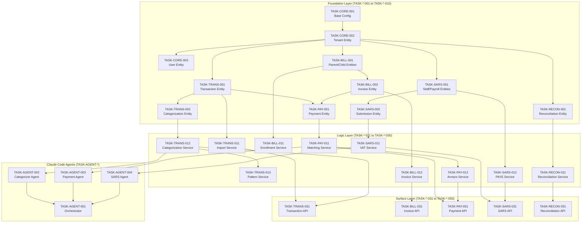

# Task Index: CrecheBooks Implementation

## Overview

This document defines the complete task sequence for implementing CrecheBooks. Tasks are organized in strict dependency order following the Inside-Out, Bottom-Up principle:

1. **Foundation Layer** - Data models, types, migrations (no dependencies)
2. **Logic Layer** - Services, business rules (depends on Foundation)
3. **Surface Layer** - Controllers, APIs, UI (depends on Logic)

**Critical Rule**: Task N cannot reference any file created in Task N+1 or later.

---

## Dependency Graph

---

## Execution Order

### Phase 1: Foundation Layer

| Order | Task ID | Title | Layer | Dependencies | Status |
|-------|---------|-------|-------|--------------|--------|
| 1 | TASK-CORE-001 | Project Setup and Base Configuration | foundation | — | ✅ Complete |
| 2 | TASK-CORE-002 | Tenant Entity and Migration | foundation | TASK-CORE-001 | ✅ Complete |
| 3 | TASK-CORE-003 | User Entity and Authentication Types | foundation | TASK-CORE-002 | ✅ Complete |
| 4 | TASK-CORE-004 | Audit Log Entity and Trail System | foundation | TASK-CORE-002 | ✅ Complete |
| 5 | TASK-TRANS-001 | Transaction Entity and Migration | foundation | TASK-CORE-002 | ✅ Complete |
| 6 | TASK-TRANS-002 | Categorization Entity and Types | foundation | TASK-TRANS-001 | Pending |
| 7 | TASK-TRANS-003 | Payee Pattern Entity | foundation | TASK-TRANS-001 | Pending |
| 8 | TASK-BILL-001 | Parent and Child Entities | foundation | TASK-CORE-002 | Pending |
| 9 | TASK-BILL-002 | Fee Structure and Enrollment Entities | foundation | TASK-BILL-001 | Pending |
| 10 | TASK-BILL-003 | Invoice and Invoice Line Entities | foundation | TASK-BILL-001 | Pending |
| 11 | TASK-PAY-001 | Payment Entity and Types | foundation | TASK-TRANS-001, TASK-BILL-003 | Pending |
| 12 | TASK-SARS-001 | Staff and Payroll Entities | foundation | TASK-CORE-002 | Pending |
| 13 | TASK-SARS-002 | SARS Submission Entity | foundation | TASK-CORE-002 | Pending |
| 14 | TASK-RECON-001 | Reconciliation Entity | foundation | TASK-TRANS-001 | Pending |
| 15 | TASK-MCP-001 | Xero MCP Server Foundation | foundation | TASK-CORE-001 | Pending |

### Phase 2: Logic Layer

| Order | Task ID | Title | Layer | Dependencies | Status |
|-------|---------|-------|-------|--------------|--------|
| 16 | TASK-TRANS-011 | Transaction Import Service | logic | TASK-TRANS-001 | Pending |
| 17 | TASK-TRANS-012 | Transaction Categorization Service | logic | TASK-TRANS-002, TASK-TRANS-003 | Pending |
| 18 | TASK-TRANS-013 | Payee Pattern Learning Service | logic | TASK-TRANS-003 | Pending |
| 19 | TASK-TRANS-014 | Xero Sync Service | logic | TASK-MCP-001, TASK-TRANS-001 | Pending |
| 20 | TASK-BILL-011 | Enrollment Management Service | logic | TASK-BILL-002 | Pending |
| 21 | TASK-BILL-012 | Invoice Generation Service | logic | TASK-BILL-003, TASK-BILL-002 | Pending |
| 22 | TASK-BILL-013 | Invoice Delivery Service | logic | TASK-BILL-003 | Pending |
| 23 | TASK-BILL-014 | Pro-rata Calculation Service | logic | TASK-BILL-012 | Pending |
| 24 | TASK-PAY-011 | Payment Matching Service | logic | TASK-PAY-001 | Pending |
| 25 | TASK-PAY-012 | Payment Allocation Service | logic | TASK-PAY-001, TASK-BILL-003 | Pending |
| 26 | TASK-PAY-013 | Arrears Calculation Service | logic | TASK-PAY-001, TASK-BILL-003 | Pending |
| 27 | TASK-PAY-014 | Payment Reminder Service | logic | TASK-PAY-013 | Pending |
| 28 | TASK-SARS-011 | VAT Calculation Service | logic | TASK-TRANS-002, TASK-BILL-003 | Pending |
| 29 | TASK-SARS-012 | PAYE Calculation Service | logic | TASK-SARS-001 | Pending |
| 30 | TASK-SARS-013 | UIF Calculation Service | logic | TASK-SARS-001 | Pending |
| 31 | TASK-SARS-014 | VAT201 Generation Service | logic | TASK-SARS-011, TASK-SARS-002 | Pending |
| 32 | TASK-SARS-015 | EMP201 Generation Service | logic | TASK-SARS-012, TASK-SARS-013, TASK-SARS-002 | Pending |
| 33 | TASK-SARS-016 | IRP5 Generation Service | logic | TASK-SARS-012, TASK-SARS-001 | Pending |
| 34 | TASK-RECON-011 | Bank Reconciliation Service | logic | TASK-RECON-001, TASK-TRANS-001 | Pending |
| 35 | TASK-RECON-012 | Discrepancy Detection Service | logic | TASK-RECON-011 | Pending |
| 36 | TASK-RECON-013 | Financial Report Service | logic | TASK-TRANS-002, TASK-BILL-003 | Pending |

### Phase 3: Claude Code Agents

| Order | Task ID | Title | Layer | Dependencies | Status |
|-------|---------|-------|-------|--------------|--------|
| 37 | TASK-AGENT-001 | Claude Code Configuration and Context | agent | TASK-CORE-001 | Pending |
| 38 | TASK-AGENT-002 | Transaction Categorizer Agent | agent | TASK-TRANS-012, TASK-AGENT-001 | Pending |
| 39 | TASK-AGENT-003 | Payment Matcher Agent | agent | TASK-PAY-011, TASK-AGENT-001 | Pending |
| 40 | TASK-AGENT-004 | SARS Calculation Agent | agent | TASK-SARS-011, TASK-AGENT-001 | Pending |
| 41 | TASK-AGENT-005 | Orchestrator Agent Setup | agent | TASK-AGENT-002, TASK-AGENT-003, TASK-AGENT-004 | Pending |

### Phase 4: Surface Layer (API)

| Order | Task ID | Title | Layer | Dependencies | Status |
|-------|---------|-------|-------|--------------|--------|
| 42 | TASK-API-001 | Authentication Controller and Guards | surface | TASK-CORE-003 | Pending |
| 43 | TASK-TRANS-031 | Transaction Controller and DTOs | surface | TASK-TRANS-011, TASK-TRANS-012 | Pending |
| 44 | TASK-TRANS-032 | Transaction Import Endpoint | surface | TASK-TRANS-031 | Pending |
| 45 | TASK-TRANS-033 | Categorization Endpoint | surface | TASK-TRANS-031, TASK-AGENT-002 | Pending |
| 46 | TASK-BILL-031 | Invoice Controller and DTOs | surface | TASK-BILL-012 | Pending |
| 47 | TASK-BILL-032 | Invoice Generation Endpoint | surface | TASK-BILL-031 | Pending |
| 48 | TASK-BILL-033 | Invoice Delivery Endpoint | surface | TASK-BILL-031, TASK-BILL-013 | Pending |
| 49 | TASK-BILL-034 | Enrollment Controller | surface | TASK-BILL-011 | Pending |
| 50 | TASK-PAY-031 | Payment Controller and DTOs | surface | TASK-PAY-011, TASK-PAY-012 | Pending |
| 51 | TASK-PAY-032 | Payment Matching Endpoint | surface | TASK-PAY-031, TASK-AGENT-003 | Pending |
| 52 | TASK-PAY-033 | Arrears Dashboard Endpoint | surface | TASK-PAY-013 | Pending |
| 53 | TASK-SARS-031 | SARS Controller and DTOs | surface | TASK-SARS-014, TASK-SARS-015 | Pending |
| 54 | TASK-SARS-032 | VAT201 Endpoint | surface | TASK-SARS-031 | Pending |
| 55 | TASK-SARS-033 | EMP201 Endpoint | surface | TASK-SARS-031 | Pending |
| 56 | TASK-RECON-031 | Reconciliation Controller | surface | TASK-RECON-011, TASK-RECON-012 | Pending |
| 57 | TASK-RECON-032 | Financial Reports Endpoint | surface | TASK-RECON-013 | Pending |

### Phase 5: Integration and Testing

| Order | Task ID | Title | Layer | Dependencies | Status |
|-------|---------|-------|-------|--------------|--------|
| 58 | TASK-INT-001 | E2E Transaction Categorization Flow | integration | TASK-TRANS-033 | Pending |
| 59 | TASK-INT-002 | E2E Billing Cycle Flow | integration | TASK-BILL-033 | Pending |
| 60 | TASK-INT-003 | E2E Payment Matching Flow | integration | TASK-PAY-032 | Pending |
| 61 | TASK-INT-004 | E2E SARS Submission Flow | integration | TASK-SARS-033 | Pending |
| 62 | TASK-INT-005 | E2E Reconciliation Flow | integration | TASK-RECON-032 | Pending |

---

## Progress Summary

| Phase | Tasks | Completed | Percentage |
|-------|-------|-----------|------------|
| Foundation | 15 | 5 | 33.3% |
| Logic | 21 | 0 | 0% |
| Agents | 5 | 0 | 0% |
| Surface | 16 | 0 | 0% |
| Integration | 5 | 0 | 0% |
| **Total** | **62** | **5** | **8.1%** |

---

## Layer Verification Checklist

Before starting Phase 2 (Logic):
- [ ] All Phase 1 entities created with migrations
- [ ] All migrations run successfully
- [ ] TypeScript compiles with no errors
- [ ] All entity tests pass

Before starting Phase 3 (Agents):
- [ ] All Phase 2 services implemented
- [ ] Unit tests for all services pass
- [ ] MCP servers functional

Before starting Phase 4 (Surface):
- [ ] Claude Code configuration complete
- [ ] All agents tested in isolation
- [ ] Agent communication contracts verified

Before starting Phase 5 (Integration):
- [ ] All API endpoints implemented
- [ ] API integration tests pass
- [ ] Xero sync functional
