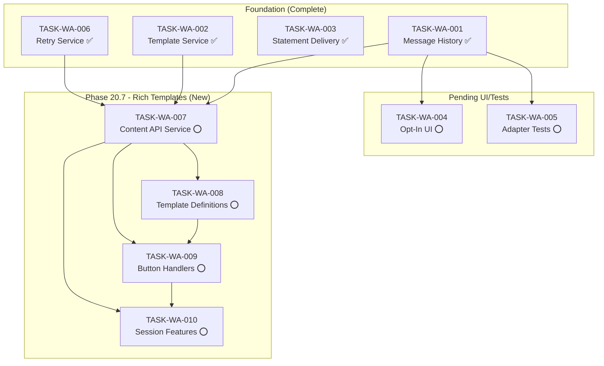

# WhatsApp Integration Traceability Matrix

## Overview

This document maps Twilio WhatsApp API capabilities to CrecheBooks implementation tasks, ensuring comprehensive coverage of all available functionality for rich tenant-branded communications.

## Content Type Mapping

### 1. Basic Content Types

| Twilio Content Type | WhatsApp Support | Implemented | Task ID | Notes |
|---------------------|------------------|-------------|---------|-------|
| `twilio/text` | Yes | ✅ | TASK-WA-001 ✓ | Basic text messaging |
| `twilio/media` | Yes | ✅ | TASK-WA-003 ✓ | PDF statements |

### 2. Interactive Content Types

| Twilio Content Type | WhatsApp Support | Implemented | Task ID | Notes |
|---------------------|------------------|-------------|---------|-------|
| `twilio/quick-reply` | Yes | ⭕ | TASK-WA-008 | 3 buttons (session), 10 buttons (approved) |
| `twilio/call-to-action` | Yes | ⭕ | TASK-WA-008 | URL + Phone buttons |
| `twilio/card` | Yes | ⭕ | TASK-WA-008 | Rich card with media + buttons |
| `twilio/list-picker` | Yes (session only) | ⭕ | TASK-WA-010 | Cannot be approved, 10 items max |
| `twilio/carousel` | Yes | ❌ | — | Not planned |

### 3. Advanced Content Types

| Twilio Content Type | WhatsApp Support | Implemented | Task ID | Notes |
|---------------------|------------------|-------------|---------|-------|
| `twilio/location` | Yes | ❌ | — | Not planned |
| `twilio/catalog` | Yes | ❌ | — | Not planned (no product catalog) |
| `whatsapp/authentication` | Yes | ❌ | — | Not planned (no OTP via WhatsApp) |

---

## Template Mapping

### Templates to Create (TASK-WA-008)

| Template Name | Content Type | Category | Variables | Task |
|---------------|--------------|----------|-----------|------|
| `cb_invoice_with_document` | twilio/card | UTILITY | 9 vars (incl tenant name) | TASK-WA-008 |
| `cb_payment_reminder_interactive` | twilio/quick-reply | UTILITY | 7 vars | TASK-WA-008 |
| `cb_payment_confirmation` | twilio/card | UTILITY | 9 vars | TASK-WA-008 |
| `cb_arrears_notice` | twilio/call-to-action | UTILITY | 8 vars | TASK-WA-008 |
| `cb_welcome_enrollment` | twilio/card | UTILITY | 9 vars | TASK-WA-008 |
| `cb_statement_notification` | twilio/card | UTILITY | 11 vars | TASK-WA-008 |
| `cb_reminder_friendly` | twilio/quick-reply | UTILITY | 6 vars | TASK-WA-008 |
| `cb_reminder_firm` | twilio/quick-reply | UTILITY | 5 vars | TASK-WA-008 |
| `cb_reminder_final` | twilio/call-to-action | UTILITY | 6 vars | TASK-WA-008 |

---

## Button Action Mapping (TASK-WA-009)

| Button ID Pattern | Action | Handler | Response Type |
|-------------------|--------|---------|---------------|
| `pay_{invoiceId}` | Send payment link | handlePayNow | Session message |
| `extension_{invoiceId}` | Request payment extension | handleExtensionRequest | Session + DB record |
| `contact_{invoiceId}` | Open conversation | handleContactRequest | Session message |
| `paid_{invoiceId}` | Report payment made | handleAlreadyPaid | Session message |
| `help_{invoiceId}` | Show help menu | handleHelpRequest | Quick reply (3 buttons) |
| `plan_{invoiceId}` | Request payment plan | handlePaymentPlanRequest | Session + notification |
| `callback_{invoiceId}` | Request callback | handleCallbackRequest | Session + notification |

---

## Session Features Mapping (TASK-WA-010)

| Feature | Content Type | Max Items | Handler |
|---------|--------------|-----------|---------|
| Statement Period Selector | list-picker | 5 | sendStatementPeriodSelector |
| Invoice List | list-picker | 10 | sendInvoiceList |
| Help Menu | list-picker | 5 | sendHelpMenu |
| Balance Quick Actions | quick-reply | 3 | sendBalanceInfo |

### Help Menu Options

| List ID | Label | Description | Handler |
|---------|-------|-------------|---------|
| `help_balance` | View My Balance | Check outstanding amount | sendBalanceInfo |
| `help_payment` | Payment Methods | How to pay fees | sendPaymentMethods |
| `help_statement` | Request Statement | Get account statement | sendStatementPeriodSelector |
| `help_update` | Update Details | Change contact info | sendUpdateDetailsLink |
| `help_human` | Speak to Someone | Request callback | requestHumanCallback |

---

## Communication Touchpoint Coverage

### Currently Implemented (Text-Only)

| Touchpoint | Service | WhatsApp Support | Rich Template |
|------------|---------|------------------|---------------|
| Invoice Delivery | InvoiceDeliveryService | ✅ Text | ⭕ TASK-WA-008 |
| Payment Reminders | ReminderService | ✅ Text | ⭕ TASK-WA-008 |
| Statement Notifications | StatementDeliveryService | ✅ Text | ⭕ TASK-WA-008 |
| Welcome Messages | WelcomePackDeliveryService | ✅ Text | ⭕ TASK-WA-008 |
| Arrears Notices | ArrearsService | ✅ Text | ⭕ TASK-WA-008 |

### New Rich Features (To Implement)

| Feature | Task | Content Type | Interactive |
|---------|------|--------------|-------------|
| PDF Invoice Card | TASK-WA-008 | twilio/card | View + Pay buttons |
| Quick Reply Reminders | TASK-WA-008 | twilio/quick-reply | 3 action buttons |
| Payment Confirmation Card | TASK-WA-008 | twilio/card | View Receipt button |
| Arrears with Call Button | TASK-WA-008 | twilio/call-to-action | URL + Phone |
| Welcome with Portal Link | TASK-WA-008 | twilio/card | Setup + Contact |
| Statement with PDF | TASK-WA-008 | twilio/card | View Statement |
| Interactive Help Menu | TASK-WA-010 | twilio/list-picker | 5 options |
| Statement Period Selector | TASK-WA-010 | twilio/list-picker | 5 periods |

---

## Tenant Branding Requirements

**CRITICAL**: All templates MUST use tenant-specific data.

| Template Variable | Source | Example |
|-------------------|--------|---------|
| Creche Name | `tenant.tradingName` | "Little Stars Creche" |
| Phone Number | `tenant.phone` | "+27600188230" |
| Email | `tenant.email` | "info@littlestars.co.za" |
| Bank Name | `tenant.bankName` | "FNB" |
| Account Number | `tenant.bankAccountNumber` | "62123456789" |
| Branch Code | `tenant.bankBranchCode` | "250655" |

**Anti-Pattern**: Never hardcode "CrecheBooks" in template bodies.

---

## Implementation Coverage Summary

| Category | Total Features | Implemented | Pending | Coverage |
|----------|----------------|-------------|---------|----------|
| Content Types | 7 | 2 | 3 | 29% |
| Templates (text-only) | 6 | 6 | 0 | 100% |
| Templates (rich) | 9 | 0 | 9 | 0% |
| Button Handlers | 7 | 0 | 7 | 0% |
| Session Features | 4 | 0 | 4 | 0% |
| **Total** | **33** | **8** | **23** | **24%** |

### Completed Foundation Tasks
- ✅ **TASK-WA-001**: Message history entity - `entities/whatsapp-message.entity.ts`
- ✅ **TASK-WA-002**: Template service - `services/template.service.ts`
- ✅ **TASK-WA-003**: Statement delivery - `sendStatementNotification()` methods
- ✅ **TASK-WA-006**: Retry service - `services/retry.service.ts` + `processors/whatsapp-retry.processor.ts`

---

## Task Dependencies

---

## Approval Requirements

| Template | Approval Required | Expected Time | Notes |
|----------|-------------------|---------------|-------|
| cb_invoice_with_document | Yes | 24-48 hours | UTILITY category |
| cb_payment_reminder_interactive | Yes | 24-48 hours | UTILITY category |
| cb_payment_confirmation | Yes | 24-48 hours | UTILITY category |
| cb_arrears_notice | Yes | 24-48 hours | UTILITY category |
| cb_welcome_enrollment | Yes | 24-48 hours | UTILITY category |
| cb_statement_notification | Yes | 24-48 hours | UTILITY category |
| cb_reminder_friendly | Yes | 24-48 hours | UTILITY category |
| cb_reminder_firm | Yes | 24-48 hours | UTILITY category |
| cb_reminder_final | Yes | 24-48 hours | UTILITY category |
| List Picker (session) | No | N/A | Cannot be approved |
| Quick Reply (3 btn session) | No | N/A | Session only |

---

## Character Limits Reference

| Element | Limit |
|---------|-------|
| Template body | 1,024 characters |
| Card body | 1,600 characters |
| Card title | 1,024 characters |
| Card subtitle | 60 characters |
| Button text | 20 characters |
| URL button text | 25 characters |
| Quick reply payload | 200 characters |
| List item title | 24 characters |
| List item description | 72 characters |
| Header text | 60 characters |
| Footer text | 60 characters |

---

*Traceability matrix created: 2026-02-05*
*Last updated: 2026-02-05*
