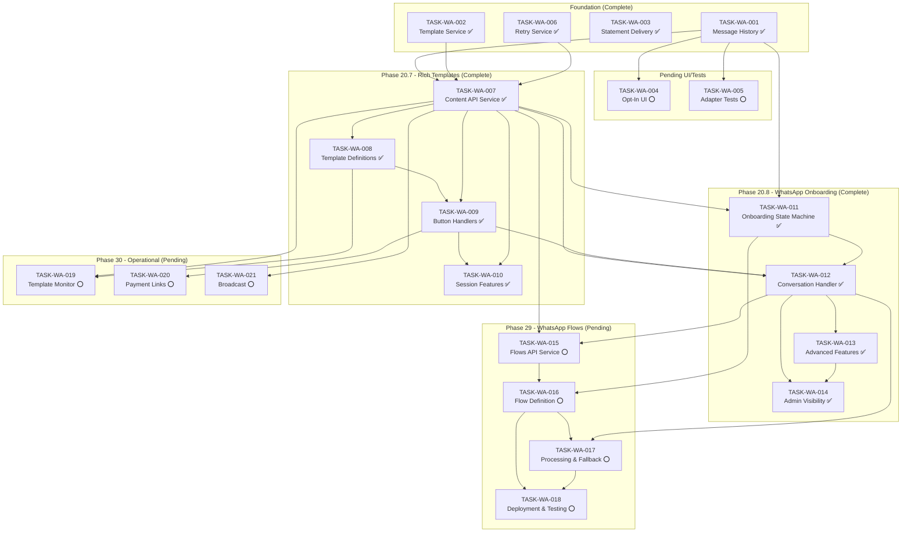

# WhatsApp Integration Traceability Matrix

## Overview

This document maps Twilio WhatsApp API capabilities to CrecheBooks implementation tasks, ensuring comprehensive coverage of all available functionality for rich tenant-branded communications.

## Content Type Mapping

### 1. Basic Content Types

| Twilio Content Type | WhatsApp Support | Implemented | Task ID | Notes |
|---------------------|------------------|-------------|---------|-------|
| `twilio/text` | Yes | ✅ | TASK-WA-001 ✓ | Basic text messaging |
| `twilio/media` | Yes | ✅ | TASK-WA-003 ✓ | PDF statements |

### 2. Interactive Content Types

| Twilio Content Type | WhatsApp Support | Implemented | Task ID | Notes |
|---------------------|------------------|-------------|---------|-------|
| `twilio/quick-reply` | Yes | ⭕ | TASK-WA-008 | 3 buttons (session), 10 buttons (approved) |
| `twilio/call-to-action` | Yes | ⭕ | TASK-WA-008 | URL + Phone buttons |
| `twilio/card` | Yes | ⭕ | TASK-WA-008 | Rich card with media + buttons |
| `twilio/list-picker` | Yes (session only) | ⭕ | TASK-WA-010 | Cannot be approved, 10 items max |
| `twilio/carousel` | Yes | ❌ | — | Not planned |

### 3. Advanced Content Types

| Twilio Content Type | WhatsApp Support | Implemented | Task ID | Notes |
|---------------------|------------------|-------------|---------|-------|
| `twilio/location` | Yes | ❌ | — | Not planned |
| `twilio/catalog` | Yes | ❌ | — | Not planned (no product catalog) |
| `whatsapp/authentication` | Yes | ❌ | — | Not planned (no OTP via WhatsApp) |

---

## Template Mapping

### Registered Templates (TASK-WA-008) — All Pending Approval

| Template Name | Content Type | Category | Variables | SID |
|---------------|-------------|----------|-----------|-----|
| `cb_invoice_with_document_v3` | twilio/quick-reply | UTILITY | 7 vars | HX09bfce531e893903cfd993181f481628 |
| `cb_payment_reminder_interactive` | twilio/quick-reply | UTILITY | 7 vars | HX1b9e42f2e2db54112e20386d8d532f35 |
| `cb_payment_confirmation_v4` | twilio/quick-reply | UTILITY | 5 vars | HX26d8b5d0fb71801d9b7a44dec5731399 |
| `cb_arrears_notice_v2` | twilio/call-to-action | UTILITY | 7 vars | HXec84454f20552d1e981ec37b863a17e0 |
| `cb_welcome_enrollment_v2` | twilio/call-to-action | UTILITY | 7 vars | HXa8006fbbdb9555891e9f128b3490c81b |
| `cb_statement_notification_v2` | twilio/quick-reply | UTILITY | 10 vars | HX381c1a675d524f7b8d27d6df4608d9b0 |
| `cb_reminder_friendly` | twilio/quick-reply | UTILITY | 6 vars | HXaa44a80ed4a90ec6b32f825a0a182469 |
| `cb_reminder_firm` | twilio/quick-reply | UTILITY | 5 vars | HXf7f7ea559dd9b9fc79e33157ad7cf1a8 |
| `cb_reminder_final` | twilio/call-to-action | UTILITY | 5 vars | HXe6ccaebec5f2178e9297aa8125cf2944 |

**Note**: Templates were redesigned from `twilio/card` to `twilio/quick-reply` and `twilio/call-to-action` to comply with WhatsApp approval rules (no dynamic media URLs). PDFs are delivered via Option A hybrid flow (template → session → PDF attachment).

---

## Button Action Mapping (TASK-WA-009)

| Button ID Pattern | Action | Handler | Response Type |
|-------------------|--------|---------|---------------|
| `pay_{invoiceId}` | Send payment link | handlePayNow | Session message |
| `extension_{invoiceId}` | Request payment extension | handleExtensionRequest | Session + DB record |
| `contact_{invoiceId}` | Open conversation | handleContactRequest | Session message |
| `paid_{invoiceId}` | Report payment made | handleAlreadyPaid | Session message |
| `help_{invoiceId}` | Show help menu | handleHelpRequest | Quick reply (3 buttons) |
| `plan_{invoiceId}` | Request payment plan | handlePaymentPlanRequest | Session + notification |
| `callback_{invoiceId}` | Request callback | handleCallbackRequest | Session + notification |

---

## Session Features Mapping (TASK-WA-010)

| Feature | Content Type | Max Items | Handler |
|---------|--------------|-----------|---------|
| Statement Period Selector | list-picker | 5 | sendStatementPeriodSelector |
| Invoice List | list-picker | 10 | sendInvoiceList |
| Help Menu | list-picker | 5 | sendHelpMenu |
| Balance Quick Actions | quick-reply | 3 | sendBalanceInfo |

### Help Menu Options

| List ID | Label | Description | Handler |
|---------|-------|-------------|---------|
| `help_balance` | View My Balance | Check outstanding amount | sendBalanceInfo |
| `help_payment` | Payment Methods | How to pay fees | sendPaymentMethods |
| `help_statement` | Request Statement | Get account statement | sendStatementPeriodSelector |
| `help_update` | Update Details | Change contact info | sendUpdateDetailsLink |
| `help_human` | Speak to Someone | Request callback | requestHumanCallback |

---

## Communication Touchpoint Coverage

### Currently Implemented (Text-Only)

| Touchpoint | Service | WhatsApp Support | Rich Template |
|------------|---------|------------------|---------------|
| Invoice Delivery | InvoiceDeliveryService | ✅ Text | ⭕ TASK-WA-008 |
| Payment Reminders | ReminderService | ✅ Text | ⭕ TASK-WA-008 |
| Statement Notifications | StatementDeliveryService | ✅ Text | ⭕ TASK-WA-008 |
| Welcome Messages | WelcomePackDeliveryService | ✅ Text | ⭕ TASK-WA-008 |
| Arrears Notices | ArrearsService | ✅ Text | ⭕ TASK-WA-008 |

### New Rich Features (To Implement)

| Feature | Task | Content Type | Interactive |
|---------|------|--------------|-------------|
| PDF Invoice Card | TASK-WA-008 | twilio/card | View + Pay buttons |
| Quick Reply Reminders | TASK-WA-008 | twilio/quick-reply | 3 action buttons |
| Payment Confirmation Card | TASK-WA-008 | twilio/card | View Receipt button |
| Arrears with Call Button | TASK-WA-008 | twilio/call-to-action | URL + Phone |
| Welcome with Portal Link | TASK-WA-008 | twilio/card | Setup + Contact |
| Statement with PDF | TASK-WA-008 | twilio/card | View Statement |
| Interactive Help Menu | TASK-WA-010 | twilio/list-picker | 5 options |
| Statement Period Selector | TASK-WA-010 | twilio/list-picker | 5 periods |

---

## Tenant Branding Requirements

**CRITICAL**: All templates MUST use tenant-specific data.

| Template Variable | Source | Example |
|-------------------|--------|---------|
| Creche Name | `tenant.tradingName` | "Little Stars Creche" |
| Phone Number | `tenant.phone` | "+27600188230" |
| Email | `tenant.email` | "info@littlestars.co.za" |
| Bank Name | `tenant.bankName` | "FNB" |
| Account Number | `tenant.bankAccountNumber` | "62123456789" |
| Branch Code | `tenant.bankBranchCode` | "250655" |

**Anti-Pattern**: Never hardcode "CrecheBooks" in template bodies.

---

## Implementation Coverage Summary

| Category | Total Features | Implemented | Pending | Coverage |
|----------|----------------|-------------|---------|----------|
| Content Types | 7 | 5 | 2 | 71% |
| Templates (text-only) | 6 | 6 | 0 | 100% |
| Templates (rich) | 9 | 9 | 0 | 100% |
| Button Handlers | 7 | 7 | 0 | 100% |
| Session Features | 4 | 4 | 0 | 100% |
| Parent Onboarding (Phase 1) | 4 | 4 | 0 | 100% |
| WhatsApp Flows (Phase 2) | 4 | 0 | 4 | 0% |
| Operational Enhancements | 3 | 0 | 3 | 0% |
| **Total** | **44** | **35** | **9** | **80%** |

### Completed Foundation Tasks
- ✅ **TASK-WA-001**: Message history entity - `entities/whatsapp-message.entity.ts`
- ✅ **TASK-WA-002**: Template service - `services/template.service.ts`
- ✅ **TASK-WA-003**: Statement delivery - `sendStatementNotification()` methods
- ✅ **TASK-WA-006**: Retry service - `services/retry.service.ts` + `processors/whatsapp-retry.processor.ts`
- ✅ **TASK-WA-007**: Twilio Content API integration - `services/twilio-content.service.ts`
- ✅ **TASK-WA-008**: Rich template definitions - `templates/content-templates.ts`
- ✅ **TASK-WA-009**: Button response handlers - `handlers/button-response.handler.ts`
- ✅ **TASK-WA-010**: Session interactive features - `handlers/session-interactive.handler.ts`

---

## WhatsApp Parent Onboarding (Phase 20.8)

### Onboarding Flow Mapping

| Step | Prompt | Input Type | Validation | Task |
|------|--------|-----------|------------|------|
| WELCOME | Greeting + POPIA notice | Quick reply | Accept/Decline | TASK-WA-012 |
| CONSENT | POPIA consent | Quick reply | Required: Accept | TASK-WA-012 |
| PARENT_NAME | "What is your first name?" | Free text | Non-empty | TASK-WA-012 |
| PARENT_SURNAME | "What is your surname?" | Free text | Non-empty | TASK-WA-012 |
| PARENT_EMAIL | "What is your email?" | Free text | Email regex | TASK-WA-012 |
| PARENT_ID_NUMBER | "SA ID number?" | Free text | Luhn / "Skip" | TASK-WA-012 |
| CHILD_NAME | "Child's first name?" | Free text | Non-empty | TASK-WA-012 |
| CHILD_DOB | "Child's date of birth?" | Free text | DD/MM/YYYY, age 0-7 | TASK-WA-012 |
| CHILD_ALLERGIES | "Allergies?" | Free text | "None" accepted | TASK-WA-012 |
| CHILD_ANOTHER | "Register another child?" | Quick reply | Add Another/Continue | TASK-WA-013 |
| EMERGENCY_CONTACT_NAME | "Emergency contact name?" | Free text | Non-empty | TASK-WA-012 |
| EMERGENCY_CONTACT_PHONE | "Emergency phone?" | Free text | SA phone format | TASK-WA-012 |
| EMERGENCY_CONTACT_RELATION | "Relationship?" | Quick reply | 4 options | TASK-WA-012 |
| ID_DOCUMENT | "Photo of SA ID?" | Media/text | Image or "Skip" | TASK-WA-013 |
| FEE_AGREEMENT | Fee structure + acknowledge | Quick reply | Agree/Decline | TASK-WA-012 |
| COMMUNICATION_PREFS | "How to reach you?" | Quick reply | WhatsApp/Email/Both | TASK-WA-012 |
| CONFIRMATION | Summary + confirm | Quick reply | Confirm/Edit/Cancel | TASK-WA-012 |

### Onboarding Task Dependencies

| Task ID | Title | Layer | Dependencies | Priority | Status |
|---------|-------|-------|--------------|----------|--------|
| TASK-WA-011 | Onboarding State Machine and Session Model | foundation | TASK-WA-001, TASK-WA-007 | P1-HIGH | ✅ Complete |
| TASK-WA-012 | Conversational Onboarding Handler | logic | TASK-WA-011, TASK-WA-007, TASK-WA-009 | P1-HIGH | ✅ Complete |
| TASK-WA-013 | Onboarding Advanced Features | logic | TASK-WA-012 | P2-MEDIUM | ✅ Complete |
| TASK-WA-014 | Onboarding Admin Visibility and Tests | surface | TASK-WA-012, TASK-WA-013 | P2-MEDIUM | ✅ Complete |

### Onboarding Template Mapping

| Template Name | Content Type | Category | Variables | Task |
|---------------|-------------|----------|-----------|------|
| `cb_onboarding_resume` | twilio/quick-reply | UTILITY | 3 vars (name, tenant, step) | TASK-WA-011 |

### Admin Endpoints (TASK-WA-014)

| Method | Endpoint | Description |
|--------|----------|-------------|
| GET | `/whatsapp/onboarding` | List onboarding sessions (filter by status) |
| GET | `/whatsapp/onboarding/:id` | Get session detail with collected data |
| POST | `/whatsapp/onboarding/:id/enroll` | Convert to enrollment |
| GET | `/whatsapp/onboarding/stats` | Dashboard statistics |

---

## Task Dependencies

---

## Approval Requirements

| Template | Approval Required | Expected Time | Notes |
|----------|-------------------|---------------|-------|
| cb_invoice_with_document_v3 | Yes | 24-48 hours | UTILITY, pending approval |
| cb_payment_reminder_interactive | Yes | 24-48 hours | UTILITY, pending approval |
| cb_payment_confirmation_v4 | Yes | 24-48 hours | UTILITY, pending approval |
| cb_arrears_notice_v3 | Yes | 24-48 hours | UTILITY, pending approval |
| cb_welcome_enrollment_v3 | Yes | 24-48 hours | UTILITY, pending approval |
| cb_statement_notification_v2 | Yes | 24-48 hours | UTILITY, pending approval |
| cb_reminder_friendly | Yes | 24-48 hours | UTILITY, pending approval |
| cb_reminder_firm | Yes | 24-48 hours | UTILITY, pending approval |
| cb_reminder_final_v2 | Yes | 24-48 hours | UTILITY, pending approval |
| cb_onboarding_resume | Yes | 24-48 hours | UTILITY, TASK-WA-011 |
| List Picker (session) | No | N/A | Cannot be approved |
| Quick Reply (3 btn session) | No | N/A | Session only |

---

## Character Limits Reference

| Element | Limit |
|---------|-------|
| Template body | 1,024 characters |
| Card body | 1,600 characters |
| Card title | 1,024 characters |
| Card subtitle | 60 characters |
| Button text | 20 characters |
| URL button text | 25 characters |
| Quick reply payload | 200 characters |
| List item title | 24 characters |
| List item description | 72 characters |
| Header text | 60 characters |
| Footer text | 60 characters |

---

---

## WhatsApp Flows Onboarding — Phase 2 (Phase 29)

### Flows Task Dependencies

| Task ID | Title | Layer | Dependencies | Priority | Status |
|---------|-------|-------|--------------|----------|--------|
| TASK-WA-015 | WhatsApp Flows API Integration Service | foundation | TASK-WA-007, TASK-WA-012 | P2-MEDIUM | ⭕ Pending |
| TASK-WA-016 | WhatsApp Flows Onboarding Form Definition | logic | TASK-WA-015, TASK-WA-011 | P2-MEDIUM | ⭕ Pending |
| TASK-WA-017 | WhatsApp Flows Onboarding Processing and Fallback | logic | TASK-WA-016, TASK-WA-012 | P2-MEDIUM | ⭕ Pending |
| TASK-WA-018 | WhatsApp Flows Deployment, Testing and Migration | integration | TASK-WA-016, TASK-WA-017 | P2-MEDIUM | ⭕ Pending |

### Flow Screen Mapping

| Screen | Title | Components | Data Collected |
|--------|-------|------------|---------------|
| CONSENT | Welcome | TextHeading, TextBody, OptIn, Footer | popia_consent |
| PARENT_DETAILS | Your Details | TextInput x4, Footer | first_name, surname, email, id_number |
| CHILD_DETAILS | Child Details | TextInput, DatePicker, TextArea, Footer | child_name, child_dob, allergies |
| EMERGENCY_CONTACT | Emergency Contact | TextInput x2, Dropdown, Footer | name, phone, relationship |
| CONFIRMATION | Confirm Registration | TextBody, RadioButtons, Footer | communication_pref |

### Flows vs Conversational Comparison

| Aspect | Phase 1 (Conversational) | Phase 2 (Flows) |
|--------|--------------------------|-----------------|
| Messages required | 16+ (one per field) | 1 (send flow) + 1 (confirmation) |
| Input validation | Server-side after each message | Client-side native (email, phone types) |
| Date entry | Free text (DD/MM/YYYY) | Native DatePicker |
| Dropdowns | Not available (quick reply max 3) | Native Dropdown (unlimited) |
| Back navigation | Not supported | Built-in screen navigation |
| Multi-child | Loop via quick reply | Separate flow trigger needed |
| ID document | Photo upload (media message) | Not supported in Flows |
| Fallback | N/A | Conversational (Phase 1) |
| Min WhatsApp version | Any | Android 2.24.13+, iOS 2.24.13+ |

---

## WhatsApp Operational Enhancements (Phase 30)

### Operational Task Dependencies

| Task ID | Title | Layer | Dependencies | Priority | Status |
|---------|-------|-------|--------------|----------|--------|
| TASK-WA-019 | Template Approval Monitoring Service | logic | TASK-WA-007, TASK-WA-008 | P2-HIGH | ⭕ Pending |
| TASK-WA-020 | Payment Deep-Linking with Yoco | logic | TASK-WA-009, TASK-PAY-011 | P2-HIGH | ⭕ Pending |
| TASK-WA-021 | Broadcast Integration with Ad-hoc Communications | logic | TASK-WA-007, TASK-COMM-001 | P3-MEDIUM | ⭕ Pending |

### Operational Feature Mapping

| Feature | Task | Current State | Target State |
|---------|------|--------------|-------------|
| Template approval check | TASK-WA-019 | Manual curl to Twilio API | Automated CRON (6h) + admin email |
| Rejection tracking | TASK-WA-019 | Not tracked | DB field + resubmission info |
| Payment links | TASK-WA-020 | Hardcoded URL (TODO) | Dynamic Yoco checkout per invoice |
| Payment confirmation | TASK-WA-020 | Manual | Auto-send template after Yoco webhook |
| Broadcast sending | TASK-WA-021 | Basic text only | Rich template + rate limiting |
| Broadcast analytics | TASK-WA-021 | No per-recipient tracking | Delivery status per recipient |
| Opt-out handling | TASK-WA-021 | Twilio auto-handles STOP | Sync whatsappOptIn flag on STOP |

### New Templates Required

| Template Name | Phase | Content Type | Variables | Purpose |
|---------------|-------|-------------|-----------|---------|
| `cb_onboarding_resume` | 28 | twilio/quick-reply | 3 | Re-engage abandoned onboarding |
| `cb_broadcast_announcement` | 30 | twilio/quick-reply | 4 | Ad-hoc broadcast messages |

---

### Onboarding Coverage

| Feature | Task | Status |
|---------|------|--------|
| Onboarding State Machine (Prisma model) | TASK-WA-011 | ✅ Complete |
| Onboarding types/interfaces | TASK-WA-011 | ✅ Complete |
| Re-engagement template | TASK-WA-011 | ✅ Complete |
| Conversational handler (16 steps) | TASK-WA-012 | ✅ Complete |
| Input validation (SA ID, email, phone, DOB) | TASK-WA-012 | ✅ Complete |
| POPIA consent collection | TASK-WA-012 | ✅ Complete |
| Parent/Child/EmergencyContact creation | TASK-WA-012 | ✅ Complete |
| Webhook routing | TASK-WA-012 | ✅ Complete |
| Multi-child registration loop | TASK-WA-013 | ✅ Complete |
| ID document photo upload | TASK-WA-013 | ✅ Complete |
| Session expiry CRON job | TASK-WA-013 | ✅ Complete |
| Progress indicators | TASK-WA-013 | ✅ Complete |
| Edit flow from confirmation | TASK-WA-013 | ✅ Complete |
| Admin API endpoints | TASK-WA-014 | ✅ Complete |
| Convert-to-enrollment action | TASK-WA-014 | ✅ Complete |
| Admin notification on completion | TASK-WA-014 | ✅ Complete |
| E2E onboarding tests | TASK-WA-014 | ✅ Complete |

### WhatsApp Flows Coverage (Phase 29)

| Feature | Task | Status |
|---------|------|--------|
| Flows API service (Graph API integration) | TASK-WA-015 | ⭕ Pending |
| Flow CRUD (create, update, publish) | TASK-WA-015 | ⭕ Pending |
| Flow message sending via Twilio | TASK-WA-015 | ⭕ Pending |
| Flow JSON types/schema | TASK-WA-015 | ⭕ Pending |
| 5-screen onboarding flow definition | TASK-WA-016 | ⭕ Pending |
| Data endpoint controller | TASK-WA-016 | ⭕ Pending |
| Flow registration script | TASK-WA-016 | ⭕ Pending |
| Flow data decryption (AES-GCM) | TASK-WA-017 | ⭕ Pending |
| Flow response → record creation | TASK-WA-017 | ⭕ Pending |
| Flows vs conversational routing | TASK-WA-017 | ⭕ Pending |
| Tenant whatsappFlowsEnabled flag | TASK-WA-017 | ⭕ Pending |
| Deployment script | TASK-WA-018 | ⭕ Pending |
| E2E tests (Flow + fallback) | TASK-WA-018 | ⭕ Pending |
| Channel stats (Flow vs conversational) | TASK-WA-018 | ⭕ Pending |

### Operational Coverage (Phase 30)

| Feature | Task | Status |
|---------|------|--------|
| Template approval CRON (6h poll) | TASK-WA-019 | ⭕ Pending |
| DB approval status sync | TASK-WA-019 | ⭕ Pending |
| Rejection reason tracking | TASK-WA-019 | ⭕ Pending |
| Admin notification on approval/rejection | TASK-WA-019 | ⭕ Pending |
| Manual --check-status CLI | TASK-WA-019 | ⭕ Pending |
| Dynamic Yoco checkout links | TASK-WA-020 | ⭕ Pending |
| WhatsApp payment channel tracking | TASK-WA-020 | ⭕ Pending |
| Auto payment confirmation template | TASK-WA-020 | ⭕ Pending |
| Rate-limited broadcast sending | TASK-WA-021 | ⭕ Pending |
| Broadcast announcement template | TASK-WA-021 | ⭕ Pending |
| Broadcast delivery tracking | TASK-WA-021 | ⭕ Pending |
| Opt-out sync (STOP → whatsappOptIn) | TASK-WA-021 | ⭕ Pending |

---

*Traceability matrix created: 2026-02-05*
*Last updated: 2026-02-06*

---

## Completed Work Summary (Phase 28)

**TASK-WA-011 to TASK-WA-014** — Completed 2026-02-05

### Files Created/Modified

| File | Description |
|------|-------------|
| `apps/api/prisma/schema.prisma` | Added `OnboardingStep` enum, `WaOnboardingStatus` enum, `WhatsAppOnboardingSession` model |
| `apps/api/src/integrations/whatsapp/types/onboarding.types.ts` | Interfaces, validators (SA ID Luhn, email, phone, DOB) |
| `apps/api/src/integrations/whatsapp/handlers/onboarding-conversation.handler.ts` | 16-step conversation handler (~1050 lines) |
| `apps/api/src/integrations/whatsapp/jobs/onboarding-expiry.job.ts` | Hourly CRON for session expiry + re-engagement |
| `apps/api/src/integrations/whatsapp/controllers/onboarding.controller.ts` | Admin API (stats, list, detail, enroll) |
| `apps/api/src/integrations/whatsapp/dto/onboarding.dto.ts` | Request/response DTOs |
| `apps/api/src/webhooks/webhook.controller.ts` | Added `POST /webhooks/twilio/incoming` |
| `apps/api/src/integrations/whatsapp/templates/content-templates.ts` | Added `ONBOARDING_RESUME`, fixed URL templates (v3) |
| `apps/web/src/components/parent-portal/auth-guard.tsx` | Parent portal auth redirect |
| `apps/web/src/app/parent/login/page.tsx` | Redirect param support |
| `apps/web/src/app/parent/verify/page.tsx` | Redirect after magic link auth |

### Tests

- 101 tests across 3 suites (handler unit, controller unit, E2E)
- `pnpm test --filter @crechebooks/api -- --testPathPatterns="onboarding"`

### Templates on Twilio

| Template | SID | Status |
|----------|-----|--------|
| `cb_onboarding_resume` | HXd9d72c0d5e34e38601819d594c176cd5 | Submitted for approval |
| `cb_arrears_notice_v3` | HX6910ca9be8e5634c4f4281b60fe85feb | Submitted for approval |
| `cb_welcome_enrollment_v3` | HX4af6f93bf57360b232fead10707aeda1 | Submitted for approval |
| `cb_reminder_final_v2` | HXfd0303c96c1e777d9250d4efaee4aecf | Submitted for approval |

### Commits

- `ddf43b1` feat(whatsapp): implement parent onboarding via conversational flow
- `6ac97bf` fix(db): add missing migration for whatsapp_onboarding_sessions table
- `ab8b9b5` fix(whatsapp): use approved template for onboarding re-engagement
- `b9f59a8` fix(whatsapp): fix template URLs and add parent portal auth redirect
