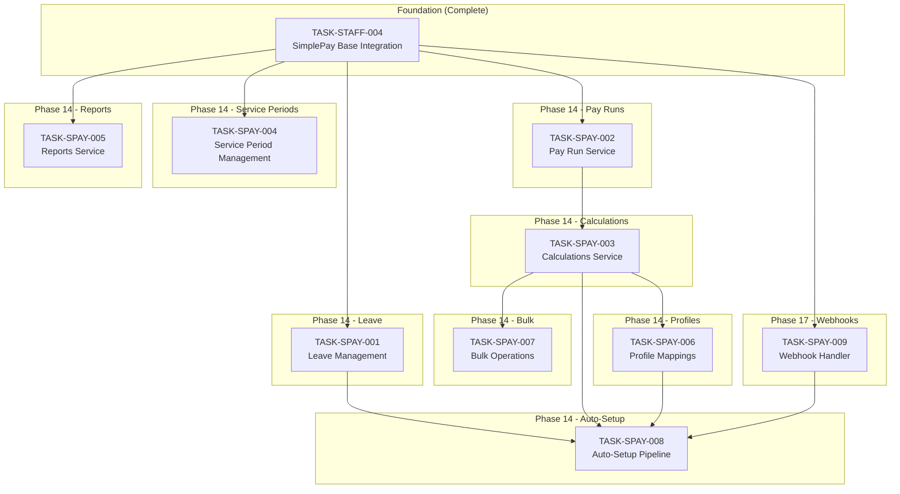
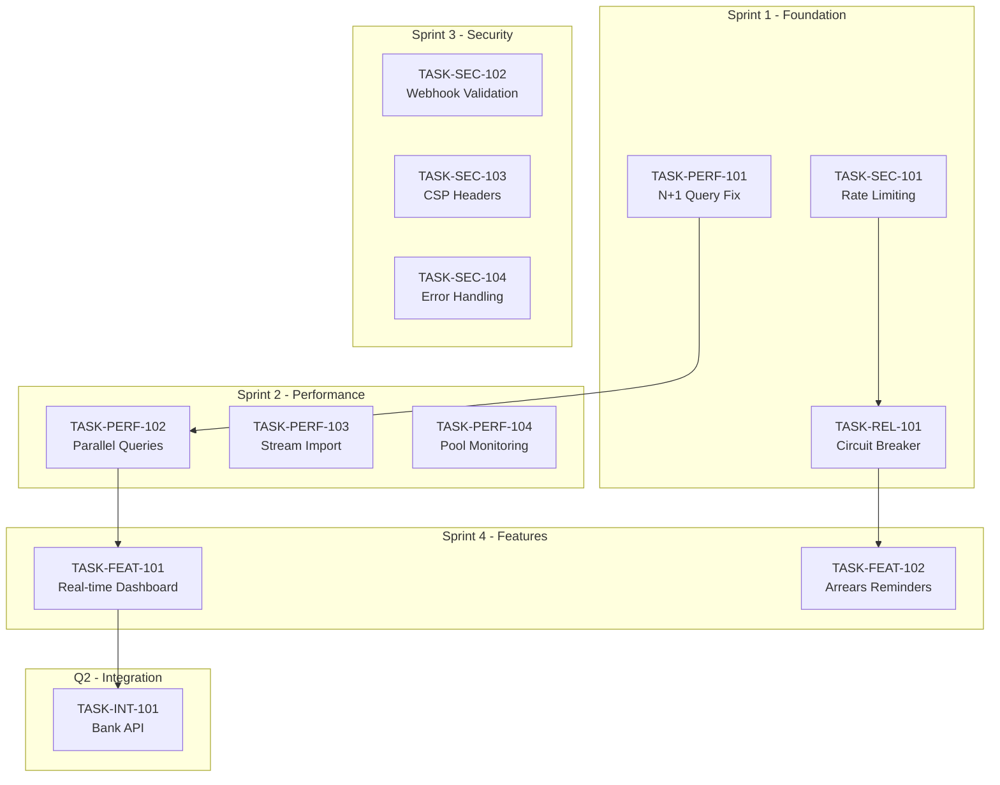

# SimplePay Integration Traceability Matrix

## Overview

This document maps SimplePay API capabilities to CrecheBooks implementation tasks, ensuring comprehensive coverage of all available functionality.

## API Resource Mapping

### 1. Client Management

| SimplePay Endpoint | HTTP Method | Implemented | Task ID | Notes |
|-------------------|-------------|-------------|---------|-------|
| `/v1/clients/` | GET | ✅ | TASK-STAFF-004 | List accessible clients |
| Client ID validation | — | ✅ | TASK-STAFF-004 | Via testConnection |

### 2. Employee Management

| SimplePay Endpoint | HTTP Method | Implemented | Task ID | Notes |
|-------------------|-------------|-------------|---------|-------|
| `/v1/clients/:client_id/employees` | GET | ✅ | TASK-STAFF-004 | List employees |
| `/v1/clients/:client_id/employees` | POST | ✅ | TASK-STAFF-004 | Create employee |
| `/v1/employees/:id` | GET | ✅ | TASK-STAFF-004 | Get employee details |
| `/v1/employees/:id` | PATCH | ✅ | TASK-STAFF-004 | Update employee |
| `/v1/employees/:id` | DELETE | ⭕ | — | Not implemented |

### 3. Service Periods (Employment Lifecycle)

| SimplePay Endpoint | HTTP Method | Implemented | Task ID | Notes |
|-------------------|-------------|-------------|---------|-------|
| `/v1/employees/:id/service_periods` | GET | ⭕ | TASK-SPAY-004 | Pending |
| `/v1/employees/:id/service_periods/end_service` | POST | ⭕ | TASK-SPAY-004 | Pending |
| `/v1/employees/:id/service_periods/reinstate` | POST | ⭕ | TASK-SPAY-004 | Pending |
| `/v1/employees/:id/service_periods/undo_end_service` | DELETE | ⭕ | TASK-SPAY-004 | Pending |

### 4. Waves (Pay Frequencies)

| SimplePay Endpoint | HTTP Method | Implemented | Task ID | Notes |
|-------------------|-------------|-------------|---------|-------|
| `/v1/clients/:client_id/waves` | GET | ✅ | TASK-STAFF-004 | Get pay frequencies |
| `/v1/clients/:client_id/waves` | POST | ⭕ | — | Not planned |

### 5. Payslips

| SimplePay Endpoint | HTTP Method | Implemented | Task ID | Notes |
|-------------------|-------------|-------------|---------|-------|
| `/v1/employees/:id/payslips` | GET | ✅ | TASK-STAFF-004 | List employee payslips |
| `/v1/payslips/:id` | GET | ✅ | TASK-STAFF-004 | Get payslip JSON |
| `/v1/payslips/:id.pdf` | GET | ✅ | TASK-STAFF-004 | Download payslip PDF |

### 6. Pay Runs (Payment Runs)

| SimplePay Endpoint | HTTP Method | Implemented | Task ID | Notes |
|-------------------|-------------|-------------|---------|-------|
| `/v1/clients/:client_id/payment_runs` | GET | ⭕ | TASK-SPAY-002 | Pending |
| `/v1/payment_runs/:id/payslips` | GET | ⭕ | TASK-SPAY-002 | Pending |
| `/v1/payment_runs/:id/accounting` | GET | ⭕ | TASK-SPAY-002 | Pending |

### 7. Calculations (Payslip Items)

| SimplePay Endpoint | HTTP Method | Implemented | Task ID | Notes |
|-------------------|-------------|-------------|---------|-------|
| `/v1/employees/:id/calculations` | GET | ⭕ | TASK-SPAY-003 | Pending |
| `/v1/employees/:id/calculations` | POST | ⭕ | TASK-SPAY-003 | Pending |
| `/v1/payslips/:id/calculations` | GET | ⭕ | TASK-SPAY-003 | Pending |
| `/v1/payslips/:id/calculations` | POST | ⭕ | TASK-SPAY-003 | Pending |
| `/v1/calculations/:id` | GET | ⭕ | TASK-SPAY-003 | Pending |
| `/v1/calculations/:id` | PATCH | ⭕ | TASK-SPAY-003 | Pending |
| `/v1/calculations/:id` | DELETE | ⭕ | TASK-SPAY-003 | Pending |

### 8. Inherited Calculations

| SimplePay Endpoint | HTTP Method | Implemented | Task ID | Notes |
|-------------------|-------------|-------------|---------|-------|
| `/v1/employees/:id/inherited_calculations` | GET | ⭕ | TASK-SPAY-003 | Pending |
| `/v1/employees/:id/inherited_calculations` | PATCH | ⭕ | TASK-SPAY-003 | Pending |

### 9. Items and Outputs

| SimplePay Endpoint | HTTP Method | Implemented | Task ID | Notes |
|-------------------|-------------|-------------|---------|-------|
| `/v1/clients/:client_id/items_and_outputs` | GET | ⭕ | TASK-SPAY-003 | Pending |

### 10. Leave Management

| SimplePay Endpoint | HTTP Method | Implemented | Task ID | Notes |
|-------------------|-------------|-------------|---------|-------|
| `/v1/clients/:client_id/leave_types` | GET | ⭕ | TASK-SPAY-001 | Pending |
| `/v1/employees/:id/leave_balances` | GET | ⭕ | TASK-SPAY-001 | Pending |
| `/v1/employees/:id/leave_days` | GET | ⭕ | TASK-SPAY-001 | Pending |
| `/v1/employees/:id/leave_days` | POST | ⭕ | TASK-SPAY-001 | Pending |
| `/v1/employees/:id/leave_days/create_multiple` | POST | ⭕ | TASK-SPAY-001 | Pending |
| `/v1/leave_days/:id` | PATCH | ⭕ | TASK-SPAY-001 | Pending |
| `/v1/leave_days/:id` | DELETE | ⭕ | TASK-SPAY-001 | Pending |

### 11. Tax Certificates

| SimplePay Endpoint | HTTP Method | Implemented | Task ID | Notes |
|-------------------|-------------|-------------|---------|-------|
| `/v1/employees/:id/tax_certificates` | GET | ✅ | TASK-STAFF-004 | List IRP5 certificates |
| `/v1/tax_certificates/:id` | GET | ✅ | TASK-STAFF-004 | Download IRP5 PDF |

### 12. Submissions (EMP201)

| SimplePay Endpoint | HTTP Method | Implemented | Task ID | Notes |
|-------------------|-------------|-------------|---------|-------|
| `/v1/clients/:client_id/submissions/emp201` | GET | ✅ | TASK-STAFF-004 | Get EMP201 data |

### 13. Reports

| SimplePay Endpoint | HTTP Method | Implemented | Task ID | Notes |
|-------------------|-------------|-------------|---------|-------|
| `/v1/clients/:client_id/reports/eti` | POST | ⭕ | TASK-SPAY-005 | Pending |
| `/v1/clients/:client_id/reports/transaction_history` | POST | ⭕ | TASK-SPAY-005 | Pending |
| `/v1/clients/:client_id/reports/variance` | POST | ⭕ | TASK-SPAY-005 | Pending |
| `/v1/clients/:client_id/reports/comparison_leave` | POST | ⭕ | TASK-SPAY-005 | Pending |
| `/v1/clients/:client_id/reports/leave_liability_v2` | POST | ⭕ | TASK-SPAY-005 | Pending |
| `/v1/clients/:client_id/reports/tracked_balances` | POST | ⭕ | TASK-SPAY-005 | Pending |
| `/v1/clients/:client_id/reports/:report/async` | POST | ⭕ | TASK-SPAY-005 | Pending |
| `/v1/clients/:client_id/reports/poll/:uuid` | GET | ⭕ | TASK-SPAY-005 | Pending |

### 14. Profile Mappings

| SimplePay Endpoint | HTTP Method | Implemented | Task ID | Notes |
|-------------------|-------------|-------------|---------|-------|
| `/v1/employees/:id/profile_mappings` | GET | ⭕ | TASK-SPAY-006 | Pending |
| `/v1/employees/:id/profile_mappings` | POST | ⭕ | TASK-SPAY-006 | Pending |
| `/v1/profile_mappings/:id` | PUT | ⭕ | TASK-SPAY-006 | Pending |
| `/v1/profile_mappings/:id` | DELETE | ⭕ | TASK-SPAY-006 | Pending |

### 15. Custom Employee Fields

| SimplePay Endpoint | HTTP Method | Implemented | Task ID | Notes |
|-------------------|-------------|-------------|---------|-------|
| `/v1/clients/:client_id/custom_employee_fields` | GET | ⭕ | — | Not planned |

### 16. Bulk Operations

| SimplePay Endpoint | HTTP Method | Implemented | Task ID | Notes |
|-------------------|-------------|-------------|---------|-------|
| `/v1/clients/:client_id/bulk_input` | POST | ⭕ | TASK-SPAY-007 | Pending |

### 17. Webhooks (Event-Driven)

| SimplePay Event | Direction | Implemented | Task ID | Notes |
|-----------------|-----------|-------------|---------|-------|
| `employee.created` | SimplePay → CrecheBooks | ⭕ | TASK-SPAY-009 | Auto-create staff |
| `employee.updated` | SimplePay → CrecheBooks | ⭕ | TASK-SPAY-009 | Sync changes |
| `employee.terminated` | SimplePay → CrecheBooks | ⭕ | TASK-SPAY-009 | Trigger offboarding |
| `payslip.finalized` | SimplePay → CrecheBooks | ⭕ | TASK-SPAY-009 | Import payslips |

---

## Implementation Coverage Summary

| Category | Total Endpoints | Implemented | Pending | Coverage |
|----------|----------------|-------------|---------|----------|
| Clients | 1 | 1 | 0 | 100% |
| Employees | 4 | 4 | 0 | 100% |
| Service Periods | 4 | 0 | 4 | 0% |
| Waves | 2 | 1 | 1 | 50% |
| Payslips | 3 | 3 | 0 | 100% |
| Pay Runs | 3 | 0 | 3 | 0% |
| Calculations | 7 | 0 | 7 | 0% |
| Inherited Calculations | 2 | 0 | 2 | 0% |
| Items/Outputs | 1 | 0 | 1 | 0% |
| Leave | 7 | 0 | 7 | 0% |
| Tax Certificates | 2 | 2 | 0 | 100% |
| EMP201 | 1 | 1 | 0 | 100% |
| Reports | 8 | 0 | 8 | 0% |
| Profile Mappings | 4 | 0 | 4 | 0% |
| Bulk Operations | 1 | 0 | 1 | 0% |
| Webhooks | 4 | 0 | 4 | 0% |
| **Total** | **54** | **12** | **42** | **22%** |

---

## Task Dependencies

---

## SA Compliance Mapping

| Requirement | SimplePay Feature | Task ID | Status |
|-------------|------------------|---------|--------|
| BCEA Leave Entitlements | Leave Management | TASK-SPAY-001 | Pending |
| UI-19 Termination Codes | Service Periods | TASK-SPAY-004 | Pending |
| PAYE Tax Calculations | Tax Certificates | TASK-STAFF-004 | ✅ Complete |
| UIF Contributions | Calculations | TASK-SPAY-003 | Pending |
| SDL Contributions | Calculations | TASK-SPAY-003 | Pending |
| EMP201 Submissions | EMP201 API | TASK-STAFF-004 | ✅ Complete |
| IRP5 Certificates | Tax Certificates | TASK-STAFF-004 | ✅ Complete |
| ETI Reporting | Reports | TASK-SPAY-005 | Pending |

---

## Integration Points

### CrecheBooks → SimplePay

| CrecheBooks Action | SimplePay API | Task |
|-------------------|---------------|------|
| Create Staff | Create Employee | TASK-STAFF-004 ✅ |
| Update Staff | Update Employee | TASK-STAFF-004 ✅ |
| Offboard Staff | End Service Period | TASK-SPAY-004 |
| Rehire Staff | Reinstate | TASK-SPAY-004 |
| Submit Leave | Create Leave Days | TASK-SPAY-001 |
| Add Bonus | Create Calculation | TASK-SPAY-003 |
| Salary Increase | Update Inherited Calc | TASK-SPAY-003 |

### SimplePay → CrecheBooks

| SimplePay Data | CrecheBooks Feature | Task |
|----------------|---------------------|------|
| Payslips | Payslip Archive | TASK-STAFF-004 ✅ |
| IRP5 Certificates | Tax Document Archive | TASK-STAFF-004 ✅ |
| EMP201 Data | SARS Compliance | TASK-STAFF-004 ✅ |
| Leave Balances | Staff Leave Dashboard | TASK-SPAY-001 |
| Pay Run Journals | Xero Sync | TASK-SPAY-002 |
| Variance Reports | Financial Analytics | TASK-SPAY-005 |
| Webhook: Employee Created | Auto Staff Creation | TASK-SPAY-009 |
| Webhook: Employee Updated | Staff Sync | TASK-SPAY-009 |
| Webhook: Employee Terminated | Offboarding Trigger | TASK-SPAY-009 |
| Webhook: Payslip Finalized | Payslip Import | TASK-SPAY-009 |

---

## Rate Limiting Considerations

SimplePay API: **60 requests per minute** (1000 requests per hour)

| Operation | Est. API Calls | Mitigation Strategy |
|-----------|---------------|---------------------|
| Single Employee Sync | 1-2 | Direct call |
| Bulk Employee Sync (50) | 50-100 | Use bulk API (TASK-SPAY-007) |
| Payslip Import (100) | 100-200 | Batch over time |
| Leave Balance Check (All) | N employees | Cache results |
| Report Generation | 1-3 | Use async reports |
| Salary Review (All Staff) | N employees | Use bulk API |

---

## Security Considerations

| Concern | Mitigation | Implementation |
|---------|-----------|----------------|
| API Key Storage | AES-256 Encryption | EncryptionService |
| API Key Transmission | HTTPS only | SimplePayApiClient |
| Rate Limit Handling | Exponential Backoff | SimplePayApiClient |
| Data Validation | Input sanitization | DTOs with validation |
| Audit Trail | Log all API calls | AuditLogService |
| Error Handling | Mask sensitive data | Logger configuration |

---

## Testing Strategy

### Unit Tests
- Mock SimplePay API responses
- Test data transformation
- Test error handling

### Integration Tests
- Sandbox environment testing
- Real API call verification
- Rate limit handling

### E2E Tests
- Full workflow testing
- UI integration verification
- Error scenario coverage

---

## SA VAT Compliance Traceability Matrix

Analysis Date: 2026-01-13
Based on South African VAT Act No. 89 of 1991, Section 12(h).

### Invoice Line Type to VAT Treatment Mapping

| Line Type | VAT Treatment | Rate | Legal Basis | Task ID | Status |
|-----------|--------------|------|-------------|---------|--------|
| MONTHLY_FEE | EXEMPT | 0% | VAT Act s.12(h)(iii) - Childcare services | Existing | ✅ Implemented |
| REGISTRATION | EXEMPT | 0% | VAT Act s.12(h)(ii) - School fees | Existing | ✅ Implemented |
| RE_REGISTRATION | EXEMPT | 0% | VAT Act s.12(h)(ii) - School fees | TASK-BILL-038 | ⭕ Pending |
| EXTRA_MURAL | EXEMPT | 0% | VAT Act s.12(h)(ii) - Subordinate to education | TASK-BILL-038 | ⭕ Pending |
| BOOKS | APPLICABLE | 15% | Goods - not exempt | Existing | ✅ Implemented |
| STATIONERY | APPLICABLE | 15% | Goods - not exempt | Existing | ✅ Implemented |
| UNIFORM | APPLICABLE | 15% | Goods - not exempt | Existing | ✅ Implemented |
| SCHOOL_TRIP | APPLICABLE | 15% | Service - not educational | Existing | ✅ Implemented |
| MEALS | APPLICABLE | 15% | Prepared food - not zero-rated | TASK-BILL-038 | ⭕ Pending |
| TRANSPORT | APPLICABLE | 15% | Service - not educational | TASK-BILL-038 | ⭕ Pending |
| LATE_PICKUP | APPLICABLE | 15% | Penalty - not educational | TASK-BILL-038 | ⭕ Pending |
| DAMAGED_EQUIPMENT | APPLICABLE | 15% | Replacement - goods | TASK-BILL-038 | ⭕ Pending |
| AD_HOC | CONFIGURABLE | 0%/15% | Depends on isVatExempt flag | TASK-BILL-038 | ⭕ Pending |
| DISCOUNT | N/A | 0% | Adjustment - no VAT | Existing | ✅ Implemented |
| CREDIT | N/A | 0% | Adjustment - no VAT | Existing | ✅ Implemented |

### SA VAT Act Section 12(h) Reference

| Section | Description | Applicable Items |
|---------|-------------|------------------|
| 12(h)(i) | Educational services by registered institutions | School fees, tuition |
| 12(h)(ii) | Goods/services subordinate to education | Registration, extra-mural if educational |
| 12(h)(iii) | Childcare services specifically | Creche fees, after-school care |
| Schedule 2, Part B | Zero-rated basic foodstuffs | Raw food items (NOT prepared meals) |

### Implementation Coverage

| Category | Line Types | Status |
|----------|-----------|--------|
| VAT Exempt (Educational) | MONTHLY_FEE, REGISTRATION | ✅ Complete |
| VAT Exempt (New Types) | RE_REGISTRATION, EXTRA_MURAL | ⭕ TASK-BILL-038 |
| VAT Applicable (Goods) | BOOKS, STATIONERY, UNIFORM | ✅ Complete |
| VAT Applicable (New Services) | MEALS, TRANSPORT, LATE_PICKUP | ⭕ TASK-BILL-038 |
| Configurable VAT | AD_HOC with isVatExempt flag | ⭕ TASK-BILL-038 |

### Key Research Sources

- VAT Act No. 89 of 1991, Section 12(h)
- SARS VAT 404 Guide for Vendors
- Grant Thornton SA - Education Sector VAT Advisory
- Tax Faculty SA - Creche Tax FAQ

---

## USACF Task Coverage Matrix

> Tasks derived from Universal Search Algorithm for Claude Flow (USACF) codebase analysis.
> See [USACF Analysis](../../docs/usacf-analysis/) for full methodology.

### Analysis Summary

| Metric | Value |
|--------|-------|
| Total Gaps Identified | 117 |
| Opportunities Generated | 52 |
| Pareto-Optimal Opportunities | 12 |
| Tasks Created | 12 |
| Overall Confidence | 87% |
| Projected ROI | 114% |

---

### Gap-to-Task Mapping

| Gap ID | Description | Task ID | Priority | Sprint |
|--------|-------------|---------|----------|--------|
| P001 | N+1 query on invoice listing | TASK-PERF-101 | P0-CRITICAL | 1 |
| S001 | No rate limiting on auth endpoints | TASK-SEC-101 | P0-CRITICAL | 1 |
| R001 | No circuit breaker for Xero | TASK-REL-101 | P0-CRITICAL | 1 |
| P002 | Sequential dashboard queries | TASK-PERF-102 | P1-HIGH | 2 |
| P003 | Memory spike on bank CSV import | TASK-PERF-103 | P1-HIGH | 2 |
| P004 | No connection pool monitoring | TASK-PERF-104 | P1-HIGH | 2 |
| S002 | Webhook signature not validated | TASK-SEC-102 | P1-HIGH | 3 |
| S003 | Missing CSP security headers | TASK-SEC-103 | P2-MEDIUM | 3 |
| S004 | Inconsistent error handling | TASK-SEC-104 | P1-HIGH | 3 |
| C003 | No real-time dashboard updates | TASK-FEAT-101 | P1-HIGH | 4 |
| C005 | No automated arrears reminders | TASK-FEAT-102 | P1-HIGH | 4 |
| C002 | No automated bank statement import | TASK-INT-101 | P1-HIGH | Q2 |

---

### Performance Optimization Coverage

| Current State | Target | Task ID | Improvement |
|---------------|--------|---------|-------------|
| Invoice list: 250ms | < 100ms | TASK-PERF-101 | 2.5x faster |
| Dashboard load: 1.5s | < 500ms | TASK-PERF-102 | 3x faster |
| Bank import memory: 150MB | < 100MB | TASK-PERF-103 | 33% reduction |
| Pool monitoring: None | < 30s detection | TASK-PERF-104 | Full observability |

**Implementation Details:**

| Task | Key Components | Files Created |
|------|---------------|---------------|
| TASK-PERF-101 | DataLoader pattern, batch loading | `invoice-loader.ts`, `dataloader.service.ts` |
| TASK-PERF-102 | Promise.all parallel queries | `dashboard.service.ts` refactor |
| TASK-PERF-103 | Stream-based CSV parsing | `stream-csv-parser.ts`, `bank-import.service.ts` refactor |
| TASK-PERF-104 | Prometheus metrics, health checks | `pool-monitor.service.ts`, `metrics.controller.ts` |

---

### Security Hardening Coverage

| Vulnerability | Mitigation | Task ID | CVSS |
|--------------|------------|---------|------|
| Credential stuffing on auth | Redis-based rate limiting (5/min) | TASK-SEC-101 | 7.5 |
| Webhook spoofing | HMAC-SHA256 signature validation | TASK-SEC-102 | 6.8 |
| XSS/clickjacking | CSP headers, X-Frame-Options | TASK-SEC-103 | 5.4 |
| PII in error logs | Standardized safe error responses | TASK-SEC-104 | 4.3 |

**Implementation Details:**

| Task | Security Controls | Files Created |
|------|------------------|---------------|
| TASK-SEC-101 | rate-limiter-flexible, Redis backend | `rate-limit.guard.ts`, `rate-limit.module.ts` |
| TASK-SEC-102 | timingSafeEqual, replay attack prevention | `webhook-signature.guard.ts`, `signature.service.ts` |
| TASK-SEC-103 | helmet CSP, frame-ancestors | `security-headers.middleware.ts` |
| TASK-SEC-104 | ErrorSanitizer, PII detector | `error-sanitizer.filter.ts`, `safe-error.types.ts` |

---

### Reliability Coverage

| Failure Mode | Recovery Strategy | Task ID | FMEA RPN |
|--------------|------------------|---------|----------|
| Xero API outage | Circuit breaker + pending queue | TASK-REL-101 | 432 |

**Implementation Details:**

| Task | Key Components | Files Created |
|------|---------------|---------------|
| TASK-REL-101 | opossum circuit breaker, BullMQ queue | `xero-circuit-breaker.ts`, `pending-sync-queue.service.ts`, `xero-sync-recovery.job.ts` |

**Circuit Breaker Configuration:**

| Parameter | Value |
|-----------|-------|
| Timeout | 5 seconds |
| Failure threshold | 50% |
| Reset timeout | 30 seconds |
| Volume threshold | 5 requests |

---

### Feature Coverage

| Current State | Target State | Task ID | Business Value |
|---------------|--------------|---------|----------------|
| Manual dashboard refresh | Real-time WebSocket updates | TASK-FEAT-101 | Instant visibility |
| Manual arrears follow-up | Automated 4-level reminders | TASK-FEAT-102 | 15% collection improvement |

**Implementation Details:**

| Task | Key Components | Files Created |
|------|---------------|---------------|
| TASK-FEAT-101 | Socket.IO, JWT auth, room-based isolation | `dashboard.gateway.ts`, `useDashboardSocket.ts` |
| TASK-FEAT-102 | Cron job, 4-level escalation emails | `arrears-reminder.job.ts`, `reminder-history.entity.ts` |

**TASK-FEAT-101 Events:**

| Event | Trigger | Latency Target |
|-------|---------|----------------|
| payment_received | Payment allocation | < 500ms |
| invoice_status_changed | Status transition | < 500ms |
| arrears_alert | Threshold crossed | < 500ms |

**TASK-FEAT-102 Escalation Schedule:**

| Level | Days Overdue | Tone |
|-------|--------------|------|
| 1 | 7 | Friendly |
| 2 | 14 | Firm |
| 3 | 30 | Serious |
| 4 | 60 | Final |

---

### Integration Coverage

| Current State | Target State | Task ID | Banks Supported |
|---------------|--------------|---------|-----------------|
| Manual CSV/PDF upload | Automated Open Banking API | TASK-INT-101 | FNB, Standard Bank, Nedbank, ABSA, Capitec |

**Implementation Details:**

| Task | Key Components | Files Created |
|------|---------------|---------------|
| TASK-INT-101 | Stitch API, OAuth flow, AES-256 tokens | `stitch.service.ts`, `linked-bank-account.entity.ts`, `bank-sync.job.ts` |

**Compliance Requirements:**

| Regulation | Requirement | Implementation |
|------------|-------------|----------------|
| POPIA | Explicit consent | Consent tracking entity |
| POPIA | Purpose limitation | Reconciliation scope only |
| SARS | 7-year retention | Audit trail, archival |
| Bank | 90-day consent | Auto-renewal reminder |

---

### Sprint Coverage Summary

| Sprint | Tasks | Priority | Budget |
|--------|-------|----------|--------|
| Sprint 1 (Week 1-2) | TASK-PERF-101, TASK-SEC-101, TASK-REL-101 | P0-CRITICAL | R43,000 |
| Sprint 2 (Week 3-4) | TASK-PERF-102, TASK-PERF-103, TASK-PERF-104 | P1-HIGH | R55,000 |
| Sprint 3 (Week 5-6) | TASK-SEC-102, TASK-SEC-103, TASK-SEC-104 | P1-P2 | R42,000 |
| Sprint 4 (Week 7-8) | TASK-FEAT-101, TASK-FEAT-102 | P1-HIGH | R70,000 |
| Q2 | TASK-INT-101 | P1-HIGH | R40,000 |
| **Total** | **12 Tasks** | — | **R250,000** |

---

### Task Dependency Graph (USACF)

---

### Cross-Reference: USACF Analysis Documents

| Document | Purpose | Path |
|----------|---------|------|
| Meta Analysis | Methodology overview | `docs/usacf-analysis/00-meta-analysis.md` |
| Discovery | Codebase exploration | `docs/usacf-analysis/01-discovery.md` |
| Gap Analysis | 117 gaps identified | `docs/usacf-analysis/02-gap-analysis.md` |
| Risk Analysis | FMEA risk scoring | `docs/usacf-analysis/03-risk-analysis.md` |
| Synthesis | 52 opportunities | `docs/usacf-analysis/04-synthesis.md` |
| Implementation | Sprint planning | `docs/usacf-analysis/05-implementation.md` |
| Observability | Monitoring design | `docs/usacf-analysis/06-observability.md` |

---

**Last Updated**: 2026-01-19
**Author**: Claude Code
**Review Status**: Phase 19 (USACF Sprint Tasks) Added
