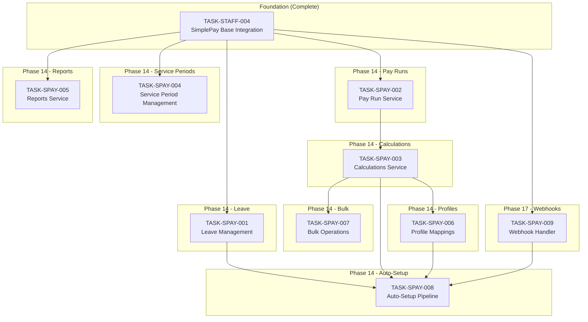
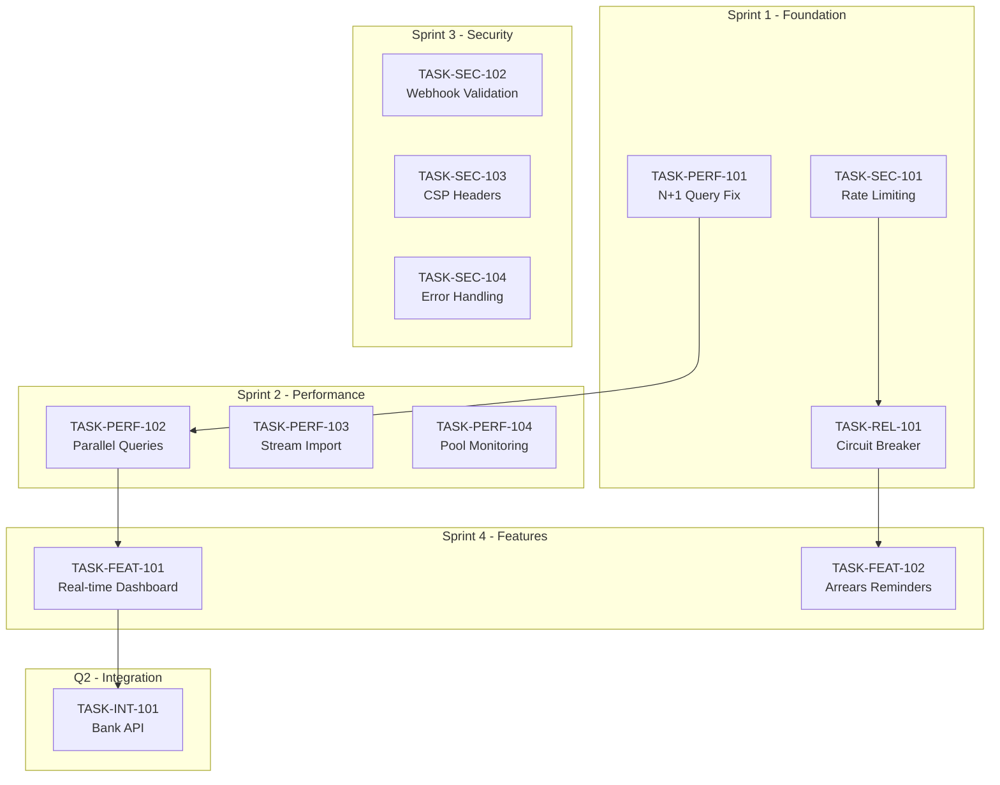
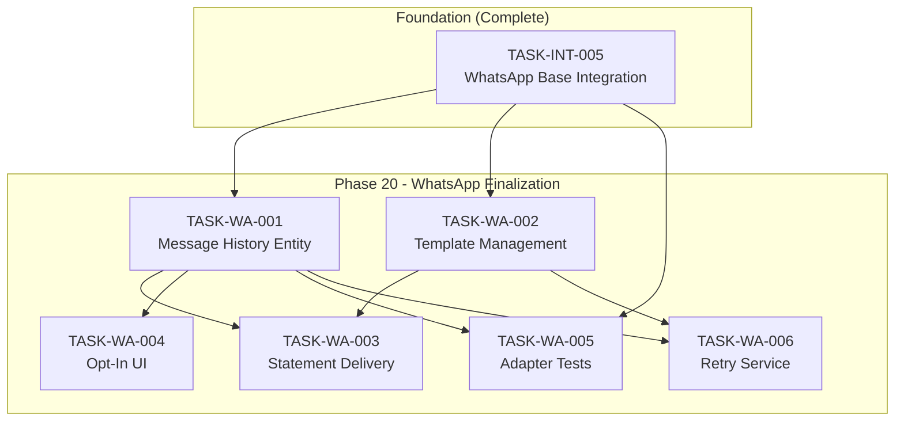
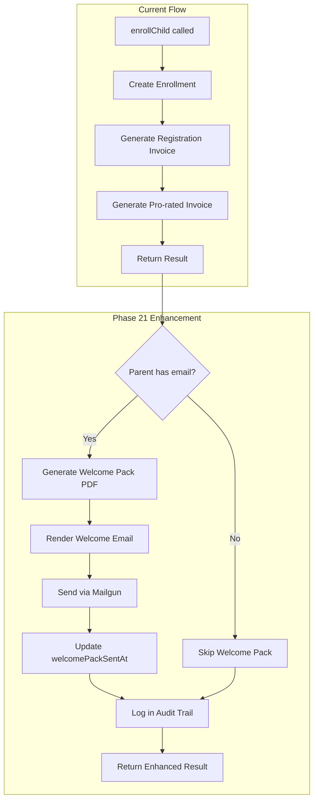
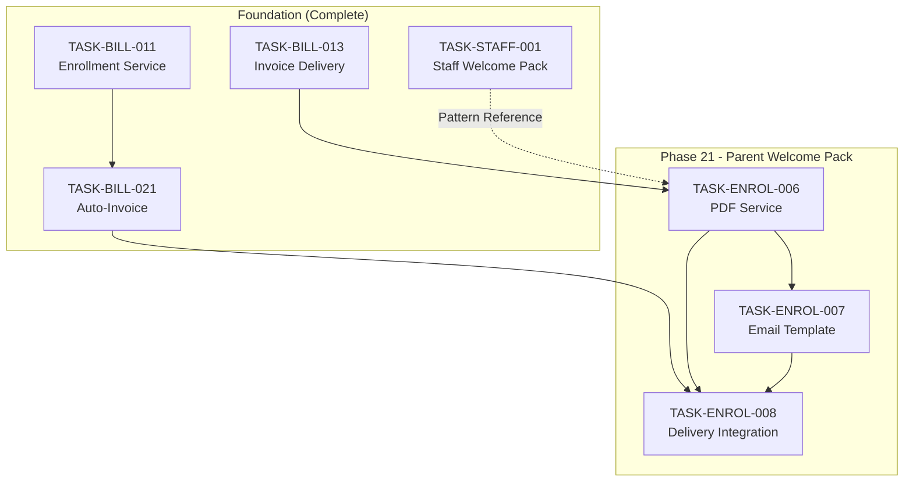
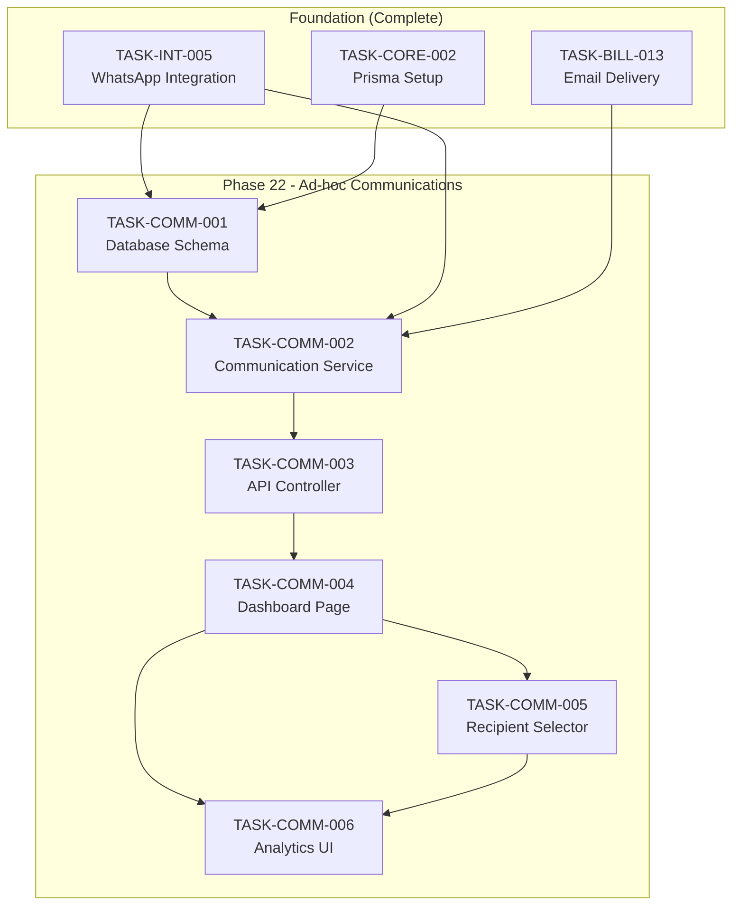
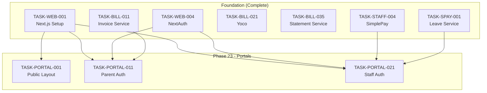
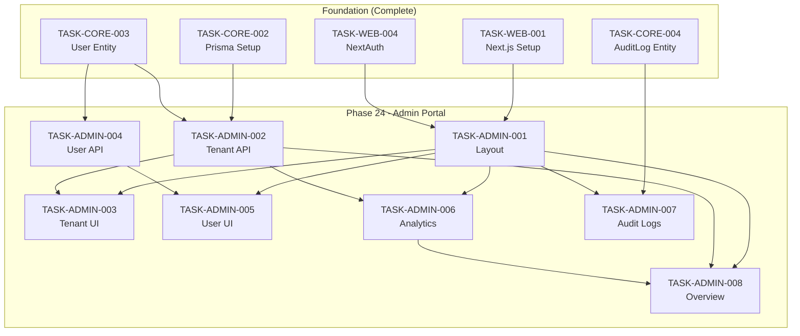
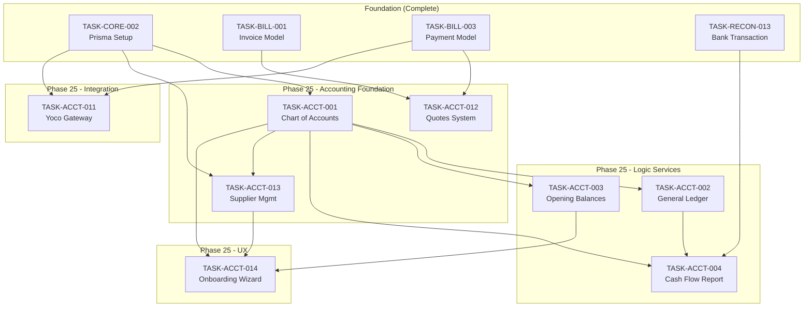

# SimplePay Integration Traceability Matrix

## Overview

This document maps SimplePay API capabilities to CrecheBooks implementation tasks, ensuring comprehensive coverage of all available functionality.

## API Resource Mapping

### 1. Client Management

| SimplePay Endpoint | HTTP Method | Implemented | Task ID | Notes |
|-------------------|-------------|-------------|---------|-------|
| `/v1/clients/` | GET | ✅ | TASK-STAFF-004 | List accessible clients |
| Client ID validation | — | ✅ | TASK-STAFF-004 | Via testConnection |

### 2. Employee Management

| SimplePay Endpoint | HTTP Method | Implemented | Task ID | Notes |
|-------------------|-------------|-------------|---------|-------|
| `/v1/clients/:client_id/employees` | GET | ✅ | TASK-STAFF-004 | List employees |
| `/v1/clients/:client_id/employees` | POST | ✅ | TASK-STAFF-004 | Create employee |
| `/v1/employees/:id` | GET | ✅ | TASK-STAFF-004 | Get employee details |
| `/v1/employees/:id` | PATCH | ✅ | TASK-STAFF-004 | Update employee |
| `/v1/employees/:id` | DELETE | ⭕ | — | Not implemented |

### 3. Service Periods (Employment Lifecycle)

| SimplePay Endpoint | HTTP Method | Implemented | Task ID | Notes |
|-------------------|-------------|-------------|---------|-------|
| `/v1/employees/:id/service_periods` | GET | ⭕ | TASK-SPAY-004 | Pending |
| `/v1/employees/:id/service_periods/end_service` | POST | ⭕ | TASK-SPAY-004 | Pending |
| `/v1/employees/:id/service_periods/reinstate` | POST | ⭕ | TASK-SPAY-004 | Pending |
| `/v1/employees/:id/service_periods/undo_end_service` | DELETE | ⭕ | TASK-SPAY-004 | Pending |

### 4. Waves (Pay Frequencies)

| SimplePay Endpoint | HTTP Method | Implemented | Task ID | Notes |
|-------------------|-------------|-------------|---------|-------|
| `/v1/clients/:client_id/waves` | GET | ✅ | TASK-STAFF-004 | Get pay frequencies |
| `/v1/clients/:client_id/waves` | POST | ⭕ | — | Not planned |

### 5. Payslips

| SimplePay Endpoint | HTTP Method | Implemented | Task ID | Notes |
|-------------------|-------------|-------------|---------|-------|
| `/v1/employees/:id/payslips` | GET | ✅ | TASK-STAFF-004 | List employee payslips |
| `/v1/payslips/:id` | GET | ✅ | TASK-STAFF-004 | Get payslip JSON |
| `/v1/payslips/:id.pdf` | GET | ✅ | TASK-STAFF-004 | Download payslip PDF |

### 6. Pay Runs (Payment Runs)

| SimplePay Endpoint | HTTP Method | Implemented | Task ID | Notes |
|-------------------|-------------|-------------|---------|-------|
| `/v1/clients/:client_id/payment_runs` | GET | ⭕ | TASK-SPAY-002 | Pending |
| `/v1/payment_runs/:id/payslips` | GET | ⭕ | TASK-SPAY-002 | Pending |
| `/v1/payment_runs/:id/accounting` | GET | ⭕ | TASK-SPAY-002 | Pending |

### 7. Calculations (Payslip Items)

| SimplePay Endpoint | HTTP Method | Implemented | Task ID | Notes |
|-------------------|-------------|-------------|---------|-------|
| `/v1/employees/:id/calculations` | GET | ⭕ | TASK-SPAY-003 | Pending |
| `/v1/employees/:id/calculations` | POST | ⭕ | TASK-SPAY-003 | Pending |
| `/v1/payslips/:id/calculations` | GET | ⭕ | TASK-SPAY-003 | Pending |
| `/v1/payslips/:id/calculations` | POST | ⭕ | TASK-SPAY-003 | Pending |
| `/v1/calculations/:id` | GET | ⭕ | TASK-SPAY-003 | Pending |
| `/v1/calculations/:id` | PATCH | ⭕ | TASK-SPAY-003 | Pending |
| `/v1/calculations/:id` | DELETE | ⭕ | TASK-SPAY-003 | Pending |

### 8. Inherited Calculations

| SimplePay Endpoint | HTTP Method | Implemented | Task ID | Notes |
|-------------------|-------------|-------------|---------|-------|
| `/v1/employees/:id/inherited_calculations` | GET | ⭕ | TASK-SPAY-003 | Pending |
| `/v1/employees/:id/inherited_calculations` | PATCH | ⭕ | TASK-SPAY-003 | Pending |

### 9. Items and Outputs

| SimplePay Endpoint | HTTP Method | Implemented | Task ID | Notes |
|-------------------|-------------|-------------|---------|-------|
| `/v1/clients/:client_id/items_and_outputs` | GET | ⭕ | TASK-SPAY-003 | Pending |

### 10. Leave Management

| SimplePay Endpoint | HTTP Method | Implemented | Task ID | Notes |
|-------------------|-------------|-------------|---------|-------|
| `/v1/clients/:client_id/leave_types` | GET | ⭕ | TASK-SPAY-001 | Pending |
| `/v1/employees/:id/leave_balances` | GET | ⭕ | TASK-SPAY-001 | Pending |
| `/v1/employees/:id/leave_days` | GET | ⭕ | TASK-SPAY-001 | Pending |
| `/v1/employees/:id/leave_days` | POST | ⭕ | TASK-SPAY-001 | Pending |
| `/v1/employees/:id/leave_days/create_multiple` | POST | ⭕ | TASK-SPAY-001 | Pending |
| `/v1/leave_days/:id` | PATCH | ⭕ | TASK-SPAY-001 | Pending |
| `/v1/leave_days/:id` | DELETE | ⭕ | TASK-SPAY-001 | Pending |

### 11. Tax Certificates

| SimplePay Endpoint | HTTP Method | Implemented | Task ID | Notes |
|-------------------|-------------|-------------|---------|-------|
| `/v1/employees/:id/tax_certificates` | GET | ✅ | TASK-STAFF-004 | List IRP5 certificates |
| `/v1/tax_certificates/:id` | GET | ✅ | TASK-STAFF-004 | Download IRP5 PDF |

### 12. Submissions (EMP201)

| SimplePay Endpoint | HTTP Method | Implemented | Task ID | Notes |
|-------------------|-------------|-------------|---------|-------|
| `/v1/clients/:client_id/submissions/emp201` | GET | ✅ | TASK-STAFF-004 | Get EMP201 data |

### 13. Reports

| SimplePay Endpoint | HTTP Method | Implemented | Task ID | Notes |
|-------------------|-------------|-------------|---------|-------|
| `/v1/clients/:client_id/reports/eti` | POST | ⭕ | TASK-SPAY-005 | Pending |
| `/v1/clients/:client_id/reports/transaction_history` | POST | ⭕ | TASK-SPAY-005 | Pending |
| `/v1/clients/:client_id/reports/variance` | POST | ⭕ | TASK-SPAY-005 | Pending |
| `/v1/clients/:client_id/reports/comparison_leave` | POST | ⭕ | TASK-SPAY-005 | Pending |
| `/v1/clients/:client_id/reports/leave_liability_v2` | POST | ⭕ | TASK-SPAY-005 | Pending |
| `/v1/clients/:client_id/reports/tracked_balances` | POST | ⭕ | TASK-SPAY-005 | Pending |
| `/v1/clients/:client_id/reports/:report/async` | POST | ⭕ | TASK-SPAY-005 | Pending |
| `/v1/clients/:client_id/reports/poll/:uuid` | GET | ⭕ | TASK-SPAY-005 | Pending |

### 14. Profile Mappings

| SimplePay Endpoint | HTTP Method | Implemented | Task ID | Notes |
|-------------------|-------------|-------------|---------|-------|
| `/v1/employees/:id/profile_mappings` | GET | ⭕ | TASK-SPAY-006 | Pending |
| `/v1/employees/:id/profile_mappings` | POST | ⭕ | TASK-SPAY-006 | Pending |
| `/v1/profile_mappings/:id` | PUT | ⭕ | TASK-SPAY-006 | Pending |
| `/v1/profile_mappings/:id` | DELETE | ⭕ | TASK-SPAY-006 | Pending |

### 15. Custom Employee Fields

| SimplePay Endpoint | HTTP Method | Implemented | Task ID | Notes |
|-------------------|-------------|-------------|---------|-------|
| `/v1/clients/:client_id/custom_employee_fields` | GET | ⭕ | — | Not planned |

### 16. Bulk Operations

| SimplePay Endpoint | HTTP Method | Implemented | Task ID | Notes |
|-------------------|-------------|-------------|---------|-------|
| `/v1/clients/:client_id/bulk_input` | POST | ⭕ | TASK-SPAY-007 | Pending |

### 17. Webhooks (Event-Driven)

| SimplePay Event | Direction | Implemented | Task ID | Notes |
|-----------------|-----------|-------------|---------|-------|
| `employee.created` | SimplePay → CrecheBooks | ⭕ | TASK-SPAY-009 | Auto-create staff |
| `employee.updated` | SimplePay → CrecheBooks | ⭕ | TASK-SPAY-009 | Sync changes |
| `employee.terminated` | SimplePay → CrecheBooks | ⭕ | TASK-SPAY-009 | Trigger offboarding |
| `payslip.finalized` | SimplePay → CrecheBooks | ⭕ | TASK-SPAY-009 | Import payslips |

---

## Implementation Coverage Summary

| Category | Total Endpoints | Implemented | Pending | Coverage |
|----------|----------------|-------------|---------|----------|
| Clients | 1 | 1 | 0 | 100% |
| Employees | 4 | 4 | 0 | 100% |
| Service Periods | 4 | 0 | 4 | 0% |
| Waves | 2 | 1 | 1 | 50% |
| Payslips | 3 | 3 | 0 | 100% |
| Pay Runs | 3 | 0 | 3 | 0% |
| Calculations | 7 | 0 | 7 | 0% |
| Inherited Calculations | 2 | 0 | 2 | 0% |
| Items/Outputs | 1 | 0 | 1 | 0% |
| Leave | 7 | 0 | 7 | 0% |
| Tax Certificates | 2 | 2 | 0 | 100% |
| EMP201 | 1 | 1 | 0 | 100% |
| Reports | 8 | 0 | 8 | 0% |
| Profile Mappings | 4 | 0 | 4 | 0% |
| Bulk Operations | 1 | 0 | 1 | 0% |
| Webhooks | 4 | 0 | 4 | 0% |
| **Total** | **54** | **12** | **42** | **22%** |

---

## Task Dependencies

---

## SA Compliance Mapping

| Requirement | SimplePay Feature | Task ID | Status |
|-------------|------------------|---------|--------|
| BCEA Leave Entitlements | Leave Management | TASK-SPAY-001 | Pending |
| UI-19 Termination Codes | Service Periods | TASK-SPAY-004 | Pending |
| PAYE Tax Calculations | Tax Certificates | TASK-STAFF-004 | ✅ Complete |
| UIF Contributions | Calculations | TASK-SPAY-003 | Pending |
| SDL Contributions | Calculations | TASK-SPAY-003 | Pending |
| EMP201 Submissions | EMP201 API | TASK-STAFF-004 | ✅ Complete |
| IRP5 Certificates | Tax Certificates | TASK-STAFF-004 | ✅ Complete |
| ETI Reporting | Reports | TASK-SPAY-005 | Pending |

---

## Integration Points

### CrecheBooks → SimplePay

| CrecheBooks Action | SimplePay API | Task |
|-------------------|---------------|------|
| Create Staff | Create Employee | TASK-STAFF-004 ✅ |
| Update Staff | Update Employee | TASK-STAFF-004 ✅ |
| Offboard Staff | End Service Period | TASK-SPAY-004 |
| Rehire Staff | Reinstate | TASK-SPAY-004 |
| Submit Leave | Create Leave Days | TASK-SPAY-001 |
| Add Bonus | Create Calculation | TASK-SPAY-003 |
| Salary Increase | Update Inherited Calc | TASK-SPAY-003 |

### SimplePay → CrecheBooks

| SimplePay Data | CrecheBooks Feature | Task |
|----------------|---------------------|------|
| Payslips | Payslip Archive | TASK-STAFF-004 ✅ |
| IRP5 Certificates | Tax Document Archive | TASK-STAFF-004 ✅ |
| EMP201 Data | SARS Compliance | TASK-STAFF-004 ✅ |
| Leave Balances | Staff Leave Dashboard | TASK-SPAY-001 |
| Pay Run Journals | Xero Sync | TASK-SPAY-002 |
| Variance Reports | Financial Analytics | TASK-SPAY-005 |
| Webhook: Employee Created | Auto Staff Creation | TASK-SPAY-009 |
| Webhook: Employee Updated | Staff Sync | TASK-SPAY-009 |
| Webhook: Employee Terminated | Offboarding Trigger | TASK-SPAY-009 |
| Webhook: Payslip Finalized | Payslip Import | TASK-SPAY-009 |

---

## Rate Limiting Considerations

SimplePay API: **60 requests per minute** (1000 requests per hour)

| Operation | Est. API Calls | Mitigation Strategy |
|-----------|---------------|---------------------|
| Single Employee Sync | 1-2 | Direct call |
| Bulk Employee Sync (50) | 50-100 | Use bulk API (TASK-SPAY-007) |
| Payslip Import (100) | 100-200 | Batch over time |
| Leave Balance Check (All) | N employees | Cache results |
| Report Generation | 1-3 | Use async reports |
| Salary Review (All Staff) | N employees | Use bulk API |

---

## Security Considerations

| Concern | Mitigation | Implementation |
|---------|-----------|----------------|
| API Key Storage | AES-256 Encryption | EncryptionService |
| API Key Transmission | HTTPS only | SimplePayApiClient |
| Rate Limit Handling | Exponential Backoff | SimplePayApiClient |
| Data Validation | Input sanitization | DTOs with validation |
| Audit Trail | Log all API calls | AuditLogService |
| Error Handling | Mask sensitive data | Logger configuration |

---

## Testing Strategy

### Unit Tests
- Mock SimplePay API responses
- Test data transformation
- Test error handling

### Integration Tests
- Sandbox environment testing
- Real API call verification
- Rate limit handling

### E2E Tests
- Full workflow testing
- UI integration verification
- Error scenario coverage

---

## SA VAT Compliance Traceability Matrix

Analysis Date: 2026-01-13
Based on South African VAT Act No. 89 of 1991, Section 12(h).

### Invoice Line Type to VAT Treatment Mapping

| Line Type | VAT Treatment | Rate | Legal Basis | Task ID | Status |
|-----------|--------------|------|-------------|---------|--------|
| MONTHLY_FEE | EXEMPT | 0% | VAT Act s.12(h)(iii) - Childcare services | Existing | ✅ Implemented |
| REGISTRATION | EXEMPT | 0% | VAT Act s.12(h)(ii) - School fees | Existing | ✅ Implemented |
| RE_REGISTRATION | EXEMPT | 0% | VAT Act s.12(h)(ii) - School fees | TASK-BILL-038 | ⭕ Pending |
| EXTRA_MURAL | EXEMPT | 0% | VAT Act s.12(h)(ii) - Subordinate to education | TASK-BILL-038 | ⭕ Pending |
| BOOKS | APPLICABLE | 15% | Goods - not exempt | Existing | ✅ Implemented |
| STATIONERY | APPLICABLE | 15% | Goods - not exempt | Existing | ✅ Implemented |
| UNIFORM | APPLICABLE | 15% | Goods - not exempt | Existing | ✅ Implemented |
| SCHOOL_TRIP | APPLICABLE | 15% | Service - not educational | Existing | ✅ Implemented |
| MEALS | APPLICABLE | 15% | Prepared food - not zero-rated | TASK-BILL-038 | ⭕ Pending |
| TRANSPORT | APPLICABLE | 15% | Service - not educational | TASK-BILL-038 | ⭕ Pending |
| LATE_PICKUP | APPLICABLE | 15% | Penalty - not educational | TASK-BILL-038 | ⭕ Pending |
| DAMAGED_EQUIPMENT | APPLICABLE | 15% | Replacement - goods | TASK-BILL-038 | ⭕ Pending |
| AD_HOC | CONFIGURABLE | 0%/15% | Depends on isVatExempt flag | TASK-BILL-038 | ⭕ Pending |
| DISCOUNT | N/A | 0% | Adjustment - no VAT | Existing | ✅ Implemented |
| CREDIT | N/A | 0% | Adjustment - no VAT | Existing | ✅ Implemented |

### SA VAT Act Section 12(h) Reference

| Section | Description | Applicable Items |
|---------|-------------|------------------|
| 12(h)(i) | Educational services by registered institutions | School fees, tuition |
| 12(h)(ii) | Goods/services subordinate to education | Registration, extra-mural if educational |
| 12(h)(iii) | Childcare services specifically | Creche fees, after-school care |
| Schedule 2, Part B | Zero-rated basic foodstuffs | Raw food items (NOT prepared meals) |

### Implementation Coverage

| Category | Line Types | Status |
|----------|-----------|--------|
| VAT Exempt (Educational) | MONTHLY_FEE, REGISTRATION | ✅ Complete |
| VAT Exempt (New Types) | RE_REGISTRATION, EXTRA_MURAL | ⭕ TASK-BILL-038 |
| VAT Applicable (Goods) | BOOKS, STATIONERY, UNIFORM | ✅ Complete |
| VAT Applicable (New Services) | MEALS, TRANSPORT, LATE_PICKUP | ⭕ TASK-BILL-038 |
| Configurable VAT | AD_HOC with isVatExempt flag | ⭕ TASK-BILL-038 |

### Key Research Sources

- VAT Act No. 89 of 1991, Section 12(h)
- SARS VAT 404 Guide for Vendors
- Grant Thornton SA - Education Sector VAT Advisory
- Tax Faculty SA - Creche Tax FAQ

---

## USACF Task Coverage Matrix

> Tasks derived from Universal Search Algorithm for Claude Flow (USACF) codebase analysis.
> See [USACF Analysis](../../docs/usacf-analysis/) for full methodology.

### Analysis Summary

| Metric | Value |
|--------|-------|
| Total Gaps Identified | 117 |
| Opportunities Generated | 52 |
| Pareto-Optimal Opportunities | 12 |
| Tasks Created | 12 |
| Overall Confidence | 87% |
| Projected ROI | 114% |

---

### Gap-to-Task Mapping

| Gap ID | Description | Task ID | Priority | Sprint |
|--------|-------------|---------|----------|--------|
| P001 | N+1 query on invoice listing | TASK-PERF-101 | P0-CRITICAL | 1 |
| S001 | No rate limiting on auth endpoints | TASK-SEC-101 | P0-CRITICAL | 1 |
| R001 | No circuit breaker for Xero | TASK-REL-101 | P0-CRITICAL | 1 |
| P002 | Sequential dashboard queries | TASK-PERF-102 | P1-HIGH | 2 |
| P003 | Memory spike on bank CSV import | TASK-PERF-103 | P1-HIGH | 2 |
| P004 | No connection pool monitoring | TASK-PERF-104 | P1-HIGH | 2 |
| S002 | Webhook signature not validated | TASK-SEC-102 | P1-HIGH | 3 |
| S003 | Missing CSP security headers | TASK-SEC-103 | P2-MEDIUM | 3 |
| S004 | Inconsistent error handling | TASK-SEC-104 | P1-HIGH | 3 |
| C003 | No real-time dashboard updates | TASK-FEAT-101 | P1-HIGH | 4 |
| C005 | No automated arrears reminders | TASK-FEAT-102 | P1-HIGH | 4 |
| C002 | No automated bank statement import | TASK-INT-101 | P1-HIGH | Q2 |

---

### Performance Optimization Coverage

| Current State | Target | Task ID | Improvement |
|---------------|--------|---------|-------------|
| Invoice list: 250ms | < 100ms | TASK-PERF-101 | 2.5x faster |
| Dashboard load: 1.5s | < 500ms | TASK-PERF-102 | 3x faster |
| Bank import memory: 150MB | < 100MB | TASK-PERF-103 | 33% reduction |
| Pool monitoring: None | < 30s detection | TASK-PERF-104 | Full observability |

**Implementation Details:**

| Task | Key Components | Files Created |
|------|---------------|---------------|
| TASK-PERF-101 | DataLoader pattern, batch loading | `invoice-loader.ts`, `dataloader.service.ts` |
| TASK-PERF-102 | Promise.all parallel queries | `dashboard.service.ts` refactor |
| TASK-PERF-103 | Stream-based CSV parsing | `stream-csv-parser.ts`, `bank-import.service.ts` refactor |
| TASK-PERF-104 | Prometheus metrics, health checks | `pool-monitor.service.ts`, `metrics.controller.ts` |

---

### Security Hardening Coverage

| Vulnerability | Mitigation | Task ID | CVSS |
|--------------|------------|---------|------|
| Credential stuffing on auth | Redis-based rate limiting (5/min) | TASK-SEC-101 | 7.5 |
| Webhook spoofing | HMAC-SHA256 signature validation | TASK-SEC-102 | 6.8 |
| XSS/clickjacking | CSP headers, X-Frame-Options | TASK-SEC-103 | 5.4 |
| PII in error logs | Standardized safe error responses | TASK-SEC-104 | 4.3 |

**Implementation Details:**

| Task | Security Controls | Files Created |
|------|------------------|---------------|
| TASK-SEC-101 | rate-limiter-flexible, Redis backend | `rate-limit.guard.ts`, `rate-limit.module.ts` |
| TASK-SEC-102 | timingSafeEqual, replay attack prevention | `webhook-signature.guard.ts`, `signature.service.ts` |
| TASK-SEC-103 | helmet CSP, frame-ancestors | `security-headers.middleware.ts` |
| TASK-SEC-104 | ErrorSanitizer, PII detector | `error-sanitizer.filter.ts`, `safe-error.types.ts` |

---

### Reliability Coverage

| Failure Mode | Recovery Strategy | Task ID | FMEA RPN |
|--------------|------------------|---------|----------|
| Xero API outage | Circuit breaker + pending queue | TASK-REL-101 | 432 |

**Implementation Details:**

| Task | Key Components | Files Created |
|------|---------------|---------------|
| TASK-REL-101 | opossum circuit breaker, BullMQ queue | `xero-circuit-breaker.ts`, `pending-sync-queue.service.ts`, `xero-sync-recovery.job.ts` |

**Circuit Breaker Configuration:**

| Parameter | Value |
|-----------|-------|
| Timeout | 5 seconds |
| Failure threshold | 50% |
| Reset timeout | 30 seconds |
| Volume threshold | 5 requests |

---

### Feature Coverage

| Current State | Target State | Task ID | Business Value |
|---------------|--------------|---------|----------------|
| Manual dashboard refresh | Real-time WebSocket updates | TASK-FEAT-101 | Instant visibility |
| Manual arrears follow-up | Automated 4-level reminders | TASK-FEAT-102 | 15% collection improvement |

**Implementation Details:**

| Task | Key Components | Files Created |
|------|---------------|---------------|
| TASK-FEAT-101 | Socket.IO, JWT auth, room-based isolation | `dashboard.gateway.ts`, `useDashboardSocket.ts` |
| TASK-FEAT-102 | Cron job, 4-level escalation emails | `arrears-reminder.job.ts`, `reminder-history.entity.ts` |

**TASK-FEAT-101 Events:**

| Event | Trigger | Latency Target |
|-------|---------|----------------|
| payment_received | Payment allocation | < 500ms |
| invoice_status_changed | Status transition | < 500ms |
| arrears_alert | Threshold crossed | < 500ms |

**TASK-FEAT-102 Escalation Schedule:**

| Level | Days Overdue | Tone |
|-------|--------------|------|
| 1 | 7 | Friendly |
| 2 | 14 | Firm |
| 3 | 30 | Serious |
| 4 | 60 | Final |

---

### Integration Coverage

| Current State | Target State | Task ID | Banks Supported |
|---------------|--------------|---------|-----------------|
| Manual CSV/PDF upload | Automated Open Banking API | TASK-INT-101 | FNB, Standard Bank, Nedbank, ABSA, Capitec |

**Implementation Details:**

| Task | Key Components | Files Created |
|------|---------------|---------------|
| TASK-INT-101 | Stitch API, OAuth flow, AES-256 tokens | `stitch.service.ts`, `linked-bank-account.entity.ts`, `bank-sync.job.ts` |

**Compliance Requirements:**

| Regulation | Requirement | Implementation |
|------------|-------------|----------------|
| POPIA | Explicit consent | Consent tracking entity |
| POPIA | Purpose limitation | Reconciliation scope only |
| SARS | 7-year retention | Audit trail, archival |
| Bank | 90-day consent | Auto-renewal reminder |

---

### Sprint Coverage Summary

| Sprint | Tasks | Priority | Budget |
|--------|-------|----------|--------|
| Sprint 1 (Week 1-2) | TASK-PERF-101, TASK-SEC-101, TASK-REL-101 | P0-CRITICAL | R43,000 |
| Sprint 2 (Week 3-4) | TASK-PERF-102, TASK-PERF-103, TASK-PERF-104 | P1-HIGH | R55,000 |
| Sprint 3 (Week 5-6) | TASK-SEC-102, TASK-SEC-103, TASK-SEC-104 | P1-P2 | R42,000 |
| Sprint 4 (Week 7-8) | TASK-FEAT-101, TASK-FEAT-102 | P1-HIGH | R70,000 |
| Q2 | TASK-INT-101 | P1-HIGH | R40,000 |
| **Total** | **12 Tasks** | — | **R250,000** |

---

### Task Dependency Graph (USACF)

---

### Cross-Reference: USACF Analysis Documents

| Document | Purpose | Path |
|----------|---------|------|
| Meta Analysis | Methodology overview | `docs/usacf-analysis/00-meta-analysis.md` |
| Discovery | Codebase exploration | `docs/usacf-analysis/01-discovery.md` |
| Gap Analysis | 117 gaps identified | `docs/usacf-analysis/02-gap-analysis.md` |
| Risk Analysis | FMEA risk scoring | `docs/usacf-analysis/03-risk-analysis.md` |
| Synthesis | 52 opportunities | `docs/usacf-analysis/04-synthesis.md` |
| Implementation | Sprint planning | `docs/usacf-analysis/05-implementation.md` |
| Observability | Monitoring design | `docs/usacf-analysis/06-observability.md` |

---

---

## WhatsApp Business API Traceability Matrix

Analysis Date: 2026-01-20
Based on Meta WhatsApp Business Cloud API v18.0.

### WhatsApp API Resource Mapping

| WhatsApp API Endpoint | HTTP Method | Implemented | Task ID | Notes |
|----------------------|-------------|-------------|---------|-------|
| `/v18.0/{PHONE_ID}/messages` (template) | POST | ✅ | TASK-INT-005 | Send template message |
| `/v18.0/{PHONE_ID}/messages` (text) | POST | ✅ | TASK-INT-005 | Send text message |
| `/v18.0/{WABA_ID}/message_templates` | GET | ⭕ | TASK-WA-002 | List templates |
| Webhook: Message status | POST | ✅ | TASK-INT-005 | Delivery status updates |
| Webhook: Verification | GET | ✅ | TASK-INT-005 | Hub challenge verification |

### WhatsApp Feature Coverage

| Feature | Description | Implemented | Task ID | Status |
|---------|-------------|-------------|---------|--------|
| Send Invoice Notification | Template message for new invoice | ✅ | TASK-INT-005 | Complete |
| Send Payment Reminder | Template message for overdue | ✅ | TASK-INT-005 | Complete |
| Send Payment Received | Template message for payment | ✅ | TASK-INT-005 | Complete |
| Send Arrears Notice | Template message for arrears | ✅ | TASK-INT-005 | Complete |
| Send Welcome Message | Template for new registration | ✅ | TASK-INT-005 | Complete |
| Send Statement Summary | Template for monthly statement | ⭕ | TASK-WA-003 | Pending |
| Webhook Signature Verification | HMAC-SHA256 validation | ✅ | TASK-INT-005 | Complete |
| Delivery Status Tracking | Track sent/delivered/read/failed | ✅ | TASK-INT-005 | Complete |
| Message History Storage | Persist all messages | ⭕ | TASK-WA-001 | Pending |
| Template Management | List/validate templates | ⭕ | TASK-WA-002 | Pending |
| Opt-In Management | POPIA consent tracking | ✅ | TASK-INT-005 | Complete |
| Opt-In UI | Staff interface for consent | ⭕ | TASK-WA-004 | Pending |
| Message Retry | Exponential backoff retry | ⭕ | TASK-WA-006 | Pending |
| Rate Limiting | 80 msg/sec throttling | ✅ | TASK-INT-005 | Complete |

### WhatsApp Template Definitions

| Template Name | Parameters | Status | Task ID |
|--------------|------------|--------|---------|
| `invoice_notification` | parent_name, child_name, amount, due_date, invoice_number | ✅ Defined | TASK-INT-005 |
| `invoice_reminder` | parent_name, amount, due_date, days_overdue | ✅ Defined | TASK-INT-005 |
| `payment_received` | parent_name, amount, payment_date, reference | ✅ Defined | TASK-INT-005 |
| `arrears_notice` | parent_name, total_arrears, oldest_invoice_date | ✅ Defined | TASK-INT-005 |
| `registration_welcome` | parent_name, child_name, creche_name, start_date | ✅ Defined | TASK-INT-005 |
| `statement_notification` | parent_name, child_name, period_start, period_end, opening_balance, total_charges, total_payments, closing_balance | ⭕ Pending | TASK-WA-003 |

> **Note**: Templates must be created and approved in Meta Business Manager before use.

### WhatsApp Security Implementation

| Security Control | Description | Implemented | Task ID |
|-----------------|-------------|-------------|---------|
| HMAC-SHA256 Signature | X-Hub-Signature-256 verification | ✅ | TASK-INT-005 |
| Timing-Safe Comparison | crypto.timingSafeEqual | ✅ | TASK-INT-005 |
| App Secret Storage | Environment variable | ✅ | TASK-INT-005 |
| Webhook Idempotency | Deduplicate retried webhooks | ✅ | TASK-INFRA-006 |
| Phone Number Validation | E.164 format validation | ✅ | TASK-INT-005 |
| Injection Prevention | Phone number sanitization | ✅ | TASK-INT-005 |

### WhatsApp POPIA Compliance

| Requirement | Implementation | Status |
|-------------|---------------|--------|
| Explicit Opt-In | `whatsappOptedIn` flag on Parent | ✅ Complete |
| Opt-In Timestamp | `whatsappOptedInAt` field | ✅ Complete |
| Easy Opt-Out | `optOut()` service method | ✅ Complete |
| Consent UI | Staff interface | ⭕ TASK-WA-004 |
| Message History | Audit trail | ⭕ TASK-WA-001 |
| Data Retention | 5+ year retention | ⭕ TASK-WA-001 |

### Implementation Coverage Summary

| Category | Total Features | Implemented | Pending | Coverage |
|----------|---------------|-------------|---------|----------|
| Messaging | 6 | 5 | 1 | 83% |
| Webhooks | 2 | 2 | 0 | 100% |
| Security | 6 | 6 | 0 | 100% |
| Templates | 6 | 5 | 1 | 83% |
| History/Audit | 3 | 0 | 3 | 0% |
| UI | 2 | 0 | 2 | 0% |
| Reliability | 2 | 1 | 1 | 50% |
| **Total** | **27** | **19** | **8** | **70%** |

### Task Dependencies (WhatsApp Phase 20)

---

## Parent Onboarding Traceability Matrix

Analysis Date: 2026-01-20
Based on parent enrollment workflow requirements.

### Parent Enrollment Feature Mapping

| Feature | Current Status | Post-Phase 21 | Task ID | Notes |
|---------|---------------|---------------|---------|-------|
| Child enrollment creation | ✅ Implemented | ✅ | TASK-BILL-011 | EnrollmentService.enrollChild() |
| Registration fee invoice | ✅ Implemented | ✅ | TASK-BILL-021 | Auto-generated on enrollment |
| Pro-rated first month invoice | ✅ Implemented | ✅ | TASK-BILL-014 | Pro-rata calculation |
| Invoice delivery (email) | ✅ Implemented | ✅ | TASK-BILL-013 | Mailgun with PDF |
| Welcome Pack PDF | ❌ Missing | ✅ | TASK-ENROL-006 | Parent-focused PDF |
| Welcome Email Template | ❌ Missing | ✅ | TASK-ENROL-007 | HTML with child details |
| Welcome Pack Auto-Delivery | ❌ Missing | ✅ | TASK-ENROL-008 | Integrated into enrollChild() |
| Welcome Pack Resend | ❌ Missing | ✅ | TASK-ENROL-008 | Manual resend endpoint |

### Welcome Pack PDF Sections

| Section | Description | Required | Task ID |
|---------|-------------|----------|---------|
| Header | Tenant branding (name, logo placeholder) | Yes | TASK-ENROL-006 |
| Welcome Message | Personalized greeting | Yes | TASK-ENROL-006 |
| Enrollment Details | Child name, start date, class | Yes | TASK-ENROL-006 |
| Crèche Information | Hours, location, contact | Yes | TASK-ENROL-006 |
| Fee Structure | Monthly fee, payment reference | Yes | TASK-ENROL-006 |
| Bank Details | Account for EFT payments | Conditional | TASK-ENROL-006 |
| Policies | Attendance, illness, collection | Optional | TASK-ENROL-006 |
| What to Bring | First day checklist | Optional | TASK-ENROL-006 |
| Emergency Procedures | Contact tree, evacuation | Optional | TASK-ENROL-006 |

### Parent vs Staff Welcome Pack Comparison

| Feature | Staff (TASK-STAFF-001) | Parent (Phase 21) |
|---------|------------------------|-------------------|
| PDF Service | `welcome-pack-pdf.service.ts` | `parent-welcome-pack-pdf.service.ts` |
| Target Audience | New staff members | Parents enrolling children |
| Content Focus | Employment, compliance | Child enrollment, policies |
| Checklist | Onboarding tasks | What to bring |
| Policies | HR policies, POPIA | Crèche policies, attendance |
| Banking | Employee banking form | Payment instructions |
| Email Delivery | Integrated | TASK-ENROL-008 |
| Auto-Send Trigger | Staff creation | Child enrollment |

### Enrollment Flow Diagram

### Task Dependencies (Parent Onboarding)

### Implementation Coverage Summary

| Category | Total Features | Implemented | Pending | Coverage |
|----------|---------------|-------------|---------|----------|
| Enrollment Creation | 2 | 2 | 0 | 100% |
| Invoice Generation | 2 | 2 | 0 | 100% |
| Invoice Delivery | 1 | 1 | 0 | 100% |
| Welcome Pack PDF | 1 | 0 | 1 | 0% |
| Welcome Email | 1 | 0 | 1 | 0% |
| Welcome Delivery | 2 | 0 | 2 | 0% |
| **Total** | **9** | **5** | **4** | **56%** |

### SA Compliance Considerations

| Requirement | Implementation | Task ID |
|-------------|---------------|---------|
| POPIA Consent | Implied by enrollment | Existing |
| Data Minimization | Only necessary info in PDF | TASK-ENROL-006 |
| Purpose Limitation | Welcome/onboarding only | All Phase 21 |
| Secure Delivery | HTTPS email via Mailgun | TASK-ENROL-008 |
| Audit Trail | Logged in AuditLog | TASK-ENROL-008 |

---

## Ad-hoc Communication Traceability Matrix

Analysis Date: 2026-01-20
Based on CrecheBooks communication requirements for targeted messaging to parents and staff.

### Communication Channel Mapping

| Channel | Provider | Implemented | Task ID | Notes |
|---------|----------|-------------|---------|-------|
| Email | Mailgun | ✅ | TASK-BILL-013 | Existing transactional emails |
| Email (Raw/Adhoc) | Mailgun | ⭕ | TASK-COMM-002 | New sendRaw() method |
| WhatsApp (Template) | Meta Cloud API | ✅ | TASK-INT-005 | Template messages only |
| WhatsApp (Text) | Meta Cloud API | ⭕ | TASK-COMM-002 | New sendTextMessage() method |
| SMS | Africa's Talking | ✅ | TASK-NOTIF-001 | Existing SMS channel |

### Communication Feature Coverage

| Feature | Description | Implemented | Task ID | Status |
|---------|-------------|-------------|---------|--------|
| Transactional Invoices | Invoice notification emails | ✅ | TASK-BILL-013 | Complete |
| Payment Reminders | Overdue payment notifications | ✅ | TASK-BILL-024 | Complete |
| Statement Delivery | Monthly statement emails | ✅ | TASK-BILL-035 | Complete |
| Arrears Notifications | Escalating arrears alerts | ✅ | TASK-FEAT-102 | Complete |
| Ad-hoc Broadcasts | Targeted announcements | ⭕ | TASK-COMM-002 | Pending |
| Recipient Filtering | Filter by status/arrears/etc | ⭕ | TASK-COMM-002 | Pending |
| Recipient Groups | Saved filter presets | ⭕ | TASK-COMM-001 | Pending |
| Multi-channel Delivery | Email + WhatsApp simultaneously | ⭕ | TASK-COMM-002 | Pending |
| Delivery Tracking | Per-recipient status tracking | ⭕ | TASK-COMM-001 | Pending |
| Communication Dashboard | UI for composing/sending | ⭕ | TASK-COMM-004 | Pending |
| Delivery Analytics | Charts and reports | ⭕ | TASK-COMM-006 | Pending |

### Recipient Type Mapping

| Recipient Type | Database Model | Filters Available | Task ID |
|----------------|---------------|-------------------|---------|
| Parent | Parent | isActive, enrollmentStatus, feeStructureId, hasOutstandingBalance, daysOverdue | TASK-COMM-002 |
| Staff | Staff | isActive, employmentType, department, position | TASK-COMM-002 |
| Custom | Parent/Staff | Manual ID selection | TASK-COMM-002 |

### Database Entity Mapping

| Entity | Purpose | Fields | Task ID |
|--------|---------|--------|---------|
| BroadcastMessage | Store broadcast messages | id, tenantId, subject, body, htmlBody, recipientType, channel, status, totalRecipients, sentCount, failedCount, createdAt, sentAt, scheduledAt | TASK-COMM-001 |
| MessageRecipient | Track per-recipient delivery | id, broadcastId, recipientId, recipientType, recipientName, recipientEmail, recipientPhone, emailStatus, whatsappStatus, emailMessageId, whatsappWamid, emailSentAt, whatsappSentAt, emailError, whatsappError | TASK-COMM-001 |
| RecipientGroup | Saved filter presets | id, tenantId, name, recipientType, filterCriteria, createdById, createdAt, updatedAt | TASK-COMM-001 |

### API Endpoint Mapping

| Endpoint | HTTP Method | Purpose | Task ID | Status |
|----------|-------------|---------|---------|--------|
| POST /communications/broadcasts | POST | Create broadcast message | TASK-COMM-003 | ⭕ Pending |
| POST /communications/broadcasts/:id/send | POST | Queue broadcast for sending | TASK-COMM-003 | ⭕ Pending |
| GET /communications/broadcasts | GET | List broadcasts with filters | TASK-COMM-003 | ⭕ Pending |
| GET /communications/broadcasts/:id | GET | Get broadcast with delivery stats | TASK-COMM-003 | ⭕ Pending |
| POST /communications/recipients/preview | POST | Preview matching recipients | TASK-COMM-003 | ⭕ Pending |
| GET /communications/groups | GET | List recipient groups | TASK-COMM-003 | ⭕ Pending |
| POST /communications/groups | POST | Create recipient group | TASK-COMM-003 | ⭕ Pending |
| DELETE /communications/groups/:id | DELETE | Delete recipient group | TASK-COMM-003 | ⭕ Pending |

### Frontend Component Mapping

| Component | Purpose | Task ID | Status |
|-----------|---------|---------|--------|
| CommunicationsPage | Main dashboard with stats and list | TASK-COMM-004 | ⭕ Pending |
| NewBroadcastPage | 3-step wizard for creating broadcasts | TASK-COMM-004 | ⭕ Pending |
| BroadcastDetailPage | View broadcast details and delivery | TASK-COMM-004 | ⭕ Pending |
| BroadcastList | Tabbed list of broadcasts | TASK-COMM-004 | ⭕ Pending |
| MessageComposer | Rich text message input | TASK-COMM-004 | ⭕ Pending |
| ChannelSelector | Email/WhatsApp/Both toggle | TASK-COMM-004 | ⭕ Pending |
| RecipientSelector | Type and mode selection | TASK-COMM-005 | ⭕ Pending |
| ParentFilterForm | Parent-specific filters | TASK-COMM-005 | ⭕ Pending |
| StaffFilterForm | Staff-specific filters | TASK-COMM-005 | ⭕ Pending |
| RecipientPreview | Preview of matching recipients | TASK-COMM-005 | ⭕ Pending |
| SavedGroupsSelector | Select from saved groups | TASK-COMM-005 | ⭕ Pending |
| CustomRecipientPicker | Manual recipient selection | TASK-COMM-005 | ⭕ Pending |
| DeliveryStatsChart | Pie chart of delivery status | TASK-COMM-006 | ⭕ Pending |
| RecipientDeliveryTable | Detailed recipient status list | TASK-COMM-006 | ⭕ Pending |
| BroadcastTimeline | Status history timeline | TASK-COMM-006 | ⭕ Pending |
| ExportButton | Export to CSV/PDF | TASK-COMM-006 | ⭕ Pending |

### POPIA Compliance Considerations

| Requirement | Implementation | Task ID |
|-------------|---------------|---------|
| WhatsApp Opt-In | Only send to whatsappOptIn=true | TASK-COMM-002 |
| SMS Opt-In | Only send to smsOptIn=true | TASK-COMM-002 |
| Message Logging | Store in BroadcastMessage/MessageRecipient | TASK-COMM-001 |
| Audit Trail | AuditLogService for all broadcasts | TASK-COMM-002 |
| Data Retention | 5+ year retention for compliance | TASK-COMM-001 |
| Purpose Limitation | Tenant-scoped broadcasts only | TASK-COMM-003 |

### Rate Limiting Configuration

| Channel | Rate Limit | Source | Implementation |
|---------|------------|--------|----------------|
| Mailgun | 10,000/month (sandbox) | Mailgun API | Configurable for production |
| WhatsApp (Meta) | 80 msg/sec | Meta Cloud API | BroadcastProcessor rate limiting |
| Internal | 50ms between messages | CrecheBooks | BroadcastProcessor.handleSend() |

### Task Dependencies (Ad-hoc Communications)

### Implementation Coverage Summary

| Category | Total Features | Implemented | Pending | Coverage |
|----------|---------------|-------------|---------|----------|
| Channels | 4 | 3 | 1 | 75% |
| Database Entities | 3 | 0 | 3 | 0% |
| API Endpoints | 8 | 0 | 8 | 0% |
| Frontend Components | 16 | 0 | 16 | 0% |
| Services | 3 | 0 | 3 | 0% |
| **Total** | **34** | **3** | **31** | **9%** |

---

## Portal Traceability Matrix (Phase 23)

Analysis Date: 2026-01-21
Based on CrecheBooks gap analysis for public pages and self-service portals.

### Public Landing Pages API Mapping

| Endpoint | HTTP Method | Purpose | Task ID | Status |
|----------|-------------|---------|---------|--------|
| GET /api/public/pricing | GET | Get pricing tiers for display | TASK-PORTAL-003 | ⭕ Pending |
| POST /api/public/contact | POST | Submit contact form | TASK-PORTAL-004 | ⭕ Pending |
| POST /api/public/demo-request | POST | Request demo booking | TASK-PORTAL-005 | ⭕ Pending |
| GET /api/public/testimonials | GET | Get customer testimonials | TASK-PORTAL-002 | ⭕ Pending |

### Parent Portal API Mapping

| Endpoint | HTTP Method | Purpose | Task ID | Status |
|----------|-------------|---------|---------|--------|
| POST /api/parent-portal/auth/login | POST | Request magic link email | TASK-PORTAL-011 | ⭕ Pending |
| GET /api/parent-portal/auth/verify | GET | Verify magic link token | TASK-PORTAL-011 | ⭕ Pending |
| GET /api/parent-portal/dashboard | GET | Get aggregated dashboard data | TASK-PORTAL-012 | ⭕ Pending |
| GET /api/parent-portal/invoices | GET | List invoices with filters | TASK-PORTAL-013 | ⭕ Pending |
| GET /api/parent-portal/invoices/:id | GET | Get single invoice details | TASK-PORTAL-013 | ⭕ Pending |
| GET /api/parent-portal/invoices/:id/pdf | GET | Download invoice PDF | TASK-PORTAL-013 | ⭕ Pending |
| GET /api/parent-portal/statements | GET | List statements by date range | TASK-PORTAL-014 | ⭕ Pending |
| GET /api/parent-portal/statements/:id/pdf | GET | Download statement PDF | TASK-PORTAL-014 | ⭕ Pending |
| GET /api/parent-portal/payments | GET | Get payment history | TASK-PORTAL-015 | ⭕ Pending |
| POST /api/parent-portal/payments/initiate | POST | Start Yoco payment | TASK-PORTAL-015 | ⭕ Pending |
| GET /api/parent-portal/profile | GET | Get parent profile | TASK-PORTAL-016 | ⭕ Pending |
| PUT /api/parent-portal/profile | PUT | Update parent profile | TASK-PORTAL-016 | ⭕ Pending |
| PUT /api/parent-portal/preferences | PUT | Update communication preferences | TASK-PORTAL-016 | ⭕ Pending |

### Staff Portal API Mapping

| Endpoint | HTTP Method | Purpose | Task ID | Status |
|----------|-------------|---------|---------|--------|
| POST /api/staff-portal/auth/login | POST | Request staff magic link | TASK-PORTAL-021 | ⭕ Pending |
| GET /api/staff-portal/auth/verify | GET | Verify staff magic link | TASK-PORTAL-021 | ⭕ Pending |
| GET /api/staff-portal/dashboard | GET | Get staff dashboard data | TASK-PORTAL-022 | ⭕ Pending |
| GET /api/staff-portal/payslips | GET | List payslips with filters | TASK-PORTAL-023 | ⭕ Pending |
| GET /api/staff-portal/payslips/:id | GET | Get payslip detail | TASK-PORTAL-023 | ⭕ Pending |
| GET /api/staff-portal/payslips/:id/pdf | GET | Download payslip PDF | TASK-PORTAL-023 | ⭕ Pending |
| GET /api/staff-portal/leave/balances | GET | Get leave balances | TASK-PORTAL-024 | ⭕ Pending |
| GET /api/staff-portal/leave/requests | GET | List leave requests | TASK-PORTAL-024 | ⭕ Pending |
| POST /api/staff-portal/leave/requests | POST | Submit leave request | TASK-PORTAL-024 | ⭕ Pending |
| DELETE /api/staff-portal/leave/requests/:id | DELETE | Cancel pending request | TASK-PORTAL-024 | ⭕ Pending |
| GET /api/staff-portal/documents/irp5 | GET | List IRP5 certificates | TASK-PORTAL-025 | ⭕ Pending |
| GET /api/staff-portal/documents/irp5/:id/pdf | GET | Download IRP5 PDF | TASK-PORTAL-025 | ⭕ Pending |
| GET /api/staff-portal/profile | GET | Get staff profile | TASK-PORTAL-025 | ⭕ Pending |
| PUT /api/staff-portal/profile | PUT | Update staff profile | TASK-PORTAL-025 | ⭕ Pending |
| GET /api/staff-portal/banking | GET | Get masked banking details | TASK-PORTAL-025 | ⭕ Pending |

### Frontend Component Mapping

| Component | Purpose | Portal | Task ID | Status |
|-----------|---------|--------|---------|--------|
| PublicHeader | Marketing navigation | Public | TASK-PORTAL-001 | ⭕ Pending |
| PublicFooter | Marketing footer links | Public | TASK-PORTAL-001 | ⭕ Pending |
| HeroSection | Homepage hero with CTA | Public | TASK-PORTAL-002 | ⭕ Pending |
| FeaturesGrid | Features showcase | Public | TASK-PORTAL-002 | ⭕ Pending |
| TestimonialsCarousel | Customer testimonials | Public | TASK-PORTAL-002 | ⭕ Pending |
| PricingTable | Plan comparison | Public | TASK-PORTAL-003 | ⭕ Pending |
| ContactForm | Contact submission | Public | TASK-PORTAL-004 | ⭕ Pending |
| DemoRequestForm | Demo booking | Public | TASK-PORTAL-005 | ⭕ Pending |
| ParentHeader | Portal header with user | Parent | TASK-PORTAL-011 | ⭕ Pending |
| ParentSidebar | Portal navigation | Parent | TASK-PORTAL-011 | ⭕ Pending |
| BalanceCard | Outstanding balance | Parent | TASK-PORTAL-012 | ⭕ Pending |
| ChildrenSummary | Children list | Parent | TASK-PORTAL-012 | ⭕ Pending |
| InvoiceList | Invoice table/cards | Parent | TASK-PORTAL-013 | ⭕ Pending |
| PaymentInitiator | Yoco payment UI | Parent | TASK-PORTAL-015 | ⭕ Pending |
| StaffHeader | Staff portal header | Staff | TASK-PORTAL-021 | ⭕ Pending |
| StaffSidebar | Staff navigation | Staff | TASK-PORTAL-021 | ⭕ Pending |
| EmploymentCard | Employment status | Staff | TASK-PORTAL-022 | ⭕ Pending |
| LeaveBalanceCard | Leave summary | Staff | TASK-PORTAL-022 | ⭕ Pending |
| PayslipList | Payslip history | Staff | TASK-PORTAL-023 | ⭕ Pending |
| PayslipDetail | Earnings breakdown | Staff | TASK-PORTAL-023 | ⭕ Pending |
| LeaveRequestForm | Submit leave | Staff | TASK-PORTAL-024 | ⭕ Pending |
| LeaveCalendar | Scheduled leave view | Staff | TASK-PORTAL-024 | ⭕ Pending |
| IRP5List | Tax certificates | Staff | TASK-PORTAL-025 | ⭕ Pending |
| BankingDetails | Masked bank info | Staff | TASK-PORTAL-025 | ⭕ Pending |

### Authentication Flow Mapping

| Flow | Steps | Portal | Task ID | Status |
|------|-------|--------|---------|--------|
| Parent Magic Link | Email → Token → Session | Parent | TASK-PORTAL-011 | ⭕ Pending |
| Staff Magic Link | Work Email → Token → SimplePay Link | Staff | TASK-PORTAL-021 | ⭕ Pending |

### External Integration Mapping

| Integration | Purpose | Portal | Task ID | Existing Task |
|-------------|---------|--------|---------|---------------|
| Mailgun | Magic link emails, contact form | All | TASK-PORTAL-011, 021, 004 | TASK-BILL-013 |
| Yoco | Payment processing | Parent | TASK-PORTAL-015 | TASK-BILL-021 |
| SimplePay | Payslips, leave, IRP5 | Staff | TASK-PORTAL-021, 022, 023, 024, 025 | TASK-STAFF-004 |
| NextAuth | Session management | Parent, Staff | TASK-PORTAL-011, 021 | TASK-WEB-004 |

### BCEA Leave Entitlements (Staff Portal)

| Leave Type | Entitlement | Accrual | Task ID |
|------------|-------------|---------|---------|
| Annual Leave | 15 working days/year | 1 day per 17 days worked | TASK-PORTAL-024 |
| Sick Leave | 30 days over 3-year cycle | First 6 months: 1 day per 26 days | TASK-PORTAL-024 |
| Family Responsibility | 3 days/year | Birth, illness, or death of family | TASK-PORTAL-024 |

### POPIA Compliance Considerations

| Requirement | Implementation | Task ID |
|-------------|---------------|---------|
| Magic Link Expiry | 15-minute token validity | TASK-PORTAL-011, 021 |
| Data Minimization | Only necessary profile fields editable | TASK-PORTAL-016, 025 |
| Banking Security | Account numbers masked (****1234) | TASK-PORTAL-025 |
| WhatsApp Opt-In | Explicit consent checkbox | TASK-PORTAL-016 |
| Session Security | HTTP-only cookies, secure flag | TASK-PORTAL-011, 021 |
| Audit Logging | All profile changes logged | TASK-PORTAL-016, 025 |

### Route Group Structure

| Route Group | Base Path | Purpose | Task IDs |
|-------------|-----------|---------|----------|
| (public) | / | Marketing pages | TASK-PORTAL-001-005 |
| (parent-portal) | /portal | Parent self-service | TASK-PORTAL-011-016 |
| (staff-portal) | /staff | Staff self-service | TASK-PORTAL-021-025 |

### Task Dependencies (Phase 23)

### Implementation Coverage Summary

| Category | Total Features | Implemented | Pending | Coverage |
|----------|---------------|-------------|---------|----------|
| Public Pages | 9 | 0 | 9 | 0% |
| Parent Portal APIs | 13 | 0 | 13 | 0% |
| Staff Portal APIs | 14 | 0 | 14 | 0% |
| Frontend Components | 24 | 0 | 24 | 0% |
| Authentication Flows | 2 | 0 | 2 | 0% |
| **Total** | **62** | **0** | **62** | **0%** |

---

---

## Admin Portal Traceability Matrix (Phase 24)

Analysis Date: 2026-01-24
Based on comprehensive SUPER_ADMIN portal requirements for multi-tenant SaaS administration.

### Admin Portal API Mapping

| Endpoint | HTTP Method | Purpose | Task ID | Status |
|----------|-------------|---------|---------|--------|
| GET /api/v1/admin/tenants | GET | List tenants with filters | TASK-ADMIN-002 | ⭕ Ready |
| POST /api/v1/admin/tenants | POST | Create new tenant with owner | TASK-ADMIN-002 | ⭕ Ready |
| GET /api/v1/admin/tenants/stats | GET | Tenant statistics | TASK-ADMIN-002 | ⭕ Ready |
| GET /api/v1/admin/tenants/:id | GET | Get tenant details | TASK-ADMIN-002 | ⭕ Ready |
| PATCH /api/v1/admin/tenants/:id | PATCH | Update tenant | TASK-ADMIN-002 | ⭕ Ready |
| POST /api/v1/admin/tenants/:id/suspend | POST | Suspend tenant | TASK-ADMIN-002 | ⭕ Ready |
| POST /api/v1/admin/tenants/:id/activate | POST | Activate tenant | TASK-ADMIN-002 | ⭕ Ready |
| GET /api/v1/admin/users | GET | List users with filters | TASK-ADMIN-004 | ⭕ Ready |
| GET /api/v1/admin/users/stats | GET | User statistics | TASK-ADMIN-004 | ⭕ Ready |
| GET /api/v1/admin/users/:id | GET | Get user details | TASK-ADMIN-004 | ⭕ Ready |
| GET /api/v1/admin/users/:id/activity | GET | Get user activity log | TASK-ADMIN-004 | ⭕ Ready |
| PATCH /api/v1/admin/users/:id | PATCH | Update user role | TASK-ADMIN-004 | ⭕ Ready |
| POST /api/v1/admin/users/:id/deactivate | POST | Deactivate user | TASK-ADMIN-004 | ⭕ Ready |
| POST /api/v1/admin/users/:id/activate | POST | Activate user | TASK-ADMIN-004 | ⭕ Ready |
| POST /api/v1/admin/users/:id/impersonate | POST | Impersonate user | TASK-ADMIN-004 | ⭕ Ready |
| GET /api/v1/admin/analytics/metrics | GET | Platform metrics | TASK-ADMIN-006 | ⭕ Ready |
| GET /api/v1/admin/analytics/tenant-growth | GET | Tenant growth over time | TASK-ADMIN-006 | ⭕ Ready |
| GET /api/v1/admin/analytics/user-growth | GET | User growth over time | TASK-ADMIN-006 | ⭕ Ready |
| GET /api/v1/admin/analytics/subscriptions | GET | Subscription breakdown | TASK-ADMIN-006 | ⭕ Ready |
| GET /api/v1/admin/analytics/top-tenants | GET | Top tenants by children | TASK-ADMIN-006 | ⭕ Ready |
| GET /api/v1/admin/analytics/activity | GET | Recent activity feed | TASK-ADMIN-006 | ⭕ Ready |
| GET /api/v1/admin/audit-logs | GET | List audit logs | TASK-ADMIN-007 | ⭕ Ready |
| GET /api/v1/admin/audit-logs/stats | GET | Audit log statistics | TASK-ADMIN-007 | ⭕ Ready |
| GET /api/v1/admin/audit-logs/actions | GET | Distinct actions | TASK-ADMIN-007 | ⭕ Ready |
| GET /api/v1/admin/audit-logs/resource-types | GET | Distinct resource types | TASK-ADMIN-007 | ⭕ Ready |
| GET /api/v1/admin/audit-logs/:id | GET | Get audit log detail | TASK-ADMIN-007 | ⭕ Ready |

### Admin Frontend Page Mapping

| Route | Page | Purpose | Task ID | Status |
|-------|------|---------|---------|--------|
| /admin | AdminOverviewPage | Dashboard with stats and quick actions | TASK-ADMIN-008 | ⭕ Ready |
| /admin/tenants | TenantsPage | Tenant list with filters | TASK-ADMIN-003 | ⭕ Ready |
| /admin/tenants/new | CreateTenantPage | Create new tenant form | TASK-ADMIN-003 | ⭕ Ready |
| /admin/tenants/:id | TenantDetailPage | Tenant details and config | TASK-ADMIN-003 | ⭕ Ready |
| /admin/users | UsersPage | User list with filters | TASK-ADMIN-005 | ⭕ Ready |
| /admin/users/:id | UserDetailPage | User details and activity | TASK-ADMIN-005 | ⭕ Ready |
| /admin/analytics | AnalyticsPage | Platform analytics charts | TASK-ADMIN-006 | ⭕ Ready |
| /admin/audit-logs | AuditLogsPage | Audit log viewer | TASK-ADMIN-007 | ⭕ Ready |
| /admin/submissions | SubmissionsPage | Contact/Demo submissions | Existing | ✅ Complete |

### Admin Component Mapping

| Component | Purpose | Task ID | Status |
|-----------|---------|---------|--------|
| AdminSidebar | Navigation sidebar with sections | TASK-ADMIN-001 | ⭕ Ready |
| AdminHeader | Header with user menu | TASK-ADMIN-001 | ⭕ Ready |
| AdminBreadcrumb | Breadcrumb navigation | TASK-ADMIN-001 | ⭕ Ready |
| TenantTable | Tenant list with actions | TASK-ADMIN-003 | ⭕ Ready |
| TenantStatsCards | Tenant statistics cards | TASK-ADMIN-003 | ⭕ Ready |
| CreateTenantForm | Tenant creation form | TASK-ADMIN-003 | ⭕ Ready |
| TenantDetailCard | Tenant info display | TASK-ADMIN-003 | ⭕ Ready |
| UserTable | User list with actions | TASK-ADMIN-005 | ⭕ Ready |
| UserDetailCard | User info display | TASK-ADMIN-005 | ⭕ Ready |
| UserActivityLog | User activity timeline | TASK-ADMIN-005 | ⭕ Ready |
| PlatformMetricsChart | Subscription breakdown chart | TASK-ADMIN-006 | ⭕ Ready |
| TenantGrowthChart | Tenant growth line chart | TASK-ADMIN-006 | ⭕ Ready |
| AuditLogTable | Audit log list with pagination | TASK-ADMIN-007 | ⭕ Ready |
| AuditLogFilters | Filter controls | TASK-ADMIN-007 | ⭕ Ready |
| QuickStatsCards | Overview metrics cards | TASK-ADMIN-008 | ⭕ Ready |
| RecentActivityFeed | Activity timeline | TASK-ADMIN-008 | ⭕ Ready |
| QuickActionsPanel | Quick action buttons | TASK-ADMIN-008 | ⭕ Ready |

### Admin Hook Mapping

| Hook | Purpose | Task ID | Status |
|------|---------|---------|--------|
| useAdminTenants | List/filter tenants | TASK-ADMIN-003 | ⭕ Ready |
| useAdminTenant | Single tenant details | TASK-ADMIN-003 | ⭕ Ready |
| useAdminTenantStats | Tenant statistics | TASK-ADMIN-003 | ⭕ Ready |
| useCreateTenant | Create tenant mutation | TASK-ADMIN-003 | ⭕ Ready |
| useUpdateTenant | Update tenant mutation | TASK-ADMIN-003 | ⭕ Ready |
| useSuspendTenant | Suspend tenant mutation | TASK-ADMIN-003 | ⭕ Ready |
| useAdminUsers | List/filter users | TASK-ADMIN-005 | ⭕ Ready |
| useAdminUser | Single user details | TASK-ADMIN-005 | ⭕ Ready |
| useAdminUserStats | User statistics | TASK-ADMIN-005 | ⭕ Ready |
| useUserActivity | User activity log | TASK-ADMIN-005 | ⭕ Ready |
| useDeactivateUser | Deactivate user mutation | TASK-ADMIN-005 | ⭕ Ready |
| useActivateUser | Activate user mutation | TASK-ADMIN-005 | ⭕ Ready |
| useImpersonateUser | Impersonate mutation | TASK-ADMIN-005 | ⭕ Ready |
| useAdminAnalytics | Platform analytics data | TASK-ADMIN-006 | ⭕ Ready |
| useAdminAuditLogs | List audit logs | TASK-ADMIN-007 | ⭕ Ready |
| useAuditLogStats | Audit log statistics | TASK-ADMIN-007 | ⭕ Ready |
| useAuditLogFilters | Filter options | TASK-ADMIN-007 | ⭕ Ready |

### Security Considerations

| Concern | Implementation | Task ID |
|---------|---------------|---------|
| SUPER_ADMIN Only | RolesGuard('SUPER_ADMIN') on all endpoints | All |
| Impersonation Audit | Logged to AuditLog with impersonatedBy | TASK-ADMIN-004 |
| Cannot Deactivate Self | Service prevents self-deactivation | TASK-ADMIN-004 |
| Cannot Demote SUPER_ADMIN | Service prevents role downgrade | TASK-ADMIN-004 |
| Tenant Data Isolation | Admin sees all, but data scoped | TASK-ADMIN-002 |
| Sensitive Data Masking | auth0Id excluded from responses | TASK-ADMIN-004 |

### Task Dependencies (Phase 24)

### Implementation Coverage Summary

| Category | Total Features | Implemented | Pending | Coverage |
|----------|---------------|-------------|---------|----------|
| API Endpoints | 26 | 0 | 26 | 0% |
| Frontend Pages | 9 | 1 | 8 | 11% |
| Components | 17 | 0 | 17 | 0% |
| Hooks | 17 | 0 | 17 | 0% |
| **Total** | **69** | **1** | **68** | **1%** |

---

## Accounting Parity Traceability Matrix (Phase 25)

Analysis Date: 2026-01-25
Based on comparative analysis with Stub.africa accounting features.

### Stub Feature to CrecheBooks Task Mapping

| Stub Feature | Description | Task ID | Status | Priority |
|-------------|-------------|---------|--------|----------|
| Chart of Accounts | Native account management | TASK-ACCT-001 | ⭕ Ready | P1-HIGH |
| General Ledger | Transaction history view | TASK-ACCT-002 | ⭕ Ready | P1-HIGH |
| Opening Balances | Migration wizard | TASK-ACCT-003 | ⭕ Ready | P1-HIGH |
| Cash Flow Report | Cash flow statement | TASK-ACCT-004 | ⭕ Ready | P1-HIGH |
| Online Payments | Yoco gateway integration | TASK-ACCT-011 | ⭕ Ready | P2-MEDIUM |
| Quotes | Quote-to-invoice workflow | TASK-ACCT-012 | ⭕ Ready | P2-MEDIUM |
| Suppliers/Bills | Accounts payable | TASK-ACCT-013 | ⭕ Ready | P2-MEDIUM |
| Onboarding Wizard | Guided tenant setup | TASK-ACCT-014 | ⭕ Ready | P2-MEDIUM |

### Feature Gap Analysis

| Category | Stub Feature | CrecheBooks Status | Gap | Task |
|----------|--------------|-------------------|-----|------|
| **Chart of Accounts** | Native with defaults | Via Xero only | Full gap | TASK-ACCT-001 |
| **General Ledger** | Full transaction view | Not implemented | Full gap | TASK-ACCT-002 |
| **Opening Balances** | 7-step wizard | Not implemented | Full gap | TASK-ACCT-003 |
| **Financial Reports** | Income, Balance, Cash Flow | Income, Balance only | Cash Flow missing | TASK-ACCT-004 |
| **Quotes** | Full workflow + PDF | Not implemented | Full gap | TASK-ACCT-012 |
| **Invoicing** | Full + recurring | Full + recurring | ✅ Parity | — |
| **Credit Notes** | Full support | Partial | Partial gap | Future |
| **Payments** | Manual + Yoco | Manual only | Yoco missing | TASK-ACCT-011 |
| **Suppliers** | Full AP module | Not implemented | Full gap | TASK-ACCT-013 |
| **Bills** | With payment tracking | Not implemented | Full gap | TASK-ACCT-013 |
| **Bank Reconciliation** | Manual matching | AI-powered | ✅ Better | — |
| **SA Tax Compliance** | VAT201, EMP201 | VAT201, EMP201, IRP5 | ✅ Better | — |
| **Onboarding** | 7-step wizard | Basic tenant setup | Enhancement | TASK-ACCT-014 |

### Prisma Model Dependencies

### SA VAT Compliance (Section 12(h) Education Exemption)

| Account/Line Type | VAT Treatment | Rate | TASK-ACCT-001 Default |
|------------------|---------------|------|----------------------|
| Fee Income (4100) | EXEMPT | 0% | isEducationExempt: true |
| Registration Income (4200) | EXEMPT | 0% | isEducationExempt: true |
| Extra-Mural Income (4400) | EXEMPT | 0% | isEducationExempt: true |
| After-Care Income (4300) | EXEMPT | 0% | isEducationExempt: true |
| Uniform Sales (4500) | APPLICABLE | 15% | isEducationExempt: false |
| Book Sales | APPLICABLE | 15% | isEducationExempt: false |
| Meal Sales | APPLICABLE | 15% | isEducationExempt: false |

### Payment Gateway Integration (Yoco)

| Stub Pricing | CrecheBooks Implementation (TASK-ACCT-011) |
|-------------|-------------------------------------------|
| 3% + R2 (card-not-present) | Yoco standard rates apply |
| 4.5% + R2 (Amex) | Yoco standard rates apply |
| PayNow Link | PaymentLink model with shortCode |
| Webhook notifications | YocoWebhookService with HMAC verification |
| Auto-allocation | PaymentAllocationService on success |

### Implementation Coverage Summary

| Category | Total Features | Implemented | Pending | Coverage |
|----------|---------------|-------------|---------|----------|
| Chart of Accounts | 3 | 0 | 3 | 0% |
| General Ledger | 4 | 0 | 4 | 0% |
| Opening Balances | 3 | 0 | 3 | 0% |
| Cash Flow Report | 4 | 0 | 4 | 0% |
| Online Payments | 5 | 0 | 5 | 0% |
| Quotes System | 6 | 0 | 6 | 0% |
| Supplier Management | 5 | 0 | 5 | 0% |
| Onboarding Wizard | 8 | 1 | 7 | 13% |
| **Total** | **38** | **1** | **37** | **3%** |

---

**Last Updated**: 2026-01-25
**Author**: Claude Code
**Review Status**: Phase 25 (Accounting Parity) Added
