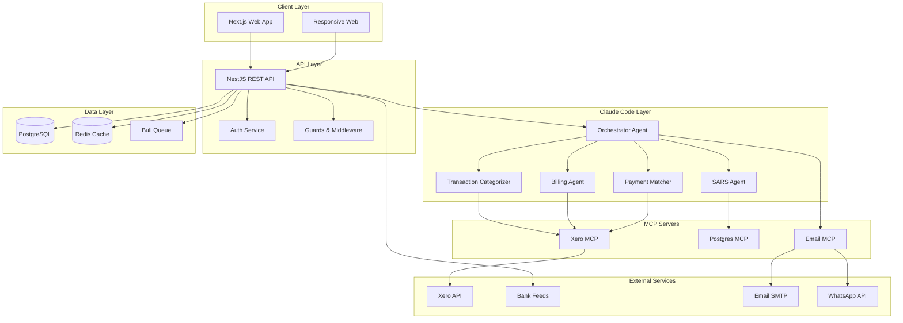

# Technical Specifications Index

## CrecheBooks AI Bookkeeping System

**Version**: 1.0
**Last Updated**: 2025-12-19
**Status**: Complete

---

## Specification Manifest

| ID | Title | Description | Status | File |
|----|-------|-------------|--------|------|
| TECH-ARCH | System Architecture | Overall system architecture, Claude Code integration, MCP servers | Complete | [architecture.md](./architecture.md) |
| TECH-DATA | Data Models | Database schemas, entities, relationships, migrations | Complete | [data-models.md](./data-models.md) |
| TECH-API | API Contracts | REST API endpoints, request/response schemas, error handling | Complete | [api-contracts.md](./api-contracts.md) |

---

## Architecture Overview

---

## Technology Stack

| Layer | Technology | Version | Purpose |
|-------|------------|---------|---------|
| Frontend | Next.js | 14.x | React-based web application |
| Backend | NestJS | 10.x | TypeScript REST API framework |
| Database | PostgreSQL | 16.x | Primary data store |
| ORM | Prisma | 0.3.x | Database access and migrations |
| Cache | Redis | 7.x | Session cache, rate limiting |
| Queue | Bull | 4.x | Background job processing |
| AI Orchestration | Claude Code CLI | Latest | Multi-agent coordination |
| Accounting | Xero API | 2.x | Accounting system integration |
| Authentication | Auth0 | Latest | OAuth 2.0 / OIDC provider |

---

## Review Status

| Specification | Author Review | Technical Review | Security Review |
|---------------|---------------|------------------|-----------------|
| TECH-ARCH | Complete | Pending | Pending |
| TECH-DATA | Complete | Pending | Pending |
| TECH-API | Complete | Pending | Pending |
