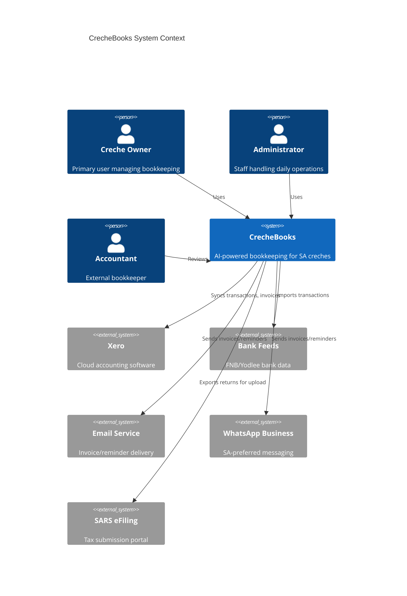
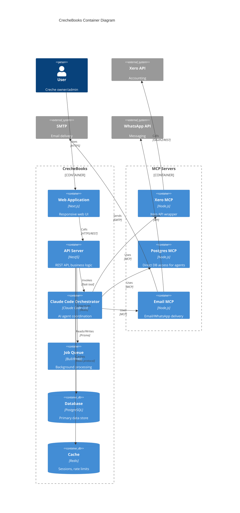
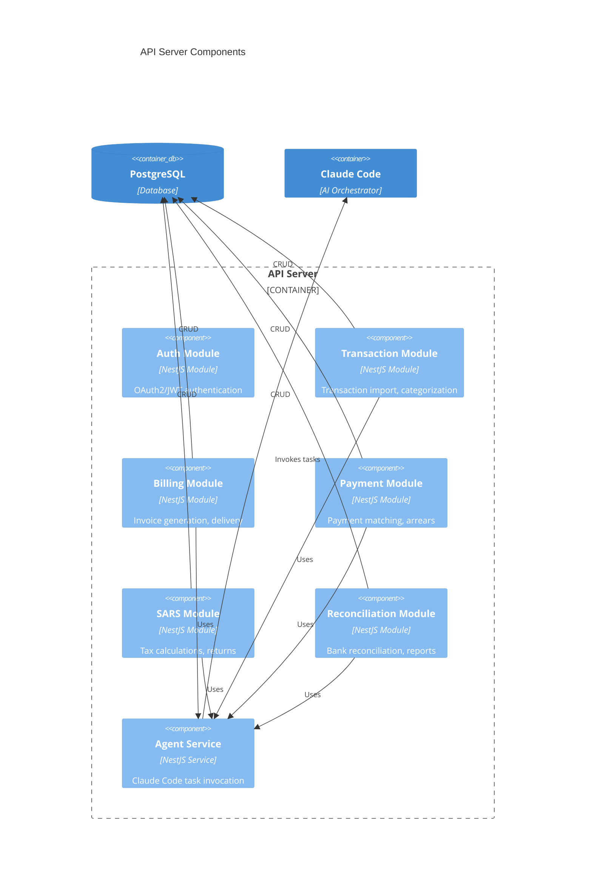
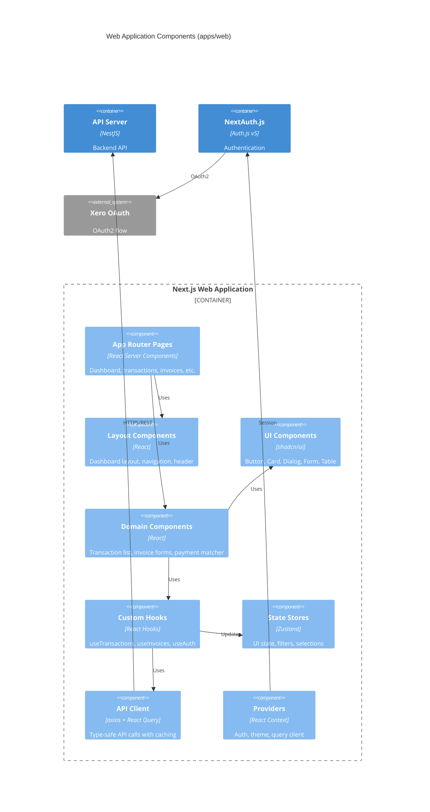
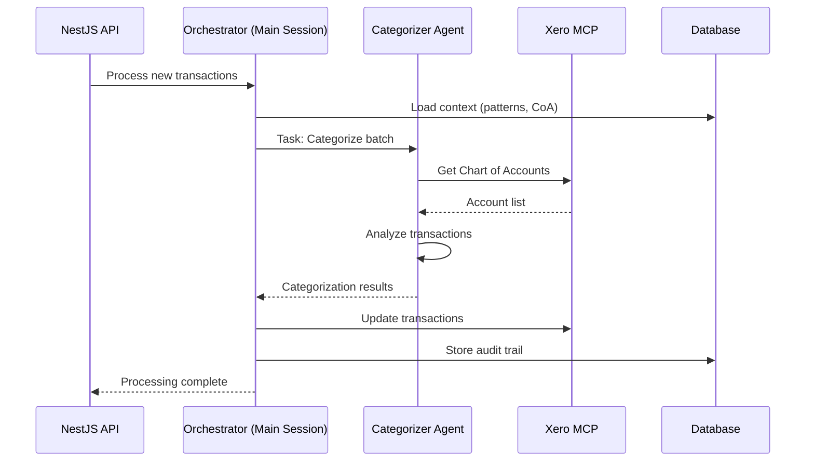
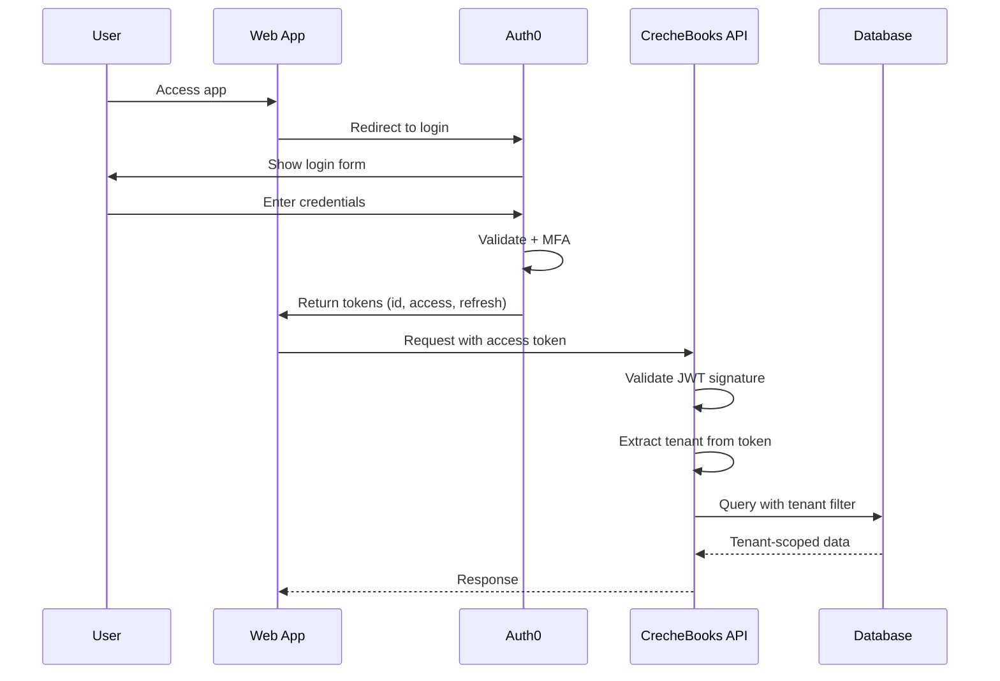
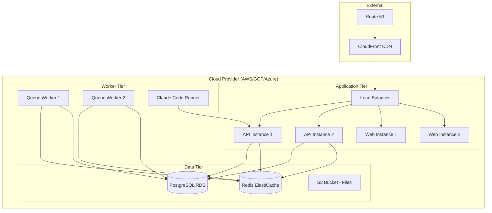
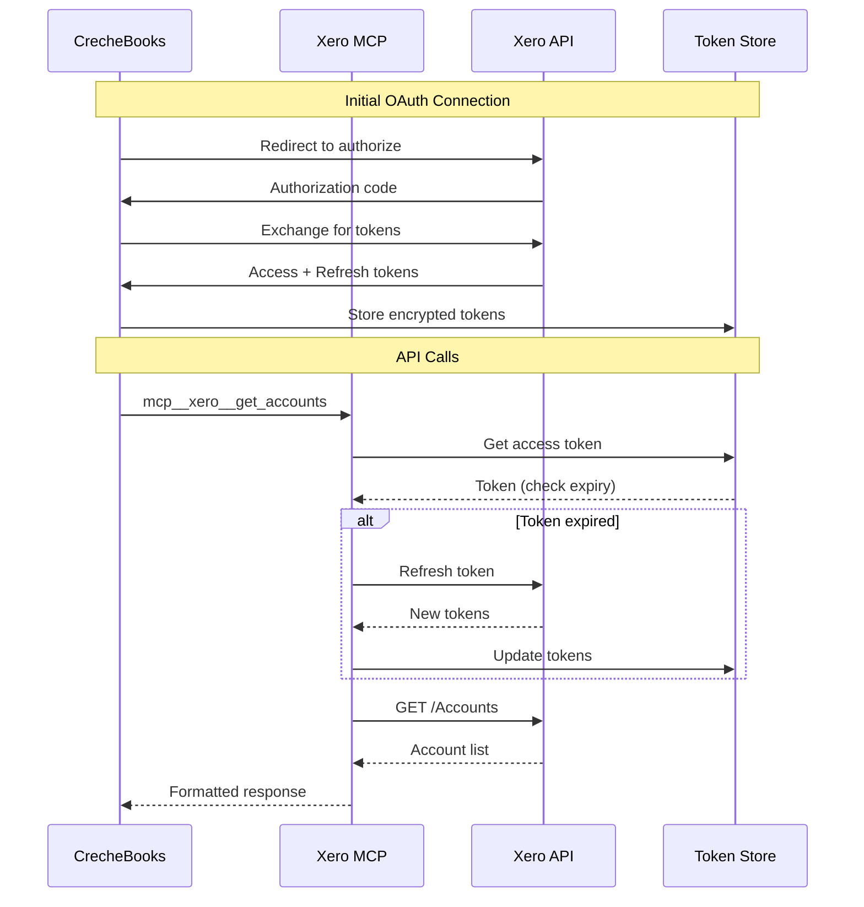
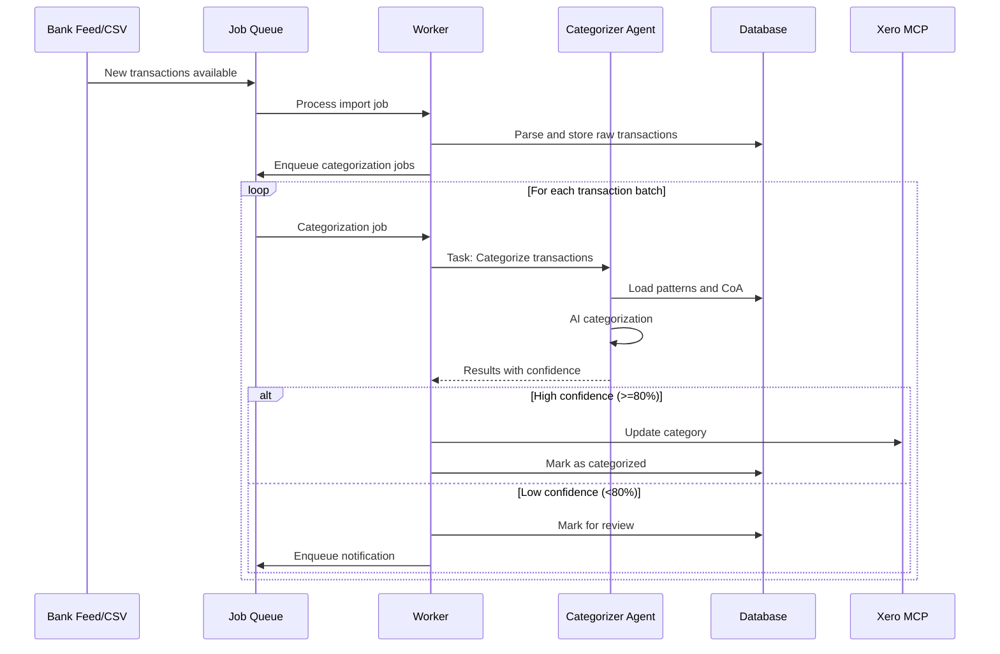

<technical_spec id="TECH-ARCH" version="1.0">

<metadata>
  <title>CrecheBooks System Architecture</title>
  <status>approved</status>
  <last_updated>2025-12-22</last_updated>
  <implements>
    <spec_ref>SPEC-TRANS</spec_ref>
    <spec_ref>SPEC-BILL</spec_ref>
    <spec_ref>SPEC-PAY</spec_ref>
    <spec_ref>SPEC-SARS</spec_ref>
    <spec_ref>SPEC-RECON</spec_ref>
    <spec_ref>SPEC-WEB</spec_ref>
  </implements>
</metadata>

<monorepo_structure>

## Directory Structure

```
crechebooks/
├── apps/
│   ├── api/                          # NestJS Backend API
│   │   ├── src/
│   │   │   ├── modules/              # Feature modules
│   │   │   │   ├── auth/
│   │   │   │   ├── transactions/
│   │   │   │   ├── billing/
│   │   │   │   ├── payments/
│   │   │   │   ├── sars/
│   │   │   │   └── reconciliation/
│   │   │   ├── mcp/                  # MCP Server implementations
│   │   │   │   ├── xero-mcp/
│   │   │   │   ├── postgres-mcp/
│   │   │   │   └── email-mcp/
│   │   │   └── common/               # Shared utilities
│   │   ├── prisma/                   # Database schema
│   │   └── test/                     # API tests
│   │
│   └── web/                          # Next.js Frontend
│       ├── src/
│       │   ├── app/                  # App Router pages
│       │   │   ├── (auth)/           # Auth pages (login, register)
│       │   │   ├── (dashboard)/      # Protected dashboard pages
│       │   │   │   ├── dashboard/
│       │   │   │   ├── transactions/
│       │   │   │   ├── invoices/
│       │   │   │   ├── payments/
│       │   │   │   ├── sars/
│       │   │   │   ├── reconciliation/
│       │   │   │   ├── parents/
│       │   │   │   ├── staff/
│       │   │   │   ├── reports/
│       │   │   │   └── settings/
│       │   │   └── api/              # API routes
│       │   ├── components/           # React components
│       │   │   ├── ui/               # shadcn/ui base components
│       │   │   ├── forms/            # Form components
│       │   │   ├── layout/           # Layout components
│       │   │   ├── data-table/       # Table components
│       │   │   ├── charts/           # Chart components
│       │   │   ├── transactions/     # Transaction components
│       │   │   ├── invoices/         # Invoice components
│       │   │   ├── payments/         # Payment components
│       │   │   ├── sars/             # SARS components
│       │   │   ├── reconciliation/   # Reconciliation components
│       │   │   ├── parents/          # Parent/child components
│       │   │   ├── staff/            # Staff/payroll components
│       │   │   └── reports/          # Report components
│       │   ├── hooks/                # Custom React hooks
│       │   ├── lib/                  # Utilities and API client
│       │   ├── stores/               # Zustand state stores
│       │   └── styles/               # Global styles
│       └── public/                   # Static assets
│
└── packages/
    ├── types/                        # Shared TypeScript types
    │   └── src/
    │       ├── common.ts
    │       ├── transactions.ts
    │       ├── billing.ts
    │       ├── payments.ts
    │       ├── sars.ts
    │       └── reconciliation.ts
    └── shared/                       # Shared utilities (future)
```

</monorepo_structure>

<architecture_diagram>

</architecture_diagram>

<container_diagram>

</container_diagram>

<component_diagram>

</component_diagram>

<web_component_diagram>


### Web Application Technology Stack

| Layer | Technology | Purpose |
|-------|------------|---------|
| Framework | Next.js 15 | App Router, Server Components, API Routes |
| UI Library | shadcn/ui | Accessible, customizable components |
| Styling | Tailwind CSS 4 | Utility-first CSS |
| State Management | Zustand | Client-side UI state |
| Server State | TanStack Query | Caching, refetching, mutations |
| Forms | React Hook Form + Zod | Validation, type-safe forms |
| Tables | TanStack Table | Sorting, filtering, pagination |
| Charts | Recharts | Financial visualizations |
| Authentication | NextAuth.js v5 | OAuth, sessions |
| API Client | axios | HTTP client with interceptors |

### Key Frontend Patterns

```typescript
// apps/web/src/lib/api/client.ts - Type-safe API client
import axios from 'axios';
import type { ITransaction, IPaginatedResponse } from '@crechebooks/types';

const api = axios.create({
  baseURL: process.env.NEXT_PUBLIC_API_URL,
  withCredentials: true,
});

export const transactionsApi = {
  list: (params: TransactionFilters) =>
    api.get<IPaginatedResponse<ITransaction>>('/transactions', { params }),
  categorize: (id: string, accountCode: string) =>
    api.patch<ITransaction>(`/transactions/${id}/categorize`, { accountCode }),
};
```

```typescript
// apps/web/src/hooks/use-transactions.ts - React Query hook
import { useQuery, useMutation, useQueryClient } from '@tanstack/react-query';
import { transactionsApi } from '@/lib/api/client';

export function useTransactions(filters: TransactionFilters) {
  return useQuery({
    queryKey: ['transactions', filters],
    queryFn: () => transactionsApi.list(filters),
    staleTime: 30_000, // 30 seconds
  });
}

export function useCategorizeTransaction() {
  const queryClient = useQueryClient();
  return useMutation({
    mutationFn: ({ id, accountCode }: { id: string; accountCode: string }) =>
      transactionsApi.categorize(id, accountCode),
    onSuccess: () => queryClient.invalidateQueries({ queryKey: ['transactions'] }),
  });
}
```

</web_component_diagram>

<claude_code_architecture>

## Claude Code Multi-Agent Design

### Orchestrator Pattern



### Agent Definitions

```yaml
Orchestrator:
  type: main_session
  role: Workflow coordination and task distribution
  tools:
    - Task (spawn subagents)
    - Read (context files)
    - AskUserQuestion (escalations)
  context_files:
    - .claude/context/tenant_config.json
    - .claude/logs/decisions.jsonl

Transaction_Categorizer:
  type: task_subagent
  subagent_type: general-purpose
  role: Categorize bank transactions
  tools:
    - Read (patterns, CoA)
    - mcp__xero__get_accounts
    - mcp__xero__update_transaction
  constraints:
    - Cannot modify data directly
    - Must log all decisions
    - Escalate if confidence < 80%

Billing_Agent:
  type: task_subagent
  subagent_type: general-purpose
  role: Generate monthly invoices
  tools:
    - Read (enrollment, fees)
    - mcp__xero__create_invoice
    - mcp__xero__get_contacts
  constraints:
    - Create as DRAFT only
    - Require owner approval before send

Payment_Matcher:
  type: task_subagent
  subagent_type: general-purpose
  role: Match payments to invoices
  tools:
    - Read (invoices, payments)
    - mcp__xero__apply_payment
  constraints:
    - Auto-apply exact matches only
    - Escalate ambiguous matches

SARS_Agent:
  type: task_subagent
  subagent_type: general-purpose
  role: Calculate tax submissions
  tools:
    - Read (transactions, payroll, tax tables)
    - mcp__postgres__query
  constraints:
    - ALWAYS require human review
    - Cannot submit directly
    - Flag any uncertainties
```

### MCP Server Configuration

```json
{
  "mcpServers": {
    "xero": {
      "command": "node",
      "args": ["./apps/api/src/mcp/xero-mcp/server.js"],
      "env": {
        "XERO_CLIENT_ID": "${XERO_CLIENT_ID}",
        "XERO_CLIENT_SECRET": "${XERO_CLIENT_SECRET}",
        "XERO_TENANT_ID": "${XERO_TENANT_ID}"
      },
      "tools": [
        "get_accounts",
        "get_transactions",
        "update_transaction",
        "create_invoice",
        "get_invoices",
        "apply_payment",
        "get_contacts",
        "create_contact"
      ]
    },
    "postgres": {
      "command": "node",
      "args": ["./apps/api/src/mcp/postgres-mcp/server.js"],
      "env": {
        "DATABASE_URL": "${DATABASE_URL}"
      },
      "tools": [
        "query",
        "get_tenant_context"
      ]
    },
    "email": {
      "command": "node",
      "args": ["./apps/api/src/mcp/email-mcp/server.js"],
      "env": {
        "SMTP_HOST": "${SMTP_HOST}",
        "SMTP_USER": "${SMTP_USER}",
        "SMTP_PASS": "${SMTP_PASS}",
        "WHATSAPP_TOKEN": "${WHATSAPP_TOKEN}"
      },
      "tools": [
        "send_email",
        "send_whatsapp",
        "check_delivery_status"
      ]
    }
  }
}
```

</claude_code_architecture>

<security_architecture>

## Authentication & Authorization



### Role-Based Access Control

| Role | Permissions |
|------|-------------|
| Owner | Full access; manage users; approve invoices; submit SARS |
| Admin | Manage transactions; generate invoices; view reports |
| Viewer | Read-only access to dashboards and reports |
| Accountant | Full financial access; no user management |

### Multi-Tenant Isolation

```sql
-- Row-Level Security Policy
CREATE POLICY tenant_isolation ON transactions
    USING (tenant_id = current_setting('app.tenant_id')::uuid);

-- All tables have tenant_id column
-- API sets tenant context from JWT claims
SET app.tenant_id = '${tenant_id_from_jwt}';
```

</security_architecture>

<deployment_architecture>

## Infrastructure



### Environment Configuration

```yaml
# Production
API_REPLICAS: 2
WORKER_REPLICAS: 2
DB_SIZE: db.r6g.large
REDIS_SIZE: cache.r6g.large

# Staging
API_REPLICAS: 1
WORKER_REPLICAS: 1
DB_SIZE: db.t3.medium
REDIS_SIZE: cache.t3.micro

# Development
API_REPLICAS: 1
WORKER_REPLICAS: 1
DB_SIZE: local
REDIS_SIZE: local
```

</deployment_architecture>

<integration_patterns>

## Xero Integration Flow



## Bank Feed Processing



</integration_patterns>

<implementation_notes>

<note category="performance">
**Transaction Processing**
- Batch transactions in groups of 50 for categorization
- Use database indexes on (tenant_id, date, status)
- Cache Chart of Accounts per tenant (5 min TTL)
- Queue heavy operations (invoice generation, SARS calculations)
</note>

<note category="security">
**Token Management**
- Xero tokens stored in secrets manager (AWS Secrets Manager / HashiCorp Vault)
- Never log access tokens
- Rotate refresh tokens on each use
- Implement token revocation on user disconnect
</note>

<note category="resilience">
**External API Handling**
- Implement circuit breaker for Xero API (5 failures = open, 30s recovery)
- Queue failed operations for retry (exponential backoff: 1m, 5m, 15m, 1h, 6h)
- Alert after 24h of failed syncs
- Graceful degradation: read from local cache when Xero unavailable
</note>

<note category="claude_code">
**Claude Code Best Practices**
- Keep context files under 100KB each
- Use JSON for structured data (patterns, configs)
- Log all agent decisions to decisions.jsonl
- Implement session persistence for multi-step workflows
- Set appropriate autonomy levels per operation
</note>

<note category="compliance">
**Audit Trail Requirements**
- All financial data changes logged immutably
- Include: timestamp, user_id, tenant_id, action, before_value, after_value
- Retain logs for 5+ years per SARS requirements
- Use append-only table or event sourcing pattern
</note>

</implementation_notes>

</technical_spec>
