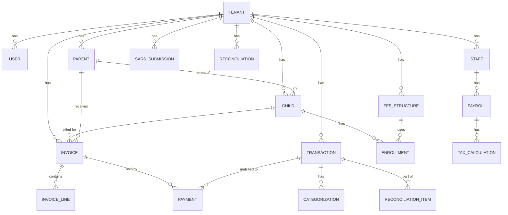

<technical_spec id="TECH-DATA" version="1.0">

<metadata>
  <title>CrecheBooks Data Models</title>
  <status>approved</status>
  <last_updated>2025-12-19</last_updated>
  <implements>
    <spec_ref>SPEC-TRANS</spec_ref>
    <spec_ref>SPEC-BILL</spec_ref>
    <spec_ref>SPEC-PAY</spec_ref>
    <spec_ref>SPEC-SARS</spec_ref>
    <spec_ref>SPEC-RECON</spec_ref>
  </implements>
</metadata>

<data_models>

## Entity Relationship Diagram

## Core Entities

<model name="Tenant">
  <description>Multi-tenant creche organization</description>
  <table>tenants</table>
  <field name="id" type="UUID" constraints="primary_key, default: gen_random_uuid()"/>
  <field name="name" type="string(200)" constraints="not_null"/>
  <field name="trading_name" type="string(200)" constraints="nullable"/>
  <field name="registration_number" type="string(50)" constraints="nullable"/>
  <field name="vat_number" type="string(20)" constraints="nullable"/>
  <field name="tax_status" type="enum(VAT_REGISTERED, NOT_REGISTERED)" constraints="not_null, default: NOT_REGISTERED"/>
  <field name="address_line1" type="string(200)" constraints="not_null"/>
  <field name="address_line2" type="string(200)" constraints="nullable"/>
  <field name="city" type="string(100)" constraints="not_null"/>
  <field name="province" type="string(50)" constraints="not_null"/>
  <field name="postal_code" type="string(10)" constraints="not_null"/>
  <field name="phone" type="string(20)" constraints="not_null"/>
  <field name="email" type="string(255)" constraints="not_null"/>
  <field name="xero_tenant_id" type="string(50)" constraints="nullable, indexed"/>
  <field name="subscription_status" type="enum(TRIAL, ACTIVE, SUSPENDED, CANCELLED)" constraints="not_null, default: TRIAL"/>
  <field name="invoice_day_of_month" type="integer" constraints="not_null, default: 1, check: 1-28"/>
  <field name="invoice_due_days" type="integer" constraints="not_null, default: 7"/>
  <field name="created_at" type="timestamp" constraints="not_null, default: now()"/>
  <field name="updated_at" type="timestamp" constraints="not_null, auto_updated"/>
  <indexes>
    <index columns="xero_tenant_id" unique="true"/>
    <index columns="email" unique="true"/>
  </indexes>
</model>

<model name="User">
  <description>System users with authentication</description>
  <table>users</table>
  <field name="id" type="UUID" constraints="primary_key, default: gen_random_uuid()"/>
  <field name="tenant_id" type="UUID" constraints="foreign_key(tenants.id), not_null, indexed"/>
  <field name="auth0_id" type="string(100)" constraints="unique, not_null"/>
  <field name="email" type="string(255)" constraints="not_null"/>
  <field name="name" type="string(200)" constraints="not_null"/>
  <field name="role" type="enum(OWNER, ADMIN, VIEWER, ACCOUNTANT)" constraints="not_null"/>
  <field name="is_active" type="boolean" constraints="not_null, default: true"/>
  <field name="last_login_at" type="timestamp" constraints="nullable"/>
  <field name="created_at" type="timestamp" constraints="not_null, default: now()"/>
  <field name="updated_at" type="timestamp" constraints="not_null, auto_updated"/>
  <indexes>
    <index columns="tenant_id, email" unique="true"/>
    <index columns="auth0_id" unique="true"/>
  </indexes>
</model>

<model name="Parent">
  <description>Parent/guardian contact for billing</description>
  <table>parents</table>
  <field name="id" type="UUID" constraints="primary_key, default: gen_random_uuid()"/>
  <field name="tenant_id" type="UUID" constraints="foreign_key(tenants.id), not_null, indexed"/>
  <field name="xero_contact_id" type="string(50)" constraints="nullable, indexed"/>
  <field name="first_name" type="string(100)" constraints="not_null"/>
  <field name="last_name" type="string(100)" constraints="not_null"/>
  <field name="email" type="string(255)" constraints="nullable"/>
  <field name="phone" type="string(20)" constraints="nullable"/>
  <field name="whatsapp" type="string(20)" constraints="nullable"/>
  <field name="preferred_contact" type="enum(EMAIL, WHATSAPP, BOTH)" constraints="not_null, default: EMAIL"/>
  <field name="id_number" type="string(20)" constraints="nullable"/>
  <field name="address" type="text" constraints="nullable"/>
  <field name="notes" type="text" constraints="nullable"/>
  <field name="is_active" type="boolean" constraints="not_null, default: true"/>
  <field name="created_at" type="timestamp" constraints="not_null, default: now()"/>
  <field name="updated_at" type="timestamp" constraints="not_null, auto_updated"/>
  <indexes>
    <index columns="tenant_id, email"/>
    <index columns="tenant_id, last_name, first_name"/>
  </indexes>
</model>

<model name="Child">
  <description>Enrolled child</description>
  <table>children</table>
  <field name="id" type="UUID" constraints="primary_key, default: gen_random_uuid()"/>
  <field name="tenant_id" type="UUID" constraints="foreign_key(tenants.id), not_null, indexed"/>
  <field name="parent_id" type="UUID" constraints="foreign_key(parents.id), not_null, indexed"/>
  <field name="first_name" type="string(100)" constraints="not_null"/>
  <field name="last_name" type="string(100)" constraints="not_null"/>
  <field name="date_of_birth" type="date" constraints="not_null"/>
  <field name="gender" type="enum(MALE, FEMALE, OTHER)" constraints="nullable"/>
  <field name="medical_notes" type="text" constraints="nullable"/>
  <field name="emergency_contact" type="string(200)" constraints="nullable"/>
  <field name="emergency_phone" type="string(20)" constraints="nullable"/>
  <field name="is_active" type="boolean" constraints="not_null, default: true"/>
  <field name="created_at" type="timestamp" constraints="not_null, default: now()"/>
  <field name="updated_at" type="timestamp" constraints="not_null, auto_updated"/>
  <indexes>
    <index columns="tenant_id, parent_id"/>
    <index columns="tenant_id, is_active"/>
  </indexes>
</model>

<model name="FeeStructure">
  <description>Fee tier configuration</description>
  <table>fee_structures</table>
  <field name="id" type="UUID" constraints="primary_key, default: gen_random_uuid()"/>
  <field name="tenant_id" type="UUID" constraints="foreign_key(tenants.id), not_null, indexed"/>
  <field name="name" type="string(100)" constraints="not_null"/>
  <field name="description" type="text" constraints="nullable"/>
  <field name="fee_type" type="enum(FULL_DAY, HALF_DAY, HOURLY, CUSTOM)" constraints="not_null"/>
  <field name="amount_cents" type="integer" constraints="not_null"/>
  <field name="vat_inclusive" type="boolean" constraints="not_null, default: true"/>
  <field name="sibling_discount_percent" type="decimal(5,2)" constraints="nullable, check: 0-100"/>
  <field name="effective_from" type="date" constraints="not_null"/>
  <field name="effective_to" type="date" constraints="nullable"/>
  <field name="is_active" type="boolean" constraints="not_null, default: true"/>
  <field name="created_at" type="timestamp" constraints="not_null, default: now()"/>
  <field name="updated_at" type="timestamp" constraints="not_null, auto_updated"/>
  <indexes>
    <index columns="tenant_id, is_active"/>
    <index columns="tenant_id, effective_from"/>
  </indexes>
</model>

<model name="Enrollment">
  <description>Child enrollment linking to fee structure</description>
  <table>enrollments</table>
  <field name="id" type="UUID" constraints="primary_key, default: gen_random_uuid()"/>
  <field name="tenant_id" type="UUID" constraints="foreign_key(tenants.id), not_null, indexed"/>
  <field name="child_id" type="UUID" constraints="foreign_key(children.id), not_null, indexed"/>
  <field name="fee_structure_id" type="UUID" constraints="foreign_key(fee_structures.id), not_null"/>
  <field name="start_date" type="date" constraints="not_null"/>
  <field name="end_date" type="date" constraints="nullable"/>
  <field name="status" type="enum(ACTIVE, PENDING, WITHDRAWN, GRADUATED)" constraints="not_null, default: ACTIVE"/>
  <field name="sibling_discount_applied" type="boolean" constraints="not_null, default: false"/>
  <field name="custom_fee_override_cents" type="integer" constraints="nullable"/>
  <field name="notes" type="text" constraints="nullable"/>
  <field name="created_at" type="timestamp" constraints="not_null, default: now()"/>
  <field name="updated_at" type="timestamp" constraints="not_null, auto_updated"/>
  <indexes>
    <index columns="tenant_id, child_id, status"/>
    <index columns="tenant_id, status, start_date"/>
  </indexes>
</model>

## Transaction & Categorization

<model name="Transaction">
  <description>Bank transaction record</description>
  <table>transactions</table>
  <field name="id" type="UUID" constraints="primary_key, default: gen_random_uuid()"/>
  <field name="tenant_id" type="UUID" constraints="foreign_key(tenants.id), not_null, indexed"/>
  <field name="xero_transaction_id" type="string(50)" constraints="nullable, indexed"/>
  <field name="bank_account" type="string(50)" constraints="not_null"/>
  <field name="date" type="date" constraints="not_null"/>
  <field name="description" type="text" constraints="not_null"/>
  <field name="payee_name" type="string(200)" constraints="nullable"/>
  <field name="reference" type="string(100)" constraints="nullable"/>
  <field name="amount_cents" type="integer" constraints="not_null"/>
  <field name="is_credit" type="boolean" constraints="not_null"/>
  <field name="source" type="enum(BANK_FEED, CSV_IMPORT, PDF_IMPORT, MANUAL)" constraints="not_null"/>
  <field name="import_batch_id" type="UUID" constraints="nullable"/>
  <field name="status" type="enum(PENDING, CATEGORIZED, REVIEW_REQUIRED, SYNCED)" constraints="not_null, default: PENDING"/>
  <field name="is_reconciled" type="boolean" constraints="not_null, default: false"/>
  <field name="reconciled_at" type="timestamp" constraints="nullable"/>
  <field name="is_deleted" type="boolean" constraints="not_null, default: false"/>
  <field name="deleted_at" type="timestamp" constraints="nullable"/>
  <field name="created_at" type="timestamp" constraints="not_null, default: now()"/>
  <field name="updated_at" type="timestamp" constraints="not_null, auto_updated"/>
  <indexes>
    <index columns="tenant_id, date"/>
    <index columns="tenant_id, status"/>
    <index columns="tenant_id, payee_name"/>
    <index columns="xero_transaction_id"/>
    <index columns="tenant_id, is_reconciled"/>
  </indexes>
</model>

<model name="Categorization">
  <description>AI categorization for a transaction</description>
  <table>categorizations</table>
  <field name="id" type="UUID" constraints="primary_key, default: gen_random_uuid()"/>
  <field name="transaction_id" type="UUID" constraints="foreign_key(transactions.id), not_null, indexed"/>
  <field name="account_code" type="string(20)" constraints="not_null"/>
  <field name="account_name" type="string(200)" constraints="not_null"/>
  <field name="confidence_score" type="decimal(5,2)" constraints="not_null, check: 0-100"/>
  <field name="reasoning" type="text" constraints="nullable"/>
  <field name="source" type="enum(AI_AUTO, AI_SUGGESTED, USER_OVERRIDE, RULE_BASED)" constraints="not_null"/>
  <field name="is_split" type="boolean" constraints="not_null, default: false"/>
  <field name="split_amount_cents" type="integer" constraints="nullable"/>
  <field name="vat_amount_cents" type="integer" constraints="nullable"/>
  <field name="vat_type" type="enum(STANDARD, ZERO_RATED, EXEMPT, NO_VAT)" constraints="not_null, default: STANDARD"/>
  <field name="reviewed_by" type="UUID" constraints="foreign_key(users.id), nullable"/>
  <field name="reviewed_at" type="timestamp" constraints="nullable"/>
  <field name="created_at" type="timestamp" constraints="not_null, default: now()"/>
  <field name="updated_at" type="timestamp" constraints="not_null, auto_updated"/>
  <indexes>
    <index columns="transaction_id"/>
    <index columns="account_code"/>
  </indexes>
</model>

<model name="PayeePattern">
  <description>Learned payee categorization patterns</description>
  <table>payee_patterns</table>
  <field name="id" type="UUID" constraints="primary_key, default: gen_random_uuid()"/>
  <field name="tenant_id" type="UUID" constraints="foreign_key(tenants.id), not_null, indexed"/>
  <field name="payee_pattern" type="string(200)" constraints="not_null"/>
  <field name="payee_aliases" type="jsonb" constraints="default: '[]'"/>
  <field name="default_account_code" type="string(20)" constraints="not_null"/>
  <field name="confidence_boost" type="decimal(5,2)" constraints="not_null, default: 0"/>
  <field name="match_count" type="integer" constraints="not_null, default: 0"/>
  <field name="is_recurring" type="boolean" constraints="not_null, default: false"/>
  <field name="expected_amount_cents" type="integer" constraints="nullable"/>
  <field name="amount_variance_percent" type="decimal(5,2)" constraints="nullable"/>
  <field name="created_at" type="timestamp" constraints="not_null, default: now()"/>
  <field name="updated_at" type="timestamp" constraints="not_null, auto_updated"/>
  <indexes>
    <index columns="tenant_id, payee_pattern"/>
  </indexes>
</model>

## Invoicing & Payments

<model name="Invoice">
  <description>School fee invoice</description>
  <table>invoices</table>
  <field name="id" type="UUID" constraints="primary_key, default: gen_random_uuid()"/>
  <field name="tenant_id" type="UUID" constraints="foreign_key(tenants.id), not_null, indexed"/>
  <field name="xero_invoice_id" type="string(50)" constraints="nullable, indexed"/>
  <field name="invoice_number" type="string(50)" constraints="not_null"/>
  <field name="parent_id" type="UUID" constraints="foreign_key(parents.id), not_null, indexed"/>
  <field name="child_id" type="UUID" constraints="foreign_key(children.id), not_null"/>
  <field name="billing_period_start" type="date" constraints="not_null"/>
  <field name="billing_period_end" type="date" constraints="not_null"/>
  <field name="issue_date" type="date" constraints="not_null"/>
  <field name="due_date" type="date" constraints="not_null"/>
  <field name="subtotal_cents" type="integer" constraints="not_null"/>
  <field name="vat_cents" type="integer" constraints="not_null, default: 0"/>
  <field name="total_cents" type="integer" constraints="not_null"/>
  <field name="amount_paid_cents" type="integer" constraints="not_null, default: 0"/>
  <field name="status" type="enum(DRAFT, SENT, VIEWED, PARTIALLY_PAID, PAID, OVERDUE, VOID)" constraints="not_null, default: DRAFT"/>
  <field name="delivery_method" type="enum(EMAIL, WHATSAPP, BOTH)" constraints="nullable"/>
  <field name="delivery_status" type="enum(PENDING, SENT, DELIVERED, OPENED, FAILED)" constraints="nullable"/>
  <field name="delivered_at" type="timestamp" constraints="nullable"/>
  <field name="notes" type="text" constraints="nullable"/>
  <field name="is_deleted" type="boolean" constraints="not_null, default: false"/>
  <field name="created_at" type="timestamp" constraints="not_null, default: now()"/>
  <field name="updated_at" type="timestamp" constraints="not_null, auto_updated"/>
  <indexes>
    <index columns="tenant_id, invoice_number" unique="true"/>
    <index columns="tenant_id, parent_id"/>
    <index columns="tenant_id, status"/>
    <index columns="tenant_id, due_date"/>
    <index columns="xero_invoice_id"/>
  </indexes>
</model>

<model name="InvoiceLine">
  <description>Invoice line item</description>
  <table>invoice_lines</table>
  <field name="id" type="UUID" constraints="primary_key, default: gen_random_uuid()"/>
  <field name="invoice_id" type="UUID" constraints="foreign_key(invoices.id), not_null, indexed"/>
  <field name="description" type="string(500)" constraints="not_null"/>
  <field name="quantity" type="decimal(10,2)" constraints="not_null, default: 1"/>
  <field name="unit_price_cents" type="integer" constraints="not_null"/>
  <field name="discount_cents" type="integer" constraints="not_null, default: 0"/>
  <field name="subtotal_cents" type="integer" constraints="not_null"/>
  <field name="vat_cents" type="integer" constraints="not_null, default: 0"/>
  <field name="total_cents" type="integer" constraints="not_null"/>
  <field name="line_type" type="enum(MONTHLY_FEE, REGISTRATION, EXTRA, DISCOUNT, CREDIT)" constraints="not_null"/>
  <field name="account_code" type="string(20)" constraints="nullable"/>
  <field name="sort_order" type="integer" constraints="not_null, default: 0"/>
  <field name="created_at" type="timestamp" constraints="not_null, default: now()"/>
  <indexes>
    <index columns="invoice_id, sort_order"/>
  </indexes>
</model>

<model name="Payment">
  <description>Payment allocation to invoice</description>
  <table>payments</table>
  <field name="id" type="UUID" constraints="primary_key, default: gen_random_uuid()"/>
  <field name="tenant_id" type="UUID" constraints="foreign_key(tenants.id), not_null, indexed"/>
  <field name="xero_payment_id" type="string(50)" constraints="nullable, indexed"/>
  <field name="transaction_id" type="UUID" constraints="foreign_key(transactions.id), nullable, indexed"/>
  <field name="invoice_id" type="UUID" constraints="foreign_key(invoices.id), not_null, indexed"/>
  <field name="amount_cents" type="integer" constraints="not_null"/>
  <field name="payment_date" type="date" constraints="not_null"/>
  <field name="reference" type="string(100)" constraints="nullable"/>
  <field name="match_type" type="enum(EXACT, PARTIAL, MANUAL, OVERPAYMENT)" constraints="not_null"/>
  <field name="match_confidence" type="decimal(5,2)" constraints="nullable"/>
  <field name="matched_by" type="enum(AI_AUTO, USER)" constraints="not_null"/>
  <field name="is_reversed" type="boolean" constraints="not_null, default: false"/>
  <field name="reversed_at" type="timestamp" constraints="nullable"/>
  <field name="reversal_reason" type="text" constraints="nullable"/>
  <field name="created_at" type="timestamp" constraints="not_null, default: now()"/>
  <field name="updated_at" type="timestamp" constraints="not_null, auto_updated"/>
  <indexes>
    <index columns="tenant_id, transaction_id"/>
    <index columns="tenant_id, invoice_id"/>
    <index columns="xero_payment_id"/>
  </indexes>
</model>

## Staff & Payroll

<model name="Staff">
  <description>Creche staff member</description>
  <table>staff</table>
  <field name="id" type="UUID" constraints="primary_key, default: gen_random_uuid()"/>
  <field name="tenant_id" type="UUID" constraints="foreign_key(tenants.id), not_null, indexed"/>
  <field name="employee_number" type="string(20)" constraints="nullable"/>
  <field name="first_name" type="string(100)" constraints="not_null"/>
  <field name="last_name" type="string(100)" constraints="not_null"/>
  <field name="id_number" type="string(20)" constraints="not_null"/>
  <field name="tax_number" type="string(20)" constraints="nullable"/>
  <field name="email" type="string(255)" constraints="nullable"/>
  <field name="phone" type="string(20)" constraints="nullable"/>
  <field name="date_of_birth" type="date" constraints="not_null"/>
  <field name="start_date" type="date" constraints="not_null"/>
  <field name="end_date" type="date" constraints="nullable"/>
  <field name="employment_type" type="enum(PERMANENT, CONTRACT, CASUAL)" constraints="not_null"/>
  <field name="pay_frequency" type="enum(MONTHLY, WEEKLY, DAILY, HOURLY)" constraints="not_null, default: MONTHLY"/>
  <field name="basic_salary_cents" type="integer" constraints="not_null"/>
  <field name="bank_name" type="string(100)" constraints="nullable"/>
  <field name="bank_account" type="string(20)" constraints="nullable"/>
  <field name="bank_branch_code" type="string(10)" constraints="nullable"/>
  <field name="medical_aid_members" type="integer" constraints="not_null, default: 0"/>
  <field name="is_active" type="boolean" constraints="not_null, default: true"/>
  <field name="created_at" type="timestamp" constraints="not_null, default: now()"/>
  <field name="updated_at" type="timestamp" constraints="not_null, auto_updated"/>
  <indexes>
    <index columns="tenant_id, id_number" unique="true"/>
    <index columns="tenant_id, is_active"/>
  </indexes>
</model>

<model name="Payroll">
  <description>Monthly payroll record</description>
  <table>payrolls</table>
  <field name="id" type="UUID" constraints="primary_key, default: gen_random_uuid()"/>
  <field name="tenant_id" type="UUID" constraints="foreign_key(tenants.id), not_null, indexed"/>
  <field name="staff_id" type="UUID" constraints="foreign_key(staff.id), not_null, indexed"/>
  <field name="pay_period_start" type="date" constraints="not_null"/>
  <field name="pay_period_end" type="date" constraints="not_null"/>
  <field name="basic_salary_cents" type="integer" constraints="not_null"/>
  <field name="overtime_cents" type="integer" constraints="not_null, default: 0"/>
  <field name="bonus_cents" type="integer" constraints="not_null, default: 0"/>
  <field name="other_earnings_cents" type="integer" constraints="not_null, default: 0"/>
  <field name="gross_salary_cents" type="integer" constraints="not_null"/>
  <field name="paye_cents" type="integer" constraints="not_null"/>
  <field name="uif_employee_cents" type="integer" constraints="not_null"/>
  <field name="uif_employer_cents" type="integer" constraints="not_null"/>
  <field name="other_deductions_cents" type="integer" constraints="not_null, default: 0"/>
  <field name="net_salary_cents" type="integer" constraints="not_null"/>
  <field name="medical_aid_credit_cents" type="integer" constraints="not_null, default: 0"/>
  <field name="status" type="enum(DRAFT, APPROVED, PAID)" constraints="not_null, default: DRAFT"/>
  <field name="payment_date" type="date" constraints="nullable"/>
  <field name="created_at" type="timestamp" constraints="not_null, default: now()"/>
  <field name="updated_at" type="timestamp" constraints="not_null, auto_updated"/>
  <indexes>
    <index columns="tenant_id, staff_id, pay_period_start" unique="true"/>
    <index columns="tenant_id, status"/>
  </indexes>
</model>

## SARS Submissions

<model name="SarsSubmission">
  <description>SARS return submission record</description>
  <table>sars_submissions</table>
  <field name="id" type="UUID" constraints="primary_key, default: gen_random_uuid()"/>
  <field name="tenant_id" type="UUID" constraints="foreign_key(tenants.id), not_null, indexed"/>
  <field name="submission_type" type="enum(VAT201, EMP201, IRP5)" constraints="not_null"/>
  <field name="period_start" type="date" constraints="not_null"/>
  <field name="period_end" type="date" constraints="not_null"/>
  <field name="deadline" type="date" constraints="not_null"/>
  <field name="output_vat_cents" type="integer" constraints="nullable"/>
  <field name="input_vat_cents" type="integer" constraints="nullable"/>
  <field name="net_vat_cents" type="integer" constraints="nullable"/>
  <field name="total_paye_cents" type="integer" constraints="nullable"/>
  <field name="total_uif_cents" type="integer" constraints="nullable"/>
  <field name="total_sdl_cents" type="integer" constraints="nullable"/>
  <field name="status" type="enum(DRAFT, READY, SUBMITTED, ACKNOWLEDGED)" constraints="not_null, default: DRAFT"/>
  <field name="submitted_at" type="timestamp" constraints="nullable"/>
  <field name="submitted_by" type="UUID" constraints="foreign_key(users.id), nullable"/>
  <field name="sars_reference" type="string(50)" constraints="nullable"/>
  <field name="document_data" type="jsonb" constraints="not_null, default: '{}'"/>
  <field name="notes" type="text" constraints="nullable"/>
  <field name="is_finalized" type="boolean" constraints="not_null, default: false"/>
  <field name="created_at" type="timestamp" constraints="not_null, default: now()"/>
  <field name="updated_at" type="timestamp" constraints="not_null, auto_updated"/>
  <indexes>
    <index columns="tenant_id, submission_type, period_start" unique="true"/>
    <index columns="tenant_id, status"/>
    <index columns="deadline"/>
  </indexes>
</model>

## Reconciliation

<model name="Reconciliation">
  <description>Bank reconciliation record</description>
  <table>reconciliations</table>
  <field name="id" type="UUID" constraints="primary_key, default: gen_random_uuid()"/>
  <field name="tenant_id" type="UUID" constraints="foreign_key(tenants.id), not_null, indexed"/>
  <field name="bank_account" type="string(50)" constraints="not_null"/>
  <field name="period_start" type="date" constraints="not_null"/>
  <field name="period_end" type="date" constraints="not_null"/>
  <field name="opening_balance_cents" type="integer" constraints="not_null"/>
  <field name="closing_balance_cents" type="integer" constraints="not_null"/>
  <field name="calculated_balance_cents" type="integer" constraints="not_null"/>
  <field name="discrepancy_cents" type="integer" constraints="not_null, default: 0"/>
  <field name="status" type="enum(IN_PROGRESS, RECONCILED, DISCREPANCY)" constraints="not_null, default: IN_PROGRESS"/>
  <field name="reconciled_by" type="UUID" constraints="foreign_key(users.id), nullable"/>
  <field name="reconciled_at" type="timestamp" constraints="nullable"/>
  <field name="notes" type="text" constraints="nullable"/>
  <field name="created_at" type="timestamp" constraints="not_null, default: now()"/>
  <field name="updated_at" type="timestamp" constraints="not_null, auto_updated"/>
  <indexes>
    <index columns="tenant_id, bank_account, period_start" unique="true"/>
  </indexes>
</model>

## Audit Trail

<model name="AuditLog">
  <description>Immutable audit trail for all changes</description>
  <table>audit_logs</table>
  <field name="id" type="UUID" constraints="primary_key, default: gen_random_uuid()"/>
  <field name="tenant_id" type="UUID" constraints="not_null, indexed"/>
  <field name="user_id" type="UUID" constraints="nullable, indexed"/>
  <field name="agent_id" type="string(50)" constraints="nullable"/>
  <field name="entity_type" type="string(50)" constraints="not_null, indexed"/>
  <field name="entity_id" type="UUID" constraints="not_null, indexed"/>
  <field name="action" type="enum(CREATE, UPDATE, DELETE, CATEGORIZE, MATCH, RECONCILE, SUBMIT)" constraints="not_null"/>
  <field name="before_value" type="jsonb" constraints="nullable"/>
  <field name="after_value" type="jsonb" constraints="nullable"/>
  <field name="change_summary" type="text" constraints="nullable"/>
  <field name="ip_address" type="string(45)" constraints="nullable"/>
  <field name="user_agent" type="text" constraints="nullable"/>
  <field name="created_at" type="timestamp" constraints="not_null, default: now()"/>
  <indexes>
    <index columns="tenant_id, entity_type, entity_id"/>
    <index columns="tenant_id, created_at"/>
    <index columns="user_id, created_at"/>
  </indexes>
  <constraints>
    <constraint type="immutable">No UPDATE or DELETE operations allowed on this table</constraint>
  </constraints>
</model>

</data_models>

<migrations>

## Migration Strategy

All migrations follow these conventions:
- Named: `YYYYMMDDHHMMSS_description.ts`
- Reversible: Include both `up()` and `down()` methods
- Atomic: Each migration is a single transaction
- Tested: Migrations tested on copy of production data before deployment

## Initial Migration Order

1. `20250101000001_create_tenants.ts`
2. `20250101000002_create_users.ts`
3. `20250101000003_create_parents.ts`
4. `20250101000004_create_children.ts`
5. `20250101000005_create_fee_structures.ts`
6. `20250101000006_create_enrollments.ts`
7. `20250101000007_create_transactions.ts`
8. `20250101000008_create_categorizations.ts`
9. `20250101000009_create_payee_patterns.ts`
10. `20250101000010_create_invoices.ts`
11. `20250101000011_create_invoice_lines.ts`
12. `20250101000012_create_payments.ts`
13. `20250101000013_create_staff.ts`
14. `20250101000014_create_payrolls.ts`
15. `20250101000015_create_sars_submissions.ts`
16. `20250101000016_create_reconciliations.ts`
17. `20250101000017_create_audit_logs.ts`
18. `20250101000018_enable_row_level_security.ts`

</migrations>

</technical_spec>
